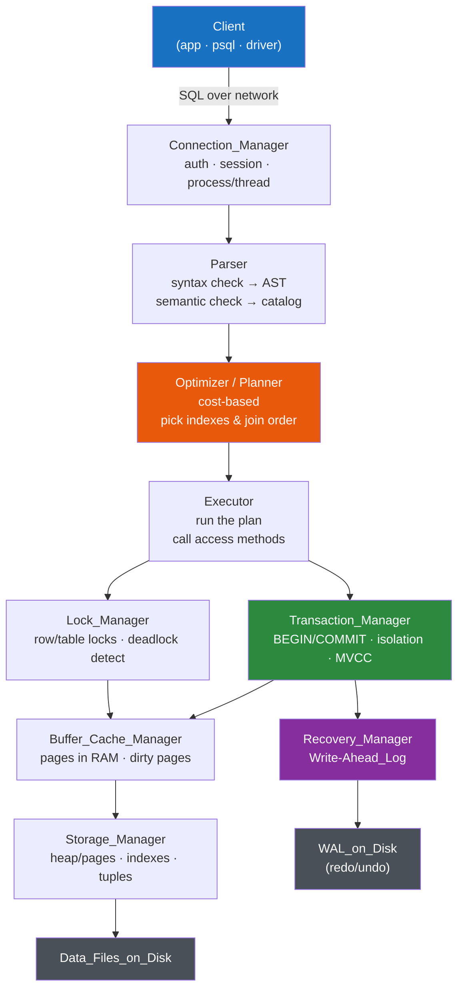

# 🏗️ DBMS Architecture

> [!abstract] TL;DR
> Inside a relational DBMS, a query passes through a pipeline of specialized components: the **connection manager** authenticates you, the **query processor** (parser → [[Query_Optimizer|optimizer]] → executor) turns SQL into an [[Execution_Plans|execution plan]], the **transaction & lock managers** keep concurrent work correct, the **buffer manager** caches hot pages in RAM, the **storage manager** lays bytes on disk, and the **recovery manager** uses the **[[Write_Ahead_Logging|Write-Ahead Log (WAL)]]** to survive crashes. The big architectural fork is the **process model**: [[PostgreSQL]] forks a process per connection; [[MySQL]] uses a thread per connection — which is exactly why you need [[Connection_Pooling]].

## Intuition — analogy FIRST

Think of a restaurant kitchen fulfilling an order ticket.

- The **host** (connection manager) seats you and checks your reservation.
- The **head chef** reads your ticket, and instead of cooking it literally as written, decides the *smartest* order of operations — sear the steak while the sauce reduces (the **optimizer** turning "what you asked for" into "the fastest way to make it").
- The **line cooks** (executor) actually do the work.
- The **expediter** (transaction manager) makes sure a table's four dishes all leave together — or none do — and that two cooks don't grab the last steak at once (lock manager).
- The **pantry/fridge** (buffer manager) keeps frequently used ingredients on the counter instead of walking to the walk-in freezer every time.
- The **order logbook** (WAL) records every ticket the instant it's fired, so if the power flickers, the kitchen knows exactly what was in progress.

A DBMS is that kitchen. SQL is the ticket. The magic is that you describe *what* you want; the components collaborate to figure out *how*.

---

## How It Works

A single `SELECT` flows through every layer. Follow the ticket:

### Query flow, step by step

Take `SELECT name FROM users WHERE email = 'a@b.com';`

1. **Connection manager** — authenticates the session, assigns it a process (PG) or thread (MySQL). Reuses a pooled connection if available.
2. **Parser** — checks SQL *syntax*, builds an Abstract Syntax Tree, then does *semantic* validation against the **system catalog** (does `users` exist? does it have `email`?).
3. **Optimizer / planner** — the brains. Generates candidate plans (sequential scan vs index scan on `email`), estimates each with **statistics** (row counts, value distribution), and picks the lowest **estimated cost**. Output: a physical execution plan.
4. **Executor** — walks the plan tree, pulling rows via **access methods** (index seek, then heap fetch), asking the buffer manager for the needed pages.
5. **Transaction manager** — ensures the read sees a consistent snapshot ([[Isolation_Levels|isolation]]) and coordinates commit/rollback.
6. **Lock manager** — grants shared/exclusive locks; detects and breaks [[Deadlocks|deadlocks]] by aborting a victim.
7. **Buffer/cache manager** — serves pages from RAM if cached; otherwise reads from disk and caches them. Tracks **dirty** (modified) pages for later flush.
8. **Storage manager** — the physical layout: tables as pages of tuples, plus indexes.
9. **Recovery manager (WAL)** — for writes, the change is written to the **Write-Ahead Log and flushed to disk *before*** the commit is acknowledged. On crash, replay the WAL to recover. This is how the **D** in ACID is delivered — see [[ACID_and_Transactions]].

**The golden rule of WAL:** the log record hits durable storage *before* the data page does. That ordering is the entire trick behind crash recovery.

---

## Key Concepts / Details

### The component roster

| Component | Job | Failure it prevents |
|-----------|-----|---------------------|
| **Connection manager** | Auth, session state, dispatch to process/thread | Unauthorized access; connection storms |
| **Parser** | Syntax + semantic validation → AST | Malformed / nonsensical queries reaching the engine |
| **Optimizer** | Cost-based plan selection using statistics | Accidentally scanning a billion rows |
| **Executor** | Runs the chosen plan via access methods | — (the actual work) |
| **Transaction manager** | Atomicity, isolation, snapshots ([[MVCC_Internals\|MVCC]]) | Partial updates; inconsistent reads |
| **Lock manager** | Grants locks, detects deadlocks | Lost updates; corruption from concurrent writes |
| **Buffer/cache manager** | Keep hot pages in RAM; manage eviction | Disk I/O on every access (slowness) |
| **Storage manager** | Page/tuple layout, index structures | — (physical persistence) |
| **Recovery manager (WAL)** | Log-before-write, crash recovery | Data loss on crash (durability) |

### Why the optimizer is the crown jewel

Two queries returning the *same result* can differ by 1000× in speed depending on plan choice (which index, join order, join algorithm). The optimizer relies on **table statistics**; stale statistics are a top cause of sudden slowdowns. Both PostgreSQL (`EXPLAIN ANALYZE`) and MySQL (`EXPLAIN`) let you inspect the chosen plan — this is the single most useful skill for debugging slow queries.

### Process vs thread model — the big architectural fork

| | PostgreSQL | MySQL (InnoDB) |
|--|-----------|----------------|
| **Model** | **Process per connection** (postmaster forks a backend) | **Thread per connection** |
| **Isolation** | Strong — a crashing backend rarely takes down others | Weaker — threads share one process address space |
| **Per-connection cost** | Heavier (~ several MB, fork overhead) | Lighter (threads are cheap) |
| **Shared memory** | Explicit shared buffers segment | Naturally shared within the process |
| **Consequence** | Many connections = many processes = high RAM; **pooling is essential** | Scales connections more cheaply, but thread contention still hurts |

Because PostgreSQL spends real resources per connection, a spike to thousands of connections can exhaust memory — which is exactly the problem [[Connection_Pooling]] (PgBouncer, pgpool) solves by multiplexing many clients over a small fixed set of backends. MySQL benefits from pooling too, but the pressure is less acute.

### Buffer manager and the storage hierarchy

The buffer manager is a cache between the executor and disk. A **buffer pool hit** (page already in RAM) is ~100ns; a **miss** (read from SSD) is ~100µs — a 1000× cliff. DBAs tune `shared_buffers` (PG) / `innodb_buffer_pool_size` (MySQL) so the working set lives in RAM. Modified pages are **dirty**; a background **checkpoint** flushes them to disk periodically and truncates the WAL.

---

## PostgreSQL vs MySQL

| Aspect | PostgreSQL | MySQL / InnoDB |
|--------|-----------|----------------|
| Connection model | Process per connection | Thread per connection |
| WAL name | WAL (`pg_wal`) | Redo log (`ib_logfile` / redo log files) + undo logs |
| Buffer cache setting | `shared_buffers` | `innodb_buffer_pool_size` |
| Plan inspection | `EXPLAIN (ANALYZE, BUFFERS)` | `EXPLAIN` / `EXPLAIN ANALYZE` (8.0+) |
| Optimizer stats | `ANALYZE`, autovacuum-driven | `ANALYZE TABLE`, persistent stats |
| Concurrency engine | MVCC (row versions in the heap; VACUUM cleans up) | MVCC (undo logs; purge thread cleans up) |
| Pooling need | High — external pooler strongly recommended | Moderate — thread pool plugin / external pooler |

---

## Real-World Notes

- **`EXPLAIN ANALYZE` first, always.** Before adding hardware or an index, read the plan. A "seq scan" on a huge table in the plan is usually the smoking gun.
- **PostgreSQL connection exhaustion is a classic outage.** An app that opens a raw connection per request under load can push a Postgres instance past `max_connections`, and each backend costs memory. PgBouncer in transaction mode is the standard fix.
- **Checkpoints cause I/O spikes.** Aggressive checkpoint tuning trades steady-state throughput against recovery time; mis-tuned checkpoints show up as periodic latency bumps.
- **Stale statistics silently regress plans.** After a bulk load, run `ANALYZE` (PG) / `ANALYZE TABLE` (MySQL) so the optimizer doesn't plan against outdated row counts.
- **The catalog is a database too.** `pg_catalog` / `information_schema` are queried by the parser on every statement; that metadata is itself cached.

---

## Common Pitfalls

1. **Blaming the disk when the plan is wrong.** A missing index makes the optimizer pick a sequential scan; more IOPS won't fix a fundamentally bad plan.
2. **Opening a fresh DB connection per request.** On PostgreSQL this forks a process each time — catastrophic under load. Pool connections.
3. **Never running `EXPLAIN`.** Guessing at why a query is slow instead of reading the actual plan wastes hours.
4. **Assuming higher isolation is free.** The transaction/lock managers do real work; Serializable can throttle throughput. Match isolation to need (see [[ACID_and_Transactions]]).
5. **Undersizing the buffer pool.** If the working set doesn't fit in `shared_buffers` / `innodb_buffer_pool_size`, every query pays disk latency and throughput collapses.
6. **Ignoring long-running transactions.** They pin old row versions (MVCC), bloating the heap/undo logs and stalling VACUUM/purge.

---

## Related Concepts

- [[_MOC_DB_Foundations|↑ Section MOC]]
- [[Database_Fundamentals]] — The zoomed-out view of where the DBMS sits between app and storage
- [[Connection_Pooling]] — Why the process/thread model forces pooling, and how PgBouncer/pgpool work
- [[ACID_and_Transactions]] — How the transaction, lock, and recovery managers deliver ACID
- [[Database_Indexes]] — The access-method structures the executor uses instead of scanning
- [[Relational_Model]] — The logical model the parser and optimizer reason about

---

## Review Questions

1. Trace `SELECT * FROM orders WHERE id = 42;` through the DBMS components in order. At which stage is the decision "use the primary-key index vs scan the whole table" made, and what information does that component rely on?
2. PostgreSQL uses a process per connection; MySQL uses a thread per connection. Explain why this difference makes connection pooling *especially* critical for PostgreSQL, and what specifically goes wrong without it.
3. State the Write-Ahead Logging rule (what must be flushed to disk before what), and explain how it lets the database recover committed transactions after a sudden power loss.

---

## Sources

- Hellerstein, Stonebraker & Hamilton, *Architecture of a Database System* (Foundations and Trends in Databases, 2007) — the canonical component breakdown
- Martin Kleppmann, *Designing Data-Intensive Applications*, Ch. 3 & 7
- PostgreSQL Documentation: Internals — https://www.postgresql.org/docs/current/internals.html
- MySQL Documentation: InnoDB Architecture — https://dev.mysql.com/doc/refman/8.0/en/innodb-architecture.html

#Database #Foundations #Architecture #QueryOptimizer #WAL #BufferManager #ProcessModel
