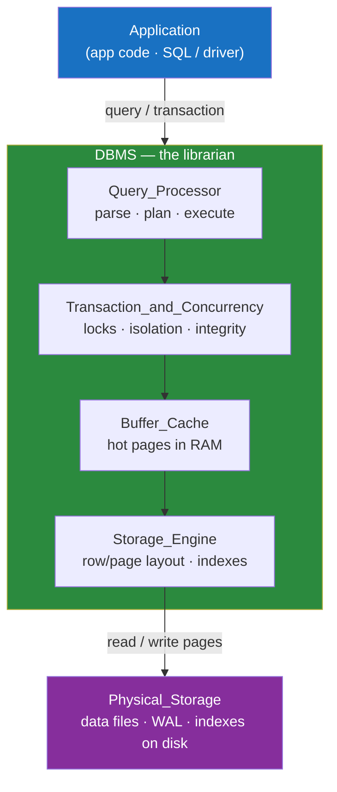

# 🗄️ Database Fundamentals

> [!abstract] TL;DR
> A **database** is an organized collection of related data; a **DBMS** (Database Management System) is the software that stores, protects, and queries it. You reach for a DBMS instead of raw files because it gives you five things flat files cannot: safe **concurrency**, enforced **integrity**, crash **durability**, a declarative **query language**, and **security**. Workloads split into **OLTP** (fast operational writes) and **OLAP** (heavy analytical reads). The **ANSI three-schema architecture** (external / conceptual / internal) is why you can change how data is stored on disk without rewriting a single query.

## Intuition — analogy FIRST

Imagine a shared office filing cabinet versus hiring a professional librarian.

The **filing cabinet** (flat files — a folder of CSVs or JSON) works when one person uses it occasionally. But the moment two people grab the same folder at once, someone's edits vanish. There is no rule stopping you from filing a customer record with no name, no way to undo a coffee spill, and anyone who opens the drawer sees everything.

The **librarian** (a DBMS) sits between you and the shelves. Ask for "all overdue books by author," and the librarian figures out the fastest way to find them. Two people can check out books simultaneously without chaos. The librarian refuses to file a book with no title, keeps a logbook so nothing is ever lost in a fire, and checks your card before handing over restricted material.

A database is the *books and shelves*. The DBMS is the *librarian*. People say "database" for both, but the distinction matters.

---

## How It Works

A DBMS sits between your **application** and **physical storage**. The application never touches disk directly — it sends declarative requests ("give me these rows"), and the DBMS translates them into physical reads and writes, applying concurrency, integrity, and durability rules along the way.



### Database vs DBMS

| Term | What it is | Example |
|------|-----------|---------|
| **Database** | The organized data itself — tables, rows, indexes | The `ecommerce` schema with `orders`, `customers` |
| **DBMS** | The software managing that data | PostgreSQL, MySQL, SQLite, MongoDB |
| **Database server / instance** | A running DBMS process serving one or more databases | A `postgres` process on port 5432 |

Casual speech blurs these ("our database is slow" usually means the DBMS). Be precise in design discussions.

### Why a DBMS over flat files

| Concern | Flat files (CSV / JSON) | DBMS |
|---------|------------------------|------|
| **Concurrency** | Two writers corrupt each other; no locking | Transactions + locks let thousands write safely |
| **Integrity** | Nothing stops garbage (missing keys, wrong types) | Constraints, types, foreign keys enforced |
| **Durability** | A crash mid-write leaves a half-written file | [[Write_Ahead_Logging\|Write-Ahead Log]] guarantees committed data survives |
| **Query language** | You hand-write scan/filter/join code | Declarative SQL; the optimizer picks the plan |
| **Security** | OS file permissions only (all-or-nothing) | Per-table / per-column / per-row access control |
| **Efficiency at scale** | Full file scan for every lookup | Indexes turn scans into log-time seeks — see [[Database_Indexes]] |

---

## Key Concepts / Details

### OLTP vs OLAP — two workload shapes

Every database workload leans toward one of two opposite profiles:

- **OLTP (Online Transaction Processing)** — many small, fast, concurrent reads and writes on current data. "Place this order," "update this profile." Optimized for low latency and high write throughput. This is what [[PostgreSQL]] and [[MySQL]] are built for.
- **OLAP (Online Analytical Processing)** — a few large, complex, read-heavy queries scanning historical data. "Total revenue by region for the last 3 years." Optimized for scan throughput, usually on columnar storage.

You almost always need both, connected by a data pipeline. Full treatment in [[OLTP_vs_OLAP]].

### The ANSI/SPARC three-schema architecture

The single most important idea in why databases are maintainable: **three levels of abstraction**, each insulated from changes in the one below it.

```
┌─────────────────────────────────────────────┐
│  EXTERNAL schema (views)                      │  "what each user/app sees"
│  e.g. a sales rep sees only their region      │
├─────────────────────────────────────────────┤
│  CONCEPTUAL schema (logical model)            │  "the whole DB, tables & relationships"
│  e.g. customers, orders, products + FKs       │
├─────────────────────────────────────────────┤
│  INTERNAL schema (physical storage)           │  "how bytes sit on disk"
│  e.g. B-tree indexes, page layout, compression│
└─────────────────────────────────────────────┘
```

| Level | Answers | Who cares | Example change |
|-------|---------|-----------|----------------|
| **External** | "What does *this* user see?" | App developers, end users | Add a view exposing only non-sensitive columns |
| **Conceptual** | "What is the whole logical structure?" | Data architects, DBAs | Add an `orders.discount` column |
| **Internal** | "How is it physically stored?" | Storage engine, DBAs | Swap a [[BTree_Indexes\|B-tree index]] for a hash index |

**Data independence** is the payoff:
- **Logical data independence** — change the conceptual schema (add a column) without breaking existing external views.
- **Physical data independence** — change the internal schema (add an index, change page size) without rewriting a single query.

This is precisely why you can add an index to speed up a query without touching application code — the internal schema changed, the conceptual and external schemas did not.

---

## PostgreSQL vs MySQL

| Aspect | PostgreSQL | MySQL |
|--------|-----------|-------|
| Positioning | Object-relational, standards-focused, extensible | Fast, simple, ubiquitous in web stacks |
| Default storage engine | Single integrated engine (heap + WAL) | Pluggable; **InnoDB** is the default (ACID) |
| Query language flavor | Rich SQL, CTEs, window functions, custom types | Broad SQL support; historically fewer advanced features (closing the gap) |
| Typical use | Complex queries, analytics-leaning OLTP, GIS | High-volume simple OLTP, LAMP/web apps |
| Extensibility | Custom types, operators, extensions (PostGIS, pgvector) | More limited; plugin architecture |

Both are relational OLTP databases that speak SQL and provide [[Transactions_and_ACID|ACID transactions]] — the differences are in extensibility, defaults, and ecosystem, not in the fundamentals above.

---

## Real-World Notes

- **[[SQLite]] is a DBMS too.** It has no server process — it is an embedded library that reads/writes a single file — yet it still gives you SQL, transactions, and durability. "DBMS" does not require a separate server.
- **"Just use a file" is a real trap.** Teams that start with a JSON file for config or state hit the concurrency and integrity walls within weeks once two processes write concurrently. The migration to SQLite/Postgres is nearly always worth doing early.
- **The three-schema model explains migrations.** A well-run schema migration touches the conceptual layer; a good ORM/view layer shields the external layer so most app code is untouched.
- **Managed services blur "DBMS."** Amazon RDS, Aurora, Cloud SQL, and PlanetScale all run PostgreSQL/MySQL for you — the fundamentals are identical; they manage the internal/operational layer.

---

## Common Pitfalls

1. **Confusing "database" with "DBMS" in design docs.** Saying "we'll pick a database" when you mean "we'll pick a DBMS" muddies capacity vs engine decisions.
2. **Rolling your own concurrency on flat files.** File locks and manual merges reinvent — badly — what a DBMS gives you for free. Reach for SQLite before hand-writing locking.
3. **Assuming files are "faster because they're simpler."** For anything beyond a single sequential read, a DBMS index beats a full file scan by orders of magnitude.
4. **Running analytics (OLAP) on your OLTP database.** Big `GROUP BY` scans evict the hot cache and spike latency for real users. Route them to a replica or warehouse.
5. **Ignoring data independence.** Hard-coding physical assumptions (column order, on-disk layout) into app code defeats the whole point of the three-schema architecture and makes every migration painful.

---

## Related Concepts

- [[_MOC_DB_Foundations|↑ Section MOC]]
- [[Databases]] — The broader landscape of relational vs NoSQL databases and when each fits
- [[DBMS_Architecture]] — Zoom into the internal components (parser, optimizer, buffer manager) that make the DBMS work
- [[Relational_Model]] — The formal data model most DBMSs are built on
- [[OLTP_vs_OLAP]] — Deep dive on the two workload shapes introduced here
- [[ACID_and_Transactions]] — How the DBMS delivers the concurrency and durability guarantees files lack
- [[Database_Indexes]] — The internal-schema structure that makes queries fast without changing your SQL

---

## Review Questions

1. A teammate says "let's store our user records in a JSON file instead of setting up a database — it's simpler." Name three specific problems this will cause and the DBMS feature that solves each.
2. Explain the difference between a *database* and a *DBMS*, and give an example of a DBMS that has no separate server process.
3. Using the ANSI three-schema architecture, explain why a DBA can add an index to speed up a slow query without any application code changing. Which schema level changed, and which stayed the same?

---

## Sources

- Ramez Elmasri & Shamkant Navathe, *Fundamentals of Database Systems*, Ch. 1–2 (three-schema architecture, data independence)
- Abraham Silberschatz et al., *Database System Concepts*, Ch. 1 — Introduction
- PostgreSQL Documentation: Overview — https://www.postgresql.org/docs/current/intro-whatis.html
- MySQL Documentation: What is MySQL — https://dev.mysql.com/doc/refman/8.0/en/what-is-mysql.html

#Database #Foundations #Fundamentals #DBMS #ThreeSchemaArchitecture #OLTP #OLAP
