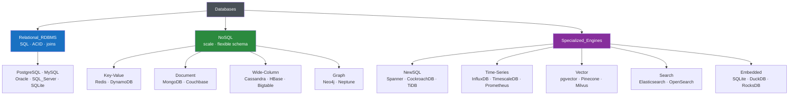

# 🗺️ Database Types Overview

> [!abstract] TL;DR
> The database landscape splits into a few big families. **Relational (RDBMS)** is the default: structured data, joins, [[Transactions_and_ACID|ACID]]. **NoSQL** relaxes the relational rules for scale and flexibility across four shapes — **key-value**, **document**, **wide-column**, and **graph**. Then come the specialists: **[[NewSQL]]** (relational SQL + horizontal scale), **[[Time_Series_and_Vector_Databases|time-series]]** (metrics/IoT), **vector** (AI embeddings / similarity search), **search engines** (full-text/relevance), and **embedded** (in-process, zero-ops). The skill isn't memorizing products — it's matching your **data shape + access pattern + scale + consistency need** to the right family. When in doubt, start relational.

## Intuition — analogy FIRST

Think of choosing a **vehicle**.

A **sedan** (relational database) is the sensible default: it handles almost every trip — commuting, groceries, a road trip. Most people never need anything else. But specialized jobs demand specialized vehicles: a **moving truck** (wide-column, for massive volume), a **motorcycle** (key-value, for raw speed on simple trips), a **delivery van with labeled shelves** (document store, flexible cargo), a **subway map reader** (graph, for connections), a **stopwatch-on-wheels** (time-series, for measuring over time), and a **bloodhound** (vector/search, for "find me the thing most *like* this").

The mistake beginners make is buying a moving truck to commute — reaching for Cassandra or a graph DB because it sounds powerful, when a sedan (Postgres/MySQL) would carry the load with far less operational pain. **Pick the vehicle for the trip, not for the brochure.**

---

## How It Works

Databases form a taxonomy: one dominant relational family, four NoSQL families, and a set of purpose-built specialists.

---

## Key Concepts / Details

### Relational (RDBMS) — the default

Structured rows and columns, enforced schema, **joins**, and **ACID** transactions. The workhorse for OLTP: orders, users, payments, inventory. Speaks SQL. If your data is structured and relationships matter, start here — see [[Databases]] and [[Relational_Model]].
- **Reach for it when:** you need joins, transactions, strong consistency, and ad-hoc queries.
- **Examples:** PostgreSQL, MySQL, Oracle, SQL Server, SQLite.

### The four NoSQL families

| Family | Data shape | Superpower | Reach for it when | Note |
|--------|-----------|-----------|-------------------|------|
| **Key-Value** | `key → opaque value` | Blazing O(1) lookups; simple | Caching, sessions, feature flags, rate limits | [[Key_Value_Store]] |
| **Document** | JSON/BSON documents | Flexible/nested schema, per-document reads | Content, catalogs, user profiles, evolving schemas | [[Document_Store]] |
| **Wide-Column** | Rows with dynamic column families | Massive write throughput, linear scale | Time-stamped events, IoT, huge write volume | [[Wide_Column_Store]] |
| **Graph** | Nodes + edges (relationships) | Traversing deep relationships cheaply | Social networks, fraud rings, recommendations, knowledge graphs | [[Graph_Databases]] |

NoSQL generally trades joins and strict schema (and sometimes strong consistency) for horizontal scale and flexibility — the core trade-off dissected in [[SQL_vs_NoSQL]] and constrained by the [[CAP_Theorem]].

### The specialists

- **NewSQL** — SQL interface and ACID transactions **plus** horizontal scale via a distributed architecture. The "have your cake and eat it" tier for global-scale OLTP. Examples: Google Spanner, CockroachDB, TiDB, YugabyteDB. Reach for it when you've genuinely outgrown a single relational primary but still need SQL/ACID.
- **Time-series (TSDB)** — optimized for append-only, timestamp-ordered data with time-window queries and downsampling. Examples: InfluxDB, TimescaleDB (a Postgres extension!), Prometheus. Reach for it for metrics, monitoring, IoT sensor streams, financial ticks.
- **Vector** — stores high-dimensional **embeddings** and does approximate nearest-neighbor (ANN) similarity search. The backbone of semantic search and RAG for LLMs. Examples: pgvector (Postgres extension), Pinecone, Milvus, Weaviate, Qdrant. Reach for it for "find items *semantically similar* to this."
- **Search engines** — inverted indexes for full-text search, relevance ranking, faceting, typo tolerance. Examples: Elasticsearch, OpenSearch, Apache Solr, Meilisearch. Reach for it for search boxes, log analytics, relevance-ranked results.
- **Embedded** — run **in-process**, no server to operate, a single file or library. Examples: SQLite (the most deployed DB on Earth), DuckDB (embedded OLAP/analytics), RocksDB/LevelDB (embedded KV storage engine). Reach for them for mobile/desktop apps, edge, local analytics, or as a storage layer inside a bigger system.

### A practical decision guide

Ask these in order; stop at the first strong signal:

1. **Structured data with relationships and transactions?** → **Relational** (Postgres/MySQL). This covers ~80% of applications.
2. **Just need a fast cache / ephemeral lookups?** → **Key-Value** ([[Redis]]).
3. **Flexible, nested, schema-evolving documents?** → **Document** ([[MongoDB]]) — or Postgres `JSONB` (you often don't need a separate DB).
4. **Enormous write volume / linear multi-region scale, simple queries?** → **Wide-Column** ([[Cassandra]]).
5. **The relationships *are* the query (traversals, paths)?** → **Graph** (Neo4j).
6. **Time-stamped metrics and time-window aggregation?** → **Time-series** (TimescaleDB / Prometheus).
7. **Semantic similarity / AI embeddings?** → **Vector** (pgvector / Pinecone).
8. **Full-text search and relevance ranking?** → **Search** (Elasticsearch).
9. **Global SQL + ACID beyond one node?** → **NewSQL** (Spanner / CockroachDB).
10. **Embedded / no server / edge?** → **SQLite / DuckDB.**

> **Beginner's rule:** default to PostgreSQL. With `JSONB` (document-ish), `pgvector` (vector), TimescaleDB (time-series), and full-text search built in, it postpones the "polyglot persistence" decision far longer than people expect. Adopt a specialist only when a real, measured need appears.

### Polyglot persistence

Mature systems rarely use one database — they use the right store per job: Postgres for orders, Redis for sessions, Elasticsearch for search, a vector DB for recommendations. This is **[[Polyglot_Persistence|polyglot persistence]]**. The cost is operational complexity and data-sync pipelines, so add stores deliberately, not speculatively.

---

## PostgreSQL vs MySQL

In the *relational* family specifically, the two default choices compare like this:

| Aspect | PostgreSQL | MySQL |
|--------|-----------|-------|
| Best fit | Complex queries, mixed OLTP/light-OLAP, extensibility | High-volume simple OLTP, classic web stacks |
| Absorbs other "types" via | `JSONB` (document), `pgvector` (vector), `hstore` (KV), PostGIS (geo), TimescaleDB (time-series), full-text search | JSON type, basic full-text (InnoDB), spatial types |
| Extensibility | Extremely high (custom types, extensions) | More limited |
| Reason to pick | You want one engine to cover many needs before going polyglot | Simplicity, raw read throughput, ubiquity |

The takeaway: **PostgreSQL's extensions let it stand in for several specialized database types**, which is why "just use Postgres" is such common advice — it delays the multi-database complexity jump.

---

## Real-World Notes

- **"Just use Postgres" is a meme because it's usually right.** Teams routinely add MongoDB/Elasticsearch/Pinecone that Postgres `JSONB` + full-text + `pgvector` could have served at a fraction of the ops cost.
- **Redis is everywhere, but as a *complement*.** It's the near-universal cache/session/queue layer alongside a primary relational store — not a system of record.
- **Cassandra/wide-column is a write-volume tool, not a default.** Its data model forces you to design tables per query pattern; joins and ad-hoc queries are painful. Adopt it when write scale genuinely demands it.
- **Vector databases exploded with LLMs.** RAG pipelines made ANN search mainstream; for many apps, `pgvector` inside your existing Postgres is enough before reaching for a dedicated vector DB.
- **SQLite is the most-deployed database in the world.** Every phone, browser, and countless apps embed it — a reminder that "database" doesn't require a server.

---

## Common Pitfalls

1. **Choosing NoSQL for "scale" you don't have.** Most apps never outgrow a well-tuned relational primary. Premature Cassandra/Mongo adds pain without benefit.
2. **Using a document DB to avoid learning schema design.** Schemaless still needs discipline; unmodeled documents become an un-queryable swamp.
3. **Ignoring the CAP trade-off.** Distributed NoSQL stores force availability-vs-consistency choices ([[CAP_Theorem]]); assuming strong consistency you didn't configure causes subtle bugs.
4. **Reaching for a specialized DB when Postgres already has the feature.** `JSONB`, full-text, `pgvector`, geospatial — check before adding a whole new system.
5. **Unbounded polyglot persistence.** Every new store multiplies ops, backups, monitoring, and data-sync work. Add stores only for measured, real needs.
6. **Forcing graph queries into relational (or vice versa).** Deep, variable-length traversals are miserable as recursive SQL joins; conversely, transactional CRUD is awkward in a graph DB. Match the shape.

---

## Related Concepts

- [[_MOC_DB_Foundations|↑ Section MOC]]
- [[SQL_vs_NoSQL]] — The central trade-off between relational and NoSQL that drives most of these choices
- [[Databases]] — The broader landscape reference this map summarizes
- [[Key_Value_Store]] — The simplest NoSQL family
- [[Document_Store]] — Flexible JSON-document databases
- [[Wide_Column_Store]] — Massive-scale column-family stores
- [[Graph_Databases]] — Relationship-first databases
- [[CAP_Theorem]] — Why distributed databases must trade consistency against availability
- [[OLTP_vs_OLAP]] — The workload split that also shapes which engine you pick

---

## Review Questions

1. Name the four NoSQL families and give a one-line "reach for it when" for each. Which one would you choose for user sessions, and which for a fraud-detection ring analysis?
2. A teammate proposes adding MongoDB *and* Elasticsearch *and* a vector database to a small app currently on PostgreSQL. What single-database features could cover each of those needs, and what is the general principle for deciding when to actually add a specialized store?
3. What does NewSQL offer that classic RDBMS and classic NoSQL each lack, and what problem is it solving? Give one example system.

---

## Sources

- Martin Kleppmann, *Designing Data-Intensive Applications*, Ch. 2 — Data Models and Query Languages
- Pramod Sadalage & Martin Fowler, *NoSQL Distilled* — the families and polyglot persistence
- Google Research: *Spanner: Google's Globally-Distributed Database* (OSDI 2012) — https://research.google/pubs/pub39966/
- PostgreSQL Documentation: JSON Types & Extensions — https://www.postgresql.org/docs/current/datatype-json.html

#Database #Foundations #DatabaseTypes #NoSQL #NewSQL #VectorDB #PolyglotPersistence
