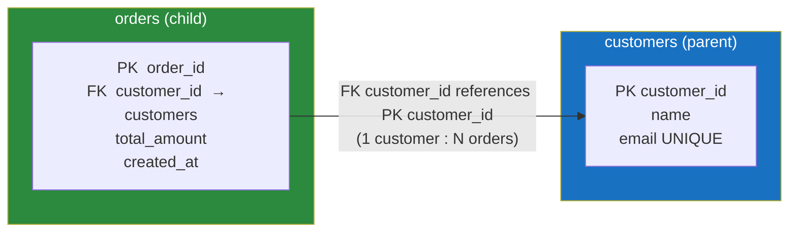

# 🔑 Keys and Relationships

> [!abstract] TL;DR
> **Keys** are how the relational model identifies rows and links tables. A **superkey** is any set of columns that's unique; a minimal one is a **candidate key**; the one you pick to identify rows is the **primary key**. A **foreign key** points at another table's primary key, enforcing **[[Constraints_and_Integrity|referential integrity]]** — you can't reference a row that doesn't exist, and **cascading actions** (`ON DELETE CASCADE / SET NULL / RESTRICT`) decide what happens when the parent is deleted. Relationships come in three **cardinalities** — 1:1, 1:N, and M:N — where M:N always needs a **junction (join) table**. In practice, most teams use **surrogate keys** (`SERIAL`/`IDENTITY` in Postgres, `AUTO_INCREMENT` in MySQL) rather than natural keys.

## Intuition — analogy FIRST

Think of a school.

- Every student has a **student ID number**. It uniquely identifies them even though two students can share the name "Alex Kim." That ID is the **primary key** — a stable, unique handle.
- The registrar *could* also identify a student by (full name + date of birth + home address) — that combination happens to be unique too. That's a **candidate key** the school chose *not* to use, because it's long, changeable, and awkward. This is exactly the **natural vs surrogate key** debate: a made-up ID number (surrogate) beats a real-world attribute combo (natural).
- A student's **enrollment record** lists their student ID to say "this enrollment belongs to that student." The ID appearing in the enrollment table is a **foreign key** — a pointer back to the real student.
- **Referential integrity** is the rule "you cannot enroll student #999 if no student #999 exists." And when a student leaves, the school must decide: delete their enrollments too (**CASCADE**), blank them out (**SET NULL**), or refuse the deletion while records remain (**RESTRICT**).

Keys are IDs and pointers. Relationships are the pointers wired between tables.

---

## How It Works

A **foreign key** in the child table references the **primary key** of the parent table, creating a relationship the database itself enforces.



Here one customer has many orders (**1:N**). Every `orders.customer_id` **must** match an existing `customers.customer_id` — the database rejects any insert that would orphan an order.

---

## Key Concepts / Details

### The key hierarchy

| Key type | Definition | Example on `students(id, ssn, email, name, dob)` |
|----------|-----------|--------------------------------------------------|
| **Superkey** | *Any* column set that uniquely identifies a row (may have extras) | `{id, name}`, `{ssn, email}`, `{id}` — all unique |
| **Candidate key** | A **minimal** superkey (remove any column and it's no longer unique) | `{id}`, `{ssn}`, `{email}` |
| **Primary key (PK)** | The *one* candidate key chosen to identify rows; **not NULL**, unique | `{id}` |
| **Alternate / unique key** | A candidate key *not* chosen as PK, enforced with `UNIQUE` | `email`, `ssn` |
| **Composite key** | A key made of **two or more columns** together | `{course_id, semester}` |
| **Foreign key (FK)** | A column referencing another table's PK/unique key | `enrollments.student_id → students.id` |

Every candidate key is a superkey; the PK is a chosen candidate key. Memorize that chain — it's a classic interview question.

### Surrogate vs natural keys

| | Natural key | Surrogate key |
|--|------------|---------------|
| **Source** | Real-world attribute (SSN, email, ISBN) | System-generated, meaningless integer/UUID |
| **Pros** | No extra column; meaningful | Stable, compact, never changes, no PII |
| **Cons** | Can change (email!), may be PII, often wide | Extra column; no inherent meaning |
| **Verdict** | Use as a `UNIQUE` constraint | **Preferred as the PK in most designs** |

Rule of thumb: use a **surrogate PK** (auto-generated integer or UUID) and add `UNIQUE` constraints on the natural keys you also care about. Natural keys have a habit of changing (people change emails, countries reassign postal codes), and changing a PK cascades everywhere.

### Referential integrity and cascading actions

When you delete or update a parent row that children reference, the FK's `ON DELETE` / `ON UPDATE` clause decides the fate of the children:

| Action | On deleting the parent row | Use when |
|--------|----------------------------|----------|
| `RESTRICT` / `NO ACTION` | **Reject** the delete if children exist | Default safety; force explicit cleanup |
| `CASCADE` | **Delete the children too** | Child has no meaning without parent (order → order_items) |
| `SET NULL` | Set the child's FK to `NULL` | Relationship optional (employee → manager who left) |
| `SET DEFAULT` | Set the child's FK to a default value | Rare; needs a valid default row |

`CASCADE` is powerful and dangerous — deleting one customer can silently wipe thousands of dependent rows. Prefer `RESTRICT` unless the child genuinely cannot exist without the parent.

### Cardinality — the three relationship shapes

```
1:1   one row ↔ one row        e.g. user ↔ user_profile
1:N   one row ↔ many rows      e.g. customer → many orders   (most common)
M:N   many rows ↔ many rows    e.g. students ↔ courses       (needs junction table)
```

- **1:1** — put the FK (with a `UNIQUE` constraint) on either side, or merge into one table unless there's a reason to split (large/optional columns, security).
- **1:N** — the FK lives on the **"many"** side. An order carries `customer_id`, not the customer carrying a list of orders.
- **M:N** — SQL can't store "many on both sides" directly. You create a **junction table** whose PK is the composite of both FKs:

```sql
-- M:N between students and courses
CREATE TABLE enrollments (
    student_id  INT REFERENCES students(id)  ON DELETE CASCADE,
    course_id   INT REFERENCES courses(id)   ON DELETE CASCADE,
    enrolled_at TIMESTAMP DEFAULT now(),
    PRIMARY KEY (student_id, course_id)   -- composite PK
);
```

The junction table is also the natural home for **attributes of the relationship itself** (grade, enrollment date).

### SQL — auto-generated primary keys

**PostgreSQL** (modern `IDENTITY`, SQL-standard):
```sql
CREATE TABLE customers (
    customer_id BIGINT GENERATED ALWAYS AS IDENTITY PRIMARY KEY,
    email       TEXT NOT NULL UNIQUE,
    name        TEXT NOT NULL
);
-- legacy/common style: customer_id SERIAL PRIMARY KEY  (or BIGSERIAL)

CREATE TABLE orders (
    order_id     BIGINT GENERATED ALWAYS AS IDENTITY PRIMARY KEY,
    customer_id  BIGINT NOT NULL REFERENCES customers(customer_id) ON DELETE RESTRICT,
    total_amount NUMERIC(10,2) NOT NULL CHECK (total_amount >= 0)
);
```

**MySQL / InnoDB** (`AUTO_INCREMENT`):
```sql
CREATE TABLE customers (
    customer_id BIGINT AUTO_INCREMENT PRIMARY KEY,
    email       VARCHAR(255) NOT NULL UNIQUE,
    name        VARCHAR(255) NOT NULL
) ENGINE=InnoDB;

CREATE TABLE orders (
    order_id     BIGINT AUTO_INCREMENT PRIMARY KEY,
    customer_id  BIGINT NOT NULL,
    total_amount DECIMAL(10,2) NOT NULL CHECK (total_amount >= 0),
    FOREIGN KEY (customer_id) REFERENCES customers(customer_id) ON DELETE RESTRICT
) ENGINE=InnoDB;
```

---

## PostgreSQL vs MySQL

| Aspect | PostgreSQL | MySQL / InnoDB |
|--------|-----------|----------------|
| Auto-increment PK | `SERIAL` / `BIGSERIAL` or `GENERATED ... AS IDENTITY` | `AUTO_INCREMENT` |
| FK enforcement | Always enforced | Enforced by **InnoDB**; **MyISAM ignores FKs entirely** |
| FK requires index on parent | References must target a PK/`UNIQUE` | Same; InnoDB auto-creates an index on the FK column |
| Deferred constraints | Supports `DEFERRABLE INITIALLY DEFERRED` | **Not supported** (checks are immediate) |
| Multiple NULLs in `UNIQUE` | Allowed (NULLs treated as distinct) | Allowed |
| UUID PKs | Native `uuid` type + `gen_random_uuid()` | `CHAR(36)` or `BINARY(16)`; `UUID()` function |
| PK & physical storage | Heap table; PK is just a unique index | InnoDB is **index-organized by PK** (clustered) — PK choice affects layout |

Key MySQL gotcha: InnoDB **clusters** the table around the primary key, so a random UUID PK causes page-split churn — favor a monotonic integer PK or ordered UUIDs. PostgreSQL heaps don't have this constraint.

---

## Real-World Notes

- **Always index your foreign keys.** [[PostgreSQL]] does **not** auto-create an index on the child's FK column ([[MySQL|MySQL/InnoDB]] does). Un-indexed FKs make joins and cascading deletes slow, and can cause lock contention on the parent.
- **`ON DELETE CASCADE` deletes more than you think.** A single `DELETE FROM customers WHERE id = 5` can remove orders, order_items, payments... Test cascades on staging with row counts first.
- **Surrogate keys win in practice.** Almost every mature schema uses an integer/UUID PK plus `UNIQUE` natural keys. It future-proofs against real-world attributes changing.
- **Junction tables are first-class.** Don't be afraid to give them their own surrogate PK and extra columns; they often become important entities (e.g., `enrollments` gaining `grade`, `status`).
- **Disable FK checks only with care.** Bulk loads sometimes toggle FK enforcement off for speed (`SET session_replication_role` in PG, `SET FOREIGN_KEY_CHECKS=0` in MySQL) — re-validate afterward or you'll ship orphans.

---

## Common Pitfalls

1. **Forgetting to index FK columns (PostgreSQL).** Slow joins and lock escalation on parent deletes. Add the index yourself.
2. **Using a mutable natural key as PK.** When the "unique" email changes, every child FK and reference must change too — a migration nightmare. Use a surrogate.
3. **`CASCADE` where you meant `RESTRICT`.** Accidental mass deletion. Default to `RESTRICT`; opt into `CASCADE` deliberately.
4. **Modeling M:N without a junction table.** Comma-separated FK lists in a single column break integrity and can't be joined or indexed. Always use a junction table.
5. **Random UUID PK on InnoDB.** Because InnoDB clusters on the PK, random UUIDs cause page splits and index bloat. Use ordered/sequential IDs or UUIDv7.
6. **Relying on MyISAM for referential integrity.** MyISAM accepts FK syntax but silently ignores enforcement. Use InnoDB.

---

## Related Concepts

- [[_MOC_DB_Foundations|↑ Section MOC]]
- [[Relational_Model]] — Where keys come from: candidate keys and the set-based foundation
- [[Database_Fundamentals]] — Integrity is one of the core reasons to use a DBMS over files
- [[Database_Indexes]] — PKs and FKs are backed by indexes; how those lookups stay fast
- [[ACID_and_Transactions]] — Referential integrity is part of the "C" (Consistency) in ACID
- [[Databases]] — How relationships and joins differ across relational vs NoSQL stores

---

## Review Questions

1. Order these from most to least general and define each: primary key, candidate key, superkey. Give an example of a superkey that is *not* a candidate key.
2. You have `customers` and `orders`. Write (in either Postgres or MySQL) the `orders` table with a foreign key such that deleting a customer is *blocked* while they still have orders. Then explain how you'd change one clause to instead auto-delete their orders, and when each choice is appropriate.
3. Model a many-to-many relationship between `students` and `courses`. What table must you introduce, what is its primary key, and where would you store the student's grade for a course?

---

## Sources

- C. J. Date, *An Introduction to Database Systems* — keys, integrity, and relationships
- Ramez Elmasri & Shamkant Navathe, *Fundamentals of Database Systems*, Ch. 3 & 5
- PostgreSQL Documentation: Constraints (Foreign Keys) — https://www.postgresql.org/docs/current/ddl-constraints.html
- MySQL Documentation: FOREIGN KEY Constraints — https://dev.mysql.com/doc/refman/8.0/en/create-table-foreign-keys.html

#Database #Foundations #Keys #ForeignKeys #ReferentialIntegrity #Cardinality #SurrogateKeys
