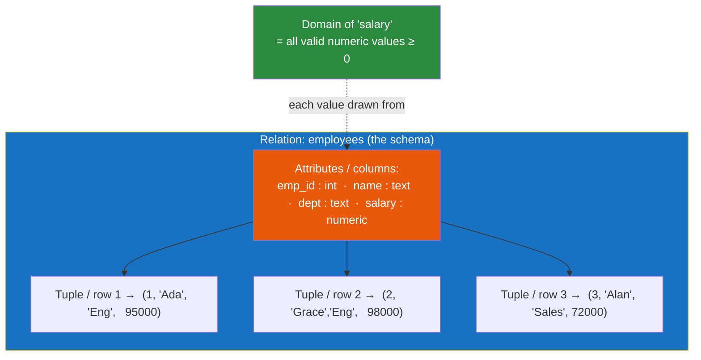

# 🧮 Relational Model

> [!abstract] TL;DR
> Edgar F. Codd's **relational model** (1970) represents all data as **relations** (tables) made of **tuples** (rows) and **attributes** (columns), where each attribute draws values from a **domain** (a type). You manipulate data with **relational algebra** — selection (σ), projection (π), join (⋈), union, and difference — thinking in **sets**, not loops. It won the database world because it separated the *logical* view of data from *physical* storage, letting a **declarative** language (SQL) describe *what* you want while the engine decides *how*. The one persistent gotcha: **NULL** turns Boolean logic into **three-valued logic** (true / false / unknown).

## Intuition — analogy FIRST

Think of a **spreadsheet with strict rules**.

A spreadsheet already looks relational: rows are records, columns are fields. But a relational *relation* adds discipline a spreadsheet lacks:

- Every value in the "birth_date" column *must* be a date — no stray text (that's the **domain**).
- No two rows are exactly identical, and there's a column (or set) that uniquely names each row (the **key**).
- Row order and column order carry **no meaning** — a relation is a *set*, not a list. Sorting the sheet changes nothing about the data.

Now the leap: instead of writing a macro that loops cell-by-cell, you say *"give me every row where country = 'IN', and only the name and email columns."* You describe the **result set**; the engine figures out the loop. That shift — from "how to iterate" to "what set do I want" — is the entire mindset of the relational model.

---

## How It Works

A **relation** is a table; its **schema** names the attributes and their domains; each **tuple** is one row; each **attribute** is one column.



### Core vocabulary

| Formal term | Everyday term | Meaning |
|-------------|--------------|---------|
| **Relation** | Table | A set of tuples sharing the same attributes |
| **Tuple** | Row / record | One data point: an ordered set of attribute values |
| **Attribute** | Column / field | A named property with a domain |
| **Domain** | Type / value set | The allowed values for an attribute (e.g., `integer`, `date`, `text`) |
| **Degree** | (arity) | Number of attributes (columns) |
| **Cardinality** | Row count | Number of tuples (rows) |
| **Relation schema** | Table definition | `employees(emp_id, name, dept, salary)` + domains |
| **Relational schema / DB schema** | The whole design | The set of all relation schemas + constraints |

A key property: a relation is a **set of tuples**, so (in theory) there are no duplicate rows and **no inherent ordering**. SQL relaxes "set" to "multiset/bag" (duplicates are allowed unless you say `DISTINCT`), which is a practical departure from Codd's pure model.

---

## Key Concepts / Details

### Relational algebra — the operations behind SQL

Every SQL query decomposes into these primitive set operations. The Greek symbols are worth knowing because they show up constantly.

| Operation | Symbol | SQL equivalent | What it does |
|-----------|:------:|----------------|--------------|
| **Selection** | σ (sigma) | `WHERE` | Keep the *rows* matching a predicate |
| **Projection** | π (pi) | `SELECT col_a, col_b` | Keep only certain *columns* |
| **Join** | ⋈ (bowtie) | `JOIN ... ON` | Combine rows of two relations on matching attributes |
| **Union** | ∪ | `UNION` | All rows in either relation (same schema) |
| **Difference** | − | `EXCEPT` / `MINUS` | Rows in A but not in B |
| **Cartesian product** | × | `CROSS JOIN` | Every row of A paired with every row of B |
| **Rename** | ρ (rho) | `AS` | Rename a relation or attribute |

**Reading a query as algebra.** The SQL:
```sql
SELECT name, salary
FROM employees
WHERE dept = 'Eng';
```
is literally: `π_{name, salary} ( σ_{dept='Eng'} (employees) )` — *project* the name/salary columns *of the selection* of Engineering rows. Selection filters rows; projection filters columns; they compose.

Join is the star operator: `employees ⋈ departments` on `dept` matches each employee to their department row, letting [[Normalization|normalized]] data be recombined at query time.

### Set-based thinking

The mental shift that trips up procedural programmers: **operate on whole sets at once, not one row at a time.** Instead of "loop over employees, and for each, look up the department," you write one join and let the optimizer choose the loop. Row-by-row cursors and `for`-loops in SQL are almost always a mistake — they discard the engine's ability to plan efficient set operations.

### NULL and three-valued logic (3VL)

`NULL` means "unknown / not applicable" — it is **not** zero and **not** an empty string. Because a value can be *unknown*, Boolean logic gains a third result: **UNKNOWN**.

| Comparison | Result |
|------------|--------|
| `5 = 5` | TRUE |
| `5 = NULL` | **UNKNOWN** (not FALSE!) |
| `NULL = NULL` | **UNKNOWN** |
| `NULL <> NULL` | **UNKNOWN** |

Consequences that bite everyone at least once:
- `WHERE salary = NULL` returns **no rows** — you must write `WHERE salary IS NULL`.
- `WHERE dept <> 'Eng'` silently **excludes rows where `dept` is NULL**, because `NULL <> 'Eng'` is UNKNOWN, not TRUE.
- Only rows where the predicate is **TRUE** are returned; UNKNOWN is filtered out just like FALSE.
- Aggregates like `AVG(salary)` **skip NULLs**, but `COUNT(*)` counts them while `COUNT(salary)` does not.

3VL is the price of representing "we don't know." Handle it explicitly with `IS NULL`, `COALESCE`, and careful negation.

### Why the relational model won

- **Data independence** — the logical model is decoupled from physical storage (the ANSI three-schema idea in [[Database_Fundamentals]]). You can re-index or re-lay-out data on disk without changing queries.
- **Declarative querying** — you say *what*, the [[Query_Optimizer|optimizer]] decides *how*. This is what makes [[Database_Indexes]] and query planners possible.
- **Mathematical foundation** — set theory and first-order logic give provable correctness and enable optimization/rewriting.
- **Integrity by design** — keys and constraints (see [[Keys_and_Relationships]]) enforce correctness at the data layer, not in every app.
- **Flexibility** — ad-hoc queries the designer never anticipated still work, because the model is general, not access-path-specific (unlike the older hierarchical/network models it replaced).

Contrast with [[SQL_vs_NoSQL]]: NoSQL families trade some of this generality (joins, strict schema) for scale and flexibility — but the relational model remains the default for good reason.

---

## PostgreSQL vs MySQL

| Aspect | PostgreSQL | MySQL |
|--------|-----------|-------|
| Domains as a first-class feature | `CREATE DOMAIN` (custom constrained types) supported | No `CREATE DOMAIN`; emulate with `CHECK` constraints |
| Boolean type (for 3VL results) | Native `BOOLEAN` (`TRUE`/`FALSE`/`NULL`) | `BOOLEAN` is an alias for `TINYINT(1)` |
| `NULL` handling in `UNIQUE` | Multiple NULLs allowed (NULLs distinct) | Multiple NULLs allowed (same behavior) |
| Set operators | `UNION`, `INTERSECT`, `EXCEPT` all supported | `UNION` yes; `INTERSECT`/`EXCEPT` added in MySQL 8.0.31+ |
| Strictness of domains | Strong typing; implicit casts limited | Historically looser (silent coercion) unless `STRICT` sql_mode |

Both implement the relational model over SQL; PostgreSQL adheres more closely to the formal model (custom domains, full set algebra), while MySQL historically favored pragmatism.

---

## Real-World Notes

- **The NULL negation bug is everywhere.** A report that filters `WHERE status <> 'closed'` quietly drops every row with a NULL status — a classic "missing data" incident. Write `WHERE status IS DISTINCT FROM 'closed'` (PG) or `WHERE (status <> 'closed' OR status IS NULL)`.
- **Thinking in sets speeds you up.** Replacing an application loop that issues N queries with a single join (or a batch `IN (...)`) routinely turns seconds into milliseconds.
- **Relational algebra is the optimizer's playground.** Because your query is algebra, the engine can rewrite it (push selections below joins, reorder joins) while guaranteeing the same result set.
- **Order is not guaranteed without `ORDER BY`.** Since a relation is a set, never rely on "natural" row order; if you need order, ask for it.

---

## Common Pitfalls

1. **Using `= NULL` instead of `IS NULL`.** `= NULL` is always UNKNOWN and matches nothing. This is the single most common relational bug.
2. **Forgetting NULLs vanish under negation.** `col <> x` excludes NULL rows silently; account for them explicitly.
3. **Assuming row order.** Without `ORDER BY`, result order is arbitrary and can change between runs, versions, or plan changes.
4. **Row-by-row procedural thinking.** Cursors and app-side loops that could be a single set operation throw away the engine's optimization ability.
5. **Treating NULL as 0 or "".** Aggregates skip NULL; concatenation and arithmetic with NULL yield NULL. Use `COALESCE` to substitute a default deliberately.
6. **Confusing degree and cardinality.** Degree = number of columns; cardinality = number of rows. Interview trap.

---

## Related Concepts

- [[_MOC_DB_Foundations|↑ Section MOC]]
- [[Keys_and_Relationships]] — Keys, foreign keys, and integrity constraints that make relations reference each other
- [[Database_Fundamentals]] — The three-schema architecture that gives the relational model its data independence
- [[SQL_vs_NoSQL]] — What NoSQL trades away by relaxing the relational model
- [[Database_Indexes]] — How declarative queries get executed efficiently under the hood
- [[Databases]] — The wider database landscape built on (and beyond) this model

---

## Review Questions

1. Express the SQL `SELECT name FROM employees WHERE dept = 'Eng'` in relational algebra using σ and π, and explain which operator filters rows versus columns.
2. Evaluate each expression and explain why: `5 = NULL`, `NULL = NULL`, and whether `WHERE dept <> 'Eng'` returns a row whose `dept` is NULL.
3. What does it mean that "a relation is a set of tuples," and what two practical consequences does that have for duplicate rows and row ordering in the *pure* relational model (versus how SQL actually behaves)?

---

## Sources

- E. F. Codd, *A Relational Model of Data for Large Shared Data Banks* (Communications of the ACM, 1970) — the founding paper
- C. J. Date, *An Introduction to Database Systems*, Ch. on the relational model and algebra
- PostgreSQL Documentation: Data Types & CREATE DOMAIN — https://www.postgresql.org/docs/current/sql-createdomain.html
- MySQL Documentation: Working with NULL Values — https://dev.mysql.com/doc/refman/8.0/en/working-with-null.html

#Database #Foundations #RelationalModel #RelationalAlgebra #NULL #ThreeValuedLogic #Codd
