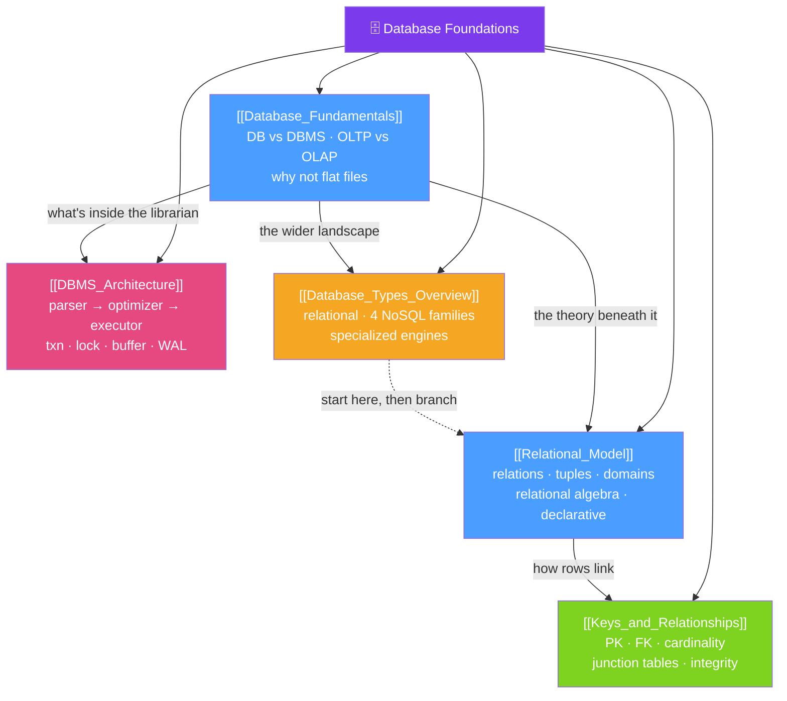

# 🗺️ Foundations — Map of Content

> [!abstract] What This Section Covers
> This section is the bedrock of everything else in the vault. It answers the most basic questions before you write a line of SQL: what a **database** and a **DBMS** actually are and why they beat flat files (concurrency, integrity, durability, querying, security), the **relational model** that Codd gave us (relations, tuples, relational algebra, declarative thinking), how **keys** and **relationships** wire tables together (primary/foreign keys, cardinality, junction tables, referential integrity), the internal **architecture** of a DBMS (parser → optimizer → executor, transaction/lock managers, buffer pool, storage manager, WAL), and finally a **map of the whole database landscape** — relational vs the four NoSQL families vs the purpose-built specialists — so you know which family to reach for and why "when in doubt, start relational" is sound advice.

## Concept Map

## Learning Path
1. [[Database_Fundamentals]] — What a database and DBMS are, why a DBMS beats flat files, and the OLTP vs OLAP split.
2. [[Relational_Model]] — Codd's relations/tuples/attributes, relational algebra, and thinking in sets instead of loops.
3. [[Keys_and_Relationships]] — Super/candidate/primary/foreign keys, 1:1/1:N/M:N cardinality, junction tables, referential integrity.
4. [[DBMS_Architecture]] — The internal pipeline a query flows through and the process-per-connection vs thread-per-connection fork.
5. [[Database_Types_Overview]] — The full taxonomy: relational, the four NoSQL families, and the specialist engines — and how to choose.

## All Notes at a Glance
| Note | Difficulty | What You'll Learn |
|------|------------|-------------------|
| [[Database_Fundamentals]] | Beginner | Database vs DBMS, the five things a DBMS gives you over flat files, OLTP vs OLAP, ANSI three-schema architecture |
| [[Relational_Model]] | Beginner | Relations, tuples, attributes, domains, relational algebra (σ π ⋈), declarative querying, and the NULL three-valued-logic gotcha |
| [[Keys_and_Relationships]] | Beginner | Superkey → candidate → primary key, foreign keys, referential integrity, cascading actions, cardinality, surrogate vs natural keys |
| [[DBMS_Architecture]] | Intermediate | The query pipeline (parser → optimizer → executor), transaction/lock/buffer/storage/recovery managers, WAL, and the process model |
| [[Database_Types_Overview]] | Beginner | The database taxonomy — relational, key-value/document/wide-column/graph, and NewSQL/time-series/vector/search/embedded specialists |

## Key Questions This Section Answers
- What is the difference between a *database* and a *DBMS*, and why not just use flat files?
- What does the relational model actually promise, and why did it beat earlier data models?
- What is the difference between a superkey, a candidate key, and a primary key?
- How does a foreign key enforce referential integrity, and what do CASCADE / SET NULL / RESTRICT do?
- How do you model a many-to-many relationship, and why does it always need a junction table?
- What are the stages a single SQL query passes through inside a DBMS?
- How do the major database families differ, and when should you pick something other than relational?

## Related Sections
- [[_MOC_Database_Master|↑ Database Master MOC]]
- [[_MOC_DB_Data_Modeling|→ Data Modeling]]
- [[_MOC_DB_SQL|→ SQL]]
- System Design: [[Databases]]

#MOC #Database #Foundations
