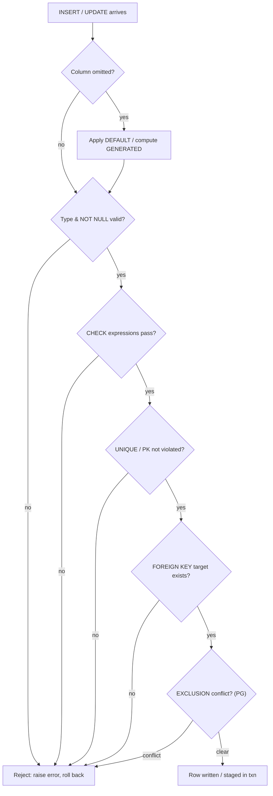

# 🛡️ Constraints and Data Integrity

> [!abstract] TL;DR
> **Constraints** are rules the database enforces on your data so bad values can never be written — regardless of which application, script, or careless human is at the keyboard. The core set is `NOT NULL`, `UNIQUE`, `PRIMARY KEY`, `FOREIGN KEY`, `CHECK`, and `DEFAULT`, plus generated columns and (in PostgreSQL) `EXCLUSION`. Together they guarantee the three integrities: **domain**, **entity**, and **referential**. Enforcing rules in the database is your last, strongest line of defense — application code can be bypassed; the constraint cannot.

## Intuition — analogy FIRST

Think of a **bouncer at a club door** versus a sign that politely asks people to behave once inside. Application-level validation is the sign: helpful, but anyone who enters through a side door (a migration script, an admin console, a bug in another service) ignores it completely.

A **database constraint is the bouncer.** It stands at the one door every write must pass through. It does not care which application sent the `INSERT` — if the row breaks a rule, it is turned away with an error. A negative price? Rejected. An order pointing at a customer who does not exist? Rejected. A duplicate email? Rejected.

The lesson every data team eventually learns the hard way: *validate in the app for good UX, but enforce in the database for actual guarantees.* Only the bouncer is unbypassable.

---

## How It Works

### The three kinds of integrity

| Integrity | Guarantees | Enforced by |
|-----------|-----------|-------------|
| **Domain integrity** | Every value in a column is valid for that column | data type, `NOT NULL`, `CHECK`, `DEFAULT`, `ENUM` |
| **Entity integrity** | Every row is uniquely identifiable; no NULL keys | `PRIMARY KEY` (implies `UNIQUE` + `NOT NULL`) |
| **Referential integrity** | Every foreign key points to a row that actually exists | `FOREIGN KEY` |

### The constraint catalog

**`NOT NULL`** — the column must always have a value. NULL means "unknown/absent"; forbidding it says this fact is mandatory.

**`UNIQUE`** — no two rows share the same value (or combination). Allows one NULL in most engines (NULLs are considered distinct). Backed by a unique index.

**`PRIMARY KEY`** — the row's identity. Exactly one per table; implies `UNIQUE` **and** `NOT NULL`. This is entity integrity (see [[Keys_and_Relationships]]).

**`FOREIGN KEY`** — a column whose value must match a key in another (or the same) table. This is referential integrity. It carries **referential actions** for what happens when the referenced row changes:

| Action | On parent DELETE/UPDATE |
|--------|-------------------------|
| `RESTRICT` / `NO ACTION` | Block it if children exist (default) |
| `CASCADE` | Delete/update the children too |
| `SET NULL` | Null out the child's FK |
| `SET DEFAULT` | Reset the child's FK to its default |

**`CHECK`** — an arbitrary boolean expression that every row must satisfy: `CHECK (price >= 0)`, `CHECK (end_date > start_date)`.

**`DEFAULT`** — the value used when an `INSERT` omits the column. Not a constraint that rejects data, but part of domain integrity.

**Generated / computed columns** — a column whose value is derived from other columns by a formula, maintained automatically. `STORED` (written to disk) or `VIRTUAL` (computed on read).

**`EXCLUSION` ([[PostgreSQL]] only)** — a generalization of `UNIQUE`: "no two rows may have values that conflict under this operator." The classic use is preventing **overlapping ranges** (double-booking a room) with the `&&` overlap operator via a [[Specialized_Indexes|GiST index]].

### Constraint enforcement flow on INSERT



### Deferrable constraints

By default, constraints check **immediately** at each statement. **Deferrable** constraints can be postponed to `COMMIT`, which lets you temporarily break integrity mid-transaction — essential for cases like swapping two rows' unique values, or inserting mutually-referencing rows.

```sql
-- PostgreSQL: defer FK checks to commit time
ALTER TABLE child
  ADD CONSTRAINT fk_parent FOREIGN KEY (parent_id) REFERENCES parent(id)
  DEFERRABLE INITIALLY DEFERRED;
```
PostgreSQL supports deferrable `UNIQUE`, `PK`, `FK`, and `EXCLUSION`. **[[MySQL|MySQL/InnoDB]] does not support deferrable constraints** (FK checks can only be toggled bluntly with `SET FOREIGN_KEY_CHECKS=0`).

---

## SQL Examples

**PostgreSQL** — the full toolkit including a generated column and an exclusion constraint:

```sql
CREATE TABLE product (
    product_id  INT GENERATED ALWAYS AS IDENTITY PRIMARY KEY,   -- entity integrity
    sku         TEXT NOT NULL UNIQUE,                            -- domain + uniqueness
    name        TEXT NOT NULL,
    price       NUMERIC(10,2) NOT NULL CHECK (price >= 0),       -- domain integrity
    currency    CHAR(3) NOT NULL DEFAULT 'USD',
    tax_rate    NUMERIC(4,3) NOT NULL DEFAULT 0.0,
    price_gross NUMERIC(12,2) GENERATED ALWAYS AS (price * (1 + tax_rate)) STORED
);

CREATE TABLE order_line (
    order_id    INT NOT NULL,
    product_id  INT NOT NULL REFERENCES product(product_id) ON DELETE RESTRICT,
    qty         INT NOT NULL CHECK (qty > 0),
    PRIMARY KEY (order_id, product_id)
);

-- EXCLUSION: no two bookings for the same room may overlap in time
CREATE EXTENSION IF NOT EXISTS btree_gist;
CREATE TABLE room_booking (
    room_id  INT NOT NULL,
    during   TSRANGE NOT NULL,
    EXCLUDE USING gist (room_id WITH =, during WITH &&)
);
```

**MySQL** — same intent; note the differences:

```sql
CREATE TABLE product (
    product_id  INT UNSIGNED NOT NULL AUTO_INCREMENT PRIMARY KEY,
    sku         VARCHAR(64) NOT NULL UNIQUE,
    name        VARCHAR(200) NOT NULL,
    price       DECIMAL(10,2) NOT NULL CHECK (price >= 0),       -- enforced in 8.0.16+
    currency    CHAR(3) NOT NULL DEFAULT 'USD',
    tax_rate    DECIMAL(4,3) NOT NULL DEFAULT 0.0,
    price_gross DECIMAL(12,2) AS (price * (1 + tax_rate)) STORED -- generated column
) ENGINE=InnoDB;

-- MySQL ENUM for a small fixed domain (Postgres would use a CHECK or a CREATE TYPE enum)
CREATE TABLE order_line (
    order_id   INT UNSIGNED NOT NULL,
    product_id INT UNSIGNED NOT NULL,
    status     ENUM('pending','shipped','cancelled') NOT NULL DEFAULT 'pending',
    qty        INT NOT NULL CHECK (qty > 0),
    PRIMARY KEY (order_id, product_id),
    FOREIGN KEY (product_id) REFERENCES product(product_id) ON DELETE RESTRICT
) ENGINE=InnoDB;
```

---

## PostgreSQL vs MySQL — the differences that bite

| Feature | PostgreSQL | MySQL |
|---------|-----------|-------|
| `CHECK` constraints | Enforced (all supported versions) | **Parsed but silently ignored before 8.0.16**; enforced from 8.0.16+ |
| Enumerated domains | `CREATE TYPE ... AS ENUM` or a `CHECK`/lookup table | Inline `ENUM('a','b')` column type |
| Deferrable constraints | Yes (`DEFERRABLE INITIALLY DEFERRED`) | **No** (only `SET FOREIGN_KEY_CHECKS=0` blunt toggle) |
| `EXCLUSION` constraints | Yes (GiST-backed, e.g. no overlapping ranges) | **No equivalent** |
| Partial / filtered unique index | Yes (`WHERE deleted_at IS NULL`) | No |
| FK on non-InnoDB engine | n/a | Ignored on MyISAM (use InnoDB) |
| Generated columns | `STORED` and `VIRTUAL` | `STORED` and `VIRTUAL` |

The historically dangerous one: **on MySQL < 8.0.16, `CHECK (price >= 0)` was accepted by the parser and did nothing.** Teams shipped schemas believing they were protected. Always confirm your MySQL version enforces CHECK, or back the rule with a trigger.

---

## Trade-offs / When to Use

| Situation | Guidance |
|-----------|----------|
| Any mandatory field | `NOT NULL` — cheap, always worth it |
| A natural business key (email, SKU) | `UNIQUE` in addition to a surrogate PK |
| A relationship between tables | `FOREIGN KEY` — do not rely on app code alone |
| A value-range rule (price ≥ 0, dates ordered) | `CHECK` (verify MySQL version) |
| Derived value read often | Generated `STORED` column vs. computing on read |
| Preventing overlapping resource bookings | PostgreSQL `EXCLUSION`; MySQL needs app-level locking |
| Very high write throughput, integrity elsewhere | Consider fewer FK checks — but measure; FK cost is usually small |

**Default posture: enforce in the database.** The rare exception is an extreme-write-volume ingestion path where FK/CHECK overhead is measured and moved elsewhere — a deliberate, benchmarked trade, not laziness.

---

## Common Pitfalls

1. **Trusting application validation alone.** A second service, a data migration, or a manual `psql` session bypasses your app entirely. Only the database constraint is unbypassable.
2. **Assuming MySQL enforces `CHECK` on old versions.** Pre-8.0.16 silently ignores it. Verify, or use triggers/lookup tables.
3. **`UNIQUE` and NULL surprises.** Most engines treat NULLs as distinct, so a `UNIQUE(email)` column allows *many* NULL emails. If that is wrong, add `NOT NULL` or use PostgreSQL 15+ `NULLS NOT DISTINCT`.
4. **`ON DELETE CASCADE` used carelessly.** Deleting one customer can silently wipe their orders, payments, and audit rows. Cascades are powerful and dangerous — prefer `RESTRICT` unless cascade is truly intended.
5. **Forgetting InnoDB for MySQL FKs.** MyISAM accepts FK syntax and ignores it. Use `ENGINE=InnoDB`.
6. **Non-deferrable constraints blocking legitimate multi-row operations.** Swapping two unique values or inserting mutually-referencing rows needs deferral (PostgreSQL) or a careful ordering / temporary disable (MySQL).
7. **Generated `STORED` columns and disk bloat / rewrite cost.** Adding a stored generated column rewrites the table and grows storage; use `VIRTUAL` when the value is cheap to compute and rarely filtered.

---

## Related Concepts

- [[_MOC_DB_Data_Modeling|↑ Section MOC]]
- [[Keys_and_Relationships]] — Primary and foreign keys are the entity- and referential-integrity constraints
- [[ER_Modeling]] — Participation and cardinality rules from the ER model become NOT NULL and FK constraints
- [[Normalization]] — Referential integrity is what makes normalized, split tables safe to join
- [[Schema_Design_Patterns]] — Soft deletes, exclusive polymorphic arcs, and junction tables rely on CHECK, partial-unique, and FK constraints
- [[Database_Indexes]] — UNIQUE, PK, and EXCLUSION constraints are backed by indexes
- [[Relational_Model]] — Integrity rules are part of Codd's model, not an add-on

---

## Review Questions

1. Name the three kinds of integrity (domain, entity, referential) and give the specific constraint that enforces each. Why does a `PRIMARY KEY` satisfy entity integrity by itself?
2. A colleague on MySQL 5.7 insists their `CHECK (balance >= 0)` protects the accounts table. What is wrong, and what are two ways to actually enforce the rule on that version?
3. Explain a concrete scenario where a **deferrable** constraint is required. Why can't the same operation be done with immediate (default) constraint checking, and how would you approach it on MySQL, which lacks deferrable constraints?

---

## Sources

- PostgreSQL Documentation — Constraints, and Exclusion Constraints (`btree_gist`, range types)
- MySQL 8.0 Reference Manual — CHECK Constraints (§13.1.20.6), Generated Columns, Foreign Keys, ENUM
- C. J. Date, *An Introduction to Database Systems* — Integrity chapter

#Database #DataModeling #Constraints #DataIntegrity #ReferentialIntegrity #ForeignKey #CheckConstraint #Beginner
