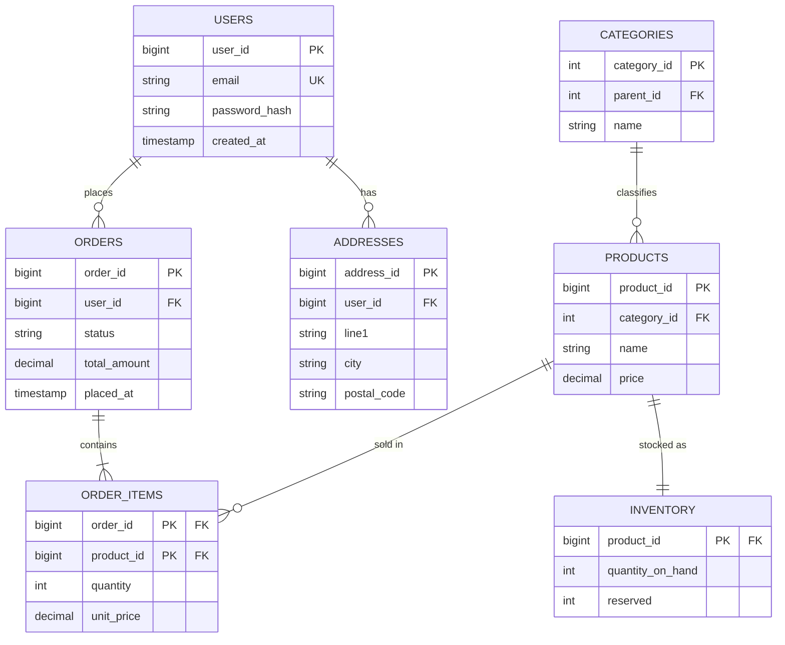
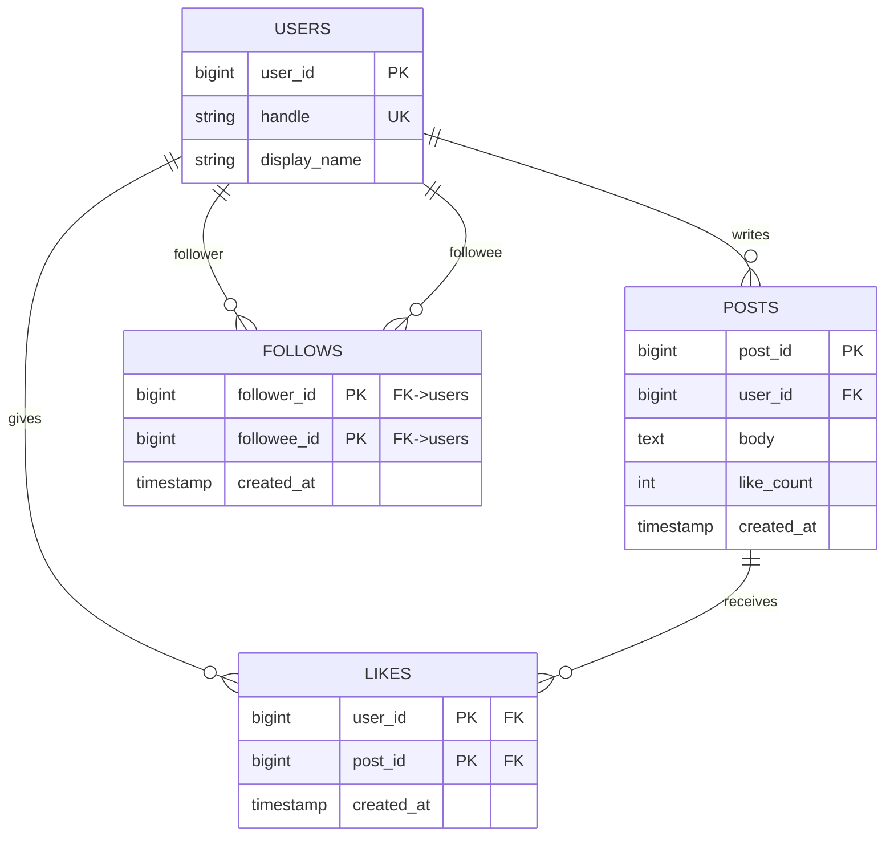
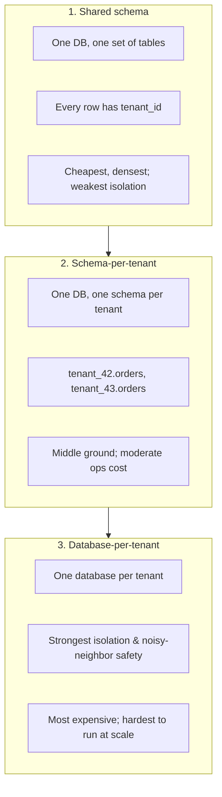

# 🏗️ Data Modeling Case Studies

> [!abstract] TL;DR
> Three complete schema designs with full DDL: **(1) e-commerce** (users, products, orders, order_items, inventory), **(2) social network** (users, posts, follows, likes — including the M:N self-join on follows), and **(3) multi-tenant SaaS** (shared-schema vs schema-per-tenant vs database-per-tenant). Each shows the normalization choices, the deliberate denormalizations, and the indexes that make the queries fast. This is where [[ER_Modeling]], [[Normalization]], [[Schema_Design_Patterns]], [[Constraints_and_Integrity]], and [[Database_Indexes]] come together in real designs.

## Intuition — analogy FIRST

Learning individual patterns is like learning individual chess moves — necessary, but not the same as playing a game. A **case study is a full game**, where every move interacts with the others: normalizing here forces a join there; adding an index speeds a read but slows a write; a multi-tenancy decision made on day one is nearly impossible to reverse on day one thousand.

These three studies are the games worth studying because you will play some version of each in your career: **selling things**, **connecting people**, and **serving many customers from one system**. Watch not just *what* the schema is, but *why each trade-off was chosen* — that reasoning is the transferable skill.

---

## How It Works

## Case Study 1 — E-commerce

**Requirements:** users register; browse products organized by category; place orders containing many products; inventory must never oversell; order history is immutable once placed.

**Key modeling decisions:**
- `order_item` is the **junction table** resolving the M:N between `orders` and `products` ([[Schema_Design_Patterns]]).
- **Price is snapshotted** onto `order_item.unit_price` — a deliberate [[Denormalization]]. The product's price may change tomorrow; the order must remember what the customer actually paid. This is *correct redundancy*, not a normalization failure.
- `inventory` is a **1:1 satellite** of `product`, split out because stock changes far more frequently than product descriptions (isolates hot writes from cold reads).
- `order.total_amount` is a **precomputed aggregate** (denormalized) so listing orders never has to re-sum line items.



**[[PostgreSQL]] DDL:**

```sql
CREATE TABLE users (
    user_id       BIGINT GENERATED ALWAYS AS IDENTITY PRIMARY KEY,
    email         TEXT NOT NULL UNIQUE,
    password_hash TEXT NOT NULL,
    created_at    TIMESTAMPTZ NOT NULL DEFAULT now()
);

CREATE TABLE categories (          -- adjacency-list hierarchy
    category_id INT GENERATED ALWAYS AS IDENTITY PRIMARY KEY,
    parent_id   INT REFERENCES categories(category_id),
    name        TEXT NOT NULL
);

CREATE TABLE products (
    product_id  BIGINT GENERATED ALWAYS AS IDENTITY PRIMARY KEY,
    category_id INT NOT NULL REFERENCES categories(category_id),
    name        TEXT NOT NULL,
    price       NUMERIC(10,2) NOT NULL CHECK (price >= 0),
    created_at  TIMESTAMPTZ NOT NULL DEFAULT now()
);

CREATE TABLE inventory (           -- 1:1 satellite, hot-write isolation
    product_id       BIGINT PRIMARY KEY REFERENCES products(product_id),
    quantity_on_hand INT NOT NULL CHECK (quantity_on_hand >= 0),
    reserved         INT NOT NULL DEFAULT 0 CHECK (reserved >= 0)
);

CREATE TABLE orders (
    order_id     BIGINT GENERATED ALWAYS AS IDENTITY PRIMARY KEY,
    user_id      BIGINT NOT NULL REFERENCES users(user_id),
    status       TEXT NOT NULL DEFAULT 'pending'
                 CHECK (status IN ('pending','paid','shipped','delivered','cancelled')),
    total_amount NUMERIC(12,2) NOT NULL DEFAULT 0,   -- denormalized aggregate
    placed_at    TIMESTAMPTZ NOT NULL DEFAULT now()
);

CREATE TABLE order_items (
    order_id   BIGINT NOT NULL REFERENCES orders(order_id),
    product_id BIGINT NOT NULL REFERENCES products(product_id),
    quantity   INT NOT NULL CHECK (quantity > 0),
    unit_price NUMERIC(10,2) NOT NULL,               -- price snapshot at purchase
    PRIMARY KEY (order_id, product_id)
);

-- Indexing (see [[Database_Indexes]])
CREATE INDEX idx_products_category ON products(category_id);
CREATE INDEX idx_orders_user_time  ON orders(user_id, placed_at DESC); -- "my recent orders"
CREATE INDEX idx_order_items_product ON order_items(product_id);       -- "who bought X"
```

**[[MySQL]] differences:** `BIGINT UNSIGNED ... AUTO_INCREMENT`, `ENUM('pending',...)` instead of a status `CHECK`, `DECIMAL`, `ENGINE=InnoDB`, and `DATETIME DEFAULT CURRENT_TIMESTAMP`. The oversell guard is the interesting part — reserving stock atomically:

```sql
-- Atomic stock reservation (works in both engines): only succeeds if stock remains
UPDATE inventory
   SET quantity_on_hand = quantity_on_hand - 2
 WHERE product_id = 1234
   AND quantity_on_hand >= 2;   -- row is locked for the txn; 0 rows affected = out of stock
```

**Why this normalization level (3NF):** orders are write-then-read-many and must be auditable, so a clean normalized core is right — with two surgical denormalizations (`unit_price` snapshot, `total_amount` rollup) justified by immutability and read frequency.

---

## Case Study 2 — Social Network

**Requirements:** users follow other users (directional, not mutual); users write posts; users like posts. Feed = recent posts from everyone I follow.

**Key modeling decisions:**
- `follows` is an **M:N self-referencing** relationship on `users` — the schema-design classic. `follower_id` and `followee_id` both FK back to `users`. A `CHECK (follower_id <> followee_id)` stops self-follows.
- `likes` is another junction (`user` × `post`) with a composite PK that *also* guarantees a user can't like a post twice.
- `posts.like_count` is a **denormalized counter** — reading a post shows its like count without a `COUNT(*)` over millions of like rows. Kept in sync by triggers or application logic (a textbook [[Denormalization]] on a read-hot value).
- The **directional follow** means indexing needs both directions: "who do I follow" (by `follower_id`) and "who follows me" (by `followee_id`).



**PostgreSQL DDL:**

```sql
CREATE TABLE users (
    user_id      BIGINT GENERATED ALWAYS AS IDENTITY PRIMARY KEY,
    handle       TEXT NOT NULL UNIQUE,
    display_name TEXT NOT NULL
);

CREATE TABLE follows (                       -- M:N self-join on users
    follower_id BIGINT NOT NULL REFERENCES users(user_id),
    followee_id BIGINT NOT NULL REFERENCES users(user_id),
    created_at  TIMESTAMPTZ NOT NULL DEFAULT now(),
    PRIMARY KEY (follower_id, followee_id),
    CHECK (follower_id <> followee_id)       -- no self-follow
);

CREATE TABLE posts (
    post_id    BIGINT GENERATED ALWAYS AS IDENTITY PRIMARY KEY,
    user_id    BIGINT NOT NULL REFERENCES users(user_id),
    body       TEXT NOT NULL,
    like_count INT NOT NULL DEFAULT 0,        -- denormalized counter
    created_at TIMESTAMPTZ NOT NULL DEFAULT now()
);

CREATE TABLE likes (
    user_id    BIGINT NOT NULL REFERENCES users(user_id),
    post_id    BIGINT NOT NULL REFERENCES posts(post_id),
    created_at TIMESTAMPTZ NOT NULL DEFAULT now(),
    PRIMARY KEY (user_id, post_id)            -- also prevents double-like
);

-- Indexes for the two follow directions and the feed query
CREATE INDEX idx_follows_followee ON follows(followee_id);          -- "who follows me"
CREATE INDEX idx_posts_user_time  ON posts(user_id, created_at DESC); -- feed fan-out
CREATE INDEX idx_likes_post       ON likes(post_id);                -- "who liked this"
```

The **feed query** (fan-out-on-read) — recent posts from people I follow:

```sql
SELECT p.post_id, p.body, p.like_count, p.created_at
FROM follows f
JOIN posts   p ON p.user_id = f.followee_id
WHERE f.follower_id = :me
ORDER BY p.created_at DESC
LIMIT 50;
```

**Scale note:** at Twitter/Instagram scale, this normalized read-time join does not survive celebrity fan-out. Production systems move to **fan-out-on-write** (precompute each user's feed into a per-user timeline store, often [[Redis]]/[[Cassandra]]) and shard by `user_id`. The relational model above is the correct starting point and stays right for most applications — the denormalized counter (`like_count`) is the first concession; the precomputed feed is the next.

---

## Case Study 3 — Multi-Tenant SaaS

**The central question:** how do you isolate many customers' (tenants') data in one system? Three architectures, each a different point on the isolation-vs-efficiency curve.



| Dimension | Shared schema | Schema-per-tenant | Database-per-tenant |
|-----------|:-------------:|:-----------------:|:-------------------:|
| Isolation | Weakest (row-level) | Medium (namespace) | Strongest (physical) |
| Cost / density | Best (one small tenant is cheap) | Medium | Worst (fixed overhead per tenant) |
| Noisy-neighbor risk | High | Medium | None |
| Per-tenant backup/restore | Hard (filter by tenant_id) | Easier (dump one schema) | Trivial (per-DB) |
| Schema migrations | One migration, all tenants | N schemas to migrate | N databases to migrate |
| Cross-tenant analytics | Trivial (one table) | Harder (UNION schemas) | Hardest (cross-DB) |
| Blast radius of a bug | All tenants | One schema | One database |
| Typical fit | Many small tenants, freemium | Mid-market, hundreds of tenants | Enterprise, compliance, few large tenants |

**Shared-schema DDL** — every table carries `tenant_id`, and PostgreSQL **Row-Level Security (RLS)** enforces isolation at the database so a missing `WHERE tenant_id = ...` cannot leak data:

```sql
CREATE TABLE projects (
    tenant_id  BIGINT NOT NULL,
    project_id BIGINT GENERATED ALWAYS AS IDENTITY,
    name       TEXT NOT NULL,
    PRIMARY KEY (tenant_id, project_id)         -- tenant_id first: co-locates a tenant's rows
);
CREATE INDEX idx_projects_tenant ON projects(tenant_id);

-- Defense-in-depth: RLS so the DB itself scopes every query to the current tenant
ALTER TABLE projects ENABLE ROW LEVEL SECURITY;
CREATE POLICY tenant_isolation ON projects
    USING (tenant_id = current_setting('app.current_tenant')::BIGINT);
```

The composite PK with `tenant_id` **first** is deliberate: it physically clusters each tenant's rows and makes tenant-scoped scans efficient — a data-locality choice, closely related to indexing strategy ([[Database_Indexes]]).

**MySQL** has no RLS; shared-schema isolation is enforced by the application layer (always inject `tenant_id`) plus per-tenant DB users with views. This makes schema-per-tenant (separate MySQL schemas/databases) comparatively more attractive on MySQL.

**Cross-tenant reporting** in all three models typically flows to a separate [[Data_Warehouse]] via ETL rather than querying the live OLTP store — see [[OLTP_vs_OLAP]]. This keeps heavy analytical scans off the transactional path regardless of tenancy model.

---

## Trade-offs / When to Use

| If your situation is... | Choose |
|-------------------------|--------|
| Selling products, need auditable immutable orders | E-commerce pattern: 3NF core + snapshotted price + rollup total |
| Social/graph, directional relationships, read-hot counts | Self-join junction + denormalized counters; plan for fan-out-on-write at scale |
| Many small SaaS tenants, cost-sensitive | Shared schema + tenant_id + RLS (PostgreSQL) |
| Hundreds of mid-size tenants, per-tenant ops | Schema-per-tenant |
| Few large/regulated tenants, hard isolation | Database-per-tenant |

The meta-lesson: **normalize the transactional core, denormalize the read-hot edges deliberately, and index for the actual query shapes** — and make the tenancy decision consciously up front, because it is the hardest to change later.

---

## Common Pitfalls

1. **Not snapshotting price on `order_items`.** Joining live `products.price` for historical orders makes yesterday's receipts change when you run a sale today. Always copy the transacted value.
2. **A `COUNT(*)` for every like/follower display.** At scale this scans millions of rows per page view. Denormalize the counter and keep it in sync — but make the increment atomic to avoid drift.
3. **Indexing only one follow direction.** "Who I follow" and "who follows me" are different queries; each needs its own index (`follower_id` vs `followee_id`).
4. **Assuming the read-time feed join scales forever.** It does not survive celebrity fan-out; know that fan-out-on-write is the next step, even if you start with the join.
5. **Choosing shared-schema then discovering a compliance requirement for physical isolation.** Retrofitting database-per-tenant onto a shared-schema product is a massive migration. Decide tenancy with future compliance needs in mind.
6. **Forgetting `tenant_id` in a `WHERE` clause (shared schema).** A single missed filter leaks one tenant's data to another — the worst SaaS bug. Enforce it in the database with RLS (PostgreSQL) or mandatory scoping, never trust every query to remember.
7. **Oversell from non-atomic inventory checks.** A read-then-write "check stock, then decrement" race lets two orders claim the last unit. Use the conditional `UPDATE ... WHERE quantity >= n` (or `SELECT ... FOR UPDATE`) so the check and decrement are one atomic step.

---

## Related Concepts

- [[_MOC_DB_Data_Modeling|↑ Section MOC]]
- [[ER_Modeling]] — Each case study begins as an ER diagram before becoming DDL
- [[Normalization]] — The 3NF core these schemas normalize to, and the deliberate exceptions
- [[Denormalization]] — Price snapshots, order totals, and like counters are all justified denormalizations
- [[Schema_Design_Patterns]] — Junction tables, self-joins, adjacency-list categories, and counters in action
- [[Constraints_and_Integrity]] — CHECK, FK, and composite PK constraints enforce every rule here
- [[Database_Indexes]] — The composite and covering indexes that make the case-study queries fast
- [[Keys_and_Relationships]] — Composite and foreign keys structure all three schemas
- [[OLTP_vs_OLAP]] — Why cross-tenant reporting moves off the OLTP store
- [[Data_Warehouse]] — Where multi-tenant analytics ultimately lands

---

## Review Questions

1. In the e-commerce schema, `order_items.unit_price` duplicates `products.price`. Is this a normalization violation? Justify your answer in terms of what fact each column actually represents and why the redundancy is correct.
2. Design the two indexes required for a directional follow graph and state exactly which query each one accelerates. Why is a single index on `follows(follower_id, followee_id)` insufficient?
3. A SaaS startup expects thousands of small free-tier tenants plus a handful of large enterprise customers with strict data-residency requirements. Propose a tenancy architecture (it may be hybrid), and explain the isolation, cost, and operational trade-offs driving your choice.

---

## Sources

- Martin Kleppmann, *Designing Data-Intensive Applications* — data models, and fan-out (timeline delivery) discussion
- Microsoft Azure Architecture Center — *Multi-tenant SaaS database tenancy patterns*
- AWS SaaS Lens (Well-Architected) — tenant isolation strategies; PostgreSQL Row-Level Security documentation

#Database #DataModeling #CaseStudies #Ecommerce #SocialGraph #MultiTenant #SaaS #Advanced
