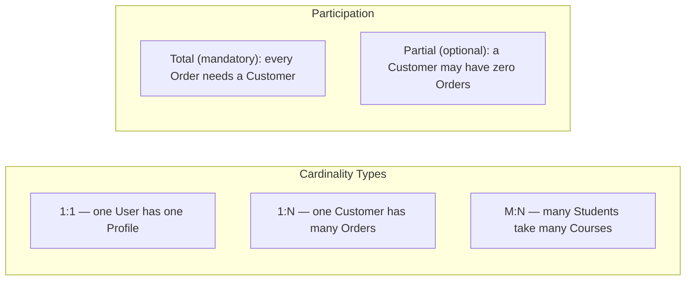
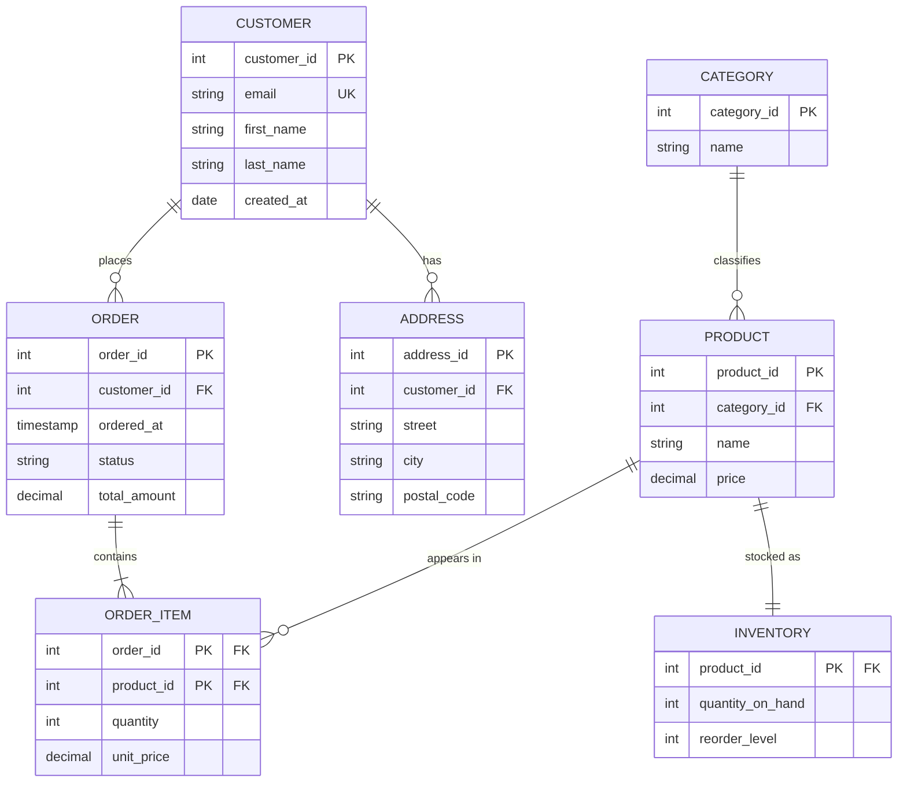

# 🗺️ Entity-Relationship (ER) Modeling

> [!abstract] TL;DR
> **ER modeling** is the blueprint stage of database design. You identify the real-world **things** (entities), the **facts** about them (attributes), and the **connections** between them (relationships) — then translate that diagram mechanically into tables, columns, primary keys, and foreign keys. Get the ER model right and the SQL schema almost writes itself; get it wrong and no amount of indexing or tuning will save you.

## Intuition — analogy FIRST

Think of designing a house. Before a single brick is laid, an architect draws a **blueprint**: rooms (entities), their dimensions and features (attributes), and how they connect via doors and hallways (relationships). The plumber and electrician later read that blueprint and install real pipes and wires (tables and foreign keys).

An **ER diagram is the blueprint for a database.** You do not start by typing `CREATE TABLE`. You start by asking: *What are the nouns in this business?* Customers, products, orders. *What do we know about each?* A customer has a name and an email. *How do they relate?* A customer **places** many orders; an order **contains** many products.

Just as you would never let a builder pour concrete without a plan, you should never write [[DDL_and_DML|DDL]] without an ER model. The blueprint is cheap to change; a poured foundation is not.

---

## How It Works

An ER model has exactly three building blocks: **entities**, **attributes**, and **relationships**.

### 1. Entities

An **entity** is a distinguishable real-world object we store data about — a `Customer`, a `Product`, an `Order`. Each becomes a **table**. A specific instance (customer #42, "Alice") is an **entity occurrence** and becomes a **row**.

- **Strong (regular) entity** — exists independently and has its own key. `Customer`, `Product`.
- **Weak entity** — cannot be identified by its own attributes alone; it depends on an owner (identifying) entity. Example: an `OrderLineItem` has no meaning without its parent `Order`. Its key is a **partial key** (e.g. line number) combined with the owner's key.

### 2. Attributes

Attributes are the facts stored about an entity. They come in flavors:

| Attribute type | Meaning | Example | Schema handling |
|----------------|---------|---------|-----------------|
| **Simple (atomic)** | Cannot be split meaningfully | `age`, `price` | One column |
| **Composite** | Made of sub-parts | `address` = street + city + zip | Split into multiple columns |
| **Single-valued** | One value per entity | `birth_date` | One column |
| **Multivalued** | Many values per entity | a user's `phone_numbers` | Separate child table (1NF) |
| **Derived** | Computed from others | `age` from `birth_date` | Not stored — computed or a generated column |
| **Key attribute** | Uniquely identifies the entity | `customer_id` | PRIMARY KEY |

The key insight: relational tables must be **flat and atomic**, so composite and multivalued attributes cannot be stored directly. Composite ones get flattened into several columns; multivalued ones get pushed into their own table.

### 3. Relationships

A **relationship** is an association between entities — the *verb* connecting the nouns. `Customer` **places** `Order`. Relationships have two constraints you must specify:

- **Cardinality** — how many instances of one entity relate to the other: **1:1**, **1:N**, or **M:N**.
- **Participation (optionality)** — is the relationship mandatory or optional for each side? **Total participation** means every instance must participate (every `Order` must belong to a `Customer`); **partial participation** means it may (a `Customer` might have zero `Orders`).



### Notation: Crow's-Foot vs Chen

Two dialects dominate ER diagrams:

| Aspect | **Chen notation** (1976, academic) | **Crow's-foot** (industry standard) |
|--------|-----------------------------------|-------------------------------------|
| Entities | Rectangles | Rectangles |
| Attributes | Ovals attached to entities | Listed *inside* the entity box |
| Relationships | Diamonds between entities | A labeled line |
| Cardinality | "1", "N", "M" labels | Symbols on the line ends |
| Multivalued attr | Double oval | — (modeled as a child table) |
| Best for | Teaching concepts, showing attribute types | Real schema design; compact for big models |

**Crow's-foot symbols** read at the end of each line, closest to the entity they describe:

```
──||──   exactly one (one and only one)
──o|──   zero or one
──|<──   one or many
──o<──   zero or many
```

The "crow's foot" (`<`) means "many"; a bar `|` means "one"; a circle `o` means "optional (zero)".

### E-commerce ER diagram (crow's-foot, Mermaid `erDiagram`)



Read it as: a `CUSTOMER` places **zero or many** `ORDER`s (`||--o{`); each `ORDER` contains **one or many** `ORDER_ITEM`s (`||--|{`); each `ORDER_ITEM` links back to exactly one `PRODUCT`. The `ORDER_ITEM` box is the resolved **junction table** for the M:N between `ORDER` and `PRODUCT`.

---

## ER → Relational Schema: The Translation Rules

The whole point of ER modeling is that the diagram converts to tables by a fixed recipe. See [[Relational_Model]] for the target model and [[Keys_and_Relationships]] for key mechanics.

**Rule 1 — Strong entity → table.** Each simple attribute becomes a column; the key attribute becomes the `PRIMARY KEY`.

**Rule 2 — Composite attribute → multiple columns.** `address` becomes `street`, `city`, `postal_code`.

**Rule 3 — Multivalued attribute → new table.** A user's many phone numbers become a `user_phone(user_id FK, phone)` table. (This is exactly what 1NF requires — see [[Normalization]].)

**Rule 4 — 1:N relationship → foreign key on the "many" side.** `Order` gets a `customer_id` FK pointing at `Customer`. No extra table.

**Rule 5 — M:N relationship → junction (associative) table.** `Order ↔ Product` becomes `order_item(order_id FK, product_id FK, ...)` with a composite PK. This table is where relationship attributes like `quantity` and `unit_price` live.

**Rule 6 — 1:1 relationship → FK on either side (often the optional side), or merge the two tables.**

**Rule 7 — Weak entity → table whose PK combines the owner's key with the partial key.** `order_item`'s PK is `(order_id, line_no)` or `(order_id, product_id)`.

### SQL Examples

The translation is where [[PostgreSQL]] and [[MySQL]] diverge slightly in syntax.

**PostgreSQL** — Rule 1 (strong entity) and Rule 4 (1:N):

```sql
-- Strong entity
CREATE TABLE customer (
    customer_id  BIGINT GENERATED ALWAYS AS IDENTITY PRIMARY KEY,
    email        TEXT NOT NULL UNIQUE,
    first_name   TEXT NOT NULL,
    last_name    TEXT NOT NULL,
    created_at   TIMESTAMPTZ NOT NULL DEFAULT now()
);

-- 1:N — FK lives on the "many" side (Rule 4)
CREATE TABLE "order" (               -- ORDER is a reserved word
    order_id     BIGINT GENERATED ALWAYS AS IDENTITY PRIMARY KEY,
    customer_id  BIGINT NOT NULL REFERENCES customer(customer_id),
    ordered_at   TIMESTAMPTZ NOT NULL DEFAULT now(),
    status       TEXT NOT NULL DEFAULT 'pending'
);
```

**MySQL** equivalent (note `AUTO_INCREMENT`, backtick-quoted reserved word, engine choice):

```sql
CREATE TABLE customer (
    customer_id  BIGINT UNSIGNED NOT NULL AUTO_INCREMENT PRIMARY KEY,
    email        VARCHAR(255) NOT NULL UNIQUE,
    first_name   VARCHAR(100) NOT NULL,
    last_name    VARCHAR(100) NOT NULL,
    created_at   DATETIME NOT NULL DEFAULT CURRENT_TIMESTAMP
) ENGINE=InnoDB;

CREATE TABLE `order` (               -- ORDER is reserved; backticks in MySQL
    order_id     BIGINT UNSIGNED NOT NULL AUTO_INCREMENT PRIMARY KEY,
    customer_id  BIGINT UNSIGNED NOT NULL,
    ordered_at   DATETIME NOT NULL DEFAULT CURRENT_TIMESTAMP,
    status       VARCHAR(20) NOT NULL DEFAULT 'pending',
    CONSTRAINT fk_order_customer
        FOREIGN KEY (customer_id) REFERENCES customer(customer_id)
) ENGINE=InnoDB;
```

**Rule 5 — M:N junction table** (identical shape in both dialects, PostgreSQL shown):

```sql
CREATE TABLE order_item (
    order_id    BIGINT NOT NULL REFERENCES "order"(order_id),
    product_id  BIGINT NOT NULL REFERENCES product(product_id),
    quantity    INT NOT NULL CHECK (quantity > 0),
    unit_price  NUMERIC(10,2) NOT NULL,
    PRIMARY KEY (order_id, product_id)   -- composite key = weak entity key
);
```

**Rule 3 — multivalued attribute** becomes a child table:

```sql
CREATE TABLE customer_phone (
    customer_id  BIGINT NOT NULL REFERENCES customer(customer_id),
    phone        VARCHAR(20) NOT NULL,
    PRIMARY KEY (customer_id, phone)
);
```

---

## Trade-offs / When to Use

| Decision | Choose... | Because |
|----------|-----------|---------|
| Notation for teaching | **Chen** | Attribute types (composite, multivalued, derived) are explicit |
| Notation for real schemas | **Crow's-foot** | Compact, cardinality is unambiguous, maps 1:1 to DDL |
| Model a 1:N | **FK on the many side** | No junction table needed; simplest form |
| Model an M:N | **Junction table** | Relational model has no direct M:N; the table also stores relationship attributes |
| Model an optional 1:1 | **FK on optional side** (nullable) | Avoids NULLs on the mandatory side |
| Very high-write, denormalized store | Consider skipping strict ER purity | See [[Denormalization]] and [[OLTP_vs_OLAP]] |

**When to invest in formal ER modeling:** any schema with more than a handful of tables, any team project, and anything that will outlive a prototype. The 30 minutes spent on a diagram prevents weeks of migration pain.

**When it is overkill:** a throwaway script, a single flat log table, or a document/key-value store where the access pattern — not the entity structure — drives the design.

---

## Common Pitfalls

1. **Confusing an attribute with an entity.** Is `color` an attribute of `product`, or its own `color` entity? If colors have their own attributes (hex code, display name) or you need to enumerate/constrain them, promote it to an entity. Otherwise keep it a column.
2. **Storing multivalued attributes as CSV strings.** `phone_numbers = "555-1234,555-9999"` violates 1NF, breaks indexing, and makes queries miserable. Use a child table (Rule 3).
3. **Forgetting the junction table for M:N.** Beginners try to put a `product_id` on `order` and an `order_id` on `product`. Neither works — you need the associative table.
4. **Ignoring participation constraints.** Not deciding whether an `Order` *must* have a `Customer` leads to nullable FKs, orphan rows, and ambiguous business rules. Decide total vs partial explicitly, then enforce with `NOT NULL`.
5. **Modeling derived attributes as stored columns without a plan to keep them fresh.** A stored `age` column goes stale daily. Either compute on read or use a generated column (see [[Constraints_and_Integrity]]).
6. **Over-normalizing weak entities into strong ones.** Giving `order_item` its own surrogate `id` when `(order_id, product_id)` is the natural key adds a column and an index for no benefit — unless the same product can appear twice on one order.

---

## Related Concepts

- [[_MOC_DB_Data_Modeling|↑ Section MOC]]
- [[Normalization]] — The next step: refining ER-derived tables to eliminate redundancy through normal forms
- [[Constraints_and_Integrity]] — Enforcing the cardinality and participation rules from the ER model as actual DB constraints
- [[Schema_Design_Patterns]] — Reusable structures (junction tables, hierarchies, EAV) built on top of ER fundamentals
- [[Data_Modeling_Case_Studies]] — Full ER-to-DDL walkthroughs for real systems
- [[Relational_Model]] — The target model that ER diagrams translate into
- [[Keys_and_Relationships]] — Primary keys, foreign keys, and how relationships are physically enforced
- [[OLTP_vs_OLAP]] — Why transactional schemas are normalized and analytical ones are not

---

## Review Questions

1. You are modeling a library. A `Book` can be borrowed by many `Members` over time, and a `Member` can borrow many `Books`. What ER construct do you need to represent this, what is its cardinality, and what table(s) will it produce? Where would `due_date` live?
2. Explain the difference between a **composite attribute** and a **multivalued attribute**, and give the distinct translation rule each one follows when converting to a relational schema.
3. In crow's-foot notation, what does the symbol `||--o{` between `CUSTOMER` and `ORDER` mean in plain English, and which side gets the foreign key when you translate it to SQL?

---

## Sources

- Peter Chen, *The Entity-Relationship Model — Toward a Unified View of Data* (ACM TODS, 1976) — the original paper
- Elmasri & Navathe, *Fundamentals of Database Systems*, Ch. 3 (ER Modeling) and Ch. 9 (ER-to-Relational Mapping)
- Mermaid `erDiagram` documentation — https://mermaid.js.org/syntax/entityRelationshipDiagram.html

#Database #DataModeling #ERModeling #ERDiagram #CrowsFoot #SchemaDesign #Beginner
