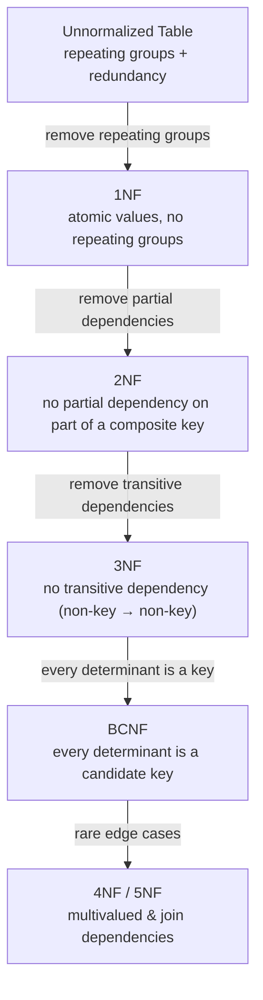

# 🧊 Database Normalization

> [!abstract] TL;DR
> **Normalization** is the process of structuring tables so that each fact is stored **exactly once**. You progress through a ladder of **normal forms** (1NF → 2NF → 3NF → BCNF) by removing different kinds of redundancy, each defined by **functional dependencies**. The payoff is the elimination of insert, update, and delete **anomalies**. The deliberate reverse — **denormalization** — trades that cleanliness back for read speed when the workload demands it.

## Intuition — analogy FIRST

Imagine a shared spreadsheet where every row about an order also repeats the customer's full name, address, and phone number. When the customer moves, you must find and edit **every** order row. Miss one, and now your data disagrees with itself — the same customer has two addresses. Worse, you cannot record a brand-new customer until they place their first order (there is no row for them), and deleting their last order erases their contact details entirely.

That is redundancy causing **anomalies**. Normalization is the discipline of splitting that fat spreadsheet into lean, single-purpose tables — one for customers, one for orders — linked by IDs. Now the customer's address lives in **one place**. Change it once and every order automatically "sees" the new value through the link.

The rule of thumb, memorized by generations of DBAs: *"Every non-key column must depend on **the key, the whole key, and nothing but the key** — so help me Codd."*

---

## How It Works

### Functional Dependencies — the foundation

A **functional dependency** `X → Y` ("X determines Y") means: if you know the value of `X`, you know exactly one value of `Y`. In a `student` table, `student_id → student_name` (an ID determines one name), but `student_name → student_id` does **not** hold (two students can share a name).

Normal forms are *defined* in terms of these dependencies. A **[[Keys_and_Relationships|candidate key]]** is a minimal set of columns that functionally determines every other column. A **prime attribute** is one that is part of some candidate key; a **non-prime attribute** is not.

### The unnormalized starting point

Consider a single flat table recording course enrollments:

```
enrollment(
  student_id, student_name, student_major, major_dept,
  course_id, course_name, instructor, instructor_office,
  grade
)
```
Sample rows repeat `course_name`, `instructor`, and `instructor_office` for every student in a course, and repeat `student_name`/`student_major` for every course a student takes. This is a redundancy minefield.



### 1NF — First Normal Form: atomic values

**Rule:** every column holds a single atomic value; no repeating groups or arrays; each row is unique.

Violation: a `courses_taken = "CS101, CS102, MA200"` cell. Fix: one row per (student, course). After 1NF our table has a composite key `(student_id, course_id)` and every cell is atomic.

### 2NF — Second Normal Form: no partial dependencies

**Rule:** be in 1NF **and** every non-prime attribute depends on the **whole** candidate key, not just part of it. Only relevant when the key is **composite**.

In our table the key is `(student_id, course_id)`. But:
- `student_id → student_name, student_major` (depends on only *half* the key) — **partial dependency**.
- `course_id → course_name, instructor` (depends on the *other* half) — **partial dependency**.

Fix — decompose by extracting each partial dependency into its own table:

```
student(student_id PK, student_name, student_major, major_dept)
course(course_id PK, course_name, instructor, instructor_office)
enrollment(student_id FK, course_id FK, grade)   -- PK (student_id, course_id)
```

### 3NF — Third Normal Form: no transitive dependencies

**Rule:** be in 2NF **and** no non-prime attribute depends on another non-prime attribute (no `key → non-key → non-key` chain).

In `student`, `student_id → student_major → major_dept`. Here `major_dept` depends on `student_major`, which is not a key — a **transitive dependency**. If a major changes departments, you would update many student rows.

Fix — split out the transitively dependent group:

```
student(student_id PK, student_name, major_id FK)
major(major_id PK, major_name, major_dept)
```

Do the same for `instructor → instructor_office` inside `course`.

### BCNF — Boyce-Codd Normal Form: every determinant is a key

**Rule:** for every functional dependency `X → Y`, `X` must be a **candidate key** (a superkey). BCNF is a stricter 3NF; they differ only when a table has **overlapping candidate keys** where a prime attribute depends on part of a key.

Classic example — `enrollment(student_id, course_id, section, instructor)` where each `instructor` teaches exactly one `course` (`instructor → course_id`) and a student takes one section per course. `instructor → course_id` is a dependency whose left side is *not* a candidate key, so the table is 3NF but not BCNF. Decompose so `instructor` becomes a determinant in its own table:

```
teaches(instructor PK, course_id)
enrolls(student_id, instructor, section)   -- PK (student_id, instructor)
```

BCNF can occasionally sacrifice **dependency preservation** (a dependency spans two tables and can't be enforced without a join) — the one case where 3NF is deliberately preferred.

### 4NF and 5NF — briefly

- **4NF** removes **multivalued dependencies**: independent multivalued facts jammed into one table (e.g. a person's `skills` and their `languages`, unrelated to each other) cause a combinatorial explosion of rows. Split each into its own table.
- **5NF (PJ/NF)** removes **join dependencies** — cases where a table can be losslessly reconstructed only by joining three or more tables. Extremely rare in practice.

**In practice, 3NF (occasionally BCNF) is the working target for OLTP schemas.**

### The three anomalies normalization eliminates

| Anomaly | What goes wrong (in the flat table) | How normalization fixes it |
|---------|-------------------------------------|----------------------------|
| **Insert** | Can't add a course with no enrolled students (no row exists to hold it) | `course` table holds courses independently |
| **Update** | Changing an instructor's office means editing every enrollment row; miss one → inconsistency | Office stored once in `instructor` |
| **Delete** | Deleting the last enrollment for a course erases the course's existence | `course` row survives independently |

---

## SQL Examples

The normalized, joined query looks the same conceptually in both engines; the DDL differs in identity syntax.

**[[PostgreSQL]]** — the 3NF schema:

```sql
CREATE TABLE major (
    major_id   INT GENERATED ALWAYS AS IDENTITY PRIMARY KEY,
    major_name TEXT NOT NULL,
    major_dept TEXT NOT NULL
);
CREATE TABLE student (
    student_id   INT GENERATED ALWAYS AS IDENTITY PRIMARY KEY,
    student_name TEXT NOT NULL,
    major_id     INT NOT NULL REFERENCES major(major_id)
);
CREATE TABLE course (
    course_id   INT GENERATED ALWAYS AS IDENTITY PRIMARY KEY,
    course_name TEXT NOT NULL
);
CREATE TABLE enrollment (
    student_id INT NOT NULL REFERENCES student(student_id),
    course_id  INT NOT NULL REFERENCES course(course_id),
    grade      CHAR(2),
    PRIMARY KEY (student_id, course_id)
);
```

**[[MySQL]]** — same design, `AUTO_INCREMENT` + InnoDB:

```sql
CREATE TABLE major (
    major_id   INT UNSIGNED NOT NULL AUTO_INCREMENT PRIMARY KEY,
    major_name VARCHAR(100) NOT NULL,
    major_dept VARCHAR(100) NOT NULL
) ENGINE=InnoDB;

CREATE TABLE student (
    student_id   INT UNSIGNED NOT NULL AUTO_INCREMENT PRIMARY KEY,
    student_name VARCHAR(150) NOT NULL,
    major_id     INT UNSIGNED NOT NULL,
    FOREIGN KEY (major_id) REFERENCES major(major_id)
) ENGINE=InnoDB;
-- course and enrollment analogous
```

Reassembling the original flat view is a JOIN — the cost normalization trades for correctness:

```sql
SELECT s.student_name, m.major_dept, c.course_name, e.grade
FROM enrollment e
JOIN student s ON s.student_id = e.student_id
JOIN major   m ON m.major_id   = s.major_id
JOIN course  c ON c.course_id  = e.course_id;
```

---

## Denormalization — the deliberate reverse

Normalization optimizes for **write integrity**; it can punish **read performance** by forcing multi-table joins. **Denormalization** intentionally reintroduces redundancy to make reads faster. This is a design *decision*, not a *mistake* — see [[Denormalization]] for the full treatment and [[OLTP_vs_OLAP]] for why analytical stores are denormalized by default.

**When to denormalize:**
- Read-heavy workloads where the same expensive join runs constantly (dashboards, feeds, [[Data_Warehouse|data warehouses]]).
- The joined data changes rarely, so the cost of keeping copies in sync is low.
- Aggregate/rollup values (order totals, follower counts) that are read far more than written.

**How to denormalize safely:**
- **Redundant columns** — copy `customer_name` onto `order` to skip a join. Keep fresh via application logic or triggers.
- **Precomputed aggregates** — store `order.total_amount` instead of summing `order_item` every read.
- **[[Views_and_Materialized_Views|Materialized views]]** — let the database maintain the denormalized copy. PostgreSQL: `CREATE MATERIALIZED VIEW ... ; REFRESH MATERIALIZED VIEW`. MySQL has no native materialized views — emulate with a summary table refreshed by [[Stored_Procedures_and_Triggers|triggers]] or a scheduled event.

The guiding principle: **normalize until it hurts (reads), then denormalize until it works** — but only with proper indexes ([[Database_Indexes]]) tried first.

---

## Trade-offs / When to Use

| Dimension | Normalized (3NF/BCNF) | Denormalized |
|-----------|----------------------|--------------|
| Write speed & integrity | Excellent — one fact, one place | Weaker — copies must stay in sync |
| Storage | Minimal redundancy | Higher |
| Read (single entity join) | Requires joins | Fewer/no joins |
| Anomaly risk | Eliminated by design | Reintroduced deliberately |
| Best fit | OLTP, transactional apps | OLAP, reporting, caches, feeds |

**Target 3NF for anything transactional.** Reach for BCNF only when overlapping candidate keys cause a genuine anomaly. Denormalize *afterward*, surgically, with measurements — never as a first move.

---

## Common Pitfalls

1. **Stopping at 1NF and calling it "a database."** Atomic cells alone still permit crippling update/delete anomalies. 3NF is the practical floor.
2. **Denormalizing before measuring.** Adding redundant columns to "speed things up" before an index or the query plan has been examined trades correctness for imagined performance. Profile first ([[Database_Indexes]]).
3. **Confusing BCNF necessity with 3NF sufficiency.** Most tables that are in 3NF are already in BCNF. Chasing BCNF everywhere can break dependency preservation for no real gain.
4. **Forgetting to keep denormalized copies in sync.** A redundant `customer_name` on `order` silently rots when the customer renames. If you denormalize, you *own* the sync logic (triggers, app code, or materialized-view refresh).
5. **Over-normalizing into a join swamp.** Splitting truly atomic single-valued attributes (like `city` and `state` when you never query them independently) into lookup tables adds joins with no anomaly benefit.
6. **Assuming NoSQL means "no normalization to think about."** Document stores embed and duplicate data — that *is* a denormalization decision with the same sync trade-offs, just made implicitly.

---

## Related Concepts

- [[_MOC_DB_Data_Modeling|↑ Section MOC]]
- [[ER_Modeling]] — Produces the initial tables that normalization then refines
- [[Denormalization]] — The deliberate reverse of normalization for read performance
- [[Database_Indexes]] — The first tool to try before denormalizing to speed up joins
- [[Constraints_and_Integrity]] — Foreign keys enforce the referential integrity that normalized designs rely on
- [[Keys_and_Relationships]] — Candidate keys and functional dependencies underpin every normal form
- [[Relational_Model]] — Codd's model in which normal forms are defined
- [[OLTP_vs_OLAP]] — Why OLTP normalizes and OLAP denormalizes
- [[Data_Warehouse]] — Star schemas are intentionally denormalized

---

## Review Questions

1. A table `sale(sale_id, product_id, product_name, product_price, qty)` has the FD `product_id → product_name, product_price`. Which normal form does it violate, why, and what tables result after fixing it?
2. Explain the precise difference between 3NF and BCNF, and describe the specific structural situation (in terms of candidate keys) where a table can be in 3NF but not BCNF.
3. Your reporting dashboard runs a five-table join on every page load and is slow. List, in order, the steps you would take before deciding to denormalize — and if you do denormalize, how would you keep the redundant data consistent?

---

## Sources

- E. F. Codd, *A Relational Model of Data for Large Shared Data Banks* (CACM, 1970) and *Further Normalization of the Data Base Relational Model* (1971)
- C. J. Date, *An Introduction to Database Systems*, chapters on Functional Dependencies and Normalization
- Elmasri & Navathe, *Fundamentals of Database Systems*, Ch. 14–15 (Normal Forms)

#Database #DataModeling #Normalization #NormalForms #FunctionalDependencies #Denormalization #Intermediate
