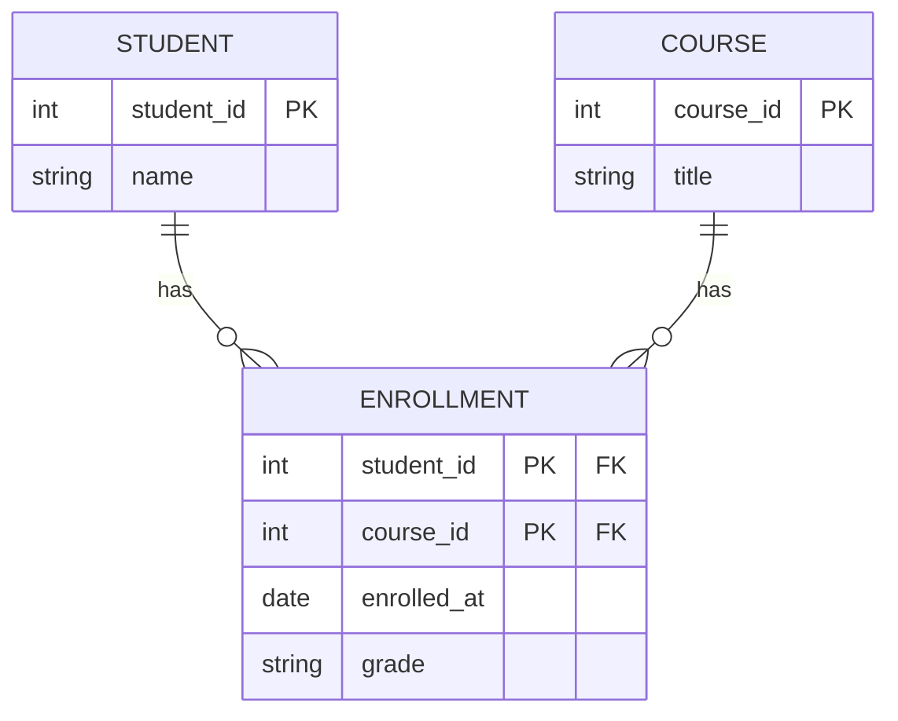
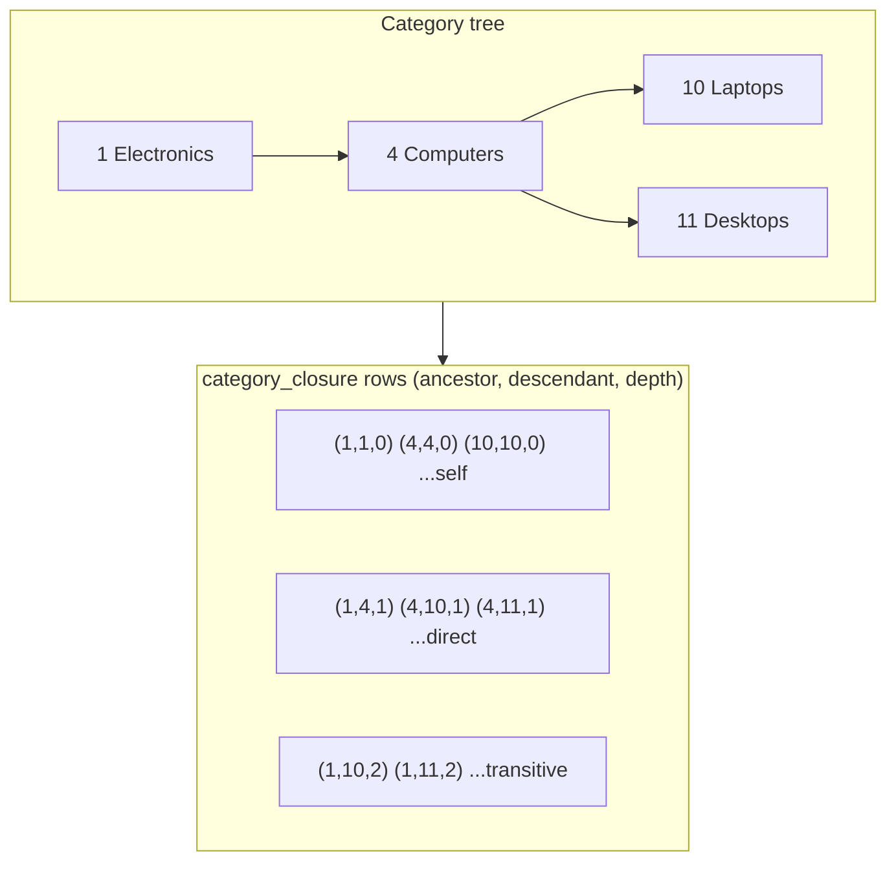

# 🧩 Schema Design Patterns

> [!abstract] TL;DR
> Most relational modeling problems are variations on a handful of **reusable patterns**: one-to-many (FK), many-to-many (junction table), hierarchies (adjacency list, materialized path, nested set, closure table), flexible attributes (EAV — use sparingly), polymorphic associations, soft deletes, audit/history tables, and inheritance mapping (single-table vs class-table). Knowing the catalog — and each pattern's cost — lets you pick the right structure instead of reinventing it badly.

## Intuition — analogy FIRST

A carpenter does not redesign a joint from scratch for every cabinet. There is a **catalog of joints** — dovetail, mortise-and-tenon, butt joint — each with known strengths, weaknesses, and the situations it fits. A dovetail is strong but slow to cut; a butt joint is fast but weak.

Schema design is the same. When you need to model "many students take many courses," you do not invent a mechanism — you reach for the **junction table** joint. When you need "a comment can reply to another comment," you reach for a **hierarchy** pattern and choose *which* one based on whether you read or write the tree more often. This note is the joint catalog: the patterns, and the trade-off that tells you which to cut.

---

## How It Works

### 1. One-to-Many (the FK pattern)

The workhorse. The "many" side carries a foreign key to the "one" side (see [[Keys_and_Relationships]]). One `author` has many `books`; each `book.author_id` points back.

```sql
-- PostgreSQL & MySQL (identical apart from identity syntax)
CREATE TABLE author (author_id INT PRIMARY KEY, name TEXT);
CREATE TABLE book (
    book_id   INT PRIMARY KEY,
    author_id INT NOT NULL REFERENCES author(author_id),
    title     TEXT NOT NULL
);
```

### 2. Many-to-Many (junction / associative table)

The relational model has no native M:N — you resolve it with a **junction table** whose primary key is the pair of foreign keys. Any *attribute of the relationship itself* (enrollment grade, cart quantity) lives here.

```sql
CREATE TABLE student (student_id INT PRIMARY KEY, name TEXT);
CREATE TABLE course  (course_id  INT PRIMARY KEY, title TEXT);
CREATE TABLE enrollment (
    student_id INT NOT NULL REFERENCES student(student_id),
    course_id  INT NOT NULL REFERENCES course(course_id),
    enrolled_at DATE NOT NULL,
    grade      CHAR(2),
    PRIMARY KEY (student_id, course_id)
);
```



### 3–6. Modeling Hierarchies (trees)

Four classic patterns, trading read speed against write speed. Consider a category tree or an org chart.

**a) Adjacency list (self-referencing FK)** — each row points to its parent. Simplest to write; a plain single-level query.

```sql
CREATE TABLE category (
    category_id INT PRIMARY KEY,
    name        TEXT NOT NULL,
    parent_id   INT REFERENCES category(category_id)   -- NULL = root
);
```
Fetching a *whole subtree* needs a recursive query. [[PostgreSQL]] and [[MySQL|MySQL 8+]] both support [[CTEs|recursive CTEs]]:

```sql
WITH RECURSIVE subtree AS (
    SELECT category_id, name, parent_id FROM category WHERE category_id = 10
    UNION ALL
    SELECT c.category_id, c.name, c.parent_id
    FROM category c JOIN subtree s ON c.parent_id = s.category_id
)
SELECT * FROM subtree;
```

**b) Materialized path** — store the ancestry as a string like `/1/4/10/`. Subtree = a single `LIKE '/1/4/%'`. Fast reads, but moving a subtree rewrites many paths, and referential integrity on the path is weak. PostgreSQL's `ltree` extension is purpose-built for this.

**c) Nested set** — store `lft`/`rgt` boundary numbers per node; a subtree is `WHERE lft BETWEEN parent.lft AND parent.rgt`. Blazing-fast subtree reads and depth queries, but **any insert renumbers large portions of the table** — terrible for write-heavy trees.

**d) Closure table** — a separate table storing **every ancestor-descendant pair** (including self, depth 0). Best all-round: fast reads *and* writes, full referential integrity, easy subtree/ancestor queries. Cost is extra storage (one row per path).

```sql
CREATE TABLE category (category_id INT PRIMARY KEY, name TEXT);
CREATE TABLE category_closure (
    ancestor_id   INT NOT NULL REFERENCES category(category_id),
    descendant_id INT NOT NULL REFERENCES category(category_id),
    depth         INT NOT NULL,          -- 0 = self
    PRIMARY KEY (ancestor_id, descendant_id)
);
-- Descendants of node 4 at any depth:
SELECT c.* FROM category c
JOIN category_closure cc ON cc.descendant_id = c.category_id
WHERE cc.ancestor_id = 4;
```



| Tree pattern | Read subtree | Insert/move | Integrity | Notes |
|--------------|:-----------:|:-----------:|:---------:|-------|
| Adjacency list | Slow (recursive CTE) | Trivial | Strong (FK) | Simplest; fine with CTEs |
| Materialized path | Fast (`LIKE`) | Moderate (rewrite paths) | Weak | Great with Postgres `ltree` |
| Nested set | Very fast | Very slow (renumber) | Weak | Read-mostly trees only |
| Closure table | Fast | Fast | Strong | Best general choice; extra storage |

### 7. EAV (Entity-Attribute-Value) — the escape hatch

When entities have wildly varying, user-defined attributes (a product catalog spanning books and refrigerators), EAV stores each attribute as a **row** instead of a column:

```sql
CREATE TABLE eav_value (
    entity_id INT NOT NULL,
    attribute TEXT NOT NULL,       -- 'color', 'page_count', 'voltage'
    value     TEXT NOT NULL,
    PRIMARY KEY (entity_id, attribute)
);
```
It is maximally flexible and maximally painful: no type safety, no per-attribute constraints, and every "normal" query becomes a pivot with N self-joins. **Prefer alternatives first:** a [[Advanced_SQL_and_JSON|JSONB]] column (PostgreSQL) or JSON column (MySQL 5.7+) gives schemaless flexibility *with* indexing (`GIN` / generated-column indexes) and far better ergonomics. Reserve true EAV for genuinely open-ended, admin-defined attribute systems.

### 8. Polymorphic associations

A `comment` that can belong to a `post` *or* a `photo` *or* a `video`. Three approaches:

- **"Loose" polymorphic** (`commentable_type`, `commentable_id`) — one nullable-free pair, but you **cannot use a foreign key** (it points to different tables), so integrity is app-enforced. Common in Rails/Laravel.
- **Exclusive FKs** — separate nullable `post_id`, `photo_id`, `video_id` columns with a `CHECK` that exactly one is non-null. Keeps real FKs and integrity.
- **Shared supertable** — a `commentable(id)` parent table that posts/photos/videos all reference; the comment FKs to `commentable`. Cleanest integrity, more joins.

```sql
-- Exclusive-arc variant (PostgreSQL): real FKs + a CHECK
CREATE TABLE comment (
    comment_id INT PRIMARY KEY,
    body       TEXT NOT NULL,
    post_id    INT REFERENCES post(post_id),
    photo_id   INT REFERENCES photo(photo_id),
    CHECK ( num_nonnulls(post_id, photo_id) = 1 )
);
```

### 9. Soft deletes

Instead of `DELETE`, mark rows inactive so they can be restored and audited.

```sql
ALTER TABLE account ADD COLUMN deleted_at TIMESTAMP NULL;   -- NULL = live
-- Every query must filter:  WHERE deleted_at IS NULL
```
PostgreSQL bonus: enforce "unique among live rows only" with a **partial index**: `CREATE UNIQUE INDEX ON account(email) WHERE deleted_at IS NULL;`. MySQL lacks partial indexes — emulate with a generated column trick or app logic.

### 10. Audit / history tables

Keep a full change log. A **shadow table** mirrors the main table's columns plus `valid_from`, `valid_to`, `operation`, `changed_by`. Populate it with [[Stored_Procedures_and_Triggers|triggers]] (PostgreSQL `AFTER` triggers, MySQL triggers) or via temporal features. This is the basis of slowly-changing dimensions in a [[Data_Warehouse]].

### 11. Inheritance mapping

Modeling a class hierarchy (`Vehicle` → `Car`, `Truck`) in flat tables:

| Strategy | Structure | Trade-off |
|----------|-----------|-----------|
| **Single-table inheritance** | One `vehicle` table, all columns, a `type` discriminator | Fast, no joins; many NULL columns, weak per-subtype constraints |
| **Class-table inheritance** | `vehicle` base + `car`, `truck` child tables sharing the PK | Clean, typed; every read joins base + child |
| **Concrete-table** | Separate full `car`, `truck` tables, no base | No joins per type; no polymorphic query across all vehicles |

---

## SQL Examples

See each pattern above for its DDL. The engine differences worth flagging:

- **Recursive CTEs** (adjacency list traversal): PostgreSQL all versions; **MySQL only 8.0+** (MySQL 5.x cannot do it — a reason closure tables were historically popular there).
- **JSON alternative to EAV**: PostgreSQL `JSONB` with `GIN` indexes; MySQL `JSON` type with functional/generated-column indexes.
- **Partial indexes for soft deletes**: PostgreSQL native (`WHERE deleted_at IS NULL`); MySQL has no partial indexes.
- **`CHECK` for exclusive polymorphic arcs**: enforced in PostgreSQL and MySQL 8.0.16+ (older MySQL parsed but ignored `CHECK`).

---

## Trade-offs / When to Use

| Need | Reach for | Avoid when |
|------|-----------|-----------|
| Simple parent/child | One-to-many FK | (rarely wrong) |
| Both sides "many" | Junction table | — |
| Read-heavy tree | Closure table or materialized path | Write-heavy → prefer adjacency list |
| Write-heavy tree | Adjacency list + recursive CTE | You need constant-time subtree reads |
| Open-ended attributes | JSON column first, EAV last resort | You need typed columns/constraints → use real columns |
| "Belongs to one of several" | Exclusive FKs or shared supertable | You need a real FK → don't use loose type/id |
| Recoverable deletes / audit | Soft delete + history table | Hard-delete compliance (GDPR erasure) required |
| Class hierarchy | Class-table (integrity) or single-table (speed) | — |

---

## Common Pitfalls

1. **Reaching for EAV as a default.** It defeats the relational model — no types, no constraints, unreadable queries. Try real columns, then JSON, and only then EAV.
2. **Nested set for a write-heavy tree.** A single insert can renumber thousands of rows and deadlock under concurrency. Use a closure table or adjacency list instead.
3. **Loose polymorphic associations without integrity checks.** `commentable_id` with no FK lets orphaned comments accumulate silently. Add app-level validation or use exclusive FKs.
4. **Forgetting the soft-delete filter.** One query that omits `WHERE deleted_at IS NULL` leaks "deleted" rows into the UI. Centralize it in a view or ORM default scope.
5. **Junction table without a composite PK.** Omitting `PRIMARY KEY (a_id, b_id)` allows duplicate pairings and lets the relationship table bloat. Always constrain the pair.
6. **Single-table inheritance with dozens of subtype-specific columns.** The table becomes a swamp of mostly-NULL columns and you cannot enforce "trucks must have a payload capacity." Switch to class-table inheritance.
7. **History tables that copy nothing on schema change.** When the base table gains a column, the shadow/audit table and its triggers must be updated in lockstep, or you silently lose auditing on the new field.

---

## Related Concepts

- [[_MOC_DB_Data_Modeling|↑ Section MOC]]
- [[ER_Modeling]] — Junction tables and hierarchies are the relational realization of ER relationships
- [[Normalization]] — These patterns assume normalized foundations (EAV and denormalized copies are deliberate deviations)
- [[Denormalization]] — Precomputed aggregates and redundant columns are patterns of their own
- [[Constraints_and_Integrity]] — CHECK, FK, and partial-unique constraints enforce these patterns
- [[Database_Indexes]] — Closure tables, path columns, and soft-delete filters all depend on the right indexes
- [[Keys_and_Relationships]] — Composite and foreign keys underpin junction and hierarchy patterns
- [[Data_Modeling_Case_Studies]] — These patterns combined into complete real schemas

---

## Review Questions

1. You are building a threaded comment system where users constantly post new replies but rarely move existing threads, and you must show entire threads quickly. Which hierarchy pattern do you choose, and what is the specific weakness you are accepting?
2. A junior engineer proposes an EAV table to store product attributes because "products vary a lot." Give two concrete problems EAV will cause and one modern alternative that keeps flexibility while preserving indexing.
3. Explain why a *loose* polymorphic association (`commentable_type` + `commentable_id`) cannot use a database foreign key, and describe two schema alternatives that restore referential integrity.

---

## Sources

- Bill Karwin, *SQL Antipatterns* — chapters on EAV, Naive Trees, Polymorphic Associations, and Adjacency List alternatives
- Joe Celko, *Trees and Hierarchies in SQL for Smarties* — nested set and closure models
- PostgreSQL `ltree` and `JSONB` documentation; MySQL 8 Recursive CTE and JSON documentation

#Database #DataModeling #SchemaPatterns #JunctionTable #ClosureTable #EAV #Polymorphic #Inheritance #Intermediate
