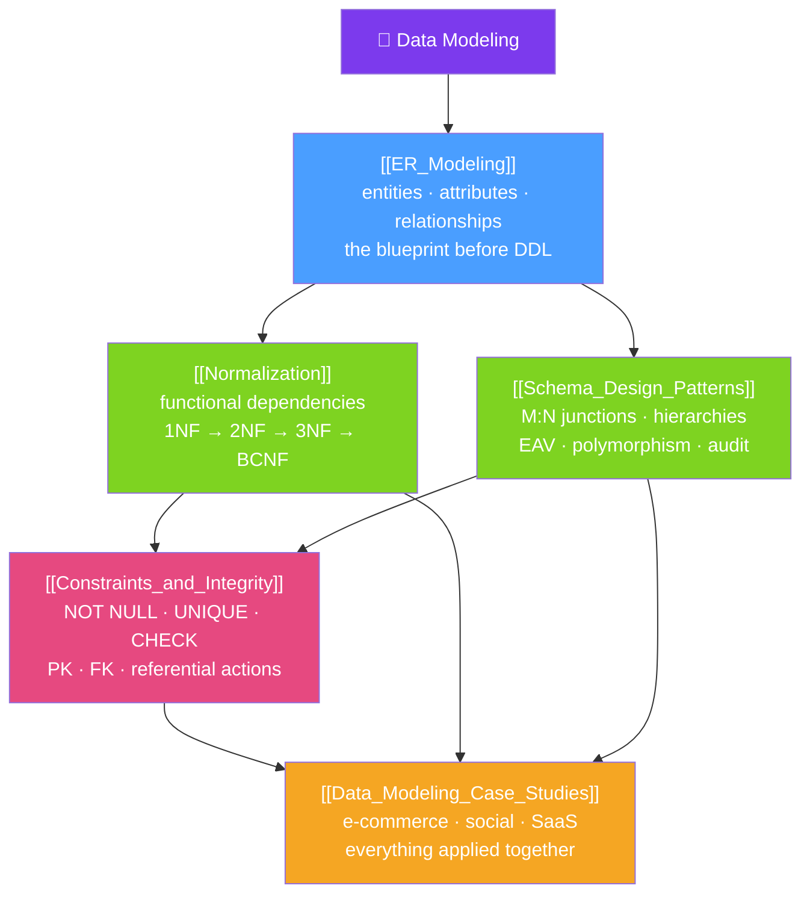

# 🗺️ Data Modeling — Map of Content

> [!abstract] What This Section Covers
> Data modeling is the discipline of turning a fuzzy business domain into a precise, correct, performant schema. It starts with **ER modeling** — the blueprint stage where you name entities, attributes, and relationships before typing any DDL — then translates that blueprint into tables. **Normalization** structures those tables so each fact is stored exactly once (1NF → 2NF → 3NF → BCNF, driven by functional dependencies) to kill insert/update/delete anomalies, while deliberate denormalization trades that cleanliness back for read speed. A catalog of **schema design patterns** (one-to-many, junction tables, hierarchy models, EAV, polymorphic associations, soft deletes, audit tables, inheritance mapping) gives you reusable joints instead of reinventing them badly, and **constraints** make the database itself the unbypassable enforcer of domain, entity, and referential integrity. Finally, three worked **case studies** (e-commerce, social network, multi-tenant SaaS) show every pattern interacting in a real design.

## Concept Map

## Learning Path
1. [[ER_Modeling]] — Identify entities, attributes (simple/composite/multivalued/derived), and relationships, then translate the diagram into tables.
2. [[Normalization]] — Functional dependencies and the normal-form ladder (1NF → BCNF); why redundancy causes anomalies and when to denormalize.
3. [[Schema_Design_Patterns]] — The reusable joint catalog: FK one-to-many, junction tables, hierarchy models, EAV, polymorphic associations, soft deletes, inheritance mapping.
4. [[Constraints_and_Integrity]] — The three integrities (domain/entity/referential) and the constraint toolbox that enforces them at the one door every write passes through.
5. [[Data_Modeling_Case_Studies]] — Three full DDL designs showing the patterns, normalization choices, and deliberate denormalizations working together.

## All Notes at a Glance
| Note | Difficulty | What You'll Learn |
|------|------------|-------------------|
| [[ER_Modeling]] | Beginner | Entities (strong/weak), attribute types, relationships and cardinality, and the mechanical translation of an ER diagram into a relational schema |
| [[Normalization]] | Intermediate | Functional dependencies, 1NF/2NF/3NF/BCNF, the anomalies normalization prevents, and when denormalization is the right call |
| [[Schema_Design_Patterns]] | Intermediate | The pattern catalog — junction tables, adjacency list/materialized path/nested set/closure table, EAV, polymorphism, audit/history, inheritance mapping |
| [[Constraints_and_Integrity]] | Beginner | Domain/entity/referential integrity and the full constraint set (NOT NULL, UNIQUE, PRIMARY KEY, FOREIGN KEY, CHECK, DEFAULT, generated, EXCLUSION) |
| [[Data_Modeling_Case_Studies]] | Advanced | Complete schemas with DDL for e-commerce, a social network (M:N self-join), and multi-tenant SaaS, plus the trade-offs behind each decision |

## Key Questions This Section Answers
- Why do you draw an ER model before writing `CREATE TABLE`, and how does a diagram become tables?
- What are functional dependencies, and how do they define each normal form?
- What is the "key, the whole key, and nothing but the key" rule really saying?
- When is denormalization correct redundancy rather than a normalization failure?
- Which hierarchy pattern (adjacency list, materialized path, nested set, closure table) fits read-heavy vs write-heavy trees?
- Why enforce rules with database constraints instead of trusting application validation?
- How do normalization, indexing, and denormalization trade off against each other in a real e-commerce or SaaS schema?

## Related Sections
- [[_MOC_Database_Master|↑ Database Master MOC]]
- [[_MOC_DB_Foundations|← Foundations]]
- [[_MOC_DB_SQL|→ SQL]]
- System Design: [[Denormalization]]

#MOC #Database #DataModeling
