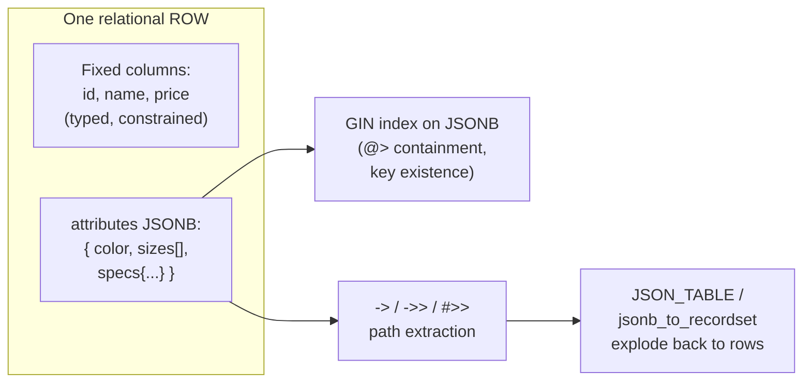

# 🧬 Advanced SQL and JSON

> [!abstract] TL;DR
> Modern SQL engines are no longer purely relational — they store and query **semi-structured JSON** inside columns, hold **arrays**, run **full-text search**, and support relational power tools like **`LATERAL` joins**, **`PIVOT`/`UNPIVOT`**, and **`generate_series`**. [[PostgreSQL]] leads with **`JSONB`** (binary, indexable, rich operators `->`, `->>`, `@>`, `jsonb_path_query`), native arrays, and `tsvector`/`tsquery` full-text search. [[MySQL]] has a capable but narrower `JSON` type (`JSON_EXTRACT`, `->>`, `JSON_TABLE`) and `FULLTEXT` indexes. These features let you blend document-style flexibility with relational integrity in one database — cross-reference [[Document_Store]] for the pure-NoSQL alternative.

## Intuition — analogy FIRST

A classic relational table is a **filing cabinet with fixed labeled folders** — every record has exactly the same drawers (columns). Rigid, but you can find anything instantly and the labels never lie.

**JSON columns** are like slipping a **flexible sticky-note packet** into one of those drawers. Most of the record is still in neat labeled folders (relational columns with constraints and foreign keys), but one drawer holds a free-form document whose fields can differ from row to row — a product's spec sheet, a user's variable preferences, an event's arbitrary payload.

The advanced-SQL toolkit is about **reaching into that sticky-note packet with the same precision you'd use on a real folder** — indexing it, filtering by its contents, and even exploding it back out into rows when you want relational shape again. You get the flexibility of a document store *without* leaving your [[Transactions_and_ACID|ACID]] relational database.

---

## How It Works



`JSONB` (Postgres) stores a *parsed binary* representation — slightly slower to insert, much faster to query, deduplicates keys, loses whitespace/key-order, and is **indexable with [[Specialized_Indexes|GIN]]**. `JSON` (Postgres text type) preserves the exact input but can't be indexed for containment. MySQL's `JSON` type is binary like `JSONB` but has a different operator set.

---

## SQL Examples

### JSON storage and operators — PostgreSQL JSONB

```sql
CREATE TABLE products (
    id         BIGINT PRIMARY KEY,
    name       TEXT,
    attributes JSONB
);

INSERT INTO products VALUES
(1, 'Shirt', '{"color":"blue","sizes":["S","M","L"],"specs":{"fabric":"cotton"}}');

-- ->  returns JSON;   ->> returns TEXT
SELECT attributes -> 'color'        AS color_json,   -- "blue" (jsonb)
       attributes ->> 'color'       AS color_text,   -- blue   (text)
       attributes #>> '{specs,fabric}' AS fabric      -- deep path as text -> cotton
FROM products;

-- @> containment: does the JSONB contain this sub-document?
SELECT * FROM products WHERE attributes @> '{"color":"blue"}';

-- ? key existence
SELECT * FROM products WHERE attributes ? 'specs';

-- jsonb_path_query (SQL/JSON path, Postgres 12+)
SELECT jsonb_path_query(attributes, '$.sizes[*]') FROM products;
```

Index it so `@>` and path queries are fast:

```sql
CREATE INDEX idx_products_attrs ON products USING GIN (attributes);
-- jsonb_path_ops variant: smaller, supports @> only
CREATE INDEX idx_products_attrs_pathops ON products USING GIN (attributes jsonb_path_ops);
```

### JSON — MySQL equivalents

```sql
CREATE TABLE products (
    id   BIGINT PRIMARY KEY,
    name VARCHAR(100),
    attributes JSON
);

-- JSON_EXTRACT and the ->/->>  shortcuts
SELECT JSON_EXTRACT(attributes, '$.color')      AS color_json,  -- "blue"
       attributes -> '$.color'                  AS color_json2, -- same as JSON_EXTRACT
       attributes ->> '$.color'                 AS color_text   -- unquoted -> blue
FROM products;

-- Filter by JSON path
SELECT * FROM products WHERE attributes ->> '$.color' = 'blue';

-- MySQL cannot GIN-index JSON directly; index a generated column instead:
ALTER TABLE products
  ADD COLUMN color VARCHAR(20)
  AS (attributes ->> '$.color') STORED,
  ADD INDEX idx_color (color);
```

Postgres containment `@>` has **no direct MySQL equivalent**; MySQL uses `JSON_CONTAINS(attributes, '"blue"', '$.color')`.

### Exploding JSON into rows — JSON_TABLE

```sql
-- PostgreSQL: jsonb_array_elements / jsonb_to_recordset
SELECT p.id, s.size
FROM products p,
     jsonb_array_elements_text(p.attributes -> 'sizes') AS s(size);

-- MySQL 8+ : JSON_TABLE
SELECT p.id, jt.size
FROM products p,
     JSON_TABLE(p.attributes, '$.sizes[*]'
         COLUMNS (size VARCHAR(5) PATH '$')) AS jt;
```

### Arrays (PostgreSQL native)

```sql
CREATE TABLE articles (id INT, tags TEXT[]);
INSERT INTO articles VALUES (1, ARRAY['sql','json','postgres']);

SELECT * FROM articles WHERE 'sql' = ANY(tags);        -- membership
SELECT * FROM articles WHERE tags @> ARRAY['sql'];     -- containment (GIN-indexable)
SELECT id, unnest(tags) AS tag FROM articles;          -- explode array to rows
```

MySQL has no native array type — model as a JSON array or a child table.

### Full-text search

```sql
-- PostgreSQL: tsvector / tsquery
ALTER TABLE articles ADD COLUMN body TEXT;
SELECT * FROM articles
WHERE to_tsvector('english', body) @@ to_tsquery('english', 'database & index');

-- Precompute + GIN index for speed
ALTER TABLE articles ADD COLUMN body_tsv tsvector
    GENERATED ALWAYS AS (to_tsvector('english', body)) STORED;
CREATE INDEX idx_body_fts ON articles USING GIN (body_tsv);
```

```sql
-- MySQL: FULLTEXT index + MATCH ... AGAINST
ALTER TABLE articles ADD FULLTEXT INDEX ft_body (body);
SELECT * FROM articles
WHERE MATCH(body) AGAINST('+database +index' IN BOOLEAN MODE);
```

### LATERAL joins (correlated subquery in FROM)

`LATERAL` lets a joined subquery reference columns from earlier `FROM` items — perfect for top-N-per-group without ranking every row:

```sql
-- Top 3 most recent orders per customer (PostgreSQL; MySQL 8+ uses LATERAL too)
SELECT c.id, o.*
FROM customers c
CROSS JOIN LATERAL (
    SELECT * FROM orders o
    WHERE o.customer_id = c.id
    ORDER BY o.created_at DESC
    LIMIT 3
) o;
```

Compare with the `ROW_NUMBER()` approach in [[Window_Functions]]; `LATERAL` can stop after 3 rows per customer, often winning on large tables.

### PIVOT / UNPIVOT

Neither Postgres nor MySQL has SQL-Server-style `PIVOT`. Emulate with conditional aggregation:

```sql
-- Pivot: rows of (region, quarter, amount) -> one column per quarter
SELECT region,
       SUM(amount) FILTER (WHERE quarter = 'Q1') AS q1,   -- Postgres FILTER
       SUM(amount) FILTER (WHERE quarter = 'Q2') AS q2
FROM sales GROUP BY region;

-- MySQL: use CASE instead of FILTER
SELECT region,
       SUM(CASE WHEN quarter='Q1' THEN amount END) AS q1,
       SUM(CASE WHEN quarter='Q2' THEN amount END) AS q2
FROM sales GROUP BY region;
```

PostgreSQL also ships `crosstab()` in the `tablefunc` extension for dynamic pivots.

### generate_series (set-returning helper)

```sql
-- PostgreSQL: generate a gap-free date spine to left-join sparse data against
SELECT d::date AS day
FROM generate_series('2026-01-01'::date, '2026-01-31'::date, INTERVAL '1 day') d;

SELECT n, n*n FROM generate_series(1, 5) AS n;   -- 1..5 and squares
```

MySQL 8 has no `generate_series`; emulate with a recursive CTE (`WITH RECURSIVE seq AS (...)`).

---

## Performance Notes

- **`JSONB` + GIN is fast for containment/existence but not for range/sort.** `attributes @> '{"color":"blue"}'` uses the GIN index; `attributes->>'price' > '100'` does not (it's a text extraction) — index an expression `((attributes->>'price')::numeric)` or a generated column instead. See [[Database_Indexes]].
- Keep **structured, frequently-filtered fields as real typed columns**; reserve JSON for genuinely variable/sparse attributes. Over-JSONifying loses constraints, statistics, and index efficiency — the [[Query_Optimizer]] has poor row estimates inside JSON.
- Full-text: always **materialize the `tsvector` into a stored generated column with a GIN index**; recomputing `to_tsvector` per query row is O(n) and unindexed.
- `LATERAL` with `LIMIT` is often the fastest top-N-per-group because it short-circuits per group; verify with [[Execution_Plans]] and compare against [[Window_Functions]].
- MySQL JSON can't be indexed directly — the **generated (virtual/stored) column + index** pattern is mandatory for selective JSON filters. STORED costs disk; VIRTUAL costs recompute.

## Common Pitfalls

1. **Confusing `->` and `->>`.** `->` returns JSON (so `= 'blue'` fails — it's `"blue"` with quotes); `->>` returns text. Comparing the wrong one silently returns no rows.
2. **Expecting `@>` in MySQL.** MySQL has no containment operator; use `JSON_CONTAINS`. Copy-pasting Postgres JSON queries into MySQL fails here.
3. **Unindexed JSON filters at scale.** A `WHERE attributes->>'x' = ...` on millions of rows is a full scan unless you added a GIN/expression index (PG) or generated-column index (MySQL).
4. **Using JSON as a substitute for schema.** Storing everything in one JSON blob throws away foreign keys, type checks, and column statistics — you've built a [[Document_Store]] badly inside an RDBMS.
5. **`tsvector` without a stored column.** Recomputing full-text vectors per query is slow; always precompute + GIN index.
6. **Recursive-CTE `generate_series` in MySQL without a recursion limit.** Runaway recursion hits `cte_max_recursion_depth`; set a bound.
7. **JSONB loses key order and duplicate keys.** If you need byte-exact round-tripping, use `json` (text) not `jsonb`.

## Related Concepts

- [[_MOC_DB_SQL|↑ Section MOC]]
- [[Document_Store]] — the pure NoSQL document model these features borrow from
- [[Window_Functions]] — alternative top-N-per-group vs `LATERAL`
- [[Database_Indexes]] — GIN, expression, and generated-column indexes for JSON/FTS
- [[Query_Optimizer]] — why row estimates degrade inside JSON
- [[Execution_Plans]] — verifying GIN/expression index usage
- [[SQL_Tuning]] — making JSON and full-text queries fast

## Review Questions

1. You store `{"color":"blue"}` in a JSONB column and `WHERE attributes -> 'color' = 'blue'` returns nothing, but `->>` works. Why? What index makes `attributes @> '{"color":"blue"}'` fast?
2. Show how to make a JSON field efficiently searchable in MySQL, given that JSON columns can't be indexed directly. Contrast with the PostgreSQL GIN approach.
3. When would you reach for a `LATERAL` join instead of `ROW_NUMBER()` for a top-N-per-group query, and why might `LATERAL` perform better on a large table?

## Sources

- PostgreSQL Documentation — JSON Types & Functions: https://www.postgresql.org/docs/current/datatype-json.html
- PostgreSQL Documentation — Full Text Search: https://www.postgresql.org/docs/current/textsearch.html
- PostgreSQL Documentation — LATERAL subqueries: https://www.postgresql.org/docs/current/queries-table-expressions.html#QUERIES-LATERAL
- MySQL 8.0 Reference Manual — The JSON Data Type & JSON_TABLE: https://dev.mysql.com/doc/refman/8.0/en/json.html

#Database #SQL #JSON #JSONB #FullTextSearch #LATERAL #Pivot #Arrays #PostgreSQL #MySQL
