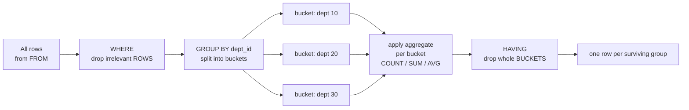

# 📊 Aggregation and Grouping

> [!abstract] TL;DR
> Aggregate functions (`COUNT`, `SUM`, `AVG`, `MIN`, `MAX`, `STRING_AGG`/`GROUP_CONCAT`, `ARRAY_AGG`) collapse many rows into one summary value. `GROUP BY` splits rows into buckets *before* aggregating; `HAVING` filters *those buckets* (aggregates), while `WHERE` filters *individual rows* before grouping. `GROUPING SETS`/`ROLLUP`/`CUBE` compute several grouping levels (subtotals, grand totals) in one pass. PostgreSQL's `FILTER (WHERE …)` clause is the clean way to do conditional aggregation; MySQL gets the same effect with `SUM(CASE WHEN …)`. Watch the difference between `COUNT(*)`, `COUNT(col)`, and `COUNT(DISTINCT col)` — they answer three different questions.

## 🧠 Intuition — analogy FIRST

Picture sorting a **pile of receipts** on your desk.

1. First you **throw out** any receipt that's clearly irrelevant — anything before this year (that's `WHERE`, filtering individual receipts).
2. Then you make **piles by store** (that's `GROUP BY store` — one pile per group).
3. For each pile you compute a summary — total spent, count of visits (that's the **aggregate function** running once per pile).
4. Finally you **discard whole piles** that don't interest you — "only show stores where I spent over $500" (that's `HAVING`, which filters *piles*, not receipts).

The key insight: `WHERE` acts on **receipts** (rows), `HAVING` acts on **piles** (groups). You can't say "keep receipts where the pile total > 500" in `WHERE`, because at `WHERE` time the piles don't exist yet — this mirrors the logical processing order from [[SQL_Fundamentals]].

## ⚙️ How It Works + mermaid



**Cardinality rule:** after `GROUP BY`, the result has **one row per distinct group**. Every column in the `SELECT` list must therefore be either (a) a grouping column or (b) inside an aggregate. [[PostgreSQL]] enforces this strictly. [[MySQL]] historically allowed "bare" columns (returning an arbitrary value from the group) — modern MySQL enables `ONLY_FULL_GROUP_BY` by default and rejects it too.

## 💻 SQL Examples

### The core aggregate functions

```sql
-- One summary row for the whole table (no GROUP BY = single group)
SELECT COUNT(*)      AS num_employees,
       SUM(salary)   AS total_payroll,
       AVG(salary)   AS avg_salary,
       MIN(salary)   AS lowest,
       MAX(salary)   AS highest
FROM   employees;
```

### GROUP BY

```sql
-- One summary row PER DEPARTMENT
SELECT dept_id,
       COUNT(*)    AS headcount,
       AVG(salary) AS avg_salary
FROM   employees
GROUP BY dept_id
ORDER BY avg_salary DESC;
```

### COUNT(*) vs COUNT(col) vs COUNT(DISTINCT col)

```sql
SELECT
    COUNT(*)               AS all_rows,        -- counts EVERY row, NULLs included
    COUNT(manager_id)      AS with_manager,    -- counts rows where manager_id IS NOT NULL
    COUNT(DISTINCT dept_id) AS distinct_depts  -- counts unique non-NULL dept_id values
FROM employees;
```

> [!tip] Three different questions
> `COUNT(*)` = "how many rows?" · `COUNT(col)` = "how many rows have a non-NULL value in col?" · `COUNT(DISTINCT col)` = "how many different non-NULL values?" Using `COUNT(col)` when you meant `COUNT(*)` silently undercounts whenever the column is nullable.

### WHERE vs HAVING

```sql
-- WHERE filters ROWS before grouping; HAVING filters GROUPS after aggregating.
SELECT dept_id, AVG(salary) AS avg_salary
FROM   employees
WHERE  hire_date >= DATE '2020-01-01'   -- only recent hires enter the buckets
GROUP BY dept_id
HAVING AVG(salary) > 70000              -- keep only well-paid departments
ORDER BY avg_salary DESC;
```

> [!warning] Never put an aggregate in `WHERE`
> `WHERE AVG(salary) > 70000` is a syntax error — aggregation hasn't happened yet at `WHERE` time. That test belongs in `HAVING`.

### STRING_AGG / GROUP_CONCAT / ARRAY_AGG

```sql
-- PostgreSQL: STRING_AGG concatenates group values into one delimited string;
-- ARRAY_AGG collects them into an array. Both accept ORDER BY inside.
SELECT dept_id,
       STRING_AGG(last_name, ', ' ORDER BY last_name) AS staff_list,
       ARRAY_AGG(emp_id ORDER BY emp_id)              AS emp_ids
FROM   employees
GROUP BY dept_id;
```

```sql
-- MySQL: GROUP_CONCAT is the equivalent (no ARRAY_AGG; MySQL has no array type).
-- Note: output truncates at group_concat_max_len (default 1024 bytes)!
SELECT dept_id,
       GROUP_CONCAT(last_name ORDER BY last_name SEPARATOR ', ') AS staff_list
FROM   employees
GROUP BY dept_id;
-- Raise the limit if needed:  SET SESSION group_concat_max_len = 1000000;
```

### FILTER clause vs conditional aggregation

```sql
-- PostgreSQL: FILTER (WHERE ...) aggregates only rows matching a per-aggregate
-- condition. Clean "pivot" of order counts by status, in ONE pass.
SELECT customer_id,
       COUNT(*)                                  AS total_orders,
       COUNT(*) FILTER (WHERE status = 'paid')      AS paid_orders,
       COUNT(*) FILTER (WHERE status = 'cancelled') AS cancelled_orders,
       SUM(amount) FILTER (WHERE status = 'paid')   AS paid_revenue
FROM   orders
GROUP BY customer_id;
```

```sql
-- MySQL (no FILTER): use CASE inside the aggregate. SUM(CASE WHEN ... 1 ELSE 0 END)
-- counts matches; aggregates ignore NULLs so COUNT(CASE ... END) also works.
SELECT customer_id,
       COUNT(*)                                      AS total_orders,
       SUM(CASE WHEN status = 'paid'      THEN 1 ELSE 0 END) AS paid_orders,
       SUM(CASE WHEN status = 'cancelled' THEN 1 ELSE 0 END) AS cancelled_orders,
       SUM(CASE WHEN status = 'paid'      THEN amount END)   AS paid_revenue
FROM   orders
GROUP BY customer_id;
```

> [!tip] The `CASE` conditional-aggregation trick works in PostgreSQL too, so it's the portable choice. `FILTER` is cleaner and often a touch faster where available.

### GROUPING SETS / ROLLUP / CUBE

```sql
-- GROUPING SETS: compute several groupings in one query.
-- Here: totals per (dept, status), plus per-dept subtotals, plus grand total.
SELECT dept_id, status, COUNT(*) AS n
FROM   employees e JOIN orders o ON TRUE   -- illustrative
GROUP BY GROUPING SETS ((dept_id, status), (dept_id), ());
```

```sql
-- ROLLUP: hierarchical subtotals (right-to-left). Sales by year > quarter, plus
-- a subtotal per year and a grand total. PostgreSQL syntax:
SELECT EXTRACT(YEAR FROM order_date)    AS yr,
       EXTRACT(QUARTER FROM order_date) AS qtr,
       SUM(amount) AS revenue
FROM   orders
GROUP BY ROLLUP (EXTRACT(YEAR FROM order_date), EXTRACT(QUARTER FROM order_date));
```

```sql
-- MySQL uses a trailing WITH ROLLUP modifier (older, less flexible; no CUBE):
SELECT YEAR(order_date) AS yr, QUARTER(order_date) AS qtr, SUM(amount) AS revenue
FROM   orders
GROUP BY YEAR(order_date), QUARTER(order_date) WITH ROLLUP;
```

```sql
-- CUBE: every combination of the grouping columns (all subtotals + grand total).
-- PostgreSQL only (MySQL has no CUBE).
SELECT dept_id, location, COUNT(*) 
FROM   departments
GROUP BY CUBE (dept_id, location);
```

> [!tip] Subtotal rows have `NULL` in the "rolled-up" columns. Use `GROUPING(col)` (both engines) to distinguish a genuine `NULL` from a subtotal placeholder: `GROUPING(qtr) = 1` means "this is a subtotal across all quarters."

## 🚀 Performance Notes

- **`GROUP BY` costs a sort or a hash.** PostgreSQL picks a `HashAggregate` (build hash table of groups) or a `GroupAggregate` (requires sorted input). An index that already delivers rows in `GROUP BY` order lets the engine skip the sort. Verify with [[Execution_Plans]].
- **`COUNT(*)` is the cheapest count.** It never inspects column values; `COUNT(col)` must test each value for `NULL`. In PostgreSQL, even `COUNT(*)` on a whole table is not O(1) (MVCC has no stored row count) — for fast approximate totals use `reltuples` from `pg_class`. In MySQL/InnoDB, `COUNT(*)` on the whole table is also a scan (MyISAM cached it; InnoDB does not).
- **`COUNT(DISTINCT col)` is expensive** — it must de-duplicate, needing a sort or hash. For big tables and approximate answers, PostgreSQL's `HyperLogLog` extensions or `APPROX_COUNT_DISTINCT` (in some engines) are far cheaper.
- **`FILTER`/`CASE` conditional aggregation beats N separate queries.** One pass over the table computes every bucket, instead of scanning once per status. This is a common [[SQL_Tuning]] win.
- **A covering index on `(group_col, agg_col)`** can let the engine aggregate straight from the index without touching the heap. See [[Database_Indexes]].

## ⚠️ Common Pitfalls

- **Putting aggregates in `WHERE`.** Use `HAVING`.
- **Selecting a non-grouped, non-aggregated column.** PostgreSQL errors; MySQL with `ONLY_FULL_GROUP_BY` off returns an *arbitrary* value from the group — a silent data-correctness bug.
- **`COUNT(nullable_col)` when you meant `COUNT(*)`.** Undercounts by the number of `NULL`s.
- **`GROUP_CONCAT` silent truncation.** MySQL cuts off at `group_concat_max_len` (default 1024 bytes) with no error. Raise it or you lose data.
- **Averaging away `NULL`s unintentionally.** `AVG(col)` ignores `NULL` rows entirely — the denominator is the count of non-`NULL` values, not the row count. If `NULL` should count as zero, use `AVG(COALESCE(col, 0))`.
- **Confusing subtotal `NULL`s with real `NULL`s** in `ROLLUP`/`CUBE` output. Disambiguate with `GROUPING()`.

## 🔗 Related Concepts

- [[_MOC_DB_SQL|↑ Section MOC]]
- [[SQL_Fundamentals]] — logical processing order (`WHERE` vs `HAVING`)
- [[Joins]] — aggregate the "many" side to avoid over-counting
- [[Subqueries]] — aggregates inside correlated subqueries and derived tables
- [[Set_Operations]] — combining aggregated result sets
- [[Database_Indexes]] — indexes that eliminate the group-by sort
- [[Query_Optimizer]] — HashAggregate vs GroupAggregate choice
- [[Execution_Plans]] — reading the aggregate node
- [[SQL_Tuning]] — one-pass conditional aggregation vs N queries

## ❓ Review Questions

1. Explain the difference between `WHERE` and `HAVING` using the "receipts and piles" analogy. Give one query where you legitimately need both.
2. A report shows `COUNT(email)` as the number of employees but the total looks low. What is the likely cause, and which count would be correct?
3. You need order counts broken out by status (`paid`, `pending`, `cancelled`) as separate columns, in one pass. Write the PostgreSQL version with `FILTER` and the portable version with `CASE`.

## 📚 Sources

- PostgreSQL Documentation — *Aggregate Functions*, *GROUPING SETS, CUBE, ROLLUP*, *Aggregate Expressions (FILTER)*
- MySQL 8.0 Reference Manual — *Aggregate Functions*, *GROUP BY Modifiers (WITH ROLLUP)*, *GROUP_CONCAT*
- ISO/IEC 9075 (SQL:2016) — grouped tables, `GROUPING SETS`
- Markus Winand, *Use The Index, Luke!* — indexing for `GROUP BY`

#SQL #Database #Aggregation #GroupBy #Having #Rollup #Cube
