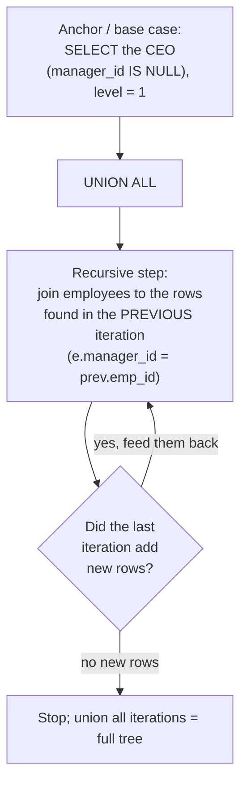

# 🧵 Common Table Expressions (CTEs)

> [!abstract] TL;DR
> A **CTE** is a named, temporary result set defined with `WITH` at the top of a query — a way to give a subquery a name and reference it (even multiple times) in the main query. CTEs make complex queries **readable** by naming each step top-to-bottom instead of nesting subqueries inside-out. `WITH RECURSIVE` adds *iteration*: a base case `UNION ALL`-ed with a step that references the CTE itself — perfect for **hierarchy traversal** (org charts, bill-of-materials), **sequence generation**, and **graph walks**. Watch [[PostgreSQL]]'s optimization-fence history (`MATERIALIZED` / `NOT MATERIALIZED`) versus [[MySQL]] 8+'s always-mergeable CTEs.

## 🧠 Intuition — analogy FIRST

Writing a query with nested subqueries is like reading a sentence with parentheses nested five deep — you have to unwrap from the inside out to understand it.

A CTE is like **defining your terms in a glossary at the top of a document**, then referring to them by name in plain prose. "Let `dept_avg` = the average salary per department. Let `well_paid` = departments where `dept_avg` > 70k. Now list employees in `well_paid`." Each step reads top-to-bottom, like assigning intermediate variables in a program.

A **recursive** CTE is like following a **chain of command**: start with the CEO (base case), then repeatedly ask "who reports to the people I found last round?" until nobody new appears. Each round feeds the next — an iteration, not a one-shot lookup.

## ⚙️ How It Works + mermaid

A recursive CTE walking an org hierarchy downward from the CEO:



The engine runs the anchor once, then repeats the recursive step, each time operating **only on the rows produced by the immediately preceding iteration**, accumulating results until an iteration returns nothing.

## 💻 SQL Examples

### Basic CTE — naming a subquery

```sql
-- Compare each employee to their department average, read top-to-bottom.
WITH dept_avg AS (
    SELECT dept_id, AVG(salary) AS avg_salary
    FROM   employees
    GROUP BY dept_id
)
SELECT e.first_name, e.salary, d.avg_salary
FROM   employees e
JOIN   dept_avg d ON e.dept_id = d.dept_id
WHERE  e.salary > d.avg_salary;
```

### Multiple CTEs (chained, comma-separated)

```sql
-- Each CTE can reference the ones defined before it — a readable pipeline.
WITH dept_avg AS (
    SELECT dept_id, AVG(salary) AS avg_salary
    FROM   employees
    GROUP BY dept_id
),
well_paid AS (
    SELECT dept_id
    FROM   dept_avg
    WHERE  avg_salary > 70000
)
SELECT e.first_name, e.salary
FROM   employees e
JOIN   well_paid w ON e.dept_id = w.dept_id
ORDER BY e.salary DESC;
```

> [!tip] CTE vs subquery vs temp table
> - **Subquery/derived table** — inline, single-use, can get unreadable when nested.
> - **CTE** — named, can be referenced *multiple times* in one statement, reads top-down. Same statement scope; disappears when the query ends.
> - **Temp table** — persists across multiple statements in a session, can be indexed and re-queried, but costs a write. Reach for it when you reuse the intermediate result across *several* statements or need an index on it.

### RECURSIVE CTE — org hierarchy traversal

```sql
-- All employees under the CEO, with their depth in the tree.
-- Syntax is IDENTICAL in PostgreSQL and MySQL 8+.
WITH RECURSIVE org_chart AS (
    -- anchor: the top of the tree
    SELECT emp_id, first_name, manager_id, 1 AS level
    FROM   employees
    WHERE  manager_id IS NULL
    UNION ALL
    -- recursive step: employees who report to someone already in org_chart
    SELECT e.emp_id, e.first_name, e.manager_id, oc.level + 1
    FROM   employees e
    JOIN   org_chart oc ON e.manager_id = oc.emp_id
)
SELECT level, emp_id, first_name
FROM   org_chart
ORDER BY level, emp_id;
```

### RECURSIVE CTE — generating a sequence

```sql
-- Generate numbers 1..10 without a numbers table.
WITH RECURSIVE nums AS (
    SELECT 1 AS n                      -- anchor
    UNION ALL
    SELECT n + 1 FROM nums WHERE n < 10 -- step, with a STOP condition
)
SELECT n FROM nums;
```

```sql
-- PostgreSQL has purpose-built set-returning functions for this — prefer them:
SELECT g AS n FROM generate_series(1, 10) AS g;          -- integers
SELECT d::date FROM generate_series(DATE '2026-01-01',
                                    DATE '2026-01-10',
                                    INTERVAL '1 day') d;  -- date range
-- MySQL has no generate_series; the recursive CTE above is the idiomatic way.
```

### RECURSIVE CTE — graph traversal (with cycle guard)

```sql
-- Walk a "follows" graph from user 1, avoiding infinite loops on cycles.
WITH RECURSIVE reachable AS (
    SELECT follower_id, followee_id,
           ARRAY[follower_id, followee_id] AS path   -- PostgreSQL array to track visited
    FROM   follows
    WHERE  follower_id = 1
    UNION ALL
    SELECT r.follower_id, f.followee_id, r.path || f.followee_id
    FROM   follows f
    JOIN   reachable r ON f.follower_id = r.followee_id
    WHERE  f.followee_id <> ALL (r.path)              -- cycle guard: don't revisit
)
SELECT DISTINCT followee_id FROM reachable;
```

> [!tip] PostgreSQL 14+ offers `UNION ... CYCLE col SET is_cycle USING path` as built-in cycle detection. MySQL lacks arrays; emulate the visited-set with a delimited string and `FIND_IN_SET`, or cap recursion with `cte_max_recursion_depth`.

### PostgreSQL materialization control

```sql
-- Pre-PG12, a CTE was an OPTIMIZATION FENCE: always materialized, predicates
-- were NOT pushed into it. PG12+ inlines a CTE used ONCE by default.
-- Force the old behavior (compute once, reuse) or the new (inline):
WITH big AS MATERIALIZED (       -- always materialize (compute once)
    SELECT * FROM orders WHERE amount > 1000
)
SELECT * FROM big WHERE status = 'paid';

WITH big AS NOT MATERIALIZED (   -- inline into the outer query, allow predicate push-down
    SELECT * FROM orders WHERE amount > 1000
)
SELECT * FROM big WHERE status = 'paid';
```

> [!warning] Version-dependent behavior
> **PostgreSQL ≤ 11:** every CTE is materialized (a fence) — sometimes a performance foot-gun, sometimes a deliberate optimization tool. **PostgreSQL ≥ 12:** a CTE referenced once and side-effect-free is *inlined* by default; use `MATERIALIZED`/`NOT MATERIALIZED` to override. **MySQL 8+:** CTEs are merged (inlined) when possible, otherwise materialized — there is no `MATERIALIZED` keyword to control it.

## 🚀 Performance Notes

- **A CTE is not automatically a temp table.** On PostgreSQL 12+ and MySQL 8+, a non-recursive CTE used once is typically inlined, so `WITH` costs nothing versus the equivalent subquery — it's purely readability. Confirm with [[Execution_Plans]].
- **The old PostgreSQL fence cuts both ways.** Materializing (`MATERIALIZED`) is great when the CTE is *expensive and reused many times* (compute once), but bad when it *blocks predicate push-down* into a large scan. Choose deliberately; see [[Query_Optimizer]].
- **Recursive CTEs need indexes on the join column.** The org-chart example probes `employees.manager_id` once per iteration — index it, or every level triggers a full scan. See [[Database_Indexes]].
- **Bound your recursion.** Always include a terminating condition (a depth limit or cycle guard). MySQL defaults `cte_max_recursion_depth = 1000`; PostgreSQL has no default cap, so a cyclic graph without a guard runs until it exhausts memory.
- **`UNION ALL` vs `UNION` in the recursive term.** Use `UNION ALL` (cheaper, no dedup) unless you specifically need to collapse duplicate paths — `UNION`'s per-iteration dedup can be costly. See [[Set_Operations]].

## ⚠️ Common Pitfalls

- **Assuming a CTE is always materialized.** True on old PostgreSQL, false on PG12+/MySQL 8+. Don't rely on a CTE as an "optimization barrier" unless you write `MATERIALIZED`.
- **Missing the recursive stop condition.** An unbounded recursive CTE loops forever (or until the depth cap / OOM). Every recursive step needs a `WHERE` that eventually returns no rows.
- **Cycles in graph data.** Without a visited-set/cycle guard, a recursive walk over a graph with cycles never terminates.
- **Forgetting `RECURSIVE`.** In PostgreSQL the keyword is mandatory for self-referencing CTEs; MySQL requires it too. Omitting it yields "relation does not exist" for the self-reference.
- **Over-using CTEs as pseudo-variables and hurting plans on old PostgreSQL.** A chain of materialized CTEs can defeat the optimizer's ability to push filters down. Profile before assuming readability is free on legacy versions.
- **Column-list mismatch in recursion.** The anchor and recursive terms must have the same number and compatible types of columns, in the same order.

## 🔗 Related Concepts

- [[_MOC_DB_SQL|↑ Section MOC]]
- [[Subqueries]] — derived tables, the inline alternative a CTE names
- [[Set_Operations]] — `UNION ALL` that glues recursive iterations together
- [[SQL_Fundamentals]] — the `SELECT` building blocks each CTE step uses
- [[Joins]] — the self-join at the heart of the recursive step
- [[Aggregation_and_Grouping]] — aggregating over a recursive result (e.g., subtree totals)
- [[Query_Optimizer]] — CTE inlining vs materialization decisions
- [[Execution_Plans]] — reading a `Recursive Union` / `CTE Scan` node
- [[Database_Indexes]] — indexing the recursive join column
- [[SQL_Tuning]] — when a CTE helps vs hurts

## ❓ Review Questions

1. Explain the difference in CTE behavior between PostgreSQL 11 and PostgreSQL 12+, and what `MATERIALIZED` / `NOT MATERIALIZED` let you control.
2. Write a `WITH RECURSIVE` query that lists every employee reporting (directly or indirectly) to a given manager, along with their depth. Identify the anchor and the recursive step.
3. Your recursive CTE over a social graph never finishes. Give two independent reasons this can happen and the fix for each.

## 📚 Sources

- PostgreSQL Documentation — *WITH Queries (Common Table Expressions)*, *MATERIALIZED / NOT MATERIALIZED*, *SEARCH and CYCLE clauses*
- MySQL 8.0 Reference Manual — *WITH (Common Table Expressions)*, *Recursive CTEs*, `cte_max_recursion_depth`
- ISO/IEC 9075 (SQL:2016) — `WITH` and `WITH RECURSIVE`
- *SQL Performance Explained* — CTE materialization trade-offs

#SQL #Database #CTE #Recursive #WITH #HierarchyTraversal #GraphTraversal
