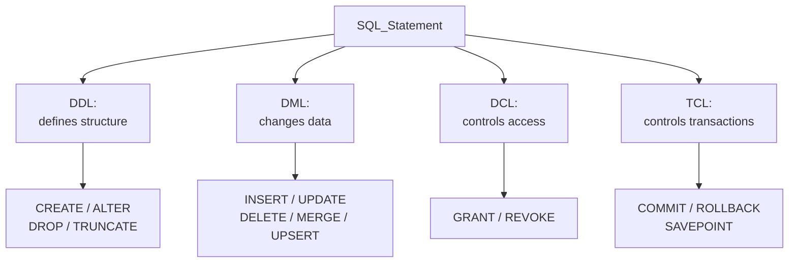

# 🏗️ DDL and DML

> [!abstract] TL;DR
> SQL statements split into families by what they act on. **DDL** (Data Definition Language: `CREATE`, `ALTER`, `DROP`, `TRUNCATE`) defines and changes the *shape* of the database — tables, columns, [[Constraints_and_Integrity|constraints]]. **DML** (Data Manipulation Language: `INSERT`, `UPDATE`, `DELETE`, `MERGE`) changes the *data* inside those tables. Two more families: **DCL** (`GRANT`, `REVOKE`) controls permissions, and **TCL** (`COMMIT`, `ROLLBACK`, `SAVEPOINT`) controls [[Transactions_and_ACID|transactions]]. The big cross-engine gotcha: **[[PostgreSQL]] DDL is transactional; [[MySQL]] DDL is not** — in MySQL, `CREATE`/`ALTER`/`DROP` cause an implicit commit.

## Intuition — analogy FIRST

Think of a database like a **warehouse**.

- **DDL is the construction crew.** It builds the shelving units, decides how many bays each aisle has, and demolishes racks that are no longer needed. It changes the *structure* of the building.
- **DML is the stock team.** It puts boxes onto shelves, moves them, relabels them, and throws them out. It never touches the shelving — only what sits on it.
- **DCL is the security desk** handing out keycards deciding who may enter which aisle.
- **TCL is the "commit the day's work" clipboard** — either the whole shift's stock changes are recorded, or you undo them and pretend the shift never happened.

You wouldn't reorganize the shelving (DDL) casually during business hours, but you move stock (DML) constantly. That distinction — rare structural change vs. constant data change — is exactly why the two languages behave and lock differently.

---

## How It Works



- **DDL** statements are auto-persisted structural changes. In most engines they take stronger locks (often a table-level lock) because they rewrite the catalog/metadata.
- **DML** statements operate under transaction control — their effects are provisional until `COMMIT` (see [[MVCC_Internals]] for how concurrent readers see old vs. new rows).
- **`TRUNCATE`** is a curious hybrid: it deletes all rows like DML but is classified as DDL because it deallocates storage and resets the table rather than logging per-row deletes.

---

## SQL Examples

### DDL — CREATE / ALTER / DROP / TRUNCATE

```sql
-- CREATE with columns, types, and constraints
CREATE TABLE customers (
    id         BIGINT GENERATED ALWAYS AS IDENTITY PRIMARY KEY,  -- Postgres 10+ / SQL standard
    email      VARCHAR(255) NOT NULL UNIQUE,
    full_name  TEXT NOT NULL,
    status     VARCHAR(20) DEFAULT 'active'
                   CHECK (status IN ('active','suspended','closed')),
    created_at TIMESTAMPTZ NOT NULL DEFAULT now()
);
```

MySQL equivalent (auto-increment + `ENGINE`):

```sql
CREATE TABLE customers (
    id         BIGINT AUTO_INCREMENT PRIMARY KEY,
    email      VARCHAR(255) NOT NULL UNIQUE,
    full_name  TEXT NOT NULL,
    status     VARCHAR(20) DEFAULT 'active',
    created_at TIMESTAMP NOT NULL DEFAULT CURRENT_TIMESTAMP,
    CHECK (status IN ('active','suspended','closed'))   -- enforced only in MySQL 8.0.16+
) ENGINE=InnoDB;
```

`ALTER TABLE` operations:

```sql
ALTER TABLE customers ADD COLUMN phone VARCHAR(30);
ALTER TABLE customers ALTER COLUMN status SET DEFAULT 'pending';   -- Postgres
ALTER TABLE customers ALTER COLUMN status DROP DEFAULT;            -- Postgres
-- MySQL uses MODIFY / CHANGE:
ALTER TABLE customers MODIFY status VARCHAR(20) DEFAULT 'pending'; -- MySQL
ALTER TABLE customers RENAME COLUMN phone TO phone_number;
ALTER TABLE customers ADD CONSTRAINT uq_phone UNIQUE (phone_number);
ALTER TABLE customers DROP COLUMN phone_number;
```

`DROP` vs `TRUNCATE` vs `DELETE`:

```sql
DROP TABLE customers;                 -- removes table + data + structure entirely
TRUNCATE TABLE customers;             -- removes all rows, keeps structure, resets identity, minimal logging
TRUNCATE customers RESTART IDENTITY;  -- Postgres: also reset the sequence
DELETE FROM customers;                -- removes all rows via DML (row-by-row, transactional, slower)
```

### DML — INSERT

```sql
-- Single row
INSERT INTO customers (email, full_name) VALUES ('a@x.com', 'Ann');

-- Multi-row
INSERT INTO customers (email, full_name) VALUES
    ('b@x.com', 'Ben'),
    ('c@x.com', 'Cara');

-- INSERT ... SELECT (bulk copy from another query)
INSERT INTO customers_archive (email, full_name)
SELECT email, full_name FROM customers WHERE status = 'closed';
```

### DML — UPDATE (with JOIN / FROM)

```sql
-- PostgreSQL: UPDATE ... FROM
UPDATE orders o
SET    discount = 0.10
FROM   customers c
WHERE  o.customer_id = c.id
  AND  c.status = 'active';

-- MySQL: UPDATE with JOIN in the FROM position
UPDATE orders o
JOIN   customers c ON o.customer_id = c.id
SET    o.discount = 0.10
WHERE  c.status = 'active';
```

### DML — DELETE

```sql
DELETE FROM orders WHERE created_at < '2020-01-01';

-- DELETE with a JOIN
-- PostgreSQL:
DELETE FROM orders o USING customers c
WHERE o.customer_id = c.id AND c.status = 'closed';
-- MySQL:
DELETE o FROM orders o JOIN customers c ON o.customer_id = c.id
WHERE c.status = 'closed';
```

### UPSERT — the classic divergence

```sql
-- PostgreSQL: INSERT ... ON CONFLICT
INSERT INTO customers (email, full_name)
VALUES ('a@x.com', 'Ann Updated')
ON CONFLICT (email)
DO UPDATE SET full_name = EXCLUDED.full_name;   -- EXCLUDED = the row you tried to insert

-- Do nothing on conflict (idempotent insert)
INSERT INTO customers (email, full_name)
VALUES ('a@x.com', 'Ann')
ON CONFLICT (email) DO NOTHING;
```

```sql
-- MySQL: INSERT ... ON DUPLICATE KEY UPDATE
INSERT INTO customers (email, full_name)
VALUES ('a@x.com', 'Ann Updated')
ON DUPLICATE KEY UPDATE full_name = VALUES(full_name);
-- MySQL 8.0.19+ preferred alias syntax:
INSERT INTO customers (email, full_name) VALUES ('a@x.com', 'Ann Updated') AS new
ON DUPLICATE KEY UPDATE full_name = new.full_name;
```

### MERGE (SQL standard, PostgreSQL 15+)

```sql
MERGE INTO customers c
USING staging s ON c.email = s.email
WHEN MATCHED THEN
    UPDATE SET full_name = s.full_name
WHEN NOT MATCHED THEN
    INSERT (email, full_name) VALUES (s.email, s.full_name);
```

`MERGE` exists in PostgreSQL 15+, Oracle, and SQL Server. **MySQL has no `MERGE`** — use `INSERT ... ON DUPLICATE KEY UPDATE`.

### RETURNING clause (PostgreSQL)

Get generated/modified values back in the same round trip — no second `SELECT`:

```sql
INSERT INTO customers (email, full_name)
VALUES ('d@x.com', 'Dan')
RETURNING id, created_at;

UPDATE orders SET status = 'shipped' WHERE id = 42 RETURNING id, status;
DELETE FROM orders WHERE id = 42 RETURNING *;
```

MySQL has no `RETURNING` for `INSERT` (use `LAST_INSERT_ID()`); MariaDB 10.5+ does support `RETURNING`.

### Transactional DDL (the biggest behavioral difference)

```sql
-- PostgreSQL: DDL participates in transactions and can be rolled back
BEGIN;
CREATE TABLE temp_thing (id INT);
ALTER TABLE customers ADD COLUMN nickname TEXT;
ROLLBACK;   -- BOTH statements are undone; no table, no column
```

```sql
-- MySQL: DDL causes an IMPLICIT COMMIT — cannot be rolled back
START TRANSACTION;
INSERT INTO customers (email, full_name) VALUES ('e@x.com', 'Eve');
CREATE TABLE temp_thing (id INT);   -- <-- implicitly commits the INSERT above!
ROLLBACK;   -- the INSERT is already committed; only nothing-after-DDL rolls back
```

This means Postgres supports **atomic [[Schema_Migrations|schema migrations]]** (whole migration succeeds or none of it applies); MySQL migrations are not atomic and can leave the schema half-applied on failure.

---

## Performance Notes

- **`TRUNCATE` >> `DELETE` for clearing a whole table.** `TRUNCATE` deallocates pages with minimal logging and no per-row triggers; `DELETE` logs every row and fires row triggers. But `TRUNCATE` takes an exclusive table lock and (in MySQL/InnoDB) implicitly commits.
- **`INSERT ... SELECT` and multi-row `INSERT`** are far faster than N single-row inserts because they amortize parse/plan/round-trip cost. For bulk loads use `COPY` (Postgres) or `LOAD DATA INFILE` (MySQL).
- **`ALTER TABLE` can rewrite the whole table** and hold a lock. Postgres 11+ makes `ADD COLUMN ... DEFAULT` on a nullable/constant default a metadata-only fast operation; MySQL 8 supports `ALGORITHM=INSTANT` for some column adds. Always test large-table `ALTER`s off-peak — see [[SQL_Tuning]].
- Constraints and indexes added by DDL are checked/built at `ALTER` time — building an index on a big table locks writes unless you use `CREATE INDEX CONCURRENTLY` (Postgres). See [[Database_Indexes]].
- Wrapping many DML statements in one transaction (fewer commits) reduces [[Write_Ahead_Logging|WAL]]/redo flush overhead dramatically.

---

## Common Pitfalls

1. **Assuming MySQL will roll back a failed migration.** DDL implicitly commits — a script that does `ALTER; ALTER; <error>` leaves the first `ALTER` permanently applied. Test migrations and make them re-runnable.
2. **`DELETE FROM t` when you meant `TRUNCATE`.** On a huge table this generates enormous WAL/redo, bloats the table, and is slow. Conversely, using `TRUNCATE` when you needed row triggers or a `WHERE` clause silently skips them.
3. **Forgetting `WHERE` on `UPDATE`/`DELETE`.** Updates or wipes the entire table. Run inside a transaction and preview with a `SELECT` of the same predicate first.
4. **UPSERT keyed on the wrong constraint.** `ON CONFLICT (email)` only fires for the `email` unique index; a conflict on a *different* unique column raises an error instead. List the correct conflict target.
5. **Relying on `RETURNING` in MySQL.** It does not exist for `INSERT`; use `LAST_INSERT_ID()`. Cross-engine code must branch here.
6. **`TRUNCATE` and foreign keys.** Postgres refuses to `TRUNCATE` a table referenced by an FK unless you add `CASCADE`; MySQL blocks `TRUNCATE` on a parent table with FK references entirely.

---

## Related Concepts

- [[_MOC_DB_SQL|↑ Section MOC]]
- [[Views_and_Materialized_Views]] — `CREATE VIEW` is DDL that stores a query, not data
- [[Stored_Procedures_and_Triggers]] — `CREATE PROCEDURE`/`CREATE TRIGGER` are DDL; triggers fire on DML
- [[MVCC_Internals]] — how uncommitted DML is isolated from concurrent readers
- [[Database_Indexes]] — indexes and constraints created via DDL
- [[SQL_Tuning]] — making bulk DML and large `ALTER TABLE` operations fast
- [[Window_Functions]] — reads over the tables DDL/DML build

## Review Questions

1. A migration script does `INSERT ...; CREATE INDEX ...; UPDATE ...;` inside `START TRANSACTION` on MySQL, then hits an error on the `UPDATE` and issues `ROLLBACK`. What state is the database left in, and why does PostgreSQL behave differently?
2. Write the PostgreSQL and MySQL versions of an "insert-or-update by email" (upsert), and explain what `EXCLUDED` / `VALUES()` refer to.
3. When would you choose `TRUNCATE` over `DELETE FROM t` with no `WHERE`, and what two side effects of `TRUNCATE` might make you avoid it?

## Sources

- PostgreSQL Documentation — SQL Commands (CREATE/ALTER/INSERT/UPDATE/DELETE/MERGE): https://www.postgresql.org/docs/current/sql-commands.html
- PostgreSQL Documentation — INSERT ... ON CONFLICT: https://www.postgresql.org/docs/current/sql-insert.html
- MySQL 8.0 Reference Manual — Data Definition Statements: https://dev.mysql.com/doc/refman/8.0/en/sql-data-definition-statements.html
- MySQL 8.0 Reference Manual — Statements That Cause an Implicit Commit: https://dev.mysql.com/doc/refman/8.0/en/implicit-commit.html

#Database #SQL #DDL #DML #CREATE #INSERT #UPSERT #MERGE #PostgreSQL #MySQL
