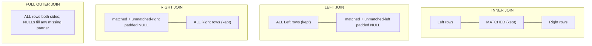

# 🔗 Joins

> [!abstract] TL;DR
> A **join** matches rows from two tables on a predicate. `INNER JOIN` keeps only matched pairs; `LEFT`/`RIGHT`/`FULL OUTER` keep unmatched rows from one or both sides (padding the missing side with `NULL`); `CROSS JOIN` produces every combination (the Cartesian product). A **self-join** joins a table to itself (great for hierarchies). **Semi-joins** (`EXISTS`) and **anti-joins** (`NOT EXISTS`) test *for existence* without duplicating rows. [[MySQL]] famously lacks `FULL OUTER JOIN` — you emulate it with `LEFT ∪ RIGHT`.

## 🧠 Intuition — analogy FIRST

Imagine two guest lists at a wedding: the **Employees** list and the **Departments** list. Each employee card has a sticky note saying which department they belong to.

- **INNER JOIN** — walk the room and only photograph pairs where an employee's sticky note matches a real department table. A freelancer with no department? Not photographed. An empty department with no staff? Not photographed.
- **LEFT JOIN** — photograph *every employee* no matter what; if their department doesn't exist, the department half of the photo is just an empty chair (`NULL`).
- **RIGHT JOIN** — the mirror image: photograph *every department*, even empty ones.
- **FULL OUTER JOIN** — photograph everyone and every department; empty chairs wherever a partner is missing.
- **CROSS JOIN** — pair *every* employee with *every* department, regardless of sticky notes. 40 employees × 5 departments = 200 photos. Rarely what you want.

An **anti-join** is the bouncer's list: "show me employees whose department **doesn't exist**" — you check for the *absence* of a match, not the match itself.

## ⚙️ How It Works + mermaid

The four core join shapes as set regions:



A concrete **result trace**. Suppose:

```
employees                     departments
emp_id  name     dept_id      dept_id  dept_name
1       Alice    10           10       Engineering
2       Bob      20           20       Sales
3       Cara     NULL         30       Legal        (no employees)
```

| Join | Rows produced |
|------|---------------|
| `INNER` | (Alice,Eng), (Bob,Sales) — Cara & Legal dropped |
| `LEFT` (emp ⟕ dept) | (Alice,Eng), (Bob,Sales), (Cara, **NULL**) |
| `RIGHT` (emp ⟖ dept) | (Alice,Eng), (Bob,Sales), (**NULL**, Legal) |
| `FULL OUTER` | (Alice,Eng), (Bob,Sales), (Cara,**NULL**), (**NULL**,Legal) |
| `CROSS` | 3 × 3 = 9 rows, all combinations |

## 💻 SQL Examples

### INNER JOIN

```sql
-- Only employees that have a matching department
SELECT e.first_name, d.dept_name
FROM   employees e
INNER JOIN departments d ON e.dept_id = d.dept_id;   -- INNER keyword optional
```

### LEFT / RIGHT OUTER JOIN

```sql
-- Every employee, even those with no department (dept columns become NULL)
SELECT e.first_name, d.dept_name
FROM   employees e
LEFT JOIN departments d ON e.dept_id = d.dept_id;

-- Every department, even those with zero employees
SELECT e.first_name, d.dept_name
FROM   employees e
RIGHT JOIN departments d ON e.dept_id = d.dept_id;
```

```sql
-- Classic use of LEFT JOIN: "find the orphans" — rows with no partner.
-- Departments that currently have no employees:
SELECT d.dept_name
FROM   departments d
LEFT JOIN employees e ON e.dept_id = d.dept_id
WHERE  e.emp_id IS NULL;          -- the NULL test turns LEFT JOIN into an anti-join
```

### FULL OUTER JOIN (and the MySQL emulation)

```sql
-- PostgreSQL: FULL OUTER JOIN keeps unmatched rows from BOTH sides
SELECT e.first_name, d.dept_name
FROM   employees e
FULL OUTER JOIN departments d ON e.dept_id = d.dept_id;
```

```sql
-- MySQL has NO FULL OUTER JOIN. Emulate with LEFT ∪ RIGHT.
-- UNION (not UNION ALL) de-duplicates the matched rows counted by both halves.
SELECT e.first_name, d.dept_name
FROM   employees e
LEFT JOIN departments d ON e.dept_id = d.dept_id
UNION
SELECT e.first_name, d.dept_name
FROM   employees e
RIGHT JOIN departments d ON e.dept_id = d.dept_id;
```

### CROSS JOIN

```sql
-- Every employee paired with every department (Cartesian product)
SELECT e.first_name, d.dept_name
FROM   employees e
CROSS JOIN departments d;

-- Equivalent legacy comma syntax (avoid — easy to forget the WHERE and blow up):
SELECT e.first_name, d.dept_name FROM employees e, departments d;
```

### Self-join

```sql
-- A table joined to itself: pair each employee with their manager.
-- Two aliases (emp / mgr) make the single table look like two.
SELECT emp.first_name  AS employee,
       mgr.first_name  AS manager
FROM   employees emp
LEFT JOIN employees mgr ON emp.manager_id = mgr.emp_id;  -- LEFT keeps top-level bosses
```

### ON vs USING vs NATURAL

```sql
-- ON: most explicit and flexible — you spell out the predicate
SELECT * FROM employees e JOIN departments d ON e.dept_id = d.dept_id;

-- USING: shorthand when the join column has the SAME NAME in both tables.
-- The joined column appears ONCE (not qualified) in the output.
SELECT * FROM employees e JOIN departments d USING (dept_id);

-- NATURAL JOIN: joins on ALL identically-named columns automatically.
-- Concise but DANGEROUS: adding a same-named column later silently changes results.
SELECT * FROM employees NATURAL JOIN departments;   -- avoid in production
```

> [!tip] Both [[PostgreSQL]] and MySQL support `ON`, `USING`, and `NATURAL` identically. The safety advice (prefer `ON`, avoid `NATURAL`) is the same on both.

### Multiple joins

```sql
-- Chain joins to walk a relationship graph: order -> customer, and order status
SELECT o.order_id, c.name AS customer, o.amount, o.status
FROM   orders o
JOIN   customers c ON o.customer_id = c.customer_id
WHERE  o.status = 'paid'
ORDER BY o.amount DESC;
```

### Join on inequalities (non-equi joins)

```sql
-- Join condition doesn't have to be equality. Bucket each employee into a
-- salary band defined in a ranges table.
SELECT e.first_name, b.band_name
FROM   employees e
JOIN   salary_bands b
  ON   e.salary >= b.min_salary
 AND   e.salary <  b.max_salary;     -- range/band join
```

### Semi-join and anti-join (EXISTS / NOT EXISTS)

```sql
-- SEMI-JOIN: customers who have AT LEAST ONE order.
-- EXISTS stops at the first match — no row duplication even if many orders exist.
SELECT c.name
FROM   customers c
WHERE  EXISTS (SELECT 1 FROM orders o WHERE o.customer_id = c.customer_id);

-- ANTI-JOIN: customers who have placed NO orders.
SELECT c.name
FROM   customers c
WHERE  NOT EXISTS (SELECT 1 FROM orders o WHERE o.customer_id = c.customer_id);
```

> [!warning] `NOT IN` vs `NOT EXISTS`
> `WHERE customer_id NOT IN (SELECT customer_id FROM orders)` breaks silently if `orders.customer_id` ever contains a `NULL` — it returns zero rows. `NOT EXISTS` is `NULL`-safe. This trap is dissected in [[Subqueries]].

## 🚀 Performance Notes

- **Join order and method are the optimizer's job, not the syntax's.** Whether the engine uses a *nested-loop*, *hash*, or *merge* join depends on table sizes, indexes, and statistics — not the order you typed the tables. See [[Join_Algorithms]] and [[Query_Optimizer]].
- **Index the join keys.** A hash join builds a hash table on the smaller input; a nested-loop join needs an index on the *inner* table's join column to avoid a scan per outer row. Missing indexes on [[Constraints_and_Integrity|foreign keys]] are the #1 cause of slow joins. See [[Database_Indexes]].
- **Filter early.** A predicate in `WHERE` that shrinks a table *before* the join dramatically cuts the rows the join must process. The [[Query_Optimizer]] usually pushes predicates down, but writing them explicitly helps.
- **`OUTER JOIN` predicate placement matters.** A condition on the *outer* (null-padded) table belongs in the `ON` clause, not `WHERE` — putting it in `WHERE` filters out the `NULL`-padded rows and silently degrades a `LEFT JOIN` into an `INNER JOIN`.
- **Beware accidental Cartesian products.** A missing/incomplete join predicate turns an N×M explosion loose. Row counts far larger than either input are the tell-tale sign; confirm with [[Execution_Plans]].

## ⚠️ Common Pitfalls

- **`LEFT JOIN` + filter-in-`WHERE` = accidental `INNER JOIN`.** `LEFT JOIN departments d ON … WHERE d.location = 'NYC'` drops the very null-padded rows the `LEFT JOIN` was meant to keep. Move the condition into `ON`, or use `WHERE d.location = 'NYC' OR d.dept_id IS NULL`.
- **Expecting `FULL OUTER JOIN` in MySQL.** It doesn't exist; use the `LEFT UNION RIGHT` pattern above.
- **`NATURAL JOIN` surprises.** It silently joins on *every* shared column name. Add a `created_at` column to both tables and your results change with no warning.
- **Duplicate-row explosion from one-to-many joins.** Joining `customers` to `orders` multiplies a customer row once per order. If you then `SUM(customer.credit_limit)` you overcount. Aggregate the many-side first (see [[Aggregation_and_Grouping]]) or use `EXISTS` for existence checks.
- **`NOT IN` with nullable subqueries.** Use `NOT EXISTS` instead.
- **Forgetting a self-join needs two aliases.** `FROM employees JOIN employees` is ambiguous; alias them (`emp`, `mgr`).

## 🔗 Related Concepts

- [[_MOC_DB_SQL|↑ Section MOC]]
- [[SQL_Fundamentals]] — the `SELECT` mechanics joins build on
- [[Subqueries]] — `EXISTS` / `NOT EXISTS` and the `NOT IN` `NULL` trap
- [[Aggregation_and_Grouping]] — collapsing the "many" side to avoid over-counting
- [[Set_Operations]] — `UNION` used to emulate `FULL OUTER JOIN` in MySQL
- [[Join_Algorithms]] — nested-loop vs hash vs merge join
- [[Database_Indexes]] — indexing join keys and foreign keys
- [[Query_Optimizer]] — how join order and method are chosen
- [[Execution_Plans]] — spotting Cartesian products and join methods
- [[SQL_Tuning]] — fixing slow joins

## ❓ Review Questions

1. You write `SELECT * FROM a LEFT JOIN b ON a.id=b.a_id WHERE b.status='X'` and the result mysteriously contains no unmatched `a` rows. What happened, and how do you fix it?
2. MySQL rejects your `FULL OUTER JOIN`. Write the equivalent query and explain why you use `UNION` rather than `UNION ALL`.
3. When would you choose `WHERE EXISTS (...)` over an `INNER JOIN` to test that a customer has orders? Consider both correctness (duplicates) and `NULL` safety.

## 📚 Sources

- PostgreSQL Documentation — *Table Expressions: Joined Tables*
- MySQL 8.0 Reference Manual — *JOIN Syntax* (note the absence of `FULL OUTER JOIN`)
- Joe Celko, *SQL for Smarties* — semi-joins, anti-joins, and non-equi joins
- ISO/IEC 9075 (SQL:2016) — `JOIN`, `USING`, `NATURAL` semantics

#SQL #Database #Joins #OuterJoin #SelfJoin #AntiJoin #EXISTS
