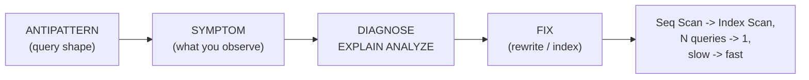

# 🚩 SQL Antipatterns

> [!abstract] TL;DR
> Most slow SQL isn't caused by weak hardware — it's caused by a handful of **repeatable mistakes** that defeat indexes, multiply round trips, or make the optimizer choose bad plans. This note is a field guide: each antipattern, the **symptom** you'll observe, the **cause**, and the concrete **fix**. The big offenders: `SELECT *`, N+1 queries, wrapping indexed columns in functions, implicit type conversions, leading-wildcard `LIKE`, deep `OFFSET` pagination, `NOT IN` with NULLs, missing FK indexes, over-indexing, and correlated subqueries where a join belongs. Learn to read [[Execution_Plans]] and most of these become obvious.

## Intuition — analogy FIRST

Imagine you have a **perfectly organized library with a card catalog** (your indexes). Antipatterns are the equivalent of walking into that library and doing something that makes the catalog useless:

- Asking the librarian to *"bring me every book, then I'll pick"* — that's `SELECT *`.
- Walking to the desk **once per book** instead of handing over your whole list — that's the N+1 query.
- Asking for *"books whose title, when translated to French, starts with X"* — the catalog is sorted by the *English* title, so the librarian must read every book. That's a **function on an indexed column**.
- Asking for *"the 50 books starting at position 100,000"* by counting from the first shelf every time — that's deep `OFFSET` pagination.

In every case the tool to fix it exists (the catalog is fine!) — you just have to phrase the request so the catalog can be used. That's what tuning is: **rewriting queries so the index can do its job.**

---

## How It Works



The universal diagnostic loop: spot the **symptom** (slow query, `Seq Scan` on a big table, hundreds of near-identical queries in logs), run `EXPLAIN ANALYZE` (see [[Execution_Plans]]), identify which antipattern applies, apply the **fix**, and re-measure. See [[SQL_Tuning]] and [[Query_Tuning]] for the broader methodology.

---

## SQL Examples

### 1. SELECT *

```sql
-- ANTIPATTERN: fetches every column, breaks covering indexes, ships unused bytes
SELECT * FROM orders WHERE customer_id = 42;
-- FIX: name only what you need; may enable an index-only scan
SELECT id, total, created_at FROM orders WHERE customer_id = 42;
```
Symptom: extra network/IO, `Seq Scan` or heap fetches even when a [[Index_Design_Strategy|covering index]] exists; fragile code that breaks when columns are added. See [[Database_Indexes]].

### 2. N+1 queries

```sql
-- ANTIPATTERN: 1 query for orders + 1 per order for its customer (101 round trips)
SELECT id, customer_id FROM orders;         -- then, per row:
SELECT name FROM customers WHERE id = ?;     -- x100
-- FIX: a single JOIN (1 round trip)
SELECT o.id, c.name
FROM orders o JOIN customers c ON c.id = o.customer_id;
```
Symptom: hundreds of tiny near-identical queries in the log; latency dominated by round-trip count, not data volume. Classic ORM lazy-loading trap.

### 3. Implicit type conversion defeating an index

```sql
-- ANTIPATTERN: phone is VARCHAR, literal is numeric -> forces per-row cast, no index
SELECT * FROM users WHERE phone = 5551234;
-- FIX: match the column's type
SELECT * FROM users WHERE phone = '5551234';
```
Symptom: `Seq Scan` despite an index on `phone`; plan shows a cast on the column. [[MySQL]] is especially prone (loose typing).

### 4. Function on an indexed column in WHERE

```sql
-- ANTIPATTERN: wrapping the indexed column hides it from the index
SELECT * FROM users WHERE LOWER(email) = 'a@x.com';
SELECT * FROM orders WHERE DATE(created_at) = '2026-01-01';
-- FIX A: rewrite to leave the column bare (sargable range)
SELECT * FROM orders WHERE created_at >= '2026-01-01' AND created_at < '2026-01-02';
-- FIX B: build an expression index that matches the function
CREATE INDEX idx_users_lower_email ON users (LOWER(email));   -- Postgres
```
Symptom: `Seq Scan` even though the column is indexed. A predicate the index can use is called **sargable**; functions on the column make it non-sargable.

### 5. OR vs UNION

```sql
-- ANTIPATTERN: OR across two different indexed columns often -> full scan
SELECT * FROM t WHERE a = 1 OR b = 2;
-- FIX: UNION lets each branch use its own index
SELECT * FROM t WHERE a = 1
UNION
SELECT * FROM t WHERE b = 2;
```
Symptom: a single `Seq Scan` where two separate `Index Scan`s (or a `BitmapOr`) would be far cheaper. ([[PostgreSQL|Postgres]] can sometimes do a Bitmap OR; test both.)

### 6. Leading-wildcard LIKE

```sql
-- ANTIPATTERN: leading % means the B-tree can't seek a prefix -> full scan
SELECT * FROM products WHERE name LIKE '%phone%';
-- FIX A: prefix search is index-friendly
SELECT * FROM products WHERE name LIKE 'phone%';
-- FIX B: real substring/full-text search
--   Postgres: pg_trgm GIN index  |  MySQL: FULLTEXT (see Advanced_SQL_and_JSON)
CREATE INDEX idx_name_trgm ON products USING GIN (name gin_trgm_ops);
```
Symptom: `Seq Scan` on `LIKE '%...'`. [[BTree_Indexes|B-trees]] seek by prefix; a leading wildcard removes the anchor.

### 7. Deep OFFSET pagination

```sql
-- ANTIPATTERN: OFFSET 100000 still reads & discards 100k rows every page
SELECT * FROM orders ORDER BY id LIMIT 20 OFFSET 100000;
-- FIX: keyset ("seek") pagination — remember the last id
SELECT * FROM orders WHERE id > :last_seen_id ORDER BY id LIMIT 20;
```
Symptom: page load time grows linearly with page depth. Keyset pagination is O(1) per page via the index. See [[SQL_Tuning]].

### 8. NOT IN with NULLs

```sql
-- ANTIPATTERN: if the subquery returns any NULL, NOT IN yields NO rows (3-valued logic)
SELECT * FROM customers
WHERE id NOT IN (SELECT customer_id FROM orders);   -- customer_id may be NULL!
-- FIX: NOT EXISTS is NULL-safe and often better-optimized
SELECT * FROM customers c
WHERE NOT EXISTS (SELECT 1 FROM orders o WHERE o.customer_id = c.id);
```
Symptom: query silently returns zero rows. Because `x NOT IN (1, NULL)` is `UNKNOWN`, never `TRUE`.

### 9. Missing index on a foreign-key column

```sql
-- Symptom: slow JOINs and slow parent DELETEs (FK check scans the child table)
-- FIX: index every FK column you join or cascade on
CREATE INDEX idx_orders_customer_id ON orders (customer_id);
```
Postgres does **not** auto-create an index on the referencing (child) [[Constraints_and_Integrity|FK]] column — only on the referenced PK. MySQL/InnoDB *does* auto-index FK columns. Know your engine.

### 10. Over-indexing

```sql
-- ANTIPATTERN: 12 indexes on a write-heavy table -> every INSERT updates all 12
-- FIX: drop unused indexes
SELECT relname, indexrelname, idx_scan
FROM pg_stat_user_indexes WHERE idx_scan = 0;   -- never-used indexes -> candidates to drop
```
Symptom: degraded write throughput, bloat. Each index is pure overhead on every write. See [[Database_Indexes]].

### 11. Giant IN lists

```sql
-- ANTIPATTERN: IN (... 10,000 literals ...) -> huge parse, plan bloat, param limits
SELECT * FROM users WHERE id IN (1,2,3, ... 10000);
-- FIX: join against a values list / temp table
SELECT u.* FROM users u JOIN (VALUES (1),(2),(3)) AS v(id) ON u.id = v.id;
-- or:  WHERE id = ANY(:id_array)   -- Postgres array bind
```
Symptom: slow parsing, plan cache misses, occasional "too many parameters" errors.

### 12. Correlated subquery where a join is better

```sql
-- ANTIPATTERN: subquery re-executed per outer row
SELECT c.id,
       (SELECT COUNT(*) FROM orders o WHERE o.customer_id = c.id) AS order_count
FROM customers c;
-- FIX: single grouped join
SELECT c.id, COALESCE(o.cnt, 0) AS order_count
FROM customers c
LEFT JOIN (SELECT customer_id, COUNT(*) cnt FROM orders GROUP BY customer_id) o
       ON o.customer_id = c.id;
```
Symptom: plan shows the subquery running once per outer row (`SubPlan` re-executed N times). Modern optimizers sometimes de-correlate automatically — verify with [[Execution_Plans]].

---

## Performance Notes

- **The unifying principle is "sargability."** A predicate is sargable when the index can *seek* to matching rows instead of scanning. Antipatterns 3–6 all break sargability by hiding the raw indexed column (behind a cast, a function, or a leading wildcard). Keep the indexed column bare on one side of the comparison.
- Antipatterns 1, 2, 7, 11 are **volume/round-trip** problems — they don't necessarily defeat indexes, they just move or fetch far more than needed. Fix by reducing what crosses the wire.
- Always confirm with real measurements: `EXPLAIN (ANALYZE, BUFFERS)` in Postgres, `EXPLAIN ANALYZE` / `EXPLAIN FORMAT=JSON` in MySQL 8. A `Seq Scan` isn't always bad (small tables, low-selectivity predicates), so measure — see [[SQL_Tuning]] and the [[Query_Optimizer]].
- Beware fixing one antipattern into another: replacing every subquery with a join, or `OR` with `UNION`, can occasionally be *worse* — benchmark both.

## Common Pitfalls

1. **Trusting that an index exists means it's used.** Any of these antipatterns can make the planner ignore a perfectly good index. Read the plan.
2. **`NOT IN` on a nullable column.** The single most silent, dangerous one — it returns *zero rows*, not an error. Default to `NOT EXISTS`.
3. **Assuming FK columns are auto-indexed.** True in MySQL/InnoDB, false in PostgreSQL for the child side. Unindexed FKs make cascading deletes crawl.
4. **Cargo-culting "`SELECT *` is always bad" or "subqueries are always slow."** Context matters; the fix must be verified, not assumed.
5. **Deep `OFFSET` "solved" by raising the limit.** It doesn't scale; you need keyset pagination, which requires a stable, indexed sort key.
6. **Adding indexes to fix reads without watching writes.** Over-indexing trades read speed for write throughput and storage; monitor `idx_scan` and drop dead indexes.

## Related Concepts

- [[_MOC_DB_SQL|↑ Section MOC]]
- [[SQL_Tuning]] — the systematic diagnose-and-fix methodology
- [[Query_Tuning]] — companion tuning workflow
- [[Execution_Plans]] — reading `EXPLAIN` to spot every antipattern here
- [[Query_Optimizer]] — why the planner picks scans vs seeks
- [[Database_Indexes]] — sargability, covering, expression, and FK indexes
- [[Advanced_SQL_and_JSON]] — `pg_trgm`/`FULLTEXT` as the real fix for substring search
- [[Window_Functions]] — keyset pagination pairs well with ordered windows

## Review Questions

1. `SELECT * FROM orders WHERE DATE(created_at) = '2026-01-01'` does a full table scan despite an index on `created_at`. Explain *why* and give two different fixes.
2. `WHERE id NOT IN (SELECT customer_id FROM orders)` returns zero rows even though you expect many. What's happening, and what's the safe rewrite?
3. A REST endpoint paginates with `LIMIT 20 OFFSET :n` and gets slower on later pages. Explain the cause and rewrite it as keyset pagination, noting what the sort column must satisfy.

## Sources

- Bill Karwin — "SQL Antipatterns: Avoiding the Pitfalls of Database Programming" (Pragmatic Bookshelf)
- Use The Index, Luke — sargability, pagination, and index misuse: https://use-the-index-luke.com/
- PostgreSQL Documentation — Using EXPLAIN: https://www.postgresql.org/docs/current/using-explain.html
- MySQL 8.0 Reference Manual — Optimizing Queries with EXPLAIN: https://dev.mysql.com/doc/refman/8.0/en/using-explain.html

#Database #SQL #Antipatterns #Performance #Sargability #Pagination #NPlusOne #PostgreSQL #MySQL
