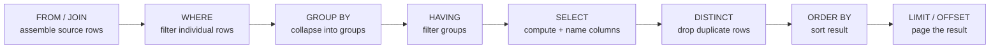

# 🧱 SQL Fundamentals

> [!abstract] TL;DR
> A single `SELECT` statement is the workhorse of SQL. You *write* it in the order `SELECT … FROM … WHERE … ORDER BY … LIMIT`, but the engine *evaluates* it in a completely different **logical processing order**: `FROM → WHERE → GROUP BY → HAVING → SELECT → ORDER BY → LIMIT`. Internalizing that order explains almost every "why can't I use my alias here?" and "why is my `WHERE` rejecting my aggregate?" surprise. This note covers filtering, sorting, paging, `DISTINCT`, aliases, operators, pattern matching (`LIKE`/`ILIKE`), `IN`, `BETWEEN`, and the ever-tricky three-valued logic of `NULL`.

## 🧠 Intuition — analogy FIRST

Think of a query as a **cafeteria line**, not a shopping list.

You *tell* the server what you want on your plate first ("I'll have the salmon, labelled 'main'"), but the kitchen actually works back-to-front:

1. **FROM** — first they wheel out every tray of raw ingredients (the tables).
2. **WHERE** — a gatekeeper throws away every ingredient that fails inspection (row filter).
3. **GROUP BY / HAVING** — surviving ingredients are sorted into buckets, and whole buckets get tossed.
4. **SELECT** — only *now* do they plate and *label* ("main", "side") what's left.
5. **ORDER BY** — they arrange the plates on the counter.
6. **LIMIT** — they hand you only the first few plates.

The punchline: the **label** ("main") you invented in step 4 (`SELECT`) does not exist yet when the gatekeeper in step 2 (`WHERE`) is working. That is *exactly* why `WHERE my_alias = 5` fails but `ORDER BY my_alias` works — ordering happens *after* labelling.

## ⚙️ How It Works + mermaid

Our running schema for this whole SQL section:

```sql
-- departments: one row per department
CREATE TABLE departments (
    dept_id    INT PRIMARY KEY,
    dept_name  VARCHAR(50),
    location   VARCHAR(50)
);

-- employees: many employees per department; manager_id is a self-reference
CREATE TABLE employees (
    emp_id      INT PRIMARY KEY,
    first_name  VARCHAR(50),
    last_name   VARCHAR(50),
    email       VARCHAR(120),
    dept_id     INT REFERENCES departments(dept_id),
    manager_id  INT REFERENCES employees(emp_id),
    salary      NUMERIC(10,2),
    hire_date   DATE
);

-- customers and orders (used heavily in later notes)
CREATE TABLE customers (
    customer_id INT PRIMARY KEY,
    name        VARCHAR(80),
    email       VARCHAR(120),
    city        VARCHAR(50),
    country     VARCHAR(50)
);

CREATE TABLE orders (
    order_id    INT PRIMARY KEY,
    customer_id INT REFERENCES customers(customer_id),
    order_date  DATE,
    amount      NUMERIC(10,2),
    status      VARCHAR(20)   -- 'paid' | 'pending' | 'cancelled'
);
```

The **logical query processing order** — the single most useful mental model in this note:



Two consequences fall straight out of this diagram:

- A column **alias** defined in `SELECT` is visible to `ORDER BY` (which runs *after* `SELECT`) but **not** to `WHERE`, `GROUP BY`, or `HAVING` (which run *before* it). [[PostgreSQL]] and [[MySQL]] both permit the alias in `GROUP BY`/`HAVING` as a non-standard convenience, but never in `WHERE`.
- An aggregate like `COUNT(*)` cannot appear in `WHERE`, because grouping hasn't happened yet at that stage. That is precisely what `HAVING` is for.

## 💻 SQL Examples

### SELECT, FROM, WHERE

```sql
-- The four fundamentals: pick columns, from a table, filtering rows
SELECT first_name, last_name, salary
FROM   employees
WHERE  dept_id = 3 AND salary > 60000;
```

```sql
-- SELECT * grabs every column. Fine for exploration, avoid in production code
-- (it breaks when columns are added and pulls data you don't need).
SELECT * FROM departments;
```

### ORDER BY

```sql
-- Sort by salary descending, then last_name ascending as a tie-breaker
SELECT first_name, last_name, salary
FROM   employees
ORDER BY salary DESC, last_name ASC;   -- ASC is the default and can be omitted
```

> [!tip] NULLs in sorting
> PostgreSQL sorts `NULL` as **largest** by default (`NULLS LAST` for `ASC`), and lets you override: `ORDER BY salary DESC NULLS LAST`. MySQL treats `NULL` as **smallest** and has no `NULLS FIRST/LAST` clause — you emulate it with `ORDER BY salary IS NULL, salary`.

### LIMIT / OFFSET — the paging dialects

```sql
-- PostgreSQL & MySQL: LIMIT count OFFSET skip
SELECT emp_id, first_name
FROM   employees
ORDER BY emp_id
LIMIT 10 OFFSET 20;      -- rows 21..30
```

```sql
-- MySQL also accepts the older comma form: LIMIT offset, count
SELECT emp_id, first_name
FROM   employees
ORDER BY emp_id
LIMIT 20, 10;            -- SAME result: skip 20, take 10  (offset FIRST here!)
```

```sql
-- ANSI-standard form (PostgreSQL 8.4+, also SQL Server / Oracle 12c+; NOT MySQL)
SELECT emp_id, first_name
FROM   employees
ORDER BY emp_id
OFFSET 20 ROWS FETCH FIRST 10 ROWS ONLY;
```

> [!warning] Always pair OFFSET with ORDER BY
> Without an explicit `ORDER BY`, "the first 10 rows" is undefined — the engine may return any 10 rows, and page 2 may overlap page 1. See Performance Notes for why deep `OFFSET` is a trap.

### DISTINCT

```sql
-- Distinct list of countries our customers come from
SELECT DISTINCT country FROM customers;

-- DISTINCT applies to the WHOLE row (all selected columns together)
SELECT DISTINCT dept_id, location   -- unique (dept_id, location) pairs
FROM   departments;
```

```sql
-- PostgreSQL-only: DISTINCT ON keeps the first row per group (needs ORDER BY)
-- "the most recent order per customer"
SELECT DISTINCT ON (customer_id) customer_id, order_id, order_date
FROM   orders
ORDER BY customer_id, order_date DESC;
```

### Aliases

```sql
-- Column alias with AS (AS is optional but improves readability)
SELECT first_name || ' ' || last_name AS full_name,   -- PostgreSQL string concat
       salary * 12                    AS annual_salary
FROM   employees;
```

```sql
-- MySQL uses CONCAT() instead of || (unless PIPES_AS_CONCAT sql_mode is on)
SELECT CONCAT(first_name, ' ', last_name) AS full_name,
       salary * 12                        AS annual_salary
FROM   employees;
```

```sql
-- Table alias: shortens references and is required for self-joins
SELECT e.first_name, d.dept_name
FROM   employees  AS e
JOIN   departments AS d ON e.dept_id = d.dept_id;
```

### Operators

```sql
-- Comparison: = <> (or !=) < <= > >=   ;  logical: AND OR NOT
SELECT * FROM employees
WHERE  salary >= 50000
  AND  dept_id <> 1
  AND  NOT (hire_date < DATE '2020-01-01');
```

### LIKE / ILIKE — pattern matching

```sql
-- % matches any sequence, _ matches exactly one character
SELECT name FROM customers WHERE name LIKE 'A%';    -- starts with A
SELECT name FROM customers WHERE name LIKE '%son';  -- ends with son
SELECT name FROM customers WHERE name LIKE '_a%';   -- 'a' as 2nd char
```

```sql
-- Case-insensitive matching:
-- PostgreSQL:  ILIKE is a first-class operator
SELECT name FROM customers WHERE name ILIKE 'aBc%';

-- MySQL: LIKE is already case-insensitive for the default (ci) collations.
-- Force case-sensitivity when needed:
SELECT name FROM customers WHERE name LIKE 'aBc%' COLLATE utf8mb4_bin;
```

### IN and BETWEEN

```sql
-- IN: membership test — cleaner than chained ORs
SELECT * FROM employees WHERE dept_id IN (1, 3, 5);

-- BETWEEN is INCLUSIVE on both ends: >= low AND <= high
SELECT * FROM orders WHERE amount BETWEEN 100 AND 500;      -- 100 and 500 included
SELECT * FROM orders WHERE order_date BETWEEN DATE '2026-01-01' AND DATE '2026-03-31';
```

### NULL handling — three-valued logic

```sql
-- NULL means "unknown". It is NOT equal to anything, not even NULL.
SELECT * FROM employees WHERE manager_id = NULL;    -- ALWAYS returns 0 rows (wrong!)
SELECT * FROM employees WHERE manager_id IS NULL;   -- correct: top-level managers
SELECT * FROM employees WHERE manager_id IS NOT NULL;
```

```sql
-- COALESCE: return the first non-NULL argument (great for defaults)
SELECT first_name,
       COALESCE(email, 'no-email-on-file') AS contact
FROM   employees;

-- NULLIF: return NULL when two values are equal (classic divide-by-zero guard)
SELECT order_id,
       amount / NULLIF(quantity, 0) AS unit_price   -- avoids division by zero error
FROM   order_lines;
```

> [!warning] The NULL-in-IN trap
> `WHERE dept_id NOT IN (1, 2, NULL)` returns **no rows** — the `NULL` makes the whole predicate evaluate to `UNKNOWN`. This is covered in depth in [[Subqueries]]. When a subquery in a `NOT IN` can produce a `NULL`, prefer `NOT EXISTS`.

## 🚀 Performance Notes

- **`SELECT *` is not free.** It transfers columns you don't need and, critically, prevents *[[Index_Design_Strategy|covering-index]]* optimizations. Naming exact columns lets an index satisfy the query without touching the table heap. See [[Database_Indexes]].
- **Deep `OFFSET` is O(offset).** `LIMIT 10 OFFSET 100000` still scans and discards 100,000 rows. For pagination at scale, use **keyset ("seek") pagination** instead: `WHERE emp_id > :last_seen ORDER BY emp_id LIMIT 10`. This turns an O(offset) scan into an O(log n) index seek.
- **A leading wildcard defeats indexes.** `LIKE 'abc%'` can use a [[BTree_Indexes|B-tree index]] on the column; `LIKE '%abc'` cannot and forces a scan. For substring/contains search consider a trigram index (`pg_trgm` in PostgreSQL) or full-text search.
- **`WHERE func(col) = x` is non-sargable.** Wrapping the indexed column in a function (e.g. `WHERE UPPER(email) = 'X'`) usually disables the index. Store normalized data, use an *expression index*, or move the function to the constant side. Related: [[SQL_Tuning]].
- **`DISTINCT` and `ORDER BY` both may require a sort or hash step.** Check whether an index already provides the order — the [[Query_Optimizer]] can skip the sort if so. Inspect with [[Execution_Plans]].

## ⚠️ Common Pitfalls

- **Aliasing in `WHERE`.** `SELECT salary*12 AS annual FROM employees WHERE annual > 1e6` fails — `annual` doesn't exist yet at `WHERE` time. Repeat the expression, or wrap the query in a subquery/CTE.
- **`= NULL` instead of `IS NULL`.** Silently returns zero rows. Always use `IS [NOT] NULL`.
- **Forgetting that `BETWEEN` is inclusive.** `BETWEEN '2026-01-01' AND '2026-01-31'` on a `TIMESTAMP` column misses everything on Jan 31 after midnight. Prefer half-open ranges: `ts >= '2026-01-01' AND ts < '2026-02-01'`.
- **Relying on implicit row order.** Without `ORDER BY`, result order is arbitrary and can change between runs, versions, or after a `VACUUM`. Never assume insertion order.
- **`NOT IN` with a nullable list.** As above — one `NULL` nukes the whole result set.
- **Mixing MySQL's `LIMIT offset,count` with `LIMIT count OFFSET skip`.** In the comma form the **offset comes first**; getting them backwards silently returns the wrong page.

## 🔗 Related Concepts

- [[_MOC_DB_SQL|↑ Section MOC]]
- [[Joins]] — combining rows across tables
- [[Aggregation_and_Grouping]] — `GROUP BY`, `HAVING`, aggregates
- [[Subqueries]] — nesting queries, the `NULL`/`NOT IN` trap in depth
- [[Set_Operations]] — `UNION` / `INTERSECT` / `EXCEPT`
- [[Database_Indexes]] — why `WHERE`/`ORDER BY` speed depends on indexes
- [[SQL_Tuning]] — making slow queries fast
- [[Query_Optimizer]] — how the engine plans a `SELECT`
- [[Execution_Plans]] — reading `EXPLAIN` output

## ❓ Review Questions

1. Given `SELECT dept_id, COUNT(*) AS n FROM employees WHERE n > 5 GROUP BY dept_id;`, why does this fail, and how do you fix it? (Hint: which clause runs before which?)
2. Explain why `WHERE manager_id = NULL` returns no rows, and rewrite it correctly. What does three-valued logic have to do with it?
3. Your app paginates with `LIMIT 20 OFFSET 200000` and page loads get slower as users go deeper. Explain the cause and describe keyset pagination as a fix.

## 📚 Sources

- PostgreSQL Documentation — *SELECT*, *The SELECT list*, *Sorting Rows*, *LIMIT and OFFSET*
- MySQL 8.0 Reference Manual — *SELECT Statement*, *LIMIT Query Optimization*
- ISO/IEC 9075 (SQL:2016) — logical query processing and three-valued logic
- Markus Winand, *Use The Index, Luke!* — sargability and keyset pagination

#SQL #Database #Fundamentals #Query #NULL #Pagination
