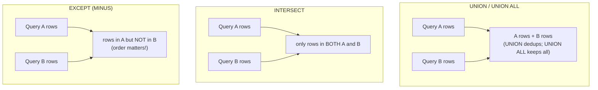

# ➕ Set Operations

> [!abstract] TL;DR
> Set operations combine the results of two (or more) `SELECT` queries vertically — stacking rows, not joining columns. **`UNION`** merges and removes duplicates; **`UNION ALL`** merges and keeps every row (cheaper — no dedup pass). **`INTERSECT`** returns rows present in *both*; **`EXCEPT`** (Oracle calls it `MINUS`) returns rows in the first but *not* the second. All require the inputs to be **union-compatible**: same number of columns, in order, with compatible types. Column names come from the *first* query, and a single `ORDER BY` sorts the *combined* result. [[MySQL]] only gained `INTERSECT`/`EXCEPT` in **8.0.31**.

## 🧠 Intuition — analogy FIRST

Think of two guest lists as two circles in a Venn diagram — **List A** (customers who bought last year) and **List B** (customers who bought this year).

- **`UNION`** = everyone who appears on *either* list, but each person named **once** (both circles combined, overlap counted a single time).
- **`UNION ALL`** = tape the two lists end-to-end without checking for repeats — people on both lists appear **twice**. Faster, because nobody cross-checks names.
- **`INTERSECT`** = only the people in the **overlap** — bought both years (loyal repeat customers).
- **`EXCEPT`** = people on List A but **not** List B — bought last year but *churned* this year.

Joins widen your rows (more columns side-by-side); set operations stack your rows (more rows top-to-bottom). Different tools for different shapes.

## ⚙️ How It Works + mermaid



**Union compatibility** is the precondition for all three: each query must project the **same number of columns**, positionally matched, with **compatible data types**. The result's column names are taken from the **first** query; the others' names are ignored.

## 💻 SQL Examples

### UNION vs UNION ALL

```sql
-- All contact emails from two sources, deduplicated.
-- UNION removes duplicate rows across the combined result.
SELECT email FROM customers
UNION
SELECT email FROM employees;

-- UNION ALL keeps everything, including duplicates (a customer who is also an
-- employee appears twice). Cheaper: no sort/hash dedup step.
SELECT email FROM customers
UNION ALL
SELECT email FROM employees;
```

> [!tip] Default to `UNION ALL`
> If you *know* the inputs are disjoint (or duplicates are acceptable/desired), use `UNION ALL`. `UNION`'s implicit de-duplication forces a sort or hash over the whole combined set — pure overhead you don't need. Only pay for `UNION` when you actually require unique rows.

### Column/type compatibility rules

```sql
-- The queries must line up POSITIONALLY, not by name. These columns are matched
-- by position: (id -> customer_id) and (label -> name), regardless of the aliases.
SELECT customer_id AS id, name AS label FROM customers
UNION ALL
SELECT emp_id,           first_name   FROM employees;   -- 2 cols, compatible types

-- Result column headers come from the FIRST query: "id", "label".
```

```sql
-- Type mismatches: engines coerce compatible types (INT + NUMERIC -> NUMERIC),
-- but incompatible ones (INT vs DATE) error. Pad missing columns with typed NULLs
-- or literals to line the queries up:
SELECT name, city,        'customer' AS source FROM customers
UNION ALL
SELECT first_name, NULL,  'employee' AS source FROM employees;
```

### Ordering the combined result

```sql
-- A single ORDER BY applies to the WHOLE combined result and must come LAST
-- (after the final SELECT). You cannot ORDER BY inside an individual branch
-- (except to pair with LIMIT). Order by position or by first-query column name.
SELECT email, 'customer' AS source FROM customers
UNION ALL
SELECT email, 'employee'           FROM employees
ORDER BY email;          -- sorts the merged set; refers to first query's columns
```

### INTERSECT

```sql
-- Emails that belong to BOTH a customer and an employee.
-- INTERSECT (like UNION) removes duplicates; INTERSECT ALL keeps multiplicity (PG).
SELECT email FROM customers
INTERSECT
SELECT email FROM employees;
```

### EXCEPT / MINUS

```sql
-- Customers who have NOT placed an order (set-difference approach).
-- Order matters: A EXCEPT B != B EXCEPT A.
SELECT customer_id FROM customers
EXCEPT
SELECT customer_id FROM orders;
```

```sql
-- Oracle spells EXCEPT as MINUS (same semantics):
-- SELECT customer_id FROM customers
-- MINUS
-- SELECT customer_id FROM orders;
```

> [!warning] MySQL version gate
> `UNION` / `UNION ALL` have always existed in MySQL. But **`INTERSECT` and `EXCEPT` were only added in MySQL 8.0.31** (October 2022). On older MySQL you must emulate them:
> ```sql
> -- INTERSECT emulation (customers who are also employees, by email):
> SELECT DISTINCT c.email FROM customers c
> JOIN employees e ON c.email = e.email;
>
> -- EXCEPT emulation (customers with no order):
> SELECT c.customer_id FROM customers c
> LEFT JOIN orders o ON o.customer_id = c.customer_id
> WHERE o.customer_id IS NULL;
> ```

### Precedence and chaining

```sql
-- INTERSECT binds TIGHTER than UNION/EXCEPT. Use parentheses to be explicit.
SELECT email FROM customers
UNION
(SELECT email FROM employees INTERSECT SELECT email FROM contractors);
```

## 🚀 Performance Notes

- **`UNION` pays for de-duplication; `UNION ALL` does not.** `UNION` must sort or hash the entire combined output to find duplicates — often the dominant cost. Reach for `UNION ALL` whenever duplicates are impossible or acceptable. A classic [[SQL_Tuning]] quick win.
- **Set-difference vs anti-join.** `EXCEPT` is clean and readable, but `LEFT JOIN … WHERE … IS NULL` or `NOT EXISTS` (see [[Joins]], [[Subqueries]]) sometimes yields a better plan and is `NULL`-safe by construction. Compare with [[Execution_Plans]].
- **Indexes help the dedup/matching.** `INTERSECT` and `EXCEPT` internally match rows across both inputs; indexes that provide sorted input can let the engine use a merge strategy instead of hashing. See [[Database_Indexes]] and [[Query_Optimizer]].
- **NULLs are treated as equal here.** Unlike `=`, set operations consider two `NULL`s *the same* for dedup/matching purposes (they use `IS NOT DISTINCT FROM` semantics). So `UNION` collapses duplicate `NULL` rows — a subtlety that differs from join equality.
- **Push work before the set op.** Filtering each branch with `WHERE` *before* the `UNION` shrinks the sets the engine must merge and dedup.

## ⚠️ Common Pitfalls

- **Reaching for `UNION` when `UNION ALL` would do** — paying for an unnecessary dedup sort on every run.
- **Column mismatch.** Different column counts or incompatible types across branches cause an error; the fix is to align positions and pad with typed `NULL`s/literals.
- **Assuming names or aliases in later branches matter.** Only the *first* query's column names survive; `ORDER BY` must reference those (or ordinal positions).
- **`ORDER BY` inside a branch.** A branch-level `ORDER BY` (without `LIMIT`) is illegal or ignored — order the *combined* result with a single trailing `ORDER BY`.
- **Using `INTERSECT`/`EXCEPT` on MySQL < 8.0.31.** They simply don't exist; emulate with joins as shown.
- **Forgetting `EXCEPT` is directional.** `A EXCEPT B` ≠ `B EXCEPT A`.
- **Surprised that `UNION` merged your `NULL` rows.** Set-op equality treats `NULL = NULL` as true for dedup, unlike ordinary comparison.

## 🔗 Related Concepts

- [[_MOC_DB_SQL|↑ Section MOC]]
- [[SQL_Fundamentals]] — the `SELECT`s that set operations combine, and `NULL` semantics
- [[Joins]] — `UNION` used to emulate MySQL's missing `FULL OUTER JOIN`; anti-join vs `EXCEPT`
- [[Subqueries]] — `NOT EXISTS` as the `NULL`-safe alternative to `EXCEPT`
- [[CTEs]] — recursive CTEs rely on `UNION ALL` to accumulate iterations
- [[Aggregation_and_Grouping]] — combining pre-aggregated result sets
- [[Database_Indexes]] — indexes that speed dedup/matching
- [[Query_Optimizer]] — merge vs hash for set operations
- [[Execution_Plans]] — comparing `EXCEPT` against an anti-join plan
- [[SQL_Tuning]] — `UNION` → `UNION ALL` and set-op → join rewrites

## ❓ Review Questions

1. When is `UNION ALL` strictly preferable to `UNION`, and what concrete cost does `UNION` add that `UNION ALL` avoids?
2. Write the query "customers who placed no orders" three ways: with `EXCEPT`, with `NOT EXISTS`, and with a `LEFT JOIN … IS NULL`. Which are available on MySQL 8.0.20?
3. Two `SELECT`s are combined with `UNION`, but the engine rejects it. List three requirements the branches must satisfy (union compatibility) and how `ORDER BY` must be positioned.

## 📚 Sources

- PostgreSQL Documentation — *Combining Queries (UNION, INTERSECT, EXCEPT)*
- MySQL 8.0 Reference Manual — *UNION Clause*, *INTERSECT Clause*, *EXCEPT Clause* (added 8.0.31)
- Oracle Database SQL Language Reference — *The Set Operators* (`MINUS`)
- ISO/IEC 9075 (SQL:2016) — `UNION`, `INTERSECT`, `EXCEPT` and union compatibility

#SQL #Database #SetOperations #Union #Intersect #Except
