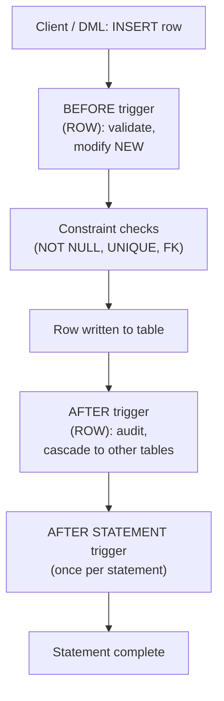

# ⚡ Stored Procedures and Triggers

> [!abstract] TL;DR
> **Stored procedures and functions** are named blocks of procedural code that live *inside* the database and run next to the data — cutting network round trips and centralizing logic. A **function** returns a value and is called inside a query; a **procedure** performs actions, can manage [[Transactions_and_ACID|transactions]], and is invoked with `CALL`. **Triggers** are code the database fires *automatically* in response to `INSERT`/`UPDATE`/`DELETE` (or `INSTEAD OF` on views), with access to the `NEW` and `OLD` row images. They're powerful for auditing, derived columns, and validation — but their great danger is **hidden logic**: a write mysteriously does five extra things nobody can see in the application code.

## Intuition — analogy FIRST

Picture a **restaurant kitchen**.

- A **stored function** is a **recipe card**: you hand it ingredients (parameters), it returns a finished dish (a value). You can use its result as part of a bigger meal (call it inside a query).
- A **stored procedure** is a **kitchen workflow** — "prep the station, cook, plate, clean up." It *does things* (side effects), may span several steps you can commit or abandon, and you start it explicitly ("chef, begin service" = `CALL`).
- A **trigger** is a **motion-sensor light**. Nobody flips a switch — the moment someone walks into the pantry (an `INSERT`), the light turns on automatically. Incredibly convenient... until you're debugging why the light flickers and realize there are *three* hidden sensors wired to the same door that nobody documented.

That last point is the whole tension with triggers: automatic, invisible, and easy to forget they exist.

---

## How It Works



Firing order for a single DML statement: **BEFORE STATEMENT → (per row: BEFORE ROW → constraint checks → AFTER ROW) → AFTER STATEMENT.** A `BEFORE ROW` trigger can *modify* the row about to be written (set `NEW.updated_at = now()`) or cancel it; an `AFTER ROW` trigger sees the final committed values and is used for cascading effects and audit logs.

---

## SQL Examples

### Function — PostgreSQL (PL/pgSQL) vs MySQL

```sql
-- PostgreSQL: a function returning a scalar
CREATE OR REPLACE FUNCTION order_total(p_order_id BIGINT)
RETURNS NUMERIC
LANGUAGE plpgsql
AS $$
DECLARE
    v_total NUMERIC;
BEGIN
    SELECT SUM(quantity * unit_price) INTO v_total
    FROM order_items WHERE order_id = p_order_id;
    RETURN COALESCE(v_total, 0);
END;
$$;

SELECT order_total(42);              -- callable inside a query
```

```sql
-- MySQL (SQL/PSM): note DELIMITER change and DETERMINISTIC hint
DELIMITER //
CREATE FUNCTION order_total(p_order_id BIGINT)
RETURNS DECIMAL(12,2)
DETERMINISTIC READS SQL DATA
BEGIN
    DECLARE v_total DECIMAL(12,2);
    SELECT SUM(quantity * unit_price) INTO v_total
    FROM order_items WHERE order_id = p_order_id;
    RETURN IFNULL(v_total, 0);
END //
DELIMITER ;
```

### Procedure with IN / OUT / INOUT parameters

```sql
-- PostgreSQL 11+ : PROCEDURE, invoked with CALL, can control transactions
CREATE OR REPLACE PROCEDURE transfer_funds(
    IN  p_from BIGINT,
    IN  p_to   BIGINT,
    IN  p_amt  NUMERIC,
    OUT p_ok   BOOLEAN
)
LANGUAGE plpgsql
AS $$
BEGIN
    UPDATE accounts SET balance = balance - p_amt WHERE id = p_from;
    UPDATE accounts SET balance = balance + p_amt WHERE id = p_to;
    p_ok := TRUE;
    COMMIT;                          -- procedures MAY commit; functions may NOT
END;
$$;

CALL transfer_funds(1, 2, 100.00, NULL);
```

```sql
-- MySQL procedure with an OUT parameter
DELIMITER //
CREATE PROCEDURE transfer_funds(IN p_from BIGINT, IN p_to BIGINT,
                                IN p_amt DECIMAL(12,2), OUT p_ok BOOLEAN)
BEGIN
    START TRANSACTION;
    UPDATE accounts SET balance = balance - p_amt WHERE id = p_from;
    UPDATE accounts SET balance = balance + p_amt WHERE id = p_to;
    COMMIT;
    SET p_ok = TRUE;
END //
DELIMITER ;

CALL transfer_funds(1, 2, 100.00, @ok);
SELECT @ok;
```

### FUNCTION vs PROCEDURE — the key distinctions

| | Function | Procedure |
|---|---|---|
| Returns a value | Yes (`RETURN`) | No (uses `OUT` params) |
| Called via | Inside a `SELECT`/expression | `CALL` statement |
| Transaction control | ❌ Cannot `COMMIT`/`ROLLBACK` | ✅ Can ([[PostgreSQL\|Postgres 11+]], [[MySQL]]) |
| Usable in a query | ✅ `SELECT f(x)` | ❌ |
| Postgres introduced | Always | `PROCEDURE` + `CALL` in **11** |

### Control flow (loops, conditionals, exceptions)

```sql
CREATE OR REPLACE FUNCTION grade(score INT) RETURNS TEXT
LANGUAGE plpgsql AS $$
BEGIN
    IF score >= 90 THEN RETURN 'A';
    ELSIF score >= 80 THEN RETURN 'B';
    ELSE RETURN 'F';
    END IF;
EXCEPTION
    WHEN others THEN RETURN 'ERR';   -- exception handling block
END;
$$;
```

### Triggers — BEFORE / AFTER, ROW vs STATEMENT

```sql
-- PostgreSQL: trigger needs a trigger FUNCTION returning TRIGGER
CREATE OR REPLACE FUNCTION set_updated_at() RETURNS TRIGGER
LANGUAGE plpgsql AS $$
BEGIN
    NEW.updated_at := now();         -- modify the row before it is written
    RETURN NEW;                      -- BEFORE ROW must return NEW (or NULL to skip)
END;
$$;

CREATE TRIGGER trg_set_updated
BEFORE UPDATE ON customers
FOR EACH ROW                          -- ROW-level: fires once per affected row
EXECUTE FUNCTION set_updated_at();
```

```sql
-- AFTER trigger writing an audit log using OLD and NEW
CREATE OR REPLACE FUNCTION audit_customer() RETURNS TRIGGER
LANGUAGE plpgsql AS $$
BEGIN
    INSERT INTO customer_audit(customer_id, old_status, new_status, changed_at)
    VALUES (OLD.id, OLD.status, NEW.status, now());
    RETURN NULL;                      -- return value ignored for AFTER triggers
END;
$$;

CREATE TRIGGER trg_audit_customer
AFTER UPDATE ON customers
FOR EACH ROW
WHEN (OLD.status IS DISTINCT FROM NEW.status)   -- fire only on real changes
EXECUTE FUNCTION audit_customer();
```

```sql
-- MySQL trigger: body is inline (no separate trigger function), NEW/OLD directly
DELIMITER //
CREATE TRIGGER trg_set_updated
BEFORE UPDATE ON customers
FOR EACH ROW
BEGIN
    SET NEW.updated_at = NOW();
END //
DELIMITER ;
```

- **ROW-level** (`FOR EACH ROW`): fires once per affected row; has `NEW`/`OLD`.
- **STATEMENT-level** (`FOR EACH STATEMENT`, Postgres): fires once per statement regardless of row count; use for "log that a bulk update happened." **MySQL supports ROW-level triggers only.**
- **INSTEAD OF** (Postgres, on views): replaces the DML entirely, making complex views writable.

`NEW` = the incoming row (INSERT/UPDATE); `OLD` = the prior row (UPDATE/DELETE).

---

## Performance Notes

- **Round-trip savings:** a procedure that runs 5 statements in one `CALL` avoids 5 client↔server round trips — a big win for chatty logic over high-latency links.
- **Triggers add hidden cost to every write.** A `FOR EACH ROW` trigger on a bulk `UPDATE` of 1M rows executes 1M times; a poorly written trigger can turn a fast batch into an hours-long crawl. Prefer STATEMENT-level or `WHEN (...)` guards to limit firing. See [[SQL_Tuning]].
- Mark deterministic functions correctly: PL/pgSQL `IMMUTABLE`/`STABLE`/`VOLATILE` and MySQL `DETERMINISTIC` let the [[Query_Optimizer]] cache results and use them in index expressions. A function wrongly marked `VOLATILE` is re-run per row.
- Functions called in a `WHERE` clause on an indexed column can defeat the index unless the index is an *expression index* matching the call — see [[SQL_Antipatterns]] and [[Database_Indexes]].
- Business logic in the DB can't be horizontally scaled the way stateless app servers can; heavy compute in triggers/procedures concentrates load on the (hard-to-scale) database tier.

## Common Pitfalls

1. **Hidden logic / action-at-a-distance.** A developer inserts a row and three unrelated tables change because of triggers they never knew existed. Document triggers loudly; consider explicit application logic for anything non-trivial.
2. **Recursive / cascading trigger loops.** Trigger A updates table B, whose trigger updates table A, which fires A again. Guard with `WHEN` conditions or `pg_trigger_depth()`; both engines have recursion limits but the logic bugs remain.
3. **Assuming `AFTER` triggers can change the row.** They can't — the row is already written. Only `BEFORE ROW` triggers may modify `NEW`.
4. **`OLD` in an INSERT / `NEW` in a DELETE.** `OLD` is undefined for INSERT and `NEW` is undefined for DELETE; referencing them errors.
5. **Functions doing transaction control.** Postgres functions **cannot** `COMMIT`/`ROLLBACK`; only procedures can. Porting a "stored proc" from another engine often breaks here.
6. **MySQL STATEMENT-level triggers.** They don't exist — every MySQL trigger is row-level, so "log once per bulk statement" needs a different design.
7. **Silent trigger failure on bulk loads.** Triggers fire on `INSERT ... SELECT` and replication apply too, sometimes with surprising ordering; validate behavior under bulk paths.

## Related Concepts

- [[_MOC_DB_SQL|↑ Section MOC]]
- [[Views_and_Materialized_Views]] — `INSTEAD OF` triggers make complex views updatable; triggers emulate MySQL matviews
- [[DDL_and_DML]] — `CREATE PROCEDURE/TRIGGER` is DDL; triggers fire on DML
- [[MVCC_Internals]] — triggers run inside the writing transaction and see MVCC row versions
- [[SQL_Tuning]] — measuring and taming per-row trigger overhead
- [[Database_Indexes]] — expression indexes for functions used in predicates
- [[SQL_Antipatterns]] — functions on indexed columns and other trigger traps

## Review Questions

1. Explain the difference between a `BEFORE ROW` and an `AFTER ROW` trigger regarding their ability to modify the row, and give a concrete use case for each (`NEW`/`OLD`).
2. In PostgreSQL, why can a stored *procedure* issue `COMMIT` but a stored *function* cannot? How does this map to `CALL` vs calling inside a `SELECT`?
3. A nightly batch `UPDATE` of 5 million rows suddenly takes 6 hours. How could a `FOR EACH ROW` trigger be responsible, and what two changes would you consider to fix it?

## Sources

- PostgreSQL Documentation — PL/pgSQL: https://www.postgresql.org/docs/current/plpgsql.html
- PostgreSQL Documentation — Trigger Functions & CREATE TRIGGER: https://www.postgresql.org/docs/current/sql-createtrigger.html
- PostgreSQL Documentation — CREATE PROCEDURE: https://www.postgresql.org/docs/current/sql-createprocedure.html
- MySQL 8.0 Reference Manual — Stored Programs and Views / Triggers: https://dev.mysql.com/doc/refman/8.0/en/stored-programs-views.html

#Database #SQL #StoredProcedures #Triggers #PLpgSQL #Programmability #PostgreSQL #MySQL
