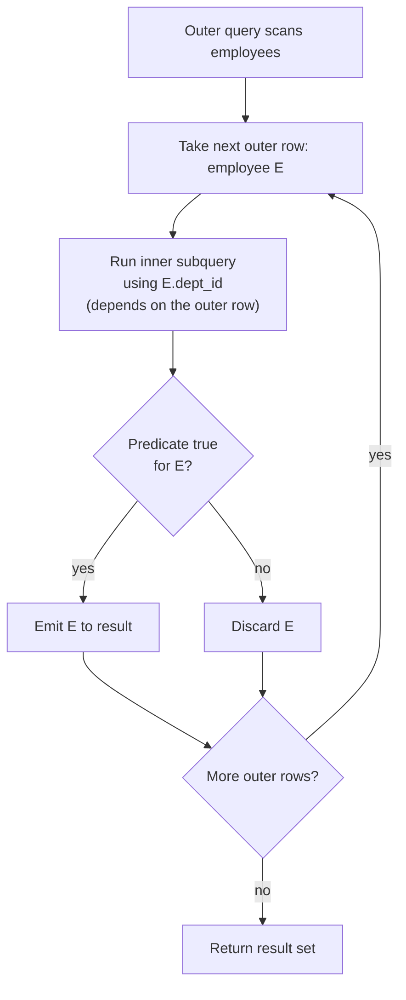

# 🪆 Subqueries

> [!abstract] TL;DR
> A **subquery** is a `SELECT` nested inside another statement. A **scalar** subquery returns one value; a subquery in `FROM` (a **derived table**) returns a virtual table; a subquery in `WHERE` filters rows. The pivotal distinction is **correlated** (references the outer row, so it re-runs *per outer row* — like a loop) vs **uncorrelated** (self-contained, runs once). `IN`/`NOT IN`, `EXISTS`/`NOT EXISTS`, and `ANY`/`ALL` express membership and existence — but `NOT IN` has a notorious `NULL` trap, so prefer `NOT EXISTS`. Modern optimizers frequently **rewrite** subqueries into joins, so the "correlated = slow" folklore is often no longer true.

## 🧠 Intuition — analogy FIRST

You're at a library looking for books.

- **Uncorrelated subquery** = you first go to the front desk, ask "what are the ISBNs of all award-winning books?", write the list on a card *once*, then walk the shelves checking each book against your fixed card. The desk trip happens a single time.
- **Correlated subquery** = for *every single book* you pick up, you walk back to the desk and ask "is *this specific* book award-winning?" You make one desk trip **per book**. It's a nested loop.
- **Scalar subquery** = you ask the desk one question with exactly one answer: "how many books are in the library?" — a single number you can slot into a sentence.
- **`EXISTS`** = you don't need the whole list; you just need a yes/no: "does *any* award exist for this author?" The clerk stops searching the instant they find one.

The correlated-vs-uncorrelated distinction is the whole ballgame for reasoning about cost — though see Performance Notes: the optimizer often un-loops the loop for you.

## ⚙️ How It Works + mermaid

A **correlated** subquery conceptually executes row-by-row against the outer query:



An **uncorrelated** subquery, by contrast, runs **once**, its result is cached, and the outer query reuses it for every row.

## 💻 SQL Examples

### Scalar subquery (returns exactly one value)

```sql
-- In SELECT: attach the company-wide average salary to every row
SELECT first_name, salary,
       salary - (SELECT AVG(salary) FROM employees) AS diff_from_avg
FROM   employees;
```

```sql
-- In WHERE: employees earning above the overall average
SELECT first_name, salary
FROM   employees
WHERE  salary > (SELECT AVG(salary) FROM employees);   -- uncorrelated, runs once
```

> [!warning] A scalar subquery must return **at most one row**. If `(SELECT salary FROM employees WHERE dept_id = 3)` returns multiple rows, both [[PostgreSQL]] and [[MySQL]] raise a runtime error ("more than one row returned by a subquery used as an expression").

### Subquery in FROM (derived table)

```sql
-- Compute per-department averages in a derived table, then filter/join on it.
-- The derived table MUST be aliased (here: dept_avg).
SELECT d.dept_name, dept_avg.avg_salary
FROM   departments d
JOIN   (SELECT dept_id, AVG(salary) AS avg_salary
        FROM   employees
        GROUP BY dept_id) AS dept_avg
  ON   d.dept_id = dept_avg.dept_id
WHERE  dept_avg.avg_salary > 65000;
```

> [!tip] A derived table is frequently more readable as a CTE (`WITH`). See [[CTEs]] for the trade-offs.

### Subquery in WHERE with IN (uncorrelated)

```sql
-- Employees who work in a department located in 'NYC'
SELECT first_name
FROM   employees
WHERE  dept_id IN (SELECT dept_id FROM departments WHERE location = 'NYC');
```

### Correlated subquery

```sql
-- Employees earning more than the average IN THEIR OWN department.
-- The inner query references e2.dept_id from the OUTER row => correlated.
SELECT e1.first_name, e1.salary
FROM   employees e1
WHERE  e1.salary > (SELECT AVG(e2.salary)
                    FROM   employees e2
                    WHERE  e2.dept_id = e1.dept_id);   -- correlation link
```

### EXISTS / NOT EXISTS

```sql
-- EXISTS: customers with at least one order (semi-join). Stops at first match.
SELECT c.name
FROM   customers c
WHERE  EXISTS (SELECT 1 FROM orders o WHERE o.customer_id = c.customer_id);

-- NOT EXISTS: customers with zero orders (anti-join). NULL-safe.
SELECT c.name
FROM   customers c
WHERE  NOT EXISTS (SELECT 1 FROM orders o WHERE o.customer_id = c.customer_id);
```

### The NOT IN / NULL trap ⚠️

```sql
-- DANGER: if ANY value returned by the subquery is NULL, NOT IN yields NO rows.
-- Suppose some orders row has customer_id = NULL:
SELECT c.name
FROM   customers c
WHERE  c.customer_id NOT IN (SELECT customer_id FROM orders);   -- may return 0 rows!
```

Why: `x NOT IN (a, b, NULL)` becomes `x<>a AND x<>b AND x<>NULL`. The last term is `UNKNOWN`, so the whole `AND` can never be `TRUE`. The fix — always `NULL`-safe:

```sql
SELECT c.name
FROM   customers c
WHERE  NOT EXISTS (SELECT 1 FROM orders o WHERE o.customer_id = c.customer_id);
```

> This same trap appears in [[Joins]] and [[SQL_Fundamentals]]. Rule of thumb: **never use `NOT IN` against a subquery on a nullable column** — reach for `NOT EXISTS`.

### ANY / ALL

```sql
-- = ANY (...) is equivalent to IN (...)
SELECT first_name FROM employees
WHERE  dept_id = ANY (SELECT dept_id FROM departments WHERE location = 'NYC');

-- > ALL (...): greater than EVERY value returned (i.e., greater than the max)
SELECT first_name, salary FROM employees
WHERE  salary > ALL (SELECT salary FROM employees WHERE dept_id = 3);

-- > ANY (...): greater than at least ONE value (i.e., greater than the min)
SELECT first_name, salary FROM employees
WHERE  salary > ANY (SELECT salary FROM employees WHERE dept_id = 3);
```

> [!tip] `> ALL (empty set)` is `TRUE`; `> ANY (empty set)` is `FALSE`. `ANY`/`ALL` also carry `NULL` subtleties similar to `IN`/`NOT IN`. Both PostgreSQL and MySQL support `ANY`/`ALL` identically.

### Rewriting a correlated subquery as a join

```sql
-- "Customers with orders" written three ways — often the SAME plan after rewrite:
-- 1) correlated EXISTS
SELECT c.name FROM customers c
WHERE EXISTS (SELECT 1 FROM orders o WHERE o.customer_id = c.customer_id);

-- 2) IN
SELECT c.name FROM customers c
WHERE c.customer_id IN (SELECT customer_id FROM orders);

-- 3) explicit semi-join via DISTINCT join
SELECT DISTINCT c.name FROM customers c
JOIN orders o ON o.customer_id = c.customer_id;
```

## 🚀 Performance Notes

- **"Correlated = slow" is often a myth today.** PostgreSQL and MySQL 8+ optimizers routinely **de-correlate** subqueries and **flatten** `IN`/`EXISTS` into semi-joins and derived tables into plain joins. Always check the actual plan with [[Execution_Plans]] before hand-rewriting. See [[Query_Optimizer]].
- **`EXISTS` short-circuits.** It can stop at the first matching row, so for an existence test it's usually at least as good as `IN` and beats fetching a full list. Index the inner correlation column (`orders.customer_id`) so each probe is an index seek — see [[Database_Indexes]].
- **Scalar subqueries in `SELECT` can be per-row killers** *if* they don't get de-correlated — a scalar subquery evaluated once per output row is a hidden nested loop. A `JOIN` to a pre-aggregated derived table is often clearer and faster.
- **`NOT IN` on nullable columns is both a correctness bug and a performance one** — engines struggle to optimize it and can't use anti-join efficiently. `NOT EXISTS` gives the optimizer a clean anti-join. A core [[SQL_Tuning]] pattern.
- **Derived tables may or may not be materialized.** MySQL historically materialized derived tables into temp tables (slow); MySQL 8 can merge them into the outer query. PostgreSQL merges subqueries where semantically safe. This mirrors CTE materialization behavior — see [[CTEs]].

## ⚠️ Common Pitfalls

- **`NOT IN` + a `NULL` in the subquery = zero rows.** The single biggest subquery gotcha. Use `NOT EXISTS`.
- **Scalar subquery returning >1 row.** Runtime error. Guard with `LIMIT 1` (plus a deterministic `ORDER BY`) or an aggregate like `MAX`.
- **Forgetting to alias a derived table.** `FROM (SELECT …)` without an alias is a syntax error in both engines.
- **Assuming correlation is always slow (or always fast).** Don't guess — read the plan. Optimizer rewrites can make `EXISTS`, `IN`, and joins identical *or* wildly different depending on stats and indexes.
- **`ANY`/`ALL` with `NULL`s.** `salary > ALL (subquery containing NULL)` can evaluate to `UNKNOWN`, dropping rows unexpectedly — same three-valued-logic root cause as `NOT IN`.
- **Correlated subquery referencing the wrong alias.** In a self-correlated query, mixing up `e1` and `e2` produces a silently wrong result rather than an error.

## 🔗 Related Concepts

- [[_MOC_DB_SQL|↑ Section MOC]]
- [[SQL_Fundamentals]] — `NULL` and three-valued logic underpinning the `NOT IN` trap
- [[Joins]] — semi-joins/anti-joins that subqueries often compile into
- [[Aggregation_and_Grouping]] — aggregates used inside scalar/correlated subqueries
- [[CTEs]] — the more readable alternative to derived tables
- [[Set_Operations]] — another way to combine result sets
- [[Query_Optimizer]] — subquery flattening and de-correlation
- [[Execution_Plans]] — confirming whether a subquery became a join
- [[Database_Indexes]] — indexing correlation columns for fast probes
- [[SQL_Tuning]] — `NOT IN` → `NOT EXISTS` and scalar-subquery → join rewrites

## ❓ Review Questions

1. Explain, using three-valued logic, why `WHERE id NOT IN (SELECT fk FROM t)` can return zero rows when `t.fk` contains a `NULL`. Rewrite it safely.
2. What distinguishes a correlated subquery from an uncorrelated one, and why does the distinction matter for reasoning about cost? Does the optimizer always honor that distinction?
3. Write a query that returns each employee who earns more than the average salary *of their own department*, using a correlated subquery. Then describe how you'd verify whether the engine actually executes it row-by-row.

## 📚 Sources

- PostgreSQL Documentation — *Subquery Expressions* (`IN`, `EXISTS`, `ANY`/`ALL`), *Scalar Subqueries*
- MySQL 8.0 Reference Manual — *Subqueries*, *Derived Tables*, *Optimizing Subqueries*
- ISO/IEC 9075 (SQL:2016) — subquery predicates and quantified comparisons
- Markus Winand / *SQL Performance Explained* — `EXISTS` vs `IN`, de-correlation

#SQL #Database #Subqueries #Correlated #EXISTS #NotIn #ScalarSubquery
