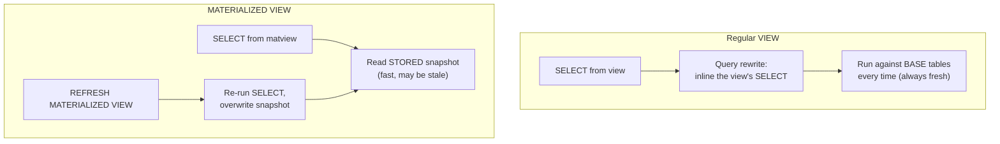

# 👓 Views and Materialized Views

> [!abstract] TL;DR
> A **view** is a *saved query* that behaves like a virtual table — it stores **no data**, it re-runs its underlying `SELECT` every time you query it, so it's always fresh but pays the query cost each read. A **materialized view** stores the *result set* physically like a cached snapshot — blazing fast to read but **stale** until you `REFRESH` it. [[PostgreSQL]] has native materialized views; **[[MySQL]] has none** and you emulate them with a real table kept up to date by triggers or scheduled events. Choose views for abstraction/security and freshness; choose materialized views for expensive aggregations you read far more often than the data changes.

## Intuition — analogy FIRST

A **regular view** is like a **saved search** in your email client — "all unread from my manager." Every time you open it, the client re-runs the search against your live mailbox, so it's always current, but it does the work each time.

A **materialized view** is like a **printed monthly report**. Someone ran the expensive query once, printed it, and pinned it to the wall. Reading it is instant — you just glance at the paper. But it only reflects the world *as of when it was printed*; if data changed this morning, the paper is stale until someone reprints it (`REFRESH`).

The whole trade is right there: **views trade read speed for freshness; materialized views trade freshness for read speed.**

---

## How It Works



- A **view** is pure metadata: a name plus a stored parse tree. At query time the planner performs **query rewrite**, substituting the view definition inline, then optimizes the combined query. There is no separate storage and no staleness.
- A **materialized view** has both a definition *and* a physical heap holding the last computed rows. Reads hit the heap directly (and can be indexed!). Data only updates when you `REFRESH`.

---

## SQL Examples

### Regular view

```sql
CREATE VIEW active_customers AS
SELECT id, email, full_name
FROM   customers
WHERE  status = 'active';

SELECT * FROM active_customers WHERE email LIKE '%@acme.com';
-- Rewritten to: SELECT ... FROM customers WHERE status='active' AND email LIKE ...
```

Replace a view definition in place (Postgres — columns must be a superset):

```sql
CREATE OR REPLACE VIEW active_customers AS
SELECT id, email, full_name, created_at
FROM   customers
WHERE  status = 'active';
```

### Updatable views and WITH CHECK OPTION

A simple view (single table, no aggregation/DISTINCT/GROUP BY) is **updatable** — you can `INSERT`/`UPDATE`/`DELETE` through it. `WITH CHECK OPTION` stops you from writing rows that would fall *outside* the view's filter:

```sql
CREATE VIEW active_customers AS
SELECT id, email, full_name, status
FROM   customers
WHERE  status = 'active'
WITH CHECK OPTION;

-- Rejected: would create a row not visible through the view
UPDATE active_customers SET status = 'closed' WHERE id = 1;   -- ERROR: check option violated
```

Both PostgreSQL and MySQL support `WITH CHECK OPTION` (MySQL adds `LOCAL` vs `CASCADED` scope). For complex/non-updatable views, PostgreSQL uses `INSTEAD OF` triggers (see [[Stored_Procedures_and_Triggers]]) to make writes work.

### Materialized view (PostgreSQL)

```sql
CREATE MATERIALIZED VIEW monthly_revenue AS
SELECT date_trunc('month', created_at) AS month,
       region,
       SUM(amount) AS revenue
FROM   sales
GROUP BY 1, 2
WITH DATA;                                  -- WITH NO DATA creates it empty/unpopulated

-- You can index a materialized view (you cannot index a regular view)
CREATE INDEX idx_mv_month ON monthly_revenue (month);

-- Refresh: locks the matview (readers blocked) while it rebuilds
REFRESH MATERIALIZED VIEW monthly_revenue;

-- CONCURRENTLY: readers keep querying during refresh (requires a UNIQUE index)
CREATE UNIQUE INDEX uq_mv ON monthly_revenue (month, region);
REFRESH MATERIALIZED VIEW CONCURRENTLY monthly_revenue;
```

`REFRESH ... CONCURRENTLY` computes the new result and applies the *diff* while allowing concurrent reads — but it is slower overall and mandates a unique index.

### MySQL has no materialized views — emulate

MySQL provides no native materialized view. Emulate with a real table plus a refresh mechanism:

```sql
-- 1. The snapshot table
CREATE TABLE monthly_revenue (
    month   DATE,
    region  VARCHAR(50),
    revenue DECIMAL(14,2),
    PRIMARY KEY (month, region)
);

-- 2a. Full periodic rebuild via a scheduled EVENT
CREATE EVENT ev_refresh_monthly_revenue
ON SCHEDULE EVERY 1 HOUR
DO
    REPLACE INTO monthly_revenue (month, region, revenue)
    SELECT DATE_FORMAT(created_at, '%Y-%m-01'), region, SUM(amount)
    FROM   sales
    GROUP BY 1, 2;
```

```sql
-- 2b. Incremental maintenance via triggers on the base table
CREATE TRIGGER trg_sales_ai AFTER INSERT ON sales
FOR EACH ROW
    INSERT INTO monthly_revenue (month, region, revenue)
    VALUES (DATE_FORMAT(NEW.created_at,'%Y-%m-01'), NEW.region, NEW.amount)
    ON DUPLICATE KEY UPDATE revenue = revenue + NEW.amount;
```

Trigger-based maintenance is always fresh but slows every write and is easy to get wrong (deletes/updates need matching triggers); event-based rebuild is simpler but periodically stale.

### Use cases

```sql
-- Abstraction: hide a gnarly 5-table join behind a clean name
CREATE VIEW order_summary AS
SELECT o.id, c.full_name, p.name AS product, o.amount
FROM orders o
JOIN customers c ON c.id = o.customer_id
JOIN products  p ON p.id = o.product_id;

-- Security: expose only non-sensitive columns; grant on the view, not the base table
CREATE VIEW customer_public AS
SELECT id, full_name FROM customers;   -- email, status hidden
GRANT SELECT ON customer_public TO reporting_role;

-- Denormalized read model: materialize an expensive rollup for a dashboard (see Denormalization)
```

---

## Performance Notes

- A regular view is **exactly as fast as the query it wraps** — no faster, no slower. It does not cache anything. Nesting views many layers deep can produce monstrous rewritten queries the planner struggles with; keep nesting shallow and verify with [[Execution_Plans]].
- A materialized view turns an expensive aggregation into a single indexed table scan — ideal when **read frequency >> data change frequency** (dashboards, reporting, denormalized read models — see [[Denormalization]]).
- **Index your materialized view** on its common filter/join columns; this is a major advantage over regular views, which cannot be indexed directly.
- `REFRESH MATERIALIZED VIEW` (non-concurrent) takes an `ACCESS EXCLUSIVE` lock — readers are blocked for the whole rebuild. Use `CONCURRENTLY` for 24/7 read availability at the cost of a slower refresh and a required unique index.
- Refresh cost scales with the full query; for very large data, incremental/trigger-based maintenance (or tools like `pg_ivm`) beats full refresh. See [[SQL_Tuning]] and [[Query_Optimizer]].

## Common Pitfalls

1. **Expecting a regular view to be faster.** It caches nothing; a slow underlying query is slow through the view too. If you needed speed, you wanted a materialized view.
2. **Reading a stale materialized view and assuming it's live.** There is no auto-refresh — you must schedule `REFRESH` (cron, `pg_cron`, or an event). Forgotten refreshes silently serve old numbers.
3. **`REFRESH ... CONCURRENTLY` without a unique index.** It errors out. And it is slower than a plain refresh, so only use it when read availability truly matters.
4. **Trying to `INSERT`/`UPDATE` through a complex view.** Views with joins, `GROUP BY`, `DISTINCT`, or aggregates are read-only; writes need `INSTEAD OF` triggers.
5. **Assuming MySQL has materialized views.** It doesn't. Emulating with triggers adds write overhead and correctness traps (you must handle `UPDATE`/`DELETE`, not just `INSERT`).
6. **Granting on base tables instead of the view.** The security benefit only holds if users can `SELECT` the view but *not* the underlying table.

## Related Concepts

- [[_MOC_DB_SQL|↑ Section MOC]]
- [[Denormalization]] — materialized views are a denormalized read model
- [[Stored_Procedures_and_Triggers]] — `INSTEAD OF` triggers for updatable complex views; triggers to emulate MySQL matviews
- [[Database_Indexes]] — you can index a materialized view but not a regular view
- [[Query_Optimizer]] — how view definitions are rewritten and inlined
- [[Execution_Plans]] — verifying whether a matview scan or a base rewrite is used
- [[SQL_Tuning]] — deciding when materialization pays off

## Review Questions

1. A dashboard runs the same 8-table aggregation every 5 seconds, but the underlying data only changes hourly. Would you use a view or a materialized view, and how would you keep it current in PostgreSQL vs MySQL?
2. Explain the difference between `REFRESH MATERIALIZED VIEW` and `REFRESH MATERIALIZED VIEW CONCURRENTLY`, including what the latter requires and why it exists.
3. What does `WITH CHECK OPTION` protect against on an updatable view? Give an `UPDATE` that it would reject.

## Sources

- PostgreSQL Documentation — CREATE VIEW: https://www.postgresql.org/docs/current/sql-createview.html
- PostgreSQL Documentation — Materialized Views: https://www.postgresql.org/docs/current/rules-materializedviews.html
- MySQL 8.0 Reference Manual — CREATE VIEW: https://dev.mysql.com/doc/refman/8.0/en/create-view.html
- MySQL 8.0 Reference Manual — Using the Event Scheduler: https://dev.mysql.com/doc/refman/8.0/en/event-scheduler.html

#Database #SQL #Views #MaterializedViews #Denormalization #ReadModel #PostgreSQL #MySQL
