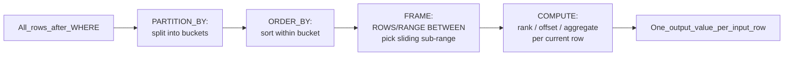

# 🪟 Window Functions

> [!abstract] TL;DR
> A **window function** computes a value across a set of rows *related to the current row* (its "window") **without collapsing them into one group** the way `GROUP BY` does. You keep every detail row *and* get aggregate/ranking context alongside it. The whole feature lives in one clause: `OVER(PARTITION BY ... ORDER BY ... frame)`. Rankings (`ROW_NUMBER`, `RANK`, `DENSE_RANK`, `NTILE`), offsets (`LAG`, `LEAD`, `FIRST_VALUE`, `LAST_VALUE`), and windowed aggregates (running totals, moving averages) are all the same mechanism with a different function on the front.

## Intuition — analogy FIRST

Imagine a **leaderboard at a running race**. `GROUP BY` is the summary board that shows only *"Men's 10K: 340 runners, average time 52 min"* — the individuals disappear into one row. A **window function** is each runner's personal result card: it still shows *your* name and *your* time (the detail row survives), but printed right next to it is *"you finished 12th out of 340"* and *"you were 4 seconds behind the person ahead of you."*

That context — your rank, the gap to the runner ahead, the running cumulative count — is computed by looking at a **window of other rows** (everyone in your race, ordered by time) while never throwing your own row away. That is the entire idea: **aggregate-style context, detail-level rows.**

---

## How It Works

A window function is evaluated logically **after** `WHERE`, `GROUP BY`, and `HAVING`, but **before** `ORDER BY` and `LIMIT`. Its `OVER()` clause has three independent parts, applied in order:

1. **`PARTITION BY`** — splits rows into independent buckets (like a per-race grouping). Restarts calculation for each partition. Omit it → the whole result set is one partition.
2. **`ORDER BY`** (inside `OVER`) — defines row ordering *within* each partition. Required for ranking and offset functions; it also implicitly turns on a running frame for aggregates.
3. **Frame clause** (`ROWS`/`RANGE`/`GROUPS BETWEEN`) — narrows the window to a sliding sub-range of the ordered partition (e.g. "the 3 rows before me through the current row").



### The frame clause (the part people forget)

The frame only applies to aggregate and `FIRST_VALUE`/`LAST_VALUE`/`NTH_VALUE` functions. Two frame units:

- **`ROWS`** — physical row offsets. `ROWS BETWEEN 2 PRECEDING AND CURRENT ROW` = exactly 3 physical rows.
- **`RANGE`** — logical value offsets based on the `ORDER BY` value. Rows with the *same* order-by value (peers) are treated as one unit.

Default frame when you specify `ORDER BY` but no explicit frame: `RANGE BETWEEN UNBOUNDED PRECEDING AND CURRENT ROW`. This peer-grouping default is the #1 source of "my running total looks wrong" bugs — see Pitfalls.

---

## SQL Examples

Setup used throughout:

```sql
CREATE TABLE sales (
    id          SERIAL PRIMARY KEY,
    region      TEXT,
    salesperson TEXT,
    sale_date   DATE,
    amount      NUMERIC
);
```

### Ranking functions

```sql
SELECT
    region,
    salesperson,
    amount,
    ROW_NUMBER() OVER (PARTITION BY region ORDER BY amount DESC) AS row_num,
    RANK()       OVER (PARTITION BY region ORDER BY amount DESC) AS rnk,
    DENSE_RANK() OVER (PARTITION BY region ORDER BY amount DESC) AS dense_rnk,
    NTILE(4)     OVER (PARTITION BY region ORDER BY amount DESC) AS quartile
FROM sales;
```

Difference between the three ranking functions when ties exist (amounts 100, 100, 90):

| amount | ROW_NUMBER | RANK | DENSE_RANK |
|-------:|:----------:|:----:|:----------:|
| 100    | 1          | 1    | 1          |
| 100    | 2          | 1    | 1          |
| 90     | 3          | 3    | 2          |

- `ROW_NUMBER` — always unique, ties broken arbitrarily (or by extra `ORDER BY` keys).
- `RANK` — ties share a rank, then **skips** (…1, 1, 3).
- `DENSE_RANK` — ties share a rank, **no gaps** (…1, 1, 2).
- `NTILE(n)` — distributes rows into `n` roughly equal buckets.

### Offset / navigation functions

```sql
SELECT
    sale_date,
    amount,
    LAG(amount)  OVER (ORDER BY sale_date)              AS prev_day,
    LEAD(amount) OVER (ORDER BY sale_date)              AS next_day,
    amount - LAG(amount, 1, 0) OVER (ORDER BY sale_date) AS day_over_day_delta,
    FIRST_VALUE(amount) OVER (ORDER BY sale_date)        AS first_ever,
    LAST_VALUE(amount)  OVER (ORDER BY sale_date
        ROWS BETWEEN UNBOUNDED PRECEDING
                 AND UNBOUNDED FOLLOWING)                AS last_ever
FROM sales;
```

`LAG(col, offset, default)` — the 3rd argument is the fallback for the first row where no previous row exists.

### Windowed aggregates — running total & moving average

```sql
-- Running (cumulative) total
SELECT
    sale_date,
    amount,
    SUM(amount) OVER (
        ORDER BY sale_date
        ROWS BETWEEN UNBOUNDED PRECEDING AND CURRENT ROW
    ) AS running_total,
    -- 7-row moving average (current row + 6 preceding)
    AVG(amount) OVER (
        ORDER BY sale_date
        ROWS BETWEEN 6 PRECEDING AND CURRENT ROW
    ) AS moving_avg_7
FROM sales;
```

### Top-N-per-group pattern (the killer use case)

Get the top 2 salespeople **per region** — impossible cleanly with plain `GROUP BY`:

```sql
SELECT region, salesperson, amount
FROM (
    SELECT
        region, salesperson, amount,
        ROW_NUMBER() OVER (PARTITION BY region ORDER BY amount DESC) AS rn
    FROM sales
) ranked
WHERE rn <= 2;
```

You cannot filter on a window function in the same `WHERE` (it is computed too late), so you wrap it in a subquery/CTE and filter on the derived column.

### Reusable window with the `WINDOW` clause

Both Postgres and MySQL 8+ support naming a window to avoid repetition:

```sql
SELECT
    salesperson,
    RANK()       OVER w AS rnk,
    SUM(amount)  OVER w AS region_total
FROM sales
WINDOW w AS (PARTITION BY region ORDER BY amount DESC);
```

### PostgreSQL vs MySQL differences

| Feature | [[PostgreSQL]] | [[MySQL]] |
|---|---|---|
| Window functions available since | 8.4 (2009) | **8.0 only** (2018) — MySQL 5.7 and MariaDB <10.2 have none |
| `GROUPS` frame unit | ✅ Supported | ❌ Not supported |
| `RANGE` with `INTERVAL` (e.g. `RANGE BETWEEN INTERVAL '7 days' PRECEDING`) | ✅ Yes | ❌ Numeric offsets only |
| `FILTER (WHERE ...)` on window aggregates | ✅ `SUM(x) FILTER (WHERE ...) OVER (...)` | ❌ Use `CASE` inside the aggregate |
| Ordered-set aggregates (`percentile_cont`) as window | ✅ | ❌ |

MySQL 8 emulation of a filtered windowed sum: `SUM(CASE WHEN cond THEN amount ELSE 0 END) OVER (...)`.

---

## Performance Notes

- **Window functions require a sort.** Each distinct `PARTITION BY`/`ORDER BY` combination generally triggers a sort (or a `WindowAgg` over an already-sorted input). An index matching the partition+order columns, e.g. `(region, amount DESC)`, lets the planner skip the sort — check with [[Execution_Plans]] / `EXPLAIN ANALYZE`.
- Multiple window functions that **share the same `OVER()` clause** are computed in a single pass — reuse the `WINDOW` clause so the optimizer recognizes them as identical.
- `ROWS` frames are cheaper than `RANGE` frames because `RANGE` must scan for value-peers at each step; prefer `ROWS` unless you specifically need peer semantics.
- For top-N-per-group on huge tables, a `LATERAL` join with a small `LIMIT` per group (see [[Advanced_SQL_and_JSON]]) can beat `ROW_NUMBER()` because it stops early instead of ranking every row.
- Window functions do **not** reduce rows, so they run after filtering — push as much work as possible into `WHERE` before the window sees the data. See [[SQL_Tuning]] and [[Query_Optimizer]].

---

## Common Pitfalls

1. **`LAST_VALUE` returns the current row, not the last row.** Because the default frame ends at `CURRENT ROW`, `LAST_VALUE(x) OVER (ORDER BY d)` gives you `x` of the current row. Fix: add `ROWS BETWEEN UNBOUNDED PRECEDING AND UNBOUNDED FOLLOWING`.
2. **Running total off by "peers".** With `ORDER BY sale_date` and no explicit frame, the default `RANGE` frame lumps all rows sharing a date into one cumulative step, inflating each. Use `ROWS BETWEEN UNBOUNDED PRECEDING AND CURRENT ROW` for a true row-by-row running total.
3. **Filtering on a window result in `WHERE`.** `WHERE ROW_NUMBER() OVER (...) = 1` is a syntax error — window functions are evaluated after `WHERE`. Wrap in a subquery/CTE and filter outside.
4. **Assuming MySQL 5.7 supports this.** It does not. Neither does MariaDB before 10.2. Legacy environments must emulate with self-joins or session variables.
5. **`ROW_NUMBER` without a deterministic `ORDER BY`.** Ties are broken non-deterministically, so pagination or dedup can shuffle between runs. Always include a tiebreaker column (e.g. primary key).
6. **Mixing `DISTINCT` and window functions.** `DISTINCT` runs after window evaluation, so it dedups on the already-computed window values — rarely what you intend.

---

## Related Concepts

- [[_MOC_DB_SQL|↑ Section MOC]]
- [[Advanced_SQL_and_JSON]] — `LATERAL` joins as an alternative top-N-per-group strategy
- [[SQL_Tuning]] — eliminating the sort behind a window function
- [[Query_Optimizer]] — how `WindowAgg` nodes are planned
- [[Execution_Plans]] — reading the `WindowAgg`/`Sort` operators in `EXPLAIN`
- [[Database_Indexes]] — indexes that let windows skip the sort
- [[DDL_and_DML]] — building the tables these queries run against

## Review Questions

1. You need each employee's salary *and* their rank within their department, keeping all detail rows. Which construct do you use and why can't `GROUP BY` do it directly?
2. Explain why `LAST_VALUE(x) OVER (ORDER BY d)` usually returns the "wrong" value, and give the exact frame clause that fixes it.
3. Contrast `RANK`, `DENSE_RANK`, and `ROW_NUMBER` on the tied series `[95, 95, 90]`. What does each output, and which one guarantees uniqueness?

## Sources

- PostgreSQL Documentation — Window Functions: https://www.postgresql.org/docs/current/tutorial-window.html
- PostgreSQL Documentation — Window Function Calls (frames): https://www.postgresql.org/docs/current/sql-expressions.html#SYNTAX-WINDOW-FUNCTIONS
- MySQL 8.0 Reference Manual — Window Functions: https://dev.mysql.com/doc/refman/8.0/en/window-functions.html
- Use The Index, Luke — Window Functions & Pagination: https://use-the-index-luke.com/sql/partial-results/window-functions

#Database #SQL #WindowFunctions #Analytics #Ranking #RunningTotal #PostgreSQL #MySQL
