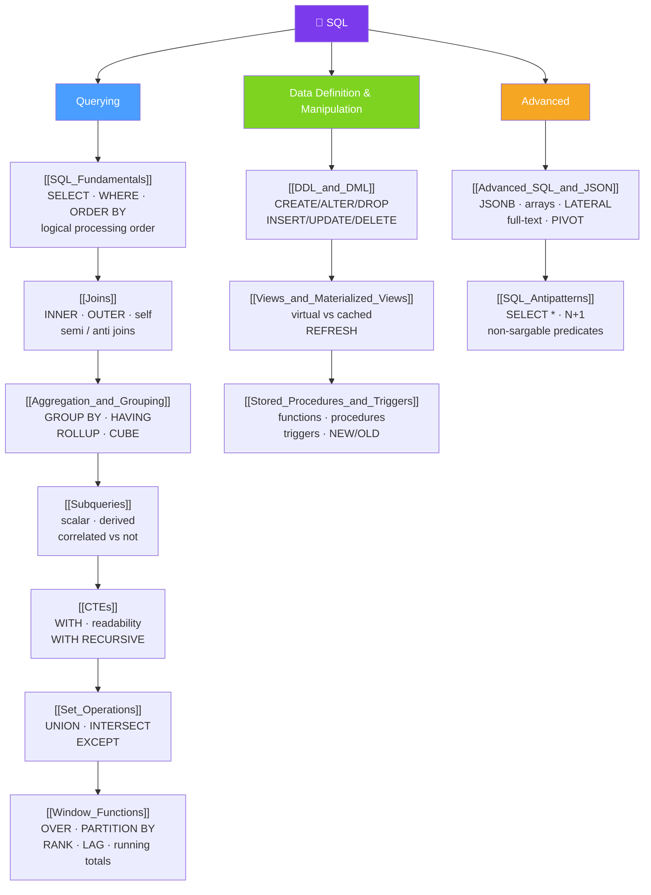

# 🗺️ SQL — Map of Content

> [!abstract] What This Section Covers
> SQL is the declarative language you use to talk to a relational database, and this section takes you from a first `SELECT` to production-grade queries. The **querying** track builds the reading skill in order — fundamentals and logical processing order, then joins to combine tables, aggregation to summarize, subqueries and CTEs to compose, set operations to stack results vertically, and window functions to get aggregate context without collapsing rows. The **data definition & manipulation** track covers the statements that change the database itself — DDL/DML/DCL/TCL families, views and materialized views for abstraction and caching, and stored procedures/functions/triggers for logic that lives next to the data. The **advanced** track pushes into semi-structured `JSON`/arrays/full-text/`LATERAL` territory and closes with a field guide to the antipatterns that quietly wreck query performance. Throughout, PostgreSQL-vs-MySQL differences are called out where they bite.

## Concept Map

## Learning Path
1. [[SQL_Fundamentals]] — The `SELECT` workhorse, the logical processing order (FROM → WHERE → … → ORDER BY → LIMIT), filtering, paging, and NULL logic.
2. [[Joins]] — INNER/LEFT/RIGHT/FULL/CROSS, self-joins, and semi/anti-joins (EXISTS / NOT EXISTS).
3. [[Aggregation_and_Grouping]] — Aggregate functions, GROUP BY vs WHERE vs HAVING, and GROUPING SETS/ROLLUP/CUBE.
4. [[Subqueries]] — Scalar, derived-table, and correlated vs uncorrelated subqueries; IN/EXISTS/ANY/ALL and the NOT IN NULL trap.
5. [[CTEs]] — Naming steps with `WITH` for readability and `WITH RECURSIVE` for hierarchy and graph traversal.
6. [[Set_Operations]] — UNION / UNION ALL / INTERSECT / EXCEPT and union-compatibility rules.
7. [[Window_Functions]] — `OVER(PARTITION BY … ORDER BY … frame)`: rankings, offsets (LAG/LEAD), and running/moving aggregates.
8. [[DDL_and_DML]] — DDL vs DML vs DCL vs TCL, and the transactional-DDL difference between PostgreSQL and MySQL.
9. [[Views_and_Materialized_Views]] — Virtual views for abstraction/security vs materialized views as refreshable caches.
10. [[Stored_Procedures_and_Triggers]] — Functions vs procedures, triggers with NEW/OLD row images, and the hidden-logic danger.
11. [[Advanced_SQL_and_JSON]] — JSONB/arrays/full-text, LATERAL joins, PIVOT/UNPIVOT, and generate_series.
12. [[SQL_Antipatterns]] — The repeatable mistakes that defeat indexes and multiply round trips, with symptom → cause → fix.

## All Notes at a Glance
| Note | Difficulty | What You'll Learn |
|------|------------|-------------------|
| [[SQL_Fundamentals]] | Beginner | Logical processing order, WHERE/ORDER BY/LIMIT/DISTINCT, LIKE/IN/BETWEEN, and three-valued NULL logic |
| [[Joins]] | Intermediate | INNER/OUTER/CROSS/self joins, semi-joins and anti-joins, and emulating FULL OUTER JOIN in MySQL |
| [[Aggregation_and_Grouping]] | Intermediate | Aggregate functions, GROUP BY/HAVING vs WHERE, FILTER vs SUM(CASE), and COUNT(*) vs COUNT(col) vs COUNT(DISTINCT) |
| [[Subqueries]] | Intermediate | Scalar/derived/filter subqueries, correlated vs uncorrelated, EXISTS over NOT IN, and optimizer rewrites to joins |
| [[CTEs]] | Intermediate | `WITH` for readable top-to-bottom queries and `WITH RECURSIVE` for org charts, BOMs, and graph walks |
| [[Set_Operations]] | Beginner | UNION vs UNION ALL, INTERSECT, EXCEPT/MINUS, union-compatibility, and ORDER BY on the combined result |
| [[Window_Functions]] | Advanced | The OVER clause, ROW_NUMBER/RANK/DENSE_RANK/NTILE, LAG/LEAD/FIRST_VALUE, and framed running/moving aggregates |
| [[DDL_and_DML]] | Beginner | CREATE/ALTER/DROP/TRUNCATE, INSERT/UPDATE/DELETE/MERGE, DCL and TCL, and transactional vs non-transactional DDL |
| [[Views_and_Materialized_Views]] | Intermediate | Views as saved queries vs materialized views as physical snapshots; REFRESH; MySQL's lack of native matviews |
| [[Stored_Procedures_and_Triggers]] | Intermediate | Functions vs procedures, PL/pgSQL, triggers and INSTEAD OF, NEW/OLD, and the maintainability trade-offs |
| [[Advanced_SQL_and_JSON]] | Advanced | JSONB operators and indexing, arrays, full-text search, LATERAL joins, and PIVOT/UNPIVOT across Postgres and MySQL |
| [[SQL_Antipatterns]] | Intermediate | SELECT *, N+1, non-sargable predicates, leading-wildcard LIKE, deep OFFSET, NOT IN with NULLs, over/under-indexing |

## Key Questions This Section Answers
- Why can't you reference a SELECT alias in the WHERE clause? (Hint: logical processing order.)
- When do you reach for a LEFT JOIN vs a semi-join (EXISTS) vs a subquery?
- What is the difference between WHERE and HAVING, and where does a window function fit?
- When should you use a CTE, and how does `WITH RECURSIVE` traverse a hierarchy?
- View vs materialized view — which do you choose for an expensive dashboard aggregation?
- When is putting logic in a trigger or stored procedure a good idea, and when is it a trap?
- How do you store and query JSON in a relational database without losing relational integrity?
- Which everyday SQL habits silently defeat your indexes, and how do you fix them?

## Related Sections
- [[_MOC_Database_Master|↑ Database Master MOC]]
- [[_MOC_DB_Data_Modeling|← Data Modeling]]
- [[_MOC_DB_Query_Processing|→ Query Processing]]

#MOC #Database #SQL
