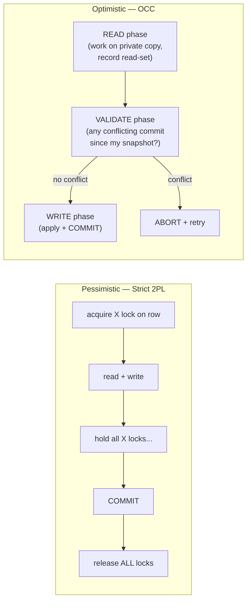

# 🔀 Concurrency Control

> [!abstract] TL;DR
> Concurrency control is *how* the engine makes overlapping transactions behave as if serial. Two philosophies: **pessimistic** (assume conflict — lock first, e.g. **Two-Phase Locking**) and **optimistic** (assume no conflict — run freely, **validate at commit**, retry on failure). Classic algorithms: **2PL** (growing/shrinking phases; strict 2PL holds write locks to commit), **timestamp ordering**, and **optimistic CC** (read → validate → write phases). Modern databases mostly use **MVCC-based snapshot isolation** so *readers don't block writers* (see [[MVCC_Internals]]). At the application layer, the everyday tool is **optimistic locking with a version column**.

## Intuition — analogy FIRST

Two ways to share a single office printer:

- **Pessimistic**: you walk over, put a **physical lock** on the printer, print your job, then unlock. Nobody else can touch it while you hold the lock. Zero collisions — but people queue and sometimes two people each hold a lock the other needs (deadlock).
- **Optimistic**: everyone just prints whenever. At the tray you check: "is this *my* output, untouched?" If someone's job interleaved with yours, you **throw it away and reprint**. No waiting — unless collisions are frequent, in which case you waste paper reprinting.

Pessimistic wins when conflicts are common (hot rows, inventory). Optimistic wins when conflicts are rare (user profile edits). MVCC is a third path: give every reader their own **timestamped photocopy** so reads never collide with writes at all.

---

## How It Works

### The two philosophies

| | Pessimistic CC | Optimistic CC |
|---|---|---|
| Assumption | Conflicts are likely | Conflicts are rare |
| Mechanism | Acquire locks *before* access | Run unlocked; check for conflict at commit |
| Conflict detected | Up front (block/wait) | At validation/commit (abort + retry) |
| Failure mode | Deadlocks, lock waits | Aborts under contention (livelock risk) |
| Best for | Hot data, high contention | Low contention, read-mostly, long think-time |
| Examples | 2PL, `SELECT FOR UPDATE`, InnoDB Serializable | OCC, SSI, app-level version columns |

### Two-Phase Locking (2PL)

The canonical pessimistic algorithm that *guarantees serializability*. Every transaction has two phases:

1. **Growing phase** — acquire locks (shared `S` for reads, exclusive `X` for writes). **Never release** a lock here.
2. **Shrinking phase** — begin releasing locks. **Never acquire** a new lock here.

The rule "once you release any lock you may not acquire another" is what enforces serializability.



**Strict 2PL** (what real databases use): hold **all exclusive locks until COMMIT/ROLLBACK**. This additionally guarantees *recoverability* and *no cascading aborts* — a transaction never reads another's uncommitted write. **Rigorous 2PL** holds *all* locks (shared too) until commit. The cost of 2PL: locks are held longer → contention and **deadlocks** (see [[Deadlocks]]).

### Timestamp Ordering (TO)

An alternative that avoids locks by assigning each transaction a unique **timestamp** at start and ordering all operations by it. Each data item tracks the largest read-timestamp and write-timestamp that touched it. If a transaction tries an operation "out of timestamp order" (e.g. it would overwrite a value already read by a *newer* transaction), it is **aborted and restarted** with a new timestamp. Pure TO is rare in production RDBMSs but is the conceptual ancestor of MVCC (which uses transaction IDs / commit timestamps as versions) and of distributed engines like Spanner/CockroachDB that order by clock timestamps.

### Optimistic Concurrency Control (OCC)

Three phases per transaction:

1. **Read phase** — execute, reading committed data and buffering writes to a private workspace. Record the **read set**.
2. **Validation phase** — at commit, check whether any concurrently-committed transaction wrote to something in this transaction's read set (a backward/forward validation check).
3. **Write phase** — if validation passes, atomically apply the buffered writes; otherwise **abort and retry**.

PostgreSQL's **SSI** (Serializable Snapshot Isolation) is a modern, MVCC-flavored OCC: it tracks rw-antidependencies between snapshot transactions and aborts one if a dangerous cycle is possible (SQLSTATE `40001`).

### Snapshot Isolation as an alternative to locking

Instead of locking reads, give each transaction a consistent **snapshot** (via MVCC — see [[MVCC_Internals]]). Readers see a frozen view; writers create new versions. This achieves the killer property: **readers never block writers, writers never block readers.** Write-write conflicts *are* still resolved with row locks (first writer wins; second blocks or aborts). Snapshot isolation prevents dirty/non-repeatable reads and lost updates but — famously — **not write skew**, which is why true Serializable needs SSI or 2PL on top.

### Application-level optimistic locking (version column)

The most common optimistic pattern in application code — no DB feature required, works on any engine:

```
1. Read row including its `version` (or updated_at).
2. Compute new state in the app.
3. UPDATE ... SET ..., version = version + 1 WHERE id = ? AND version = <the value you read>;
4. If rows-affected = 0 -> someone else changed it -> reload & retry.
```

This turns a lost-update race into a detectable, retryable failure without holding any DB lock during "think time" — ideal for web request/response cycles and long user edits.

---

## SQL / Examples

```sql
-- ============ Pessimistic: lock-first (both engines) ============
-- PostgreSQL & MySQL both support SELECT ... FOR UPDATE
BEGIN;
SELECT stock FROM products WHERE id = 42 FOR UPDATE;  -- X-lock the row NOW
-- ... decide ...
UPDATE products SET stock = stock - 1 WHERE id = 42;
COMMIT;                                                -- lock released here (strict 2PL)
```

```sql
-- ============ Optimistic: application version column (portable) ============
-- Step 1 (read)
SELECT id, stock, version FROM products WHERE id = 42;   -- got stock=10, version=7

-- Step 3 (conditional write) — runs on PostgreSQL and MySQL identically
UPDATE products
   SET stock = 9, version = version + 1
 WHERE id = 42 AND version = 7;
-- If ROW_COUNT() / rowcount == 0  => conflict, reload and retry the whole operation.
```

```sql
-- ============ Optimistic at the engine level: PostgreSQL SSI ============
BEGIN ISOLATION LEVEL SERIALIZABLE;   -- SSI: optimistic, validates via dependency tracking
SELECT count(*) FROM oncall WHERE on_call;
UPDATE oncall SET on_call = false WHERE id = 'alice';
COMMIT;   -- may fail: ERROR 40001 could not serialize access due to read/write dependencies
          -- application MUST catch 40001 and retry the transaction
```

```sql
-- ============ MySQL/InnoDB: pessimistic Serializable (no app retry needed) ============
SET SESSION TRANSACTION ISOLATION LEVEL SERIALIZABLE;
START TRANSACTION;                    -- every plain SELECT now takes shared next-key locks
SELECT count(*) FROM oncall WHERE on_call;   -- blocks conflicting writers
UPDATE oncall SET on_call = false WHERE id = 'alice';
COMMIT;
```

---

## PostgreSQL vs MySQL

| Dimension | PostgreSQL | MySQL / InnoDB |
|---|---|---|
| Read concurrency | MVCC snapshots — reads never block | MVCC snapshots for plain reads |
| Serializable strategy | **Optimistic (SSI)** — validate, abort with 40001 | **Pessimistic** — shared next-key locks on reads |
| Explicit pessimistic lock | `FOR UPDATE`, `FOR SHARE`, `FOR NO KEY UPDATE` | `FOR UPDATE`, `FOR SHARE` (a.k.a. `LOCK IN SHARE MODE`) |
| `SKIP LOCKED` / `NOWAIT` | Yes (both) | Yes (8.0+, both) |
| Write-write conflict at RR+ | Second writer errors (`could not serialize`) → retry | Second writer blocks (may deadlock) |
| App-level version column | Fully supported | Fully supported |
| Underlying model | 2PL only where explicitly locked; otherwise SI/SSI | 2PL-style locking more pervasive at higher levels |

---

## Trade-offs

- **Pessimistic**: predictable, no wasted work, but locks held during think-time throttle concurrency and create deadlocks; the wrong tool for high-latency application logic between read and write.
- **Optimistic**: no locks during think-time, great for low contention and long user interactions — but under high contention it degrades badly (repeated aborts/retries = livelock, wasted CPU). Requires idempotent, retry-safe transactions.
- **Snapshot isolation / MVCC**: best of both for reads (never block) but leaves write skew unaddressed and generates version bloat (VACUUM/purge cost).
- **2PL correctness vs throughput**: guarantees serializability but at the cost of the longest lock-hold times and highest deadlock rate; strict 2PL is the practical baseline.

---

## Common Pitfalls

1. **Optimistic locking without a retry loop** — a `version`-mismatch `UPDATE` affecting 0 rows is silently ignored; you must check `rowcount` and retry or you get lost updates *disguised as success*.
2. **Holding pessimistic locks across a network/UI round-trip** — `SELECT FOR UPDATE`, then wait for user input, then `UPDATE`: locks held for seconds/minutes cripple the system. Prefer optimistic for human-in-the-loop flows.
3. **Assuming SSI *blocks*** — Postgres Serializable *aborts*; forgetting the 40001 retry handler turns a correctness feature into random 500s under load.
4. **Read-modify-write in application code at Read Committed** — computing `new = old - 1` in the app and writing it back is the textbook lost update. Use atomic SQL (`SET x = x - 1`), `FOR UPDATE`, or a version column.
5. **Non-idempotent optimistic transactions** — if a transaction has side effects (sends an email, calls an API) *before* commit, retrying on abort double-fires them. Keep external effects outside the retried transaction.
6. **Livelock under high contention with OCC** — everyone keeps aborting each other. When contention is genuinely high, switch that hot path to pessimistic locking or a queue (`SKIP LOCKED`).

---

## Related Concepts

- [[_MOC_DB_Transactions|↑ Section MOC]]
- [[MVCC_Internals]] — the version machinery that makes readers-don't-block-writers real
- [[Isolation_Levels]] — the levels these mechanisms implement; SSI vs locking Serializable
- [[Locking]] — the lock modes, granularities, and `FOR UPDATE`/`SKIP LOCKED` primitives used by pessimistic CC
- [[Deadlocks]] — the failure mode of 2PL; detection and prevention
- [[ACID_and_Transactions]] — the systems view; Isolation is what concurrency control enforces
- [[Transactions_and_ACID]] — lifecycle and durability underpinning all of this

## Review Questions

1. State the two rules of Two-Phase Locking and explain precisely which one guarantees serializability. What does *strict* 2PL add on top, and why does it matter for recoverability?
2. You are building a "reserve a seat" flow where the user reads availability, thinks for 30 seconds, then confirms. Would you use pessimistic or optimistic concurrency control, and why? Sketch the SQL.
3. PostgreSQL's SSI and InnoDB's Serializable both give serializable execution but represent opposite philosophies. Classify each as optimistic or pessimistic, describe what happens on conflict, and state what the application must do differently for each.

## Sources

- Martin Kleppmann, *Designing Data-Intensive Applications*, Ch. 7 — Serializability (2PL, SSI)
- Kung & Robinson, *On Optimistic Methods for Concurrency Control* (1981)
- PostgreSQL Documentation: Explicit Locking & Serializable — https://www.postgresql.org/docs/current/explicit-locking.html
- MySQL Documentation: Locking Reads — https://dev.mysql.com/doc/refman/8.0/en/innodb-locking-reads.html

#Database #Transactions #Concurrency #ConcurrencyControl #TwoPhaseLocking #OptimisticLocking #SSI #Pessimistic
