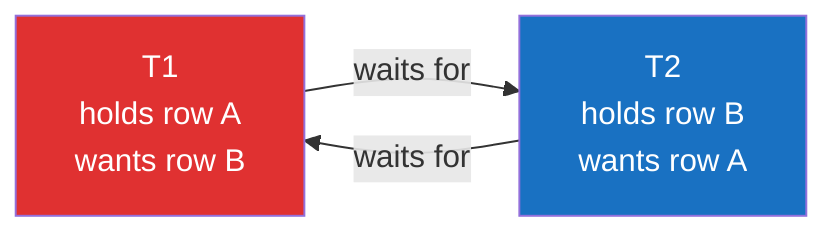

# 💥 Deadlocks

> [!abstract] TL;DR
> A **deadlock** is a **circular wait**: T1 holds lock A and wants B, while T2 holds B and wants A — neither can proceed. Databases don't prevent them by default; they **detect** and break them. **InnoDB** runs continuous wait-for-graph cycle detection and instantly rolls back the transaction that did the least work. **PostgreSQL** waits `deadlock_timeout` (default 1s), then checks the wait-for graph and aborts one transaction with SQLSTATE `40P01`. Prevention is on you: **consistent lock ordering**, **short transactions**, **lower isolation / fewer gap locks**, and **`SKIP LOCKED`** for queues. Deadlocks are normal under load — your app *must* catch the error and retry.

## Intuition — analogy FIRST

Two people at a dinner table each need **both** a fork and a knife to eat. Alice grabs the fork and reaches for the knife; Bob grabs the knife and reaches for the fork. Both now wait forever, each holding what the other needs. That's a deadlock.

The fix diners use is a *convention*: "always pick up the fork before the knife." If everyone follows the same order, the cycle can never form — that's **consistent lock ordering**, the single most effective deadlock-prevention technique. When a convention can't be guaranteed, a referee (the database) watches the table, spots the standoff, and makes one person **put everything down and start over** (victim rollback + retry).

---

## How It Works

### What a deadlock is: circular wait

Formally, a deadlock exists when the **wait-for graph** — nodes = transactions, edge T1→T2 meaning "T1 waits for a lock T2 holds" — contains a **cycle**. All four Coffman conditions hold: mutual exclusion, hold-and-wait, no preemption, and circular wait. Databases break the cycle by *preempting* one transaction (rolling it back), violating condition 4.



A cycle can involve more than two transactions (T1→T2→T3→T1); detectors find cycles of any length.

### Detection: two strategies

| | PostgreSQL | MySQL / InnoDB |
|---|---|---|
| Trigger | A lock wait exceeds **`deadlock_timeout`** (default **1s**), then it builds the wait-for graph and checks for a cycle | **Continuous** automatic wait-for-graph detection at lock-request time (near-instant) |
| Latency to break | ~1s (the timeout) by design — avoids overhead of constant checking | Immediate |
| Error to client | `ERROR: deadlock detected` (SQLSTATE `40P01`) | `ERROR 1213: Deadlock found... try restarting transaction` (SQLSTATE `40001`) |
| Toggle | Always on (timeout tunable) | `innodb_deadlock_detect` (on by default; can disable for very high concurrency, relying on `innodb_lock_wait_timeout` instead) |

> [!note] Deadlock timeout vs lock-wait timeout
> `deadlock_timeout` (PG) / `innodb_deadlock_detect` (MySQL) break *true cycles*. A different setting, **lock wait timeout** (`innodb_lock_wait_timeout`, default 50s; PG has `lock_timeout`, default off), aborts a transaction that simply *waited too long* even without a cycle. Disabling InnoDB's detector makes it fall back to this timeout to clear deadlocks — slower but cheaper under extreme concurrency.

### Victim selection

The detector must pick who dies:

- **InnoDB**: rolls back the transaction that has **modified the fewest rows** (cheapest to undo — remember InnoDB replays undo logs). Weight is roughly the amount of undo work.
- **PostgreSQL**: aborts the transaction *whose lock request would complete the cycle* (typically the one that detected it). It does not do "least work" accounting the way InnoDB does.

The victim is **automatically rolled back**; the other transaction(s) proceed. The victim's client receives the deadlock error and is expected to **retry from the beginning**.

### Prevention strategies (in priority order)

1. **Consistent lock ordering** — always acquire locks (rows, tables) in the same global order (e.g. ascending primary key). If every transaction locks A before B, no cycle can form. This is the highest-leverage fix.
2. **Keep transactions short** — less time holding locks = smaller window for cycles. Do slow work (API calls, file IO, user think-time) *outside* the transaction.
3. **Touch rows in a deterministic order** — sort the batch by key before updating; a multi-row `UPDATE ... WHERE id IN (...)` should process in a stable order.
4. **Lower isolation / reduce gap locks** — InnoDB Read Committed disables most gap locks, cutting a whole class of insert-vs-range deadlocks. Use only where phantom protection isn't needed.
5. **`SELECT ... FOR UPDATE SKIP LOCKED`** — for queues, skip contended rows instead of waiting on them → deadlocks (and convoys) largely disappear.
6. **Take the "biggest" lock first / use a single coarse lock** — sometimes locking the parent row (or an advisory lock) up front avoids fine-grained cycles.
7. **Always implement retry** — even with perfect discipline, deadlocks happen; wrap transactions in a bounded retry loop with jittered backoff.

### Reading deadlock logs

- **MySQL/InnoDB**: `SHOW ENGINE INNODB STATUS\G` → the **LATEST DETECTED DEADLOCK** section names both transactions, the locks each held/waited for, the SQL, and **which was rolled back**. Set `innodb_print_all_deadlocks = ON` to also log every deadlock to the error log.
- **PostgreSQL**: the deadlock is written to the server log with the cycle and both queries; `log_lock_waits = on` additionally logs long lock waits (those exceeding `deadlock_timeout`) even when they resolve without a deadlock.

---

## SQL / Examples

```sql
-- ============ Reproducing a classic 2-transaction deadlock ============
-- Session 1                              | Session 2
BEGIN;                                    | BEGIN;
UPDATE accounts SET bal=bal-100           |
   WHERE id='A';        -- locks A        |
                                          | UPDATE accounts SET bal=bal-50
                                          |    WHERE id='B';   -- locks B
UPDATE accounts SET bal=bal+100           |
   WHERE id='B';        -- waits for B    |
                                          | UPDATE accounts SET bal=bal+50
                                          |    WHERE id='A';   -- waits for A => CYCLE
-- One session is chosen as victim:
--   MySQL:    ERROR 1213 (40001) Deadlock found; transaction rolled back
--   Postgres: ERROR: deadlock detected (SQLSTATE 40P01)
```

```sql
-- ============ The fix: consistent lock ordering (both engines) ============
-- Always lock the lower id first, regardless of transfer direction.
BEGIN;
SELECT * FROM accounts WHERE id IN ('A','B')
  ORDER BY id                     -- deterministic order
  FOR UPDATE;                     -- acquire BOTH locks up front, in order
UPDATE accounts SET bal = bal - 100 WHERE id = 'A';
UPDATE accounts SET bal = bal + 100 WHERE id = 'B';
COMMIT;
```

```sql
-- ============ Inspecting deadlocks ============
-- MySQL/InnoDB
SHOW ENGINE INNODB STATUS\G           -- read "LATEST DETECTED DEADLOCK"
SET GLOBAL innodb_print_all_deadlocks = ON;
SELECT @@innodb_lock_wait_timeout, @@innodb_deadlock_detect;

-- PostgreSQL
SHOW deadlock_timeout;                 -- default 1s
ALTER SYSTEM SET log_lock_waits = on;  -- log long waits too
SET lock_timeout = '3s';               -- optional: cap any single lock wait
```

```text
-- Application retry loop (pseudocode) — MANDATORY even with prevention
for attempt in 1..MAX:
    try:
        run_transaction()         # BEGIN ... COMMIT
        break
    except DeadlockError (40P01 / 1213):
        sleep(random_jitter * 2**attempt)   # exponential backoff
        continue                  # retry the WHOLE transaction
```

---

## PostgreSQL vs MySQL

| Dimension | PostgreSQL | MySQL / InnoDB |
|---|---|---|
| Detection style | Timeout-triggered graph check (`deadlock_timeout`, 1s) | Continuous, immediate graph check |
| Victim choice | Transaction completing the cycle | Transaction with least undo work |
| Error code | `40P01` (`deadlock detected`) | `1213` / `40001` |
| Log source | Server log (+ `log_lock_waits`) | `SHOW ENGINE INNODB STATUS` (+ `innodb_print_all_deadlocks`) |
| Non-cycle timeout | `lock_timeout` (off by default) | `innodb_lock_wait_timeout` (50s) |
| Disable detector | N/A (timeout tunable) | `innodb_deadlock_detect = OFF` (fall back to lock-wait timeout) |
| Gap-lock deadlocks | Rare (no gap locks) | Common at Repeatable Read (mitigate with Read Committed) |

---

## Trade-offs

- **Detect vs prevent**: databases *detect* (cheap, permissive) rather than *prevent* (would require global lock-order enforcement they can't know). You get flexibility but must handle the abort.
- **`deadlock_timeout` tuning (PG)**: lower = faster deadlock resolution but more CPU spent checking on every ordinary lock wait; the 1s default assumes deadlocks are rare relative to normal waits.
- **Disabling InnoDB detection**: at extreme concurrency the detector's cost can dominate; disabling it trades instant resolution for waiting out `innodb_lock_wait_timeout` — only worth it in specialized high-throughput cases.
- **Lower isolation to avoid deadlocks**: Read Committed removes gap-lock deadlocks but reintroduces phantoms — a real correctness trade-off.

## Common Pitfalls

1. **No retry logic** — deadlocks are *expected* under concurrency; treating `40P01`/`1213` as a fatal error instead of retrying is the most common production mistake.
2. **Inconsistent lock ordering across code paths** — two features updating the same two tables in opposite orders is the textbook deadlock generator; enforce a canonical order (e.g. by primary key or table name).
3. **Long transactions holding locks** — batch jobs that lock thousands of rows for minutes turn rare races into constant deadlocks. Chunk the work and commit often.
4. **Unindexed updates widening the lock set (InnoDB)** — locking extra rows because of a missing index creates deadlock opportunities that vanish once the query uses an index.
5. **Retrying only the failed statement** — you must retry the **entire transaction** from `BEGIN`; the victim was fully rolled back, so re-running one statement corrupts logic.
6. **Assuming lower isolation removes all deadlocks** — it removes gap-lock deadlocks, not lock-ordering deadlocks; ordering discipline is still required.

## Related Concepts

- [[_MOC_DB_Transactions|↑ Section MOC]]
- [[Locking]] — the lock modes and gap/next-key locks whose cycles cause deadlocks
- [[Concurrency_Control]] — 2PL's downside is deadlock; optimistic CC trades it for retry-on-conflict
- [[Isolation_Levels]] — higher isolation (gap locks, Serializable) raises deadlock/serialization-failure rates
- [[MVCC_Internals]] — why readers don't deadlock (no read locks); write-write conflicts still can
- [[Transactions_and_ACID]] — a deadlock victim is rolled back atomically; the retry pattern

## Review Questions

1. Draw the wait-for graph for a two-transaction deadlock and explain which Coffman condition the database violates to break it. How does that map to "victim rollback"?
2. Compare PostgreSQL and InnoDB on *when* a deadlock is detected and *who* gets chosen as the victim. Why does InnoDB pick the transaction that modified the fewest rows?
3. Your money-transfer service deadlocks under load. Give the single most effective code change to prevent most deadlocks, and explain why your application still needs a retry loop even after making it.

## Sources

- MySQL Documentation: Deadlocks in InnoDB & How to Minimize/Handle Them — https://dev.mysql.com/doc/refman/8.0/en/innodb-deadlocks.html
- PostgreSQL Documentation: Explicit Locking — Deadlocks — https://www.postgresql.org/docs/current/explicit-locking.html#LOCKING-DEADLOCKS
- PostgreSQL Documentation: `deadlock_timeout` & `log_lock_waits` — https://www.postgresql.org/docs/current/runtime-config-locks.html
- Coffman, Elphick, Shoshani, *System Deadlocks* (1971)

#Database #Transactions #Concurrency #Deadlocks #WaitForGraph #LockOrdering #Retry #InnoDB #PostgreSQL
