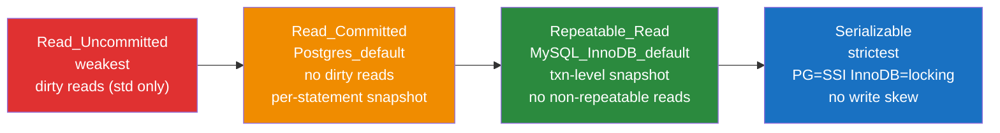

# 🎚️ Isolation Levels

> [!abstract] TL;DR
> Isolation levels are the dial that trades **correctness under concurrency** for **throughput**. The SQL standard defines four — Read Uncommitted, Read Committed, Repeatable Read, Serializable — each *preventing* progressively more anomalies (dirty read → non-repeatable read → phantom). Reality diverges from the standard: **PostgreSQL** defaults to **Read Committed**, has no true Read Uncommitted, and implements Serializable via **SSI (Serializable Snapshot Isolation)**. **MySQL/InnoDB** defaults to **Repeatable Read** and uses **next-key (gap) locks** to kill phantoms at RR. Two nastier anomalies — **lost update** and **write skew** — aren't in the original standard but decide real production bugs.

## Intuition — analogy FIRST

Imagine several accountants working from **photocopies** of the same ledger.

- **Read Uncommitted**: you're allowed to peek at another accountant's *scratch pad* before they've finalized — even numbers they later erase. Fast, reckless.
- **Read Committed**: you only ever read *finalized* pages, but you fetch a fresh photocopy for **each line you look up** — so the same figure can change between two glances.
- **Repeatable Read**: you take **one photocopy at the start** and work from it all day — the same figure never changes under you, but new rows others insert are invisible to your snapshot.
- **Serializable**: the accounting firm guarantees the end result is *as if* everyone worked one-at-a-time in some order — even if it has to make someone redo their work.

The dial is: how fresh is your photocopy, and how hard will the engine fight to make concurrent work equivalent to a serial schedule?

---

## How It Works

### The Anomalies (Read Phenomena + the two the standard forgot)

| Anomaly | What happens | Concrete example |
|---|---|---|
| **Dirty read** | Read data another txn wrote but hasn't committed | T2 reads balance=0 that T1 wrote, T1 rolls back — the 0 never existed |
| **Non-repeatable read** | Re-reading a row returns a different committed value | T2 reads price=100, T1 commits price=150, T2 re-reads and sees 150 |
| **Phantom read** | Re-running a range query returns different *rows* | T2 counts 3 orders, T1 inserts a 4th and commits, T2 now counts 4 |
| **Lost update** | Two txns read-modify-write the same row; one overwrites the other | Both read stock=10, both set 10−1=9; two sales, stock only dropped by 1 |
| **Write skew** | Each txn reads a set, writes based on it; individually valid, jointly break an invariant | Two doctors both check "≥1 on call", both go off-call → zero coverage |

Lost update and write skew are the ones that bite senior engineers, because they survive Read Committed *and* naive snapshot isolation.

### The Four Levels × Anomalies (SQL standard vs reality)

| Isolation Level | Dirty Read | Non-Repeatable Read | Phantom | Lost Update | Write Skew |
|---|:--:|:--:|:--:|:--:|:--:|
| **Read Uncommitted** | ✅ (std) — but ❌ in PG | ✅ | ✅ | ✅ | ✅ |
| **Read Committed** | ❌ | ✅ | ✅ | ✅ | ✅ |
| **Repeatable Read** | ❌ | ❌ | ✅ std / ❌ InnoDB & PG(snapshot) | ❌ PG*/InnoDB* | ✅ |
| **Serializable** | ❌ | ❌ | ❌ | ❌ | ❌ |

> [!note] Reality footnotes
> - **PostgreSQL has no real Read Uncommitted** — requesting it silently behaves as Read Committed (MVCC never exposes uncommitted data).
> - **PostgreSQL Repeatable Read = Snapshot Isolation**: it also blocks phantoms (snapshot-based) and detects lost updates (`ERROR: could not serialize access due to concurrent update`), but **still permits write skew**.
> - **InnoDB Repeatable Read** blocks phantoms via **next-key locks** on locking reads, but plain (non-locking) `SELECT` uses a consistent snapshot — a subtle mix that can produce surprising results (see pitfalls).
> - **Only Serializable eliminates write skew.**

### Ordered by strictness



### How each engine reaches Serializable — two different philosophies

- **PostgreSQL — SSI (Serializable Snapshot Isolation)**: *optimistic*. Transactions run on snapshots (like Repeatable Read) but Postgres tracks read/write dependencies (rw-antidependencies). If it detects a **dangerous structure** that could form a non-serializable cycle, it aborts one transaction with `ERROR: could not serialize access due to read/write dependencies`. No extra read locks — but callers **must retry**.
- **MySQL/InnoDB — Serializable via locking**: *pessimistic*. It effectively turns every plain `SELECT` into `SELECT ... LOCK IN SHARE MODE`, taking shared next-key locks. This blocks conflicting writers up front. No retry logic needed, but far more lock contention and deadlock risk.

This mirrors the [[Concurrency_Control]] optimistic-vs-pessimistic split at the isolation-level layer.

---

## SQL / Examples

```sql
-- ============ PostgreSQL ============
-- Per-session default:
SET default_transaction_isolation = 'read committed';   -- the default

-- Per-transaction:
BEGIN ISOLATION LEVEL REPEATABLE READ;
SELECT count(*) FROM orders WHERE status = 'open';        -- snapshot fixed here
-- ... concurrent inserts by others are invisible ...
SELECT count(*) FROM orders WHERE status = 'open';        -- SAME count (no phantom)
COMMIT;

-- Serializable with mandatory retry loop (pseudo-app logic):
BEGIN ISOLATION LEVEL SERIALIZABLE;
-- reads + writes ...
COMMIT;   -- may raise SQLSTATE 40001 -> application must retry the whole txn
```

```sql
-- ============ MySQL / InnoDB ============
-- Session / global:
SET SESSION TRANSACTION ISOLATION LEVEL READ COMMITTED;
SELECT @@transaction_isolation;                           -- REPEATABLE-READ by default

-- Next-key locks preventing phantoms at RR (locking read):
START TRANSACTION;                                         -- default REPEATABLE READ
SELECT * FROM orders WHERE id BETWEEN 10 AND 20 FOR UPDATE; -- gap+record locks
-- another session's INSERT id=15 will BLOCK until this commits => no phantom
COMMIT;
```

**Demonstrating the Read Committed non-repeatable read difference:**

```sql
-- Session A (Read Committed)             | Session B
BEGIN;                                    |
SELECT price FROM items WHERE id=1;-- 100 |
                                          | UPDATE items SET price=150 WHERE id=1; COMMIT;
SELECT price FROM items WHERE id=1;-- 150 |   <-- changed! (non-repeatable read)
COMMIT;                                   |
-- At REPEATABLE READ, the second SELECT would still return 100.
```

**Write skew — survives everything below Serializable:**

```sql
-- Invariant: at least one doctor on call. Both sessions at REPEATABLE READ.
-- A: SELECT count(*) FROM oncall WHERE on_call; -- sees 2
-- B: SELECT count(*) FROM oncall WHERE on_call; -- sees 2
-- A: UPDATE oncall SET on_call=false WHERE id='alice';  -- ok, still 1 (in A's view)
-- B: UPDATE oncall SET on_call=false WHERE id='bob';    -- ok, still 1 (in B's view)
-- Both COMMIT -> zero doctors on call. Invariant broken.
-- Fix: SERIALIZABLE (PG aborts one via SSI), or explicit SELECT ... FOR UPDATE
--      to materialize the conflict as a lock.
```

---

## PostgreSQL vs MySQL

| Dimension | PostgreSQL | MySQL / InnoDB |
|---|---|---|
| Default level | **Read Committed** | **Repeatable Read** |
| Read Uncommitted | Not real (acts as Read Committed) | Real (allows dirty reads) |
| RR snapshot semantics | True snapshot isolation; blocks phantoms; detects lost update → serialization error | Snapshot for plain SELECT; next-key locks for locking reads block phantoms |
| Serializable strategy | **SSI** (optimistic, dependency tracking, may abort with 40001) | **Locking** (pessimistic, shared next-key locks on all reads) |
| Retry required? | Yes at Serializable / RR write conflicts | Generally no (blocks instead), but deadlocks still need retry |
| Phantom prevention at RR | Yes (snapshot) | Yes (gap / next-key locks) |
| Write skew at RR | Possible | Possible |

---

## Trade-offs

- **Read Committed (PG default)**: highest concurrency, minimal blocking — but per-statement snapshots mean a multi-statement business rule ("check then act") can be violated. Great default for CRUD web apps.
- **Repeatable Read / Snapshot Isolation**: a stable view for the whole transaction (perfect for reports and multi-read logic) at the cost of potential serialization errors on writes (PG) or gap-lock contention (InnoDB).
- **Serializable**: the only level that's *always correct*, but SSI forces retry loops (throughput drops under contention) and InnoDB locking serializes readers (throughput collapses under hot rows).
- **The escape hatch**: instead of globally raising the level, materialize specific conflicts with `SELECT ... FOR UPDATE` — cheaper than Serializable for a single hot invariant.

---

## Common Pitfalls

1. **Assuming Read Uncommitted works in Postgres** — it doesn't; you get Read Committed. Don't rely on dirty reads for "fast approximate" queries there.
2. **Expecting Serializable to *block* instead of *fail* on Postgres** — SSI aborts with SQLSTATE `40001`; without a retry loop your app just errors out under load.
3. **InnoDB RR mixed semantics** — a plain `SELECT` reads the transaction snapshot, but an `UPDATE ... WHERE` in the same transaction operates on the *latest committed* rows (current read), which can update rows your snapshot couldn't "see". Surprising and a classic interview trap.
4. **Ignoring write skew** — raising to Repeatable Read feels safe but write skew and constraint-spanning invariants still break. Use Serializable or explicit locks.
5. **Lost updates via read-modify-write in app code** — `SELECT` then `UPDATE` with the computed value loses concurrent writes at Read Committed. Use `UPDATE ... SET x = x - 1` (atomic), `FOR UPDATE`, or optimistic version columns (see [[Concurrency_Control]]).
6. **Setting isolation globally to Serializable "to be safe"** — often tanks throughput; scope it to the transactions that truly need it.

---

## Related Concepts

- [[_MOC_DB_Transactions|↑ Section MOC]]
- [[ACID_and_Transactions]] — Isolation is the **I**; the systems overview of anomalies lives here
- [[Transactions_and_ACID]] — how transactions and durability underpin isolation
- [[Concurrency_Control]] — the locking / validation / snapshot mechanisms that *implement* these levels
- [[MVCC_Internals]] — why snapshots make Read Committed and Repeatable Read cheap
- [[Locking]] — next-key / gap locks that give InnoDB phantom protection
- [[Deadlocks]] — higher isolation raises deadlock and serialization-failure rates

## Review Questions

1. A report transaction at Read Committed sums a table twice and gets different totals. Which anomaly is this, and how does raising to Repeatable Read fix it on both PostgreSQL and InnoDB (note the different mechanisms)?
2. Postgres Repeatable Read prevents phantoms and lost updates but still allows write skew. Explain write skew with the on-call-doctors example and give two ways to prevent it.
3. Both engines can be Serializable, but one *aborts* transactions while the other *blocks* them. Which is which, what SQLSTATE signals the abort, and what does your application code need to add to survive it?

## Sources

- PostgreSQL Documentation: Transaction Isolation — https://www.postgresql.org/docs/current/transaction-iso.html
- MySQL Documentation: InnoDB Transaction Isolation Levels — https://dev.mysql.com/doc/refman/8.0/en/innodb-transaction-isolation-levels.html
- Berenson et al., *A Critique of ANSI SQL Isolation Levels* (1995)
- Martin Kleppmann, *Designing Data-Intensive Applications*, Ch. 7 — Weak Isolation & Serializability

#Database #Transactions #Concurrency #IsolationLevels #SSI #RepeatableRead #ReadCommitted #WriteSkew
