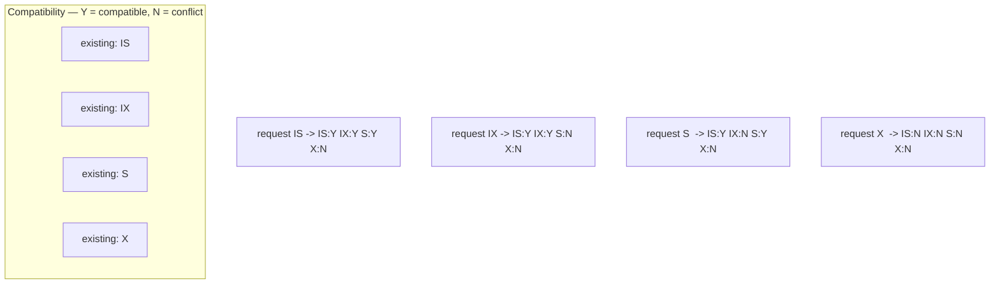

# 🔒 Locking

> [!abstract] TL;DR
> Locks are how databases serialize *conflicting* access. They vary along three axes: **granularity** (row → page → table), **mode** (shared `S` / exclusive `X`, plus **intention** locks for the hierarchy), and **scope** (a single record vs a *gap* between records). **InnoDB**'s signature feature is **next-key locking** (record lock + gap lock) that prevents phantoms at Repeatable Read. **PostgreSQL** offers granular row-lock strengths — `FOR UPDATE`, `FOR NO KEY UPDATE`, `FOR SHARE`, `FOR KEY SHARE` — plus `SKIP LOCKED` / `NOWAIT` and **advisory locks**. The everyday power tool is `SELECT ... FOR UPDATE SKIP LOCKED` for building reliable job queues.

## Intuition — analogy FIRST

Think of a **shared apartment building**:

- **Table lock** = lock the whole building's front door — nobody else gets in, maximum safety, zero concurrency.
- **Row lock** = lock just *your* apartment — everyone else uses their own freely.
- **Shared vs exclusive** = a *reading room* many can enter together (shared) vs a *bathroom* only one may use (exclusive).
- **Intention lock** = a note on the building directory saying "someone's using an apartment on floor 3," so a manager who wants to lock the *whole floor* knows to wait — without checking every apartment.
- **Gap lock** = locking the *empty hallway slot* between apartments 14 and 16 so nobody can move a new tenant into "15" while you're counting residents (phantom prevention).

Locking is the pessimistic side of concurrency control (see [[Concurrency_Control]]); MVCC removes the need for *read* locks, but writes still take them.

---

## How It Works

### Granularity

| Granularity | Locked unit | Pros | Cons |
|---|---|---|---|
| **Row** | one tuple / index record | max concurrency | many locks = memory + management overhead |
| **Page** | a disk page (several rows) | fewer locks | false conflicts on unrelated co-located rows |
| **Table** | whole relation | trivial, deadlock-resistant | serializes all writers |

- **InnoDB** locks at **row (index record)** level and, notably, **does not escalate** to table locks. It locks index records, so a query with no usable index may lock *every row it scans*.
- **PostgreSQL** uses **row locks** (stored in the tuple header / a lock-bit + `xmax`, spilling to a lock table only under contention) and **table-level** locks for DDL and explicit `LOCK TABLE`. Postgres has **no page-level** user locks and never escalates row → table automatically.

### Lock modes and the intention hierarchy

- **Shared (`S`)** — multiple readers may hold it together; blocks exclusive.
- **Exclusive (`X`)** — one holder; blocks everyone.
- **Intention locks (`IS`, `IX`)** — taken on the *table* to signal "I hold/will hold row locks below," so a transaction wanting a full-table lock can detect conflicts without scanning every row. InnoDB uses `IS`/`IX`/`S`/`X` at table level; also `AUTO-INC` locks for auto-increment.

**Lock compatibility matrix** (does the requested mode conflict with an existing one?):



Read it as: **X conflicts with everything; S conflicts with X and IX; intention locks (IS/IX) coexist** and only clash with table-level S/X. Two writers on the *same row* always conflict (X vs X).

### InnoDB record / gap / next-key locks

This is InnoDB's defining mechanism and a frequent interview topic:

- **Record lock** — locks a single **index record**.
- **Gap lock** — locks the **open interval between** index records (no rows are there yet); purpose is purely to **prevent inserts** into that gap → stops phantoms. Gap locks don't conflict with each other, only with inserts.
- **Next-key lock** — **record lock + the gap before it**; the *default* locking read behavior at Repeatable Read. This is why InnoDB blocks phantoms at RR without needing Serializable.
- **Insert intention lock** — a special gap lock inserts take, signaling intent so multiple inserts into the same gap at different positions don't needlessly block.

At **Read Committed**, InnoDB largely **disables gap locks** (only record locks), trading phantom protection for concurrency — one reason RC has fewer deadlocks.

### PostgreSQL row-lock strengths

Postgres exposes four row-level lock strengths, weakest to strongest, so common cases don't over-block:

| Clause | Strength | Blocks | Typical use |
|---|---|---|---|
| `FOR KEY SHARE` | weakest | concurrent `FOR UPDATE`/delete of the key | FK integrity checks |
| `FOR SHARE` | shared | writers | "read but pin this row" |
| `FOR NO KEY UPDATE` | strong | other updates | UPDATE that **doesn't** change a key/uniquely-indexed col (lets FK checks proceed) |
| `FOR UPDATE` | strongest | all writers + FK-share | classic "I'm going to modify/delete this row" |

Plus modifiers:
- **`NOWAIT`** — fail immediately (`ERROR: could not obtain lock`) instead of waiting.
- **`SKIP LOCKED`** — silently skip rows already locked by others → the foundation of concurrent queue workers.

### Advisory locks (PostgreSQL)

Application-defined locks keyed by an integer, *not* tied to any row — the DB tracks them but attaches no meaning. Session-level (`pg_advisory_lock`) or transaction-level (`pg_advisory_xact_lock`, auto-released at commit). Great for **cross-process mutual exclusion** (e.g. "only one worker runs this cron job") without a real table row. MySQL's analog is `GET_LOCK('name', timeout)` / `RELEASE_LOCK`.

### Table locks & explicit vs implicit locking

- **Implicit**: acquired automatically — every `UPDATE`/`DELETE`/`INSERT` takes row `X` locks; DDL takes strong table locks; `SELECT` (MVCC) takes none.
- **Explicit**: you ask — `SELECT ... FOR UPDATE` (rows), `LOCK TABLE t IN <mode>` (Postgres, 8 named modes from `ACCESS SHARE` to `ACCESS EXCLUSIVE`), `LOCK TABLES ... WRITE` (MySQL, session-scoped and requires unlocking).

### The queue-processing pattern

`SELECT ... FOR UPDATE SKIP LOCKED` lets N workers each grab a *different* unlocked job atomically — no double-processing, no worker blocking on another's row. The canonical reliable-queue-on-SQL recipe.

---

## SQL / Examples

```sql
-- ============ PostgreSQL: reliable job queue (N concurrent workers) ============
BEGIN;
SELECT id, payload
FROM jobs
WHERE status = 'queued'
ORDER BY created_at
FOR UPDATE SKIP LOCKED         -- grab an unlocked row; skip ones others hold
LIMIT 1;
-- ... process job in app ...
UPDATE jobs SET status = 'done' WHERE id = :id;
COMMIT;                        -- row lock released

-- fail fast instead of waiting
SELECT * FROM accounts WHERE id = 'A' FOR UPDATE NOWAIT;

-- weakest lock that still guards a non-key UPDATE (keeps FK checks unblocked)
SELECT * FROM orders WHERE id = 7 FOR NO KEY UPDATE;

-- cross-process singleton (only one worker proceeds)
SELECT pg_try_advisory_lock(42);   -- true = got it; false = someone else has it
```

```sql
-- ============ MySQL / InnoDB: same queue pattern (8.0+) ============
START TRANSACTION;
SELECT id, payload FROM jobs
WHERE status = 'queued'
ORDER BY created_at
FOR UPDATE SKIP LOCKED
LIMIT 1;
UPDATE jobs SET status = 'done' WHERE id = @id;
COMMIT;

-- shared lock (formerly LOCK IN SHARE MODE)
SELECT * FROM accounts WHERE id = 'A' FOR SHARE;

-- observe next-key / gap locking at Repeatable Read
START TRANSACTION;                              -- RR default
SELECT * FROM t WHERE k BETWEEN 10 AND 20 FOR UPDATE;  -- next-key locks the range
-- another session INSERT INTO t(k) VALUES (15) will BLOCK (gap locked) -> no phantom

-- application advisory lock
SELECT GET_LOCK('nightly_report', 0);          -- 1 = acquired, 0 = busy
```

```sql
-- ============ Inspecting who holds what ============
-- PostgreSQL
SELECT locktype, relation::regclass, mode, granted, pid
FROM pg_locks JOIN pg_stat_activity USING (pid) WHERE NOT granted;   -- waiters

-- MySQL 8.0
SELECT * FROM performance_schema.data_locks;         -- held locks
SELECT * FROM performance_schema.data_lock_waits;    -- who waits on whom
```

---

## PostgreSQL vs MySQL

| Dimension | PostgreSQL | MySQL / InnoDB |
|---|---|---|
| Row-lock granularity | Row (tuple), no auto-escalation | Index-record level, no escalation |
| Gap / next-key locks | **No** (uses SSI/predicate locks for Serializable phantom protection) | **Yes** — next-key locking prevents phantoms at RR |
| Row-lock strengths | 4 levels (`KEY SHARE`→`UPDATE`) | 2 (`FOR SHARE`, `FOR UPDATE`) |
| `SKIP LOCKED` / `NOWAIT` | Yes | Yes (8.0+) |
| Advisory locks | `pg_advisory_lock` family | `GET_LOCK` / `RELEASE_LOCK` |
| Explicit table lock | `LOCK TABLE ... IN <mode>` (8 modes) | `LOCK TABLES ... READ/WRITE` (session) |
| Phantom protection mechanism | Predicate locks (SSI) at Serializable | Gap locks at Repeatable Read |
| Lock on unindexed WHERE | Locks matching rows | May lock **every scanned row** (no index) |

---

## Trade-offs

- **Granularity vs overhead**: row locks maximize concurrency but cost memory/management; coarser locks are cheap but serialize unrelated work. InnoDB/PG both favor fine-grained row locks.
- **Gap locks**: buy phantom prevention at RR but *increase deadlocks and blocking of inserts* into "empty" ranges — a common InnoDB surprise. Read Committed disables them for more concurrency, less protection.
- **Pessimistic `FOR UPDATE`**: correct and simple, but holds locks for the transaction's lifetime — deadly across UI/network round-trips (prefer optimistic — see [[Concurrency_Control]]).
- **`SKIP LOCKED`**: unlocks massive queue throughput but means *no ordering guarantee* across skips and possible starvation of a "stuck" row.

## Common Pitfalls

1. **Unindexed locking queries in InnoDB** — `... FOR UPDATE WHERE non_indexed = ?` scans and **locks every examined row** (even non-matching), causing huge lock footprints and deadlocks. Always lock via an indexed predicate.
2. **Surprise gap locks at RR** — an `INSERT` blocking on a seemingly unrelated range is InnoDB's next-key lock. Dropping to Read Committed (or locking narrower ranges) often fixes it.
3. **`FOR UPDATE` across think-time** — holding row locks while waiting for a user or an external API call throttles the whole system; use optimistic version columns instead.
4. **Forgetting `SKIP LOCKED` in queue workers** — without it, all workers pile up waiting on the same head row (or double-process without a lock). With plain `FOR UPDATE` you get a convoy.
5. **Session advisory locks that never release** — `pg_advisory_lock` (session-scoped) persists until unlocked or disconnect; a crashed worker can wedge a "singleton" until its connection dies. Prefer `pg_advisory_xact_lock`.
6. **Assuming `SELECT` takes locks** — under MVCC plain reads don't; developers coming from lock-based DBs wrongly assume reads block writers.

## Related Concepts

- [[_MOC_DB_Transactions|↑ Section MOC]]
- [[Concurrency_Control]] — locking is the pessimistic strategy; contrast with optimistic/MVCC
- [[MVCC_Internals]] — why reads don't need locks; write-write still does
- [[Isolation_Levels]] — next-key locks give InnoDB phantom protection at Repeatable Read
- [[Deadlocks]] — the failure mode of holding multiple locks; detection & prevention
- [[Transactions_and_ACID]] — locks enforce the Isolation property within a transaction

## Review Questions

1. Explain a next-key lock in InnoDB (its two parts) and how it prevents a phantom read at Repeatable Read. What changes about gap locking when you drop to Read Committed?
2. PostgreSQL offers `FOR UPDATE`, `FOR NO KEY UPDATE`, `FOR SHARE`, and `FOR KEY SHARE`. Why would you deliberately choose `FOR NO KEY UPDATE` over `FOR UPDATE`, and what does it buy you regarding foreign-key checks?
3. Write the SQL for a crash-safe job queue consumed by 20 concurrent workers with no double-processing and no worker blocking on another's row. Which single clause makes this work, and what ordering caveat does it introduce?

## Sources

- MySQL Documentation: InnoDB Locking (record, gap, next-key) — https://dev.mysql.com/doc/refman/8.0/en/innodb-locking.html
- PostgreSQL Documentation: Explicit Locking (row/table modes, advisory) — https://www.postgresql.org/docs/current/explicit-locking.html
- PostgreSQL Documentation: `SELECT` — The Locking Clause (`FOR UPDATE`, `SKIP LOCKED`) — https://www.postgresql.org/docs/current/sql-select.html
- Markus Winand, *SQL Performance Explained* — locking & indexing

#Database #Transactions #Concurrency #Locking #NextKeyLock #GapLock #ForUpdate #SkipLocked #AdvisoryLock #InnoDB #PostgreSQL
