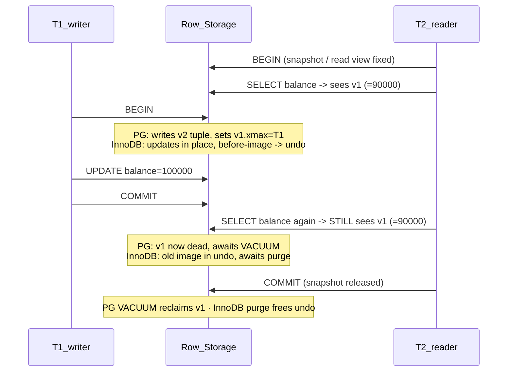

# 🧬 MVCC Internals

> [!abstract] TL;DR
> MVCC keeps **multiple physical versions of each row** so readers see a consistent snapshot without locking writers. The two mainstream engines implement it *oppositely*: **PostgreSQL stores old versions in the heap itself** (`xmin`/`xmax` tuple headers) and needs **VACUUM** to garbage-collect dead tuples, fighting **bloat** and **XID wraparound**. **MySQL/InnoDB stores old versions out-of-line in undo logs** (rollback segments) and reconstructs them on demand via **read views**, with a **purge thread** cleaning undo. This note is the engine-internals deep dive beneath the systems view in [[MVCC]].

## Intuition — analogy FIRST

Two libraries handle "revise a book while others read it":

- **PostgreSQL library**: when you revise a chapter, the librarian **glues a brand-new copy of the whole page into the book** and stamps the old page "superseded as of edit #101." The book physically fattens with old pages until the **night-shift shredder (VACUUM)** removes pages no active reader still needs. Fast to write, but the book bloats and the shredder must keep up.
- **InnoDB library**: the librarian **edits the page in place** but first photographs the old version and files the photo in a **separate archive room (undo log)**. A reader who needs the old view is handed reconstructed pages from the archive. The main book stays slim; a **cleanup clerk (purge thread)** shreds archive photos no reader needs.

Same goal (versioning), opposite storage: **versions inline (Postgres) vs versions out-of-line (InnoDB)**. Every operational difference flows from that one decision.

---

## How It Works

### PostgreSQL: versions live in the heap

Every tuple (row version) carries hidden system columns in its header:

| Field | Meaning |
|---|---|
| `xmin` | XID that **created** this version (INSERT/UPDATE) |
| `xmax` | XID that **deleted/superseded** it; 0 if still live |
| `cmin`/`cmax` | command IDs within a transaction (statement-level visibility) |
| `ctid` | physical location `(page, offset)`; UPDATE points old → new version |

**Visibility rule** (simplified): a transaction with snapshot *S* sees a tuple iff `xmin` is committed and visible to *S*, **and** `xmax` is 0 or not-yet-visible/aborted to *S*. Snapshots record `xmin`/`xmax` boundaries plus the in-progress XID list; commit status is looked up in the **commit log (`pg_xact`/clog)**.

**UPDATE = DELETE + INSERT**: Postgres never overwrites in place. It marks the old tuple's `xmax` and writes a *new* tuple. This is why an UPDATE can cause index churn and table growth.

**Dead tuples & VACUUM**: once no snapshot can see the old version, it's a **dead tuple**. `VACUUM` reclaims that space for reuse (not usually returned to the OS — `VACUUM FULL` rewrites the table to shrink it, taking an `ACCESS EXCLUSIVE` lock). **autovacuum** runs it automatically, triggered by `autovacuum_vacuum_scale_factor` (default 20% dead).

**Bloat**: if writes outrun VACUUM (or a long transaction pins old versions), dead tuples accumulate → tables/indexes grow, cache hit-rate drops, scans slow. The #1 cause is **long-running / idle-in-transaction sessions** that hold back the global "oldest snapshot" (`xmin` horizon), forbidding cleanup of anything newer.

**HOT updates (Heap-Only Tuples)**: an optimization — if an UPDATE changes **no indexed column** and the new version fits **on the same page**, Postgres chains old→new within the heap page and **skips inserting new index entries**. HOT updates drastically reduce index bloat and are a reason to keep hot-updated columns un-indexed and fillfactor < 100.

**XID wraparound**: XIDs are 32-bit and wrap after ~4 billion (compared modulo-2^31). If VACUUM doesn't **freeze** old tuples (mark them "always visible") before the horizon catches up, ancient rows could appear to be *in the future* and vanish. To prevent corruption, Postgres forces aggressive anti-wraparound autovacuums and, in the extreme, **refuses new transactions** until you VACUUM. Monitor `age(datfrozenxid)`.

### MySQL/InnoDB: versions live in undo logs

InnoDB updates rows **in place** in the clustered index but keeps rollback information:

- Each clustered-index row has hidden fields: **`DB_TRX_ID`** (last transaction that modified it) and **`DB_ROLL_PTR`** (pointer into the undo log to the previous version).
- **Undo logs** (in **rollback segments**, historically the system tablespace, now the undo tablespaces) store *before-images*. To read an old version, InnoDB walks the `DB_ROLL_PTR` chain, applying undo records to reconstruct the row as of the reader's view.
- A **read view** is the snapshot: it records the set of transactions active at its creation. A row version is visible if its `DB_TRX_ID` committed before the read view was built; otherwise InnoDB follows `DB_ROLL_PTR` to an older version.
- **Purge threads** garbage-collect undo records once no read view needs them (analogous to VACUUM). Falling behind grows the **history list length** (`SHOW ENGINE INNODB STATUS`), the InnoDB equivalent of Postgres bloat — usually caused by a long-open transaction.

Because old versions are out-of-line, **the primary table stays compact** and there's no wraparound problem, but reads of heavily-updated rows pay a reconstruction cost walking the undo chain, and delete-marked records still need purge.

### Two transactions, two versions — concurrently



### The core contrast

| Aspect | PostgreSQL | MySQL / InnoDB |
|---|---|---|
| Where old versions live | **Inline** in the heap (new tuple per UPDATE) | **Out-of-line** in undo logs |
| UPDATE physical op | DELETE-old + INSERT-new tuple | In-place update + before-image to undo |
| Snapshot object | Snapshot (xmin/xmax + in-progress XIDs) | Read view (active-trx set) |
| Version metadata | `xmin`, `xmax`, `ctid` in tuple header | `DB_TRX_ID`, `DB_ROLL_PTR` per row |
| Garbage collector | **VACUUM / autovacuum** | **Purge thread** |
| "Bloat" symptom | Dead tuples, table/index growth | History list length growth, undo tablespace growth |
| Read of old version cost | Cheap (versions are just other tuples) | Reconstruct via undo chain walk |
| Index impact of UPDATE | New index entries unless **HOT** | Secondary index updates; PK stays in place |
| Special hazard | **XID wraparound** (32-bit) | Long undo chains / purge lag |

---

## SQL / Examples

```sql
-- ============ PostgreSQL: peek at MVCC internals ============
SELECT xmin, xmax, ctid, balance FROM accounts WHERE id = 'A';
--  xmin  | xmax | ctid  | balance
--  1001  |  0   | (0,1) |  90000     <- created by txn 1001, still live

-- dead tuple / bloat monitoring
SELECT relname, n_live_tup, n_dead_tup, last_autovacuum
FROM pg_stat_user_tables ORDER BY n_dead_tup DESC LIMIT 10;

-- oldest snapshot holding back cleanup (find the bloat culprit)
SELECT pid, age(backend_xmin) AS xmin_age, state, query
FROM pg_stat_activity WHERE backend_xmin IS NOT NULL ORDER BY xmin_age DESC;

-- wraparound safety
SELECT datname, age(datfrozenxid) FROM pg_database ORDER BY age(datfrozenxid) DESC;

-- tune autovacuum on a hot table + leave room for HOT updates
ALTER TABLE orders SET (autovacuum_vacuum_scale_factor = 0.02, fillfactor = 90);
VACUUM (VERBOSE, ANALYZE) orders;
```

```sql
-- ============ MySQL / InnoDB: undo / purge / read-view monitoring ============
-- History list length + oldest active transaction (look for purge lag)
SHOW ENGINE INNODB STATUS\G      -- see "History list length" under TRANSACTIONS

-- long-running transactions pinning undo (the purge-lag culprit)
SELECT trx_id, trx_started, trx_rows_modified, trx_state
FROM information_schema.innodb_trx
ORDER BY trx_started ASC;

-- undo tablespace / purge configuration
SELECT @@innodb_purge_threads, @@innodb_max_undo_log_size;
```

---

## PostgreSQL vs MySQL

See the **core contrast** table above — it *is* the PostgreSQL vs MySQL comparison for MVCC internals. Operational summary:

- **Postgres tuning is about VACUUM**: keep autovacuum aggressive on hot tables, kill idle-in-transaction sessions, watch `n_dead_tup` and `datfrozenxid` age, exploit HOT updates.
- **InnoDB tuning is about purge & undo**: keep transactions short so the history list drains, size undo tablespaces, ensure enough `innodb_purge_threads`.

---

## Trade-offs

- **Inline versions (PG)**: cheap reads of any version and instant rollback, but write-amplification (new tuple + index entries) and mandatory VACUUM; bloat and wraparound are real operational burdens.
- **Out-of-line versions (InnoDB)**: compact primary storage and no wraparound, but reads of hot-updated rows walk undo chains, and rollback of large transactions replays undo (slow).
- **Both**: a single long-running transaction is catastrophic — it pins the GC horizon, causing unbounded bloat (PG) or history-list growth (InnoDB). MVCC's Achilles' heel is the forgotten open transaction.
- **Snapshot cost**: MVCC gives free snapshot isolation but *not* serializability — write skew persists (see [[Isolation_Levels]]).

---

## Common Pitfalls

1. **Idle-in-transaction / long analytics transactions** — the single biggest cause of both PG bloat and InnoDB history-list growth. Set `idle_in_transaction_session_timeout` (PG); keep reports short.
2. **Disabling autovacuum on "busy" tables** — guarantees runaway bloat and eventually a wraparound emergency. Tune it, never disable it.
3. **Ignoring XID wraparound warnings (PG)** — they escalate to a forced read-only shutdown; recovery means offline `VACUUM FREEZE`. Alert on `datfrozenxid` age early.
4. **Over-indexing hot-updated tables (PG)** — defeats HOT updates, so every UPDATE bloats indexes too. Keep frequently-updated columns out of indexes and set `fillfactor < 100`.
5. **Expecting `VACUUM` to shrink files** — plain VACUUM reclaims space *for reuse*, not to the OS; only `VACUUM FULL` (or `pg_repack`) shrinks, and FULL takes an exclusive lock.
6. **Thinking InnoDB has no GC** — it does (purge); a stalled purge thread bloats undo just as badly. `SHOW ENGINE INNODB STATUS` → history list length is your gauge.

---

## Related Concepts

- [[_MOC_DB_Transactions|↑ Section MOC]]
- [[MVCC]] — the systems-level view of multi-version concurrency; this note is the engine deep dive
- [[Concurrency_Control]] — where MVCC/snapshot isolation sits among locking and optimistic strategies
- [[Isolation_Levels]] — snapshots implement Read Committed & Repeatable Read; SSI adds serializability
- [[Locking]] — write-write conflicts MVCC still resolves with row locks
- [[Write_Ahead_Log]] — WAL provides durability; MVCC provides isolation (orthogonal, complementary)
- [[Transactions_and_ACID]] — Postgres's "atomicity via MVCC, no undo log" design

## Review Questions

1. PostgreSQL and InnoDB both do MVCC but store old versions in opposite places. State where each stores them and derive two operational consequences of that choice for each engine (e.g. bloat vs undo-chain reads, wraparound vs purge lag).
2. What is a HOT update in PostgreSQL, what two conditions must hold for it to trigger, and why does it matter for index bloat? How would you configure a table to encourage HOT updates?
3. A developer leaves a `BEGIN;` open in a psql session overnight while the `orders` table takes 50k updates/hour. Describe the concrete damage on PostgreSQL and, separately, on InnoDB, and how you'd diagnose each.

## Sources

- The Internals of PostgreSQL, Ch. 5 — Concurrency Control (MVCC), Ch. 6 — VACUUM — https://www.interdb.jp/pg/
- PostgreSQL Documentation: Routine Vacuuming & Wraparound — https://www.postgresql.org/docs/current/routine-vacuuming.html
- MySQL Documentation: InnoDB Multi-Versioning & Undo Logs — https://dev.mysql.com/doc/refman/8.0/en/innodb-multi-versioning.html
- MySQL Documentation: InnoDB Purge Configuration — https://dev.mysql.com/doc/refman/8.0/en/innodb-purge-configuration.html

#Database #Transactions #Concurrency #MVCC #VACUUM #UndoLog #XIDWraparound #HOTUpdate #InnoDB #PostgreSQL
