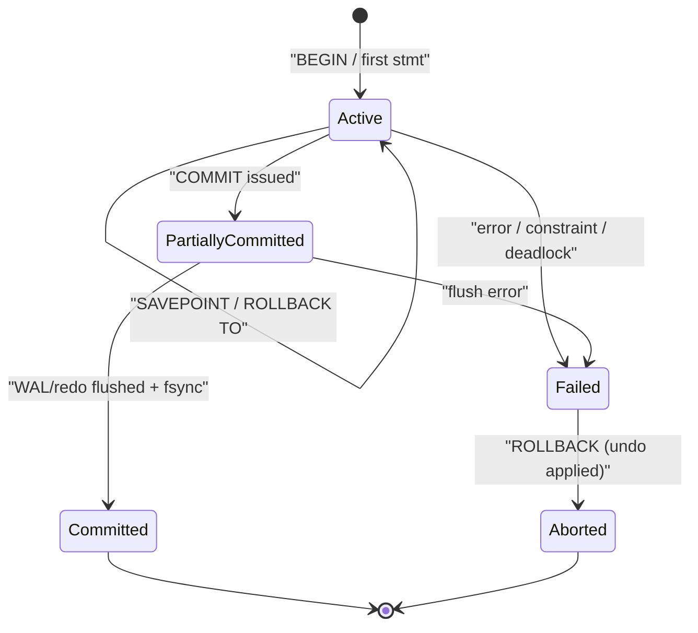

# 🔐 Transactions and ACID

> [!abstract] TL;DR
> A **transaction** is a unit of work that is executed atomically and moves the database from one valid state to another. **ACID** — Atomicity, Consistency, Isolation, Durability — is the contract the engine makes with you. The interesting part is *how* engines actually deliver it: PostgreSQL gets atomicity from **MVCC + abort markers** and durability from the **WAL**; MySQL/InnoDB gets atomicity from **undo logs (rollback segments)** and durability from the **redo log + doublewrite buffer**. `SAVEPOINT` gives you partial rollback, and read-only transactions let the engine skip bookkeeping. This note goes below the systems-level view in [[ACID_and_Transactions]] and looks at the storage-engine machinery.

## Intuition — analogy FIRST

Think of a transaction like editing a shared Google Doc with **"suggesting mode"** plus a magic **undo stack**. You make a batch of edits (BEGIN…), and until you click *Accept All* (COMMIT), nobody else sees a half-finished paragraph. If you change your mind, *Reject All* (ROLLBACK) wipes every edit as if you never touched the page. And if your laptop dies mid-click, when it reboots your accepted edits are still there because the doc was saved to a durable journal the instant you accepted — not sitting in volatile RAM.

ACID is the formalization of those four promises. What's easy to say ("all-or-nothing") is hard to build. Every letter maps to a concrete on-disk mechanism, and the mechanisms differ between engines. That's what we dig into here.

---

## How It Works

### The Transaction Lifecycle

A transaction is a **state machine**. It is born on the first statement, lives while you accumulate changes, and ends in exactly one of two terminal states: committed or aborted.



- **Active** — statements execute; changes are buffered in memory (and, for Postgres, already written to heap pages as *not-yet-visible* tuple versions).
- **Partially Committed** — `COMMIT` requested; the engine must durably flush the log *before* acknowledging.
- **Committed** — the durability point: WAL/redo record is `fsync`'d. Only now does the client get "OK".
- **Failed / Aborted** — any error or explicit `ROLLBACK` reverses changes via the undo mechanism.

### Autocommit

By default both Postgres (via the client/psql) and MySQL run in **autocommit mode**: every standalone statement is its own transaction, committed immediately.

- **PostgreSQL**: autocommit is a client-side concept in `psql` (`\set AUTOCOMMIT on`). Explicit `BEGIN` opens a multi-statement transaction block.
- **MySQL/InnoDB**: `autocommit` is a real server session variable (`SET autocommit = 0`). With it off, a transaction is implicitly started and stays open until you `COMMIT`/`ROLLBACK` — a classic source of "why is my row locked?" incidents.

> [!warning] Some statements force a commit. In MySQL, **DDL is not transactional** — `CREATE TABLE`, `ALTER TABLE`, `DROP` cause an *implicit commit* of the current transaction. PostgreSQL, by contrast, has **transactional DDL**: you can `ALTER TABLE` inside a transaction and `ROLLBACK` it.

### The Four Properties — and How Engines Deliver Them

| Property | The Guarantee | PostgreSQL Mechanism | MySQL / InnoDB Mechanism |
|---|---|---|---|
| **Atomicity** | All-or-nothing | New tuple versions written eagerly; on abort the transaction's XID is marked aborted in `pg_xact` (clog) so its tuples are simply never visible — VACUUM later reclaims them. No physical undo pass. | **Undo logs** in rollback segments record the *before-image* of every changed row. `ROLLBACK` replays undo to restore prior values. |
| **Consistency** | Invariants hold | Constraints (PK/FK/CHECK/UNIQUE/NOT NULL), triggers, and deferred constraint checking (`SET CONSTRAINTS ... DEFERRED`). | Same constraint machinery; FK checks enforced by InnoDB at the storage layer. |
| **Isolation** | Concurrent = appears serial | MVCC snapshots + SSI for `SERIALIZABLE`. See [[Isolation_Levels]] and [[MVCC_Internals]]. | MVCC via read views + next-key locking. See [[Locking]]. |
| **Durability** | Survives crash | **WAL** (write-ahead log): log record flushed & `fsync`'d before commit ack; checkpoints flush dirty pages later. See [[Write_Ahead_Log]]. | **Redo log** (`ib_logfile*` / redo log capacity) + **doublewrite buffer** to survive torn pages; controlled by `innodb_flush_log_at_trx_commit`. |

**The key asymmetry to remember:** PostgreSQL implements *atomicity without a traditional undo log* — an aborted transaction leaves dead tuples that VACUUM cleans, which is why rollback in Postgres is nearly instantaneous but bloat is a concern. InnoDB implements atomicity *with* undo logs, which makes rollback of a huge transaction potentially slow (it must replay undo), but keeps the main tablespace clean.

### Atomicity via Undo, Durability via Redo — the WAL/undo duality

Both engines separate two logs conceptually:

- **Redo** (what to *re-do* after a crash to reach the committed state) → durability.
- **Undo** (what to *un-do* to reverse an incomplete transaction) → atomicity + MVCC read of old versions.

In InnoDB these are two distinct logs (redo log + undo log). In PostgreSQL the **WAL is the redo log**, and "undo" is emulated by keeping old tuple versions in the heap (MVCC) rather than a separate undo file. This is the single biggest architectural difference between the two engines' transaction internals.

### SAVEPOINT and Subtransactions (Nested Transactions)

A `SAVEPOINT` marks a point you can partially roll back to without aborting the whole transaction. Under the hood this creates a **subtransaction**.

- **PostgreSQL**: each savepoint is a real subtransaction with its own XID (a *subxid*). `ROLLBACK TO SAVEPOINT` marks that subxid aborted. Beware: heavy savepoint use (e.g. an ORM wrapping every statement, or a PL/pgSQL block with `EXCEPTION` handlers — which internally open a savepoint) can exhaust the *subtransaction SLRU cache* and cause the notorious "SubtransSLRU" performance cliff.
- **MySQL/InnoDB**: savepoints roll back the undo to a recorded position. Same `SAVEPOINT` / `ROLLBACK TO` / `RELEASE SAVEPOINT` syntax.

### Read-Only Transactions

Declaring intent lets the engine optimize:

- **PostgreSQL**: `BEGIN READ ONLY` — cannot write, and crucially, at `SERIALIZABLE` it enables the **read-only deferrable** optimization (`SET TRANSACTION READ ONLY DEFERRABLE`) that can wait for a safe snapshot and then run with *zero* serialization-failure risk.
- **MySQL/InnoDB**: `START TRANSACTION READ ONLY` lets InnoDB skip allocating a transaction ID and skip undo-related bookkeeping, a real throughput win for read-heavy workloads.

---

## SQL / Examples

```sql
-- ============ PostgreSQL ============
BEGIN;                                   -- open transaction block
UPDATE accounts SET balance = balance - 500 WHERE id = 'A';
SAVEPOINT after_debit;                   -- subtransaction marker
UPDATE accounts SET balance = balance + 500 WHERE id = 'B';
-- oops, wrong target account:
ROLLBACK TO SAVEPOINT after_debit;       -- undo only the credit, keep the debit
UPDATE accounts SET balance = balance + 500 WHERE id = 'C';
COMMIT;                                   -- durable: WAL fsync'd here

-- transactional DDL (Postgres only):
BEGIN;
ALTER TABLE accounts ADD COLUMN note text;
ROLLBACK;                                 -- the column addition is undone

-- read-only, serializable, deferrable (report queries that never fail)
BEGIN TRANSACTION ISOLATION LEVEL SERIALIZABLE READ ONLY DEFERRABLE;
SELECT sum(balance) FROM accounts;
COMMIT;
```

```sql
-- ============ MySQL / InnoDB ============
SET autocommit = 0;                       -- explicit multi-statement mode
START TRANSACTION;
UPDATE accounts SET balance = balance - 500 WHERE id = 'A';
SAVEPOINT after_debit;
UPDATE accounts SET balance = balance + 500 WHERE id = 'B';
ROLLBACK TO SAVEPOINT after_debit;        -- replays undo to this point
UPDATE accounts SET balance = balance + 500 WHERE id = 'C';
COMMIT;                                    -- durable per innodb_flush_log_at_trx_commit

-- read-only optimization (skips trx id allocation)
START TRANSACTION READ ONLY;
SELECT SUM(balance) FROM accounts;
COMMIT;

-- WARNING: DDL implicitly commits in MySQL — this cannot be rolled back:
START TRANSACTION;
ALTER TABLE accounts ADD COLUMN note VARCHAR(255);  -- implicit COMMIT happens here
ROLLBACK;                                  -- no effect on the ALTER
```

**Durability knob to know (MySQL):**

```sql
-- 1 = flush+fsync every commit (fully ACID, default)
-- 2 = write to OS cache every commit, fsync ~once/sec (survives process crash, not OS crash)
-- 0 = flush+fsync ~once/sec (fastest, can lose ~1s of commits)
SET GLOBAL innodb_flush_log_at_trx_commit = 1;
```

PostgreSQL's equivalent is `synchronous_commit` (`on` / `off` / `local` / `remote_apply`).

---

## PostgreSQL vs MySQL

| Dimension | PostgreSQL | MySQL / InnoDB |
|---|---|---|
| Atomicity mechanism | MVCC old versions + abort bit in clog; no undo log | Undo logs in rollback segments; physical undo on rollback |
| Rollback cost | O(1)-ish (mark aborted, VACUUM later) | Proportional to work done (replay undo) |
| Durability log | WAL (redo) + `synchronous_commit` | Redo log + doublewrite; `innodb_flush_log_at_trx_commit` |
| Torn-page protection | `full_page_writes` (full page images in WAL) | Doublewrite buffer |
| DDL in transactions | Transactional (rollback-able) | Non-transactional (implicit commit) |
| Autocommit | Client-side (psql) | Server session variable |
| Savepoint impl | Subtransactions with subxids (SLRU limits) | Undo position markers |
| Read-only optimization | `READ ONLY DEFERRABLE` at Serializable | Skips trx-id allocation & undo bookkeeping |

---

## Trade-offs

- **Durability vs latency**: `fsync` on every commit is safe but caps commit throughput at the disk's sync rate. Relaxing it (`synchronous_commit = off`, `innodb_flush_log_at_trx_commit = 2`) trades a small crash-loss window for large throughput gains — acceptable for logs/metrics, unacceptable for money.
- **Postgres bloat vs fast rollback**: no-undo design makes abort cheap but leaves dead tuples → depends on VACUUM. InnoDB keeps the tablespace tidy but pays on rollback and on long-running readers pinning undo (history list length grows).
- **Transaction granularity**: one big transaction gives clean atomicity but holds locks/undo/old-versions longer, hurting concurrency. Many tiny transactions reduce contention but sacrifice cross-statement atomicity.
- **Savepoint overhead**: convenient partial rollback, but each savepoint has real cost (subxid allocation in Postgres, undo growth in InnoDB).

---

## Common Pitfalls

1. **Idle-in-transaction connections** — an ORM or pooled connection that opens a transaction and forgets to commit holds locks, pins MVCC snapshots (Postgres bloat) or grows the InnoDB history list. Monitor `pg_stat_activity` (`state = 'idle in transaction'`) / `information_schema.innodb_trx`.
2. **Assuming DDL rolls back in MySID** — `ALTER TABLE` inside a transaction silently commits everything before it. Migration tools must account for this.
3. **Relying on autocommit semantics you don't have** — code tested with autocommit on breaks subtly when a framework turns it off (locks held across requests).
4. **Catching-exceptions-per-statement in PL/pgSQL** — each `BEGIN ... EXCEPTION` block is a subtransaction; in tight loops this hammers the subtransaction SLRU and tanks performance.
5. **Confusing "committed" with "flushed to disk on a replica"** — durability is local by default. Cross-node durability needs synchronous replication (`synchronous_standby_names`, semi-sync replication).
6. **Long transactions as the root of all evil** — they block VACUUM/purge, hold locks, and extend deadlock windows. Keep transactions short.

---

## Related Concepts

- [[_MOC_DB_Transactions|↑ Section MOC]]
- [[ACID_and_Transactions]] — the systems/architecture view of ACID; this note goes deeper on engine internals
- [[Isolation_Levels]] — how the **I** in ACID is configured and what anomalies each level permits
- [[MVCC_Internals]] — the version-storage machinery that gives Postgres atomicity + isolation
- [[Write_Ahead_Log]] — how the **D** (durability) is physically implemented
- [[Concurrency_Control]] — locking and validation strategies underpinning isolation
- [[Distributed_Transactions]] — extending atomicity across nodes (2PC, sagas)
- [[Saga_Pattern]] — atomicity's pragmatic cousin when true distributed ACID is too costly

## Review Questions

1. PostgreSQL and InnoDB both offer atomic rollback, but their mechanisms differ fundamentally. Describe each and explain why rolling back a 10-million-row `UPDATE` is cheap in Postgres but expensive in InnoDB.
2. You wrap a schema migration in `BEGIN … ALTER TABLE … ROLLBACK`. On PostgreSQL the table is unchanged; on MySQL the column persists. Why?
3. A service sets `innodb_flush_log_at_trx_commit = 2` and `synchronous_commit = off` on its Postgres replica. What exactly is being traded away, and what class of failure could now lose committed data?

## Sources

- PostgreSQL Documentation: Transactions & WAL Reliability — https://www.postgresql.org/docs/current/wal-reliability.html
- MySQL Documentation: InnoDB Locking and Transaction Model — https://dev.mysql.com/doc/refman/8.0/en/innodb-transaction-model.html
- Martin Kleppmann, *Designing Data-Intensive Applications*, Ch. 7 — Transactions
- The Internals of PostgreSQL, Ch. 5 (Concurrency Control) & Ch. 9 (WAL) — https://www.interdb.jp/pg/

#Database #Transactions #ACID #Atomicity #Durability #Savepoint #PostgreSQL #InnoDB
