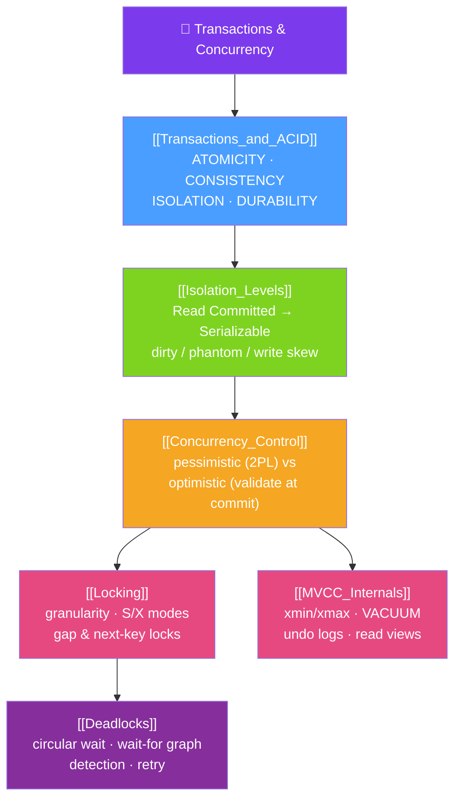

# 🗺️ Transactions & Concurrency — Map of Content

> [!abstract] What This Section Covers
> When many transactions touch the same data at once, a database must make them behave *as if* they ran one at a time — this section is how. It starts with the **transaction** contract and the **ACID** guarantees, then shows the storage-engine machinery (MVCC + abort markers vs undo logs, WAL vs redo). **Isolation levels** are the dial that trades correctness for throughput — the four SQL levels, the anomalies each one prevents (dirty read → non-repeatable read → phantom → lost update → write skew), and how PostgreSQL (Read Committed, SSI) and MySQL/InnoDB (Repeatable Read, next-key locks) diverge from the standard. **Concurrency control** covers the two philosophies (pessimistic 2PL vs optimistic validate-at-commit), **locking** is the pessimistic mechanism in detail (granularity, modes, gap/next-key locks, `FOR UPDATE SKIP LOCKED`), **MVCC internals** is the modern lock-free-reads mechanism down to `xmin`/`xmax`, VACUUM, and undo logs, and **deadlocks** are the circular-wait failure mode you must detect, retry, and design against.

## Concept Map

## Learning Path
1. [[Transactions_and_ACID]] — What a transaction is, the ACID contract, and how engines deliver atomicity/durability (MVCC + abort markers, undo logs, WAL/redo, SAVEPOINT).
2. [[Isolation_Levels]] — The four SQL levels, the anomalies each prevents, and the real PostgreSQL vs MySQL defaults and implementations.
3. [[Concurrency_Control]] — Pessimistic vs optimistic philosophies, 2PL, timestamp ordering, and application-level optimistic locking with a version column.
4. [[Locking]] — Lock granularity, shared/exclusive/intention modes, gap and next-key locks, and `SELECT … FOR UPDATE SKIP LOCKED` for job queues.
5. [[MVCC_Internals]] — How Postgres (heap tuples, VACUUM, bloat, XID wraparound) and InnoDB (undo logs, read views, purge) implement snapshot isolation.
6. [[Deadlocks]] — Circular waits, wait-for-graph detection, victim selection, and prevention via consistent lock ordering and short transactions.

## All Notes at a Glance
| Note | Difficulty | What You'll Learn |
|------|------------|-------------------|
| [[Transactions_and_ACID]] | Intermediate | The transaction lifecycle, ACID guarantees, and the storage-engine machinery (MVCC/undo/WAL/redo, doublewrite, SAVEPOINT) behind them |
| [[Isolation_Levels]] | Advanced | The four levels, dirty/non-repeatable/phantom reads plus lost update and write skew, and Postgres SSI vs InnoDB next-key locks |
| [[Concurrency_Control]] | Advanced | Pessimistic (2PL, strict 2PL, timestamp ordering) vs optimistic control, and version-column optimistic locking at the app layer |
| [[Locking]] | Advanced | Granularity, S/X and intention lock modes, gap/next-key/advisory locks, and SKIP LOCKED / NOWAIT patterns |
| [[MVCC_Internals]] | Advanced | Postgres heap versions + VACUUM (bloat, XID wraparound) vs InnoDB undo logs + read views + purge thread |
| [[Deadlocks]] | Intermediate | Circular waits, InnoDB vs Postgres detection, victim selection, and prevention through lock ordering and short transactions |

## Key Questions This Section Answers
- What do the four ACID properties actually guarantee, and how does the engine deliver each?
- What is the difference between Read Committed and Repeatable Read, and which does Postgres vs MySQL default to?
- What anomalies exist beyond the SQL standard (lost update, write skew), and how do you defend against them?
- When would you choose optimistic concurrency control over pessimistic locking?
- What is a next-key (gap) lock, and how does it prevent phantom reads at Repeatable Read?
- How does MVCC let readers proceed without blocking writers, and why does Postgres need VACUUM?
- What causes a deadlock, how does the database break it, and what must your application do about it?

## Related Sections
- [[_MOC_Database_Master|↑ Database Master MOC]]
- [[_MOC_DB_Storage_Indexing|→ Storage & Indexing]]
- [[_MOC_DB_Distributed|→ Distributed Databases]]
- System Design: [[ACID_and_Transactions]], [[MVCC]]

#MOC #Database #Transactions #Concurrency
