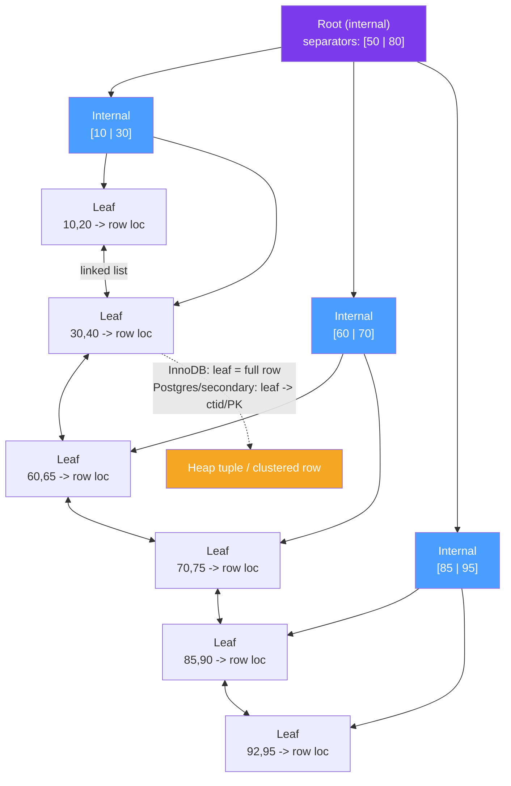

# 🌳 B-Tree Indexes

> [!abstract] TL;DR
> The default index in every mainstream RDBMS is a **B+Tree**: a balanced, high-fanout tree whose *internal* nodes hold only separator keys and whose *leaf* nodes hold the indexed keys plus a row locator, chained together in a **doubly-linked list** for efficient range scans. Because fanout is huge (hundreds of keys per page), even a billion-row table is only 3–4 levels deep → 3–4 page reads per lookup. InnoDB's **primary key is a clustered index** (leaves hold whole rows); its secondary indexes store the **PK** and need a **bookmark lookup**. Postgres keeps a **heap + all-secondary indexes** whose leaves store a `ctid`. Master the **leftmost-prefix rule**, **selectivity**, and **index-only (covering) scans** and you control most query performance.

## Intuition — analogy FIRST

Think of a multi-level phone directory for a huge company. The top volume doesn't list people — it just says "surnames A–F are in Volume 1, G–M in Volume 2…". Open Volume 2 and it again only points to thinner books: "G–H here, I–K there." Only the **thinnest final booklets** actually list a name next to a desk location.

Two properties make this fast:

1. **High fanout** — each pointer page routes you across a huge chunk of the alphabet, so you reach any name in a handful of hops (a shallow tree = few disk seeks).
2. **Linked leaf booklets** — the final booklets are physically chained "…continued in the next booklet", so once you find "Garcia" you can *walk forward* through "Garcia → Gomez → Gupta" without ever returning to the top. That chaining is exactly what makes `BETWEEN` / `ORDER BY` range scans cheap.

That's a B+Tree. The DSA foundation lives in [[B_Plus_Tree]] (and the classic [[B_Tree]]); this note is the database-engine view.

---

## How It Works

### Why B+Tree and not a binary tree or hash?

- **Fanout minimizes disk seeks.** A node = one page. Packing hundreds of keys per page means height ≈ `log_fanout(N)` ≈ 3–4 for billions of rows, so a lookup is ~3–4 page reads. A binary search tree would be ~30 levels = 30 seeks.
- **Keys only in leaves → denser internal nodes.** Unlike a plain B-tree, a B+Tree keeps *data/row-pointers only in the leaves* and *only separator keys* upstairs, so internal nodes fan out even wider and more of the upper tree fits in the buffer pool.
- **Linked leaves → ordered range scans.** Leaves form a sorted doubly-linked list, so `>=`, `BETWEEN`, `ORDER BY`, and `LIKE 'prefix%'` are answered by locating a start leaf and walking the chain. A hash index can do none of these (equality only — see [[Specialized_Indexes]]).



### Clustered vs secondary — the crucial engine difference

| | InnoDB (MySQL) | PostgreSQL |
|---|---|---|
| Primary key | **Clustered index** — leaves hold the *entire row* in PK order | Just another B-tree; leaves hold `ctid` into the heap |
| Secondary index leaf stores | The **PK value** | The **`ctid`** (physical (page,item)) |
| Fetching non-indexed columns | **Bookmark lookup**: secondary leaf → PK → traverse clustered index again | Heap fetch: leaf `ctid` → read heap page |
| Effect of a fat PK | Bloats *every* secondary index (PK stored in each) | No such penalty (ctid is 6 bytes) |
| Index-only scan possible? | Yes, if all needed cols are in the index | Yes, but needs the **visibility map** to confirm the row is all-visible |

So a query like `SELECT total FROM orders WHERE user_id = 7` on InnoDB does: scan `idx_user` leaf → get PK ids → for each, walk the clustered PK tree to fetch `total`. That second hop is the bookmark lookup you eliminate with a covering index.

### Composite indexes and the leftmost-prefix rule

An index on `(a, b, c)` is sorted by `a`, then `b` within equal `a`, then `c`. You can only use a contiguous **left prefix**, and a **range** on one column stops further columns from being used for seeking:

| Query on index `(a, b, c)` | Uses index for… |
|---|---|
| `WHERE a = 1` | ✅ a |
| `WHERE a = 1 AND b = 2` | ✅ a, b |
| `WHERE a = 1 AND b = 2 AND c = 3` | ✅ a, b, c |
| `WHERE b = 2` | ❌ (a skipped) |
| `WHERE a = 1 AND c = 3` | ⚠️ seeks on a only; filters c |
| `WHERE a = 1 AND b > 5 AND c = 3` | ⚠️ seeks a + range on b; c only filtered (range stops the prefix) |
| `WHERE a = 1 ORDER BY b, c` | ✅ sort is free from index order |

Rule: **equality columns first, then the range/sort column** (expanded in [[Index_Design_Strategy]]).

### Index-only / covering scans

If the index contains **every column the query touches**, the engine answers entirely from the index — no heap/clustered fetch. Postgres calls it an **index-only scan** and supports `INCLUDE` (non-key payload columns); MySQL calls a fully-covered query a **covering index** (shown as `Using index` in `EXPLAIN`).

### Index selectivity

**Selectivity = distinct values / total rows.** High selectivity (near 1.0, e.g. `email`) makes an index very effective; a boolean flag (~0.5 or worse) is usually ignored by the planner in favor of a sequential scan, unless a **partial index** targets the rare value.

---

## SQL / Examples

```sql
-- PostgreSQL: default B-tree, composite, covering (INCLUDE), and verifying index-only scans
CREATE INDEX idx_orders_user_created ON orders (user_id, created_at DESC);

-- Covering: keep 'total' as a non-key payload so the query never touches the heap
CREATE INDEX idx_orders_cover ON orders (user_id) INCLUDE (total);

EXPLAIN (ANALYZE, BUFFERS)
SELECT total FROM orders WHERE user_id = 7;
-- Look for "Index Only Scan using idx_orders_cover" and "Heap Fetches: 0"

-- Check selectivity before indexing
SELECT count(DISTINCT status)::float / count(*) AS selectivity FROM orders;
```

```sql
-- MySQL / InnoDB: clustered PK, secondary index bookmark lookup, and covering
CREATE TABLE orders (
  id         BIGINT AUTO_INCREMENT PRIMARY KEY,   -- clustered index: leaves hold rows
  user_id    BIGINT NOT NULL,
  created_at DATETIME NOT NULL,
  total      DECIMAL(10,2),
  KEY idx_user_created (user_id, created_at)       -- secondary: leaves hold PK (id)
) ENGINE=InnoDB;

-- This needs a bookmark lookup: idx_user_created finds ids, then the clustered
-- index is traversed to fetch 'total'.
EXPLAIN SELECT total FROM orders WHERE user_id = 7\G

-- Make it covering by adding total to the secondary index -> EXPLAIN shows "Using index"
ALTER TABLE orders ADD KEY idx_user_cover (user_id, total);
EXPLAIN SELECT total FROM orders WHERE user_id = 7\G   -- Extra: Using index
```

> Difference: Postgres secondary-index leaves point at a physical `ctid`, but an index-only scan must still consult the **visibility map** (dead-tuple MVCC bookkeeping), so a table needing VACUUM can silently do heap fetches. InnoDB secondary leaves store the **PK**, so a non-covered lookup always pays a clustered-index bookmark lookup.

---

## Trade-offs

| Factor | Benefit | Cost |
|---|---|---|
| B+Tree (vs hash) | Equality **and** range + `ORDER BY` + prefix `LIKE` | Slightly slower than hash for pure equality |
| High fanout / shallow tree | 3–4 page reads even at billions of rows | Wide pages must be kept full to preserve fanout |
| Clustered index (InnoDB) | PK range scans are sequential; index-only for PK | Secondary lookups pay a bookmark lookup; fat PK bloats all indexes |
| Heap + secondary (Postgres) | Compact `ctid` pointers; cheap PK choice | Index-only scans depend on visibility map / VACUUM |
| Composite index | One index serves many prefix queries + free sort | Wrong column order makes it unusable; range column ends the prefix |
| Covering / `INCLUDE` | Eliminates heap/bookmark fetch | Larger index; more write overhead |

---

## Common Pitfalls

1. **Wrong composite column order.** `(b, a)` when you always filter on `a` alone is dead weight; equality columns must precede range/sort columns.
2. **A range column mid-index.** In `(a, b, c)` with `b > 5`, column `c` can only be *filtered*, not *seeked* — put the range/sort column last.
3. **Expecting a covering scan but forgetting VACUUM (Postgres).** Index-only scans fall back to heap fetches when the visibility map is stale; watch `Heap Fetches` in `EXPLAIN`.
4. **Fat or random primary key in InnoDB.** The PK is copied into every secondary index and dictates physical row order — a random UUID both bloats indexes and fragments the clustered tree.
5. **Indexing a low-selectivity column.** A B-tree on a boolean/`status` column is usually ignored by the optimizer; use a **partial index** on the rare value instead (see [[Specialized_Indexes]]).
6. **Function/expression on the indexed column in the predicate.** `WHERE lower(email) = ...` or `WHERE created_at::date = ...` disables the plain index — you need an expression index.

---

## Related Concepts

- [[_MOC_DB_Storage_Indexing|↑ Section MOC]]
- [[B_Plus_Tree]] — the data-structure foundation: node splits, fanout, linked leaves (DSA vault)
- [[B_Tree]] — the classic B-tree the B+Tree specializes (DSA vault)
- [[Indexing]] — general indexing theory (DSA vault)
- [[Storage_Engine_Internals]] — pages, heap vs clustered storage that these indexes point into
- [[Specialized_Indexes]] — hash, GIN, GiST, BRIN, partial & expression indexes for non-B-tree cases
- [[Index_Design_Strategy]] — practical column-ordering and covering-index decisions
- [[Database_Indexes]] — systems-level index overview (System Design vault)
- [[MVCC_Internals]] — visibility map that gates Postgres index-only scans

---

## Review Questions

1. Explain precisely what a "bookmark lookup" is in InnoDB and why a covering secondary index eliminates it. What is the Postgres equivalent and what extra structure must it consult?
2. Given `CREATE INDEX idx ON t (a, b, c)`, which columns can the engine *seek* on for `WHERE a = 1 AND b > 10 AND c = 5`, and why does the range on `b` matter?
3. Why is a B+Tree preferred over a hash index as the default, and over a balanced binary search tree, for on-disk data? Tie each reason to a disk-I/O property.

---

## Sources

- PostgreSQL Documentation — B-Tree Indexes & Index-Only Scans — https://www.postgresql.org/docs/current/indexes-index-only-scans.html
- MySQL Reference Manual — Clustered and Secondary Indexes — https://dev.mysql.com/doc/refman/8.0/en/innodb-index-types.html
- "Use The Index, Luke!" — Markus Winand — https://use-the-index-luke.com/
- "Database Internals" — Alex Petrov, Ch. 2–4 (B-Tree basics and variants)

#Database #Storage #Indexing #BTree #BPlusTree #ClusteredIndex #CoveringIndex
