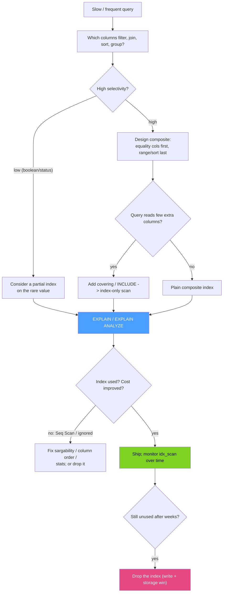

# 🎯 Index Design Strategy

> [!abstract] TL;DR
> Good indexing is a discipline, not a reflex. Index the columns that appear in **`WHERE`, `JOIN`, `ORDER BY`, and `GROUP BY`**. In a composite index, put **equality columns first, then the range/sort column** (equality-before-range). Prefer **covering / index-only** scans on hot paths to skip the heap. Use **partial indexes** for skewed data. Guard against **over-indexing** — every index taxes writes and storage — and periodically **drop unused indexes** (`pg_stat_user_indexes`, `sys.schema_unused_indexes`). Finally, always **verify with `EXPLAIN`**, because the optimizer will ignore an index if it estimates a scan is cheaper or your predicate isn't sargable.

## Intuition — analogy FIRST

Indexes are like **shortcuts you carve into a garden**. A few well-placed paths get everyone to the popular spots fast. But if you pave a shortcut for *every conceivable* route, three things happen: the garden becomes mostly pavement (storage), every time you replant a bed you must repave all the paths crossing it (write cost), and the gardener wastes time maintaining trails no one walks (unused indexes).

The craft is **matching a small set of paths to how people actually walk** — which is exactly what your `WHERE`/`JOIN`/`ORDER BY` clauses tell you. And the only way to know a shortcut is truly being used is to *watch people walk it* — that's `EXPLAIN`.

---

## How It Works



### 1. Which columns to index

Index columns that appear in:

- **`WHERE`** predicates (the primary filter) — especially high-selectivity ones.
- **`JOIN … ON`** keys — the foreign-key side is a frequent miss; index it.
- **`ORDER BY` / `GROUP BY`** — an index in the right order provides the sort/grouping for free (no separate sort step).

### 2. Composite column ordering — equality before range

For a query like `WHERE user_id = 7 AND created_at > '2026-01-01' ORDER BY created_at`, the index `(user_id, created_at)` is optimal: `user_id` equality narrows to a contiguous slice, then `created_at` serves both the range *and* the sort. Reverse it — `(created_at, user_id)` — and the equality can't seek. **Rule: equality columns first, then the single range or sort column last** (the range column ends the usable prefix; see [[BTree_Indexes]]).

### 3. Covering / index-only scans

If a query's projected columns all live in the index, the engine answers without touching the table (Postgres **index-only scan** / `INCLUDE`; MySQL **covering index** / `Using index`). This is the single biggest win on read-hot paths — it turns two I/Os (index + heap/bookmark) into one.

### 4. Partial indexes for skew

When one value dominates (`status='active'` is 99 % of rows), a full index is wasteful. Index only the minority you actually query: `... WHERE status = 'pending'`. Smaller index, cheaper writes on the majority.

### 5. Avoid over-indexing

Every index must be updated on `INSERT`/`UPDATE`/`DELETE` and consumes storage and buffer-pool space. Ten indexes on a write-heavy table can halve write throughput. Prefer **fewer, well-designed composite indexes** that each serve several query prefixes over many single-column ones.

### 6. Monitor and drop unused indexes

Indexes accumulate as features churn. Periodically find ones the optimizer never uses and drop them.

### 7. When the optimizer ignores an index

- **Non-sargable predicate** — a function/cast wraps the column (`WHERE lower(email)=…`, `WHERE created_at::date=…`), a leading wildcard (`LIKE '%x'`), or an implicit type mismatch. Fix the query or add an **expression index**.
- **Low selectivity** — reading most of the table is cheaper as a `Seq Scan`; the planner is right.
- **Stale statistics** — run `ANALYZE` (PG) / `ANALYZE TABLE` (MySQL) so estimates match reality.
- **Small table** — a full scan of a few thousand rows beats index overhead.

---

## SQL / Examples

```sql
-- PostgreSQL: design, verify, and monitor
-- Composite (equality-before-range) + covering payload for an index-only scan
CREATE INDEX idx_orders_user_created
  ON orders (user_id, created_at) INCLUDE (total);

EXPLAIN (ANALYZE, BUFFERS)
SELECT total FROM orders
WHERE user_id = 7 AND created_at > '2026-01-01'
ORDER BY created_at;
-- Want: "Index Only Scan", "Heap Fetches: 0", no separate Sort node

-- Partial index for skewed status
CREATE INDEX idx_orders_pending ON orders (created_at) WHERE status = 'pending';

-- Find UNUSED indexes to drop (idx_scan = 0 since stats reset)
SELECT relname AS table, indexrelname AS index,
       idx_scan, pg_size_pretty(pg_relation_size(indexrelid)) AS size
FROM pg_stat_user_indexes
WHERE idx_scan = 0
ORDER BY pg_relation_size(indexrelid) DESC;

ANALYZE orders;   -- refresh planner statistics
```

```sql
-- MySQL / InnoDB: equivalents
CREATE INDEX idx_orders_user_created ON orders (user_id, created_at, total);  -- covering

EXPLAIN SELECT total FROM orders
WHERE user_id = 7 AND created_at > '2026-01-01'
ORDER BY created_at\G
-- Want Extra: "Using index" (covering) and no "Using filesort"

-- Partial indexes aren't supported; emulate with a functional/generated column index.
-- Find UNUSED indexes via the sys schema (performance_schema must be enabled)
SELECT * FROM sys.schema_unused_indexes;

-- Test-drop safely first with an invisible index, then drop for real
ALTER TABLE orders ALTER INDEX idx_old INVISIBLE;   -- optimizer ignores it; watch for regressions
-- ALTER TABLE orders DROP INDEX idx_old;

ANALYZE TABLE orders;   -- refresh statistics
```

> Differences: Postgres has **partial** and **`INCLUDE`** indexes and exposes usage via `pg_stat_user_indexes`; MySQL lacks partial indexes (emulate with generated columns), makes a covering index by listing the payload columns as key parts, and surfaces unused indexes via `sys.schema_unused_indexes` plus the safe **invisible index** dry-run.

---

## Trade-offs

| Decision | Benefit | Cost |
|---|---|---|
| Composite over many single-column | One index serves several prefix queries; free sort | Must match real query column order |
| Covering / `INCLUDE` | Index-only scan eliminates heap/bookmark fetch | Larger index; more write overhead |
| Partial index | Small, cheap, targeted at skewed data | Only helps queries matching the predicate |
| More indexes | Faster, more varied reads | Slower writes, more storage, buffer-pool pressure |
| Fewer indexes | Fast writes, lean storage | Some queries fall back to Seq Scan |
| Dropping unused | Reclaims write throughput + space | Risk if a rare/periodic query silently needed it |

---

## Common Pitfalls

1. **Reversed composite order.** Putting the range/sort column before the equality column makes the equality unseekable — always equality-first.
2. **Non-sargable predicates.** Wrapping the indexed column in a function/cast, or a leading-wildcard `LIKE '%x'`, silently disables the index. Rewrite or add an expression index.
3. **Never running `EXPLAIN`.** Adding an index and *assuming* it's used is the top cause of "the index didn't help." Verify the plan, and re-check after data grows.
4. **Over-indexing write-heavy tables.** Each extra index taxes every write; audit before adding, and consolidate overlapping indexes.
5. **Stale statistics.** After a bulk load or big data shift, the planner's estimates are wrong and it may skip a good index — `ANALYZE`.
6. **Dropping an index used only by a nightly/quarterly job.** `idx_scan = 0` since the last stats reset doesn't mean *never used*; check over a full business cycle (or use MySQL's invisible-index dry run) before dropping.

---

## Related Concepts

- [[_MOC_DB_Storage_Indexing|↑ Section MOC]]
- [[BTree_Indexes]] — composite ordering, leftmost prefix, covering scans in depth
- [[Specialized_Indexes]] — partial/expression/GIN/BRIN choices this strategy selects among
- [[Storage_Engine_Internals]] — why each index adds write and buffer-pool cost
- [[SQL_Tuning]] — broader RDBMS tuning: EXPLAIN, partitioning, query rewrites (System Design vault)
- [[Query_Tuning]] — query-level optimization companion
- [[Execution_Plans]] — reading and interpreting planner output
- [[Database_Indexes]] — systems-level index overview (System Design vault)

---

## Review Questions

1. You must index for `WHERE customer_id = ? AND created_at BETWEEN ? AND ? ORDER BY created_at DESC`. Give the exact composite index (and any covering columns), and explain why the column order matters.
2. List four distinct reasons the optimizer might ignore an index that "should" apply, and give the fix for each.
3. How do you safely decide an index is truly unused before dropping it in (a) PostgreSQL and (b) MySQL? What could go wrong if you rely only on a single snapshot?

---

## Sources

- PostgreSQL Documentation — Indexes: Multicolumn, Partial, Index-Only & Statistics — https://www.postgresql.org/docs/current/indexes.html
- MySQL Reference Manual — Optimization & Index Usage; sys.schema_unused_indexes — https://dev.mysql.com/doc/refman/8.0/en/optimization-indexes.html
- "Use The Index, Luke!" — Markus Winand — https://use-the-index-luke.com/
- "SQL Performance Explained" — Markus Winand (composite ordering, covering, sargability)

#Database #Storage #Indexing #IndexDesign #CoveringIndex #PartialIndex #EXPLAIN #QueryTuning
