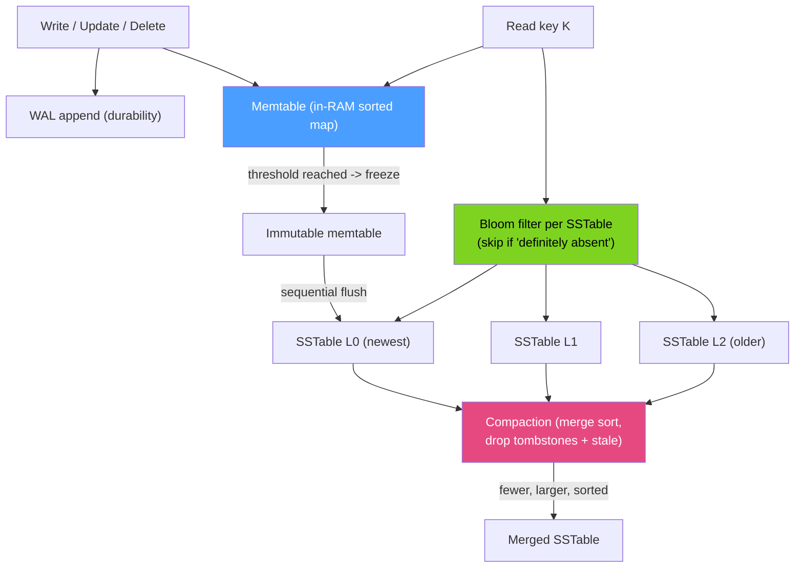

# 📥 LSM-Trees (Log-Structured Merge Trees)

> [!abstract] TL;DR
> An **LSM-tree** is the write-optimized alternative to the B-tree. Writes go to an in-memory sorted structure (**memtable**) backed by a **write-ahead log**; when it fills, it is flushed as an immutable, sorted **SSTable** on disk. Background **compaction** merges SSTables to reclaim space and bound read cost. This turns random writes into **sequential** ones (great write throughput) at the price of extra work on reads (checking several SSTables) and **write amplification** from repeated re-merging. **Bloom filters** let a read skip SSTables that can't contain a key. LSM powers **RocksDB, LevelDB, Cassandra, ScyllaDB, HBase, and MySQL MyRocks**; the classic **B-tree** ([[BTree_Indexes]]) remains the read-optimized default.

## Intuition — analogy FIRST

Imagine keeping a to-do system with two rules: (1) never erase, only append, and (2) newest note wins.

- New tasks are jotted on a **sticky pad on your desk** (the memtable) — instant, no filing.
- When the pad is full, you don't interleave it into your big binder — you just **staple the whole sorted pad into a new booklet** and file it (flush → SSTable). Filing is one clean sequential motion.
- Over weeks you accumulate many booklets. To look something up you check the desk pad first, then the newest booklet, then older ones — stopping at the first hit because newest wins.
- Periodically a clerk **merges several booklets into one tidy volume**, dropping superseded and deleted entries (compaction). This keeps the number of booklets — and thus your search effort — under control.

The B-tree does the opposite: it edits the binder *in place* on every write (random I/O, read-cheap). The LSM-tree defers and batches all that reorganization, trading read work for blazing sequential writes.

---

## How It Works

### The write path

1. **WAL append** — the mutation is appended to a commit log for durability (crash-recoverable; see [[Write_Ahead_Logging]]).
2. **Memtable insert** — the row is inserted into an in-memory sorted map (skip list / balanced tree). Updates and deletes are just new entries; a delete writes a **tombstone** marker.
3. **Flush** — when the memtable hits a size threshold it becomes immutable and is written out sequentially as a sorted **SSTable** (Sorted String Table) with a block index and (usually) a Bloom filter. A fresh memtable takes over.
4. **Compaction** — background threads merge multiple SSTables into fewer, larger, non-overlapping ones, discarding overwritten values and tombstoned keys.



### The read path & Bloom filters

A point read checks the memtable, then SSTables newest→oldest, returning the first match (a tombstone means "deleted"). To avoid touching every SSTable, each carries a **Bloom filter** — a probabilistic bitset that answers "is key K possibly here?" with **no false negatives**. If it says "definitely not," the read skips that SSTable's disk block entirely. This is what keeps LSM point reads competitive. Range scans still merge across overlapping SSTables (Bloom filters don't help ranges).

### Compaction strategies

- **Leveled (LevelDB/RocksDB default)** — data is organized into levels L0…Ln, each ~10× the previous, with **non-overlapping** key ranges within a level. A read touches at most one SSTable per level → good, bounded read amplification, but higher **write amplification** (data rewritten as it descends levels).
- **Tiered / size-tiered (Cassandra default)** — accumulate several similar-sized SSTables, then merge them into one bigger tier. Lower write amplification and higher write throughput, but **more SSTables overlap** → worse read and space amplification.

### The three amplifications

LSM design is a balancing act among:

| Amplification | Meaning | Worse with… |
|---|---|---|
| **Write** | Bytes written to disk ÷ bytes of user data | Leveled compaction (re-merges) |
| **Read** | SSTables/blocks touched per lookup | Tiered compaction; too many L0 files |
| **Space** | Disk used ÷ live data | Tiered compaction; overwrites/tombstones not yet compacted |

You cannot minimize all three at once — the "RUM conjecture." B-trees sit at the read-optimized end; LSM-trees at the write-optimized end.

### B-tree vs LSM-tree

| | B-tree ([[BTree_Indexes]]) | LSM-tree |
|---|---|---|
| Writes | In-place, random I/O | Append-only, sequential I/O |
| Optimized for | Reads, range scans | High write/ingest throughput |
| Write amplification | Lower (per write) but random | Higher (compaction) but sequential |
| Space | Fragmentation, fill factor slack | Tombstones + stale until compacted |
| Concurrency | Page locks / latches | Immutable SSTables → lock-free reads |
| Examples | Postgres, InnoDB, most RDBMS | RocksDB, LevelDB, Cassandra, ScyllaDB, HBase, MyRocks |

---

## SQL / Examples

LSM-trees usually sit *under* NoSQL/embedded stores, but they also appear as pluggable engines in the SQL world.

```sql
-- MySQL: MyRocks is a RocksDB-backed (LSM) storage engine, an alternative to InnoDB.
-- Great for write-heavy / space-constrained workloads (e.g. Facebook's UDB).
CREATE TABLE events (
  id       BIGINT AUTO_INCREMENT PRIMARY KEY,
  user_id  BIGINT NOT NULL,
  payload  JSON,
  KEY idx_user (user_id)
) ENGINE=ROCKSDB;

SHOW ENGINES;                                  -- confirm ROCKSDB is available
SHOW VARIABLES LIKE 'rocksdb_max_background_jobs';   -- compaction concurrency
SHOW STATUS LIKE 'rocksdb_compact%';                 -- compaction activity
```

```sql
-- PostgreSQL core uses heap + B-tree (not LSM). The columnar/analytics extensions
-- (e.g. Citus columnar, TimescaleDB compression) are the write-optimized analog,
-- but for a native LSM you reach for an embedded engine or a wide-column store.

-- Cassandra (CQL) is LSM-native. A DELETE writes a tombstone, not an in-place erase:
-- DELETE FROM events WHERE user_id = 7;   -- creates tombstones, reclaimed at compaction
-- Excess un-compacted tombstones cause the infamous "tombstone read" slowdown.
```

> Difference: In an InnoDB/Postgres (B-tree) table a `DELETE` frees/marks the row in place; in an LSM store it appends a **tombstone**, and the space is only reclaimed when compaction rewrites that key range — which is why delete-heavy Cassandra workloads must tune compaction and `gc_grace_seconds`.

---

## Trade-offs

| Factor | LSM benefit | LSM cost |
|---|---|---|
| Write throughput | Sequential, append-only → very high ingest | Compaction consumes background CPU/IO |
| Reads | Bloom filters skip most SSTables for point reads | Must merge multiple SSTables (esp. range scans) |
| Space | Good compression on immutable SSTables | Stale versions + tombstones until compacted |
| Concurrency | Immutable SSTables = lock-free reads | Compaction can cause latency spikes ("write stalls") |
| Deletes | O(1) tombstone write | Reads scan tombstones; delayed reclamation |
| Tunability | Leveled vs tiered lets you pick the amplification you can afford | Cannot minimize write, read, and space at once |

---

## Common Pitfalls

1. **Tombstone pileup.** Delete- or TTL-heavy workloads (queues, expiring data) accumulate tombstones that slow reads and delay space reclamation; tune compaction and grace periods.
2. **Ignoring write amplification.** Leveled compaction can rewrite each byte many times; on flash this affects endurance and write bandwidth. Size-tiered trades this for read/space amplification — pick deliberately.
3. **Assuming point-read speed for range scans.** Bloom filters don't help range queries; overlapping SSTables must all be merged, so wide scans are slower than on a B-tree.
4. **Under-provisioned compaction.** If compaction can't keep up with ingest, L0 files pile up, read amplification explodes, and the engine issues **write stalls/back-pressure**.
5. **Treating LSM as universally better.** For read-heavy, range-scan, or low-write workloads a B-tree usually wins. LSM shines on write-/ingest-heavy and space-sensitive workloads.
6. **Forgetting the WAL still exists.** The memtable is volatile; durability comes from the commit log. Disabling it for speed risks data loss on crash.

---

## Related Concepts

- [[_MOC_DB_Storage_Indexing|↑ Section MOC]]
- [[BTree_Indexes]] — the read-optimized counterpart LSM trades against
- [[Write_Ahead_Logging]] — the commit log that makes the volatile memtable durable
- [[Storage_Engine_Internals]] — pages/buffer pool vs SSTable/memtable model
- [[Specialized_Indexes]] — Bloom filters also appear as a specialized skip structure
- [[OLTP_vs_OLAP]] — write-optimized ingest vs analytical read patterns
- [[Write_Ahead_Log]] — systems-level durability log (System Design vault)

---

## Review Questions

1. Trace a single `PUT` and a later `GET` for the same key through an LSM-tree, naming every structure it touches (WAL, memtable, SSTables, Bloom filter). How does the engine know which version is current?
2. Define write, read, and space amplification, and explain why leveled and tiered compaction make opposite trade-offs among them. Which would you pick for a high-ingest time-series store?
3. Why can a delete-heavy Cassandra table become *slower to read* over time, and what mechanism (and tuning knob) governs when that space is reclaimed?

---

## Sources

- O'Neil et al. (1996) — "The Log-Structured Merge-Tree (LSM-Tree)" (original paper)
- RocksDB Wiki — Leveled & Universal (Tiered) Compaction — https://github.com/facebook/rocksdb/wiki
- "Designing Data-Intensive Applications" — Martin Kleppmann, Ch. 3 (SSTables, LSM-trees, B-trees)
- Cassandra Documentation — Compaction & Tombstones — https://cassandra.apache.org/doc/latest/

#Database #Storage #Indexing #LSMTree #Compaction #BloomFilter #SSTable #RocksDB
