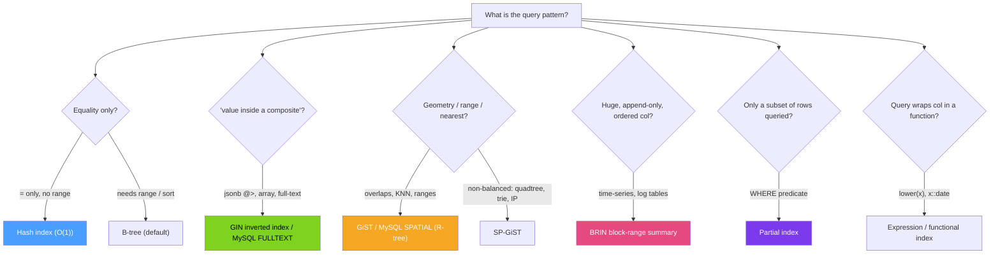

# 🧰 Specialized Indexes

> [!abstract] TL;DR
> The B+Tree is the default, but many queries are better served by a **purpose-built index**. **Hash** = O(1) equality only. Postgres **GIN** = inverted index for "value inside a composite" (`jsonb`, arrays, full-text). **GiST** = extensible tree for geometry, ranges, and nearest-neighbor. **SP-GiST** = space-partitioning for non-balanced data (quadtrees, tries). **BRIN** = tiny block-range summaries for huge, naturally-ordered append-only tables. **Bitmap index scans** combine several indexes at query time. **Partial** (`WHERE`), **expression/functional**, and **covering** (`INCLUDE`) indexes reshape any index type. MySQL adds **FULLTEXT** (inverted), **SPATIAL** (R-tree), **functional** (8.0.13+), and **invisible** indexes. Pick the index to match the *query pattern*, not out of habit.

## Intuition — analogy FIRST

A B-tree is a great *general* filing cabinet — sorted, alphabetical. But you wouldn't use it for every question:

- To find "which documents mention the word *invoice*," you don't scan every document — you keep a **word → list-of-documents** concordance. That's an **inverted index** (GIN / FULLTEXT).
- To find "the nearest coffee shop to me," alphabetical order is useless; you need a **map with regions**, so you can prune whole neighborhoods. That's a **spatial tree** (GiST / R-tree).
- For a warehouse ledger sorted by date where you only ever ask "rows from last March," you don't need a per-row index — just a sticky note on each shelf saying "this shelf: Jan–Mar." That's **BRIN**: min/max summaries per block range, tiny and cheap.
- And sometimes you only care about a *slice* of the data ("only unshipped orders") — index just that slice: a **partial index**.

Match the index's *shape* to the question's *shape*.

---

## How It Works



### Hash indexes

O(1) equality; **no ranges, no sorting, no prefix `LIKE`**. In Postgres, hash indexes are WAL-logged and crash-safe since v10. Rarely worth it over a B-tree (which also does equality) unless the key is very large and equality is the *only* access pattern.

### GIN — Generalized Inverted iNdex (Postgres)

An **inverted index**: for each *element/token* inside a composite value, GIN stores the list of rows containing it. Ideal for **`jsonb`** containment (`@>`, `?`), **arrays** (`&&`, `@>`), and **full-text search** (`tsvector @@ tsquery`). Fast to search, slower to update (use `fastupdate` / pending list); great when one row contains many searchable elements. MySQL's equivalent for text is **FULLTEXT** (also an inverted index) with `MATCH … AGAINST`.

### GiST / SP-GiST (Postgres) and SPATIAL (MySQL)

**GiST** is an extensible, balanced tree framework: it powers **geometric** queries (PostGIS `&&` overlap, `<->` nearest-neighbor / KNN), **range types**, and exclusion constraints. **SP-GiST** is for **space-partitioning, non-balanced** structures — quadtrees, k-d trees, radix tries — good for point data, IP/prefix, and text tries. MySQL's **SPATIAL** index is an **R-tree** over `GEOMETRY` columns (`ST_Contains`, `ST_Distance`).

### BRIN — Block Range INdex (Postgres)

Instead of one entry per row, BRIN stores the **min/max (summary) per range of blocks** (e.g., every 128 pages). Microscopic size, so it fits in cache. It only works when the column is **physically correlated** with storage order (append-only time-series, log tables, monotonically increasing ids). A query prunes block ranges whose min/max can't match, then rechecks surviving rows. Huge win on billion-row tables where a B-tree would be enormous.

### Bitmap index scans (Postgres, at query time)

Not a stored index type — a **runtime strategy**. Postgres can scan several indexes, build in-memory **bitmaps** of matching row locations, combine them with AND/OR, then fetch heap pages in physical order. This is how multiple single-column indexes cooperate on `WHERE a = 1 AND b = 2` without a composite index (though a composite is still faster for the hot path).

### Partial, expression, and covering indexes (both engines)

- **Partial index** — `... WHERE predicate`: index only the rows you query (e.g., `WHERE shipped_at IS NULL`). Smaller, faster, cheaper writes for non-matching rows.
- **Expression / functional index** — index the *result* of a function so `WHERE lower(email) = ...` or `WHERE (data->>'age')::int > 30` becomes seekable. MySQL added functional key parts in **8.0.13**.
- **Covering / `INCLUDE`** — add payload columns so a query is answered index-only (see [[BTree_Indexes]]).
- **Invisible indexes (MySQL 8.0)** — an index the optimizer ignores; test dropping an index safely before actually removing it.

---

## SQL / Examples

```sql
-- PostgreSQL: the specialized toolbox
-- GIN for JSONB containment and full-text
CREATE INDEX idx_doc_data     ON documents USING gin (data jsonb_path_ops);
CREATE INDEX idx_doc_search   ON documents USING gin (to_tsvector('english', body));
SELECT * FROM documents WHERE data @> '{"status":"active"}';
SELECT * FROM documents WHERE to_tsvector('english', body) @@ plainto_tsquery('invoice');

-- GiST for geometry + nearest-neighbor (KNN); BRIN for huge time-series
CREATE INDEX idx_geo   ON places USING gist (location);
SELECT * FROM places ORDER BY location <-> ST_MakePoint(-73.98, 40.75) LIMIT 5;
CREATE INDEX idx_brin  ON events USING brin (created_at) WITH (pages_per_range = 128);

-- Partial + expression + hash
CREATE INDEX idx_unshipped ON orders (created_at) WHERE shipped_at IS NULL;
CREATE INDEX idx_email_ci  ON users (lower(email));
CREATE INDEX idx_token     ON sessions USING hash (token);   -- equality only
```

```sql
-- MySQL / InnoDB: the equivalents
-- FULLTEXT (inverted index) for natural-language search
ALTER TABLE documents ADD FULLTEXT INDEX ft_body (body);
SELECT * FROM documents WHERE MATCH(body) AGAINST('invoice' IN NATURAL LANGUAGE MODE);

-- SPATIAL (R-tree) index on a NOT NULL geometry column
ALTER TABLE places ADD SPATIAL INDEX sp_loc (location);
SELECT * FROM places WHERE ST_Contains(@poly, location);

-- Functional key part (8.0.13+), invisible index for safe testing
ALTER TABLE users ADD INDEX idx_email_ci ((lower(email)));
ALTER TABLE orders ALTER INDEX idx_status INVISIBLE;   -- optimizer ignores it; test impact
```

> Differences: Postgres exposes a rich, extensible index API (GIN/GiST/SP-GiST/BRIN + `USING hash`); MySQL/InnoDB is narrower — B-tree everywhere, plus **FULLTEXT** (inverted) and **SPATIAL** (R-tree), functional key parts, and **invisible** indexes. There is no MySQL BRIN/GIN/GiST; for JSON, MySQL relies on **functional indexes over generated columns** rather than a native inverted index.

---

## Trade-offs

| Index type | Best for | Weakness |
|---|---|---|
| Hash | Pure equality on large keys | No ranges/sort; rarely beats B-tree |
| GIN / FULLTEXT | Membership inside jsonb/arrays/text | Slower, larger writes; big index |
| GiST / SPATIAL | Geometry, ranges, KNN | Lossy → recheck; build cost |
| SP-GiST | Non-balanced/point/prefix data | Niche; fewer operator classes |
| BRIN | Massive, ordered, append-only tables | Useless if data isn't physically correlated |
| Bitmap scan | Combining several indexes ad hoc | Runtime cost; composite index is faster for hot paths |
| Partial | Querying a small hot subset | Only helps queries matching the predicate |
| Expression | Function-wrapped predicates | Must match the exact expression used |

---

## Common Pitfalls

1. **Reaching for a hash index by reflex.** A B-tree already does equality *and* ranges; a hash index only pays off in narrow equality-only cases.
2. **BRIN on unordered data.** If the column isn't correlated with physical row order, BRIN prunes nothing and the query degenerates to a full scan; re-`CLUSTER`/order-load first.
3. **GIN write cost surprise.** GIN/FULLTEXT indexes are expensive to update on write-heavy tables; batch inserts and tune `fastupdate`/`ft_*` settings.
4. **Expression index that doesn't match the query.** `WHERE lower(email)=…` only uses `idx(lower(email))` if the expression is written identically; a subtle cast difference disables it.
5. **Assuming MySQL has GIN/GiST.** It doesn't — for JSON you index a **generated column** or a functional key part, and for text you use FULLTEXT.
6. **Forgetting the recheck step.** Lossy indexes (GiST, bitmap) return candidate rows the engine must recheck; don't assume every returned index hit is a final match.

---

## Related Concepts

- [[_MOC_DB_Storage_Indexing|↑ Section MOC]]
- [[BTree_Indexes]] — the default these specialize away from; covering/`INCLUDE` details
- [[Index_Design_Strategy]] — choosing among these in practice and verifying with EXPLAIN
- [[Storage_Engine_Internals]] — pages the bitmap heap scan fetches in physical order
- [[LSM_Trees]] — Bloom filters as another probabilistic skip structure
- [[Indexing]] — general indexing theory (DSA vault)
- [[Database_Indexes]] — systems-level index overview (System Design vault)

---

## Review Questions

1. For each of these queries, name the ideal index type and engine feature: (a) `jsonb @> '{"k":"v"}'`, (b) 5 nearest points to a coordinate, (c) "rows from a 2-billion-row time-series table for last week," (d) case-insensitive email login. Justify each.
2. Why does BRIN only work when the indexed column correlates with physical storage order, and how would you make a table BRIN-friendly?
3. What is a bitmap index scan, and how does it let Postgres use two separate single-column indexes for `WHERE a = 1 AND b = 2` without a composite index? When would you still prefer the composite index?

---

## Sources

- PostgreSQL Documentation — Index Types (GIN, GiST, SP-GiST, BRIN, Hash) — https://www.postgresql.org/docs/current/indexes-types.html
- MySQL Reference Manual — FULLTEXT, SPATIAL, Functional & Invisible Indexes — https://dev.mysql.com/doc/refman/8.0/en/create-index.html
- PostGIS Documentation — Spatial Indexing with GiST — https://postgis.net/docs/
- "The Art of PostgreSQL" — Dimitri Fontaine (index types and use cases)

#Database #Storage #Indexing #SpecializedIndexes #GIN #GiST #BRIN #FullText #Spatial
