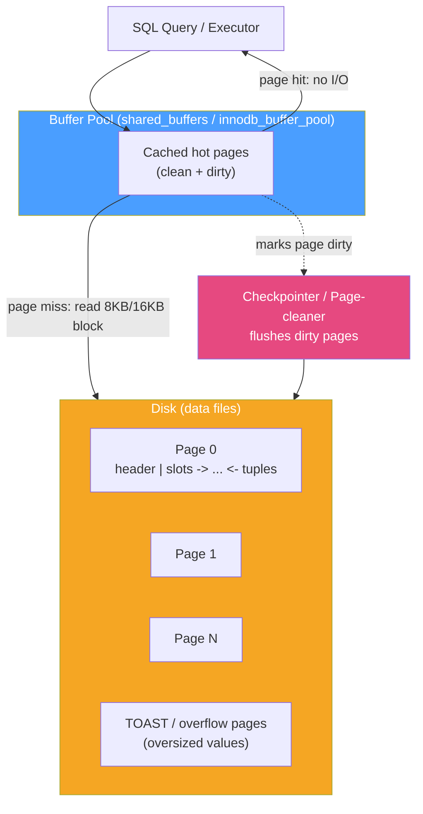

# 🧱 Storage Engine Internals

> [!abstract] TL;DR
> A relational database never reads or writes single rows from disk — it reads and writes fixed-size **pages** (Postgres 8 KB, InnoDB 16 KB) through an in-memory **buffer pool** (`shared_buffers` / InnoDB buffer pool). Rows (tuples) are packed into pages with a header and a slot directory. Postgres stores rows in an unordered **heap** with separate indexes; InnoDB stores rows *inside* the primary-key B+Tree (an **index-organized table / clustered index**). Modified pages become **dirty**, are flushed lazily by a background **checkpointer/writer**, and oversized values are pushed out-of-line (Postgres **TOAST**, InnoDB overflow pages).

## Intuition — analogy FIRST

Imagine a library where books can only be moved in and out of the reading room one **shelf-tray at a time** — never a single book. Each tray holds many books plus a little index card taped to the front listing which slot each book sits in.

- The **reading room** is the buffer pool (RAM). It has limited desk space, so only the hottest trays stay out.
- The **stacks** are the disk. Fetching a tray from the stacks is thousands of times slower than reaching for one already on your desk.
- When you scribble edits into a book, you *don't* run it back to the stacks immediately — you mark the tray "dirty" and a janitor (the checkpointer) reshelves batches of dirty trays later.
- An unusually thick book won't fit the tray, so the librarian stores it in an overflow closet (TOAST / overflow pages) and leaves a note pointing to it.

The whole storage engine is engineering around one brutal fact: **disk I/O happens in blocks, and blocks are expensive**, so amortize everything across pages and cache aggressively.

---

## How It Works

### The page (a.k.a. block)

A page is the atomic unit of disk I/O. Everything — heap rows, index nodes, free space maps — lives in pages.

| | PostgreSQL | MySQL / InnoDB |
|---|---|---|
| Default page size | 8 KB (`BLCKSZ`, compile-time) | 16 KB (`innodb_page_size`, 4/8/16/32/64 KB) |
| Row storage | Heap (unordered) + separate indexes | Clustered index (rows stored in PK B+Tree) |
| Row locator | `ctid` = (block#, item#) | Primary key value |
| Oversized values | TOAST tables + compression | Overflow (BLOB) pages, 20-byte pointer in row |
| Free-space tracking | Free Space Map (FSM) fork | `PAGE_FREE` list per page + segment inventory |

### Page layout (heap page)

A Postgres heap page is a header, then an array of **item pointers (line pointers)** growing downward from the top, and the actual **tuples** growing upward from the bottom. The gap in the middle is free space.



### Row / tuple layout

Each row carries a **row header** before its user data:

- **Postgres `HeapTupleHeader` (23 bytes)** — `xmin`/`xmax` (the MVCC transaction IDs that created/deleted the row — see [[MVCC_Internals]]), `ctid` (self/forward pointer), an infomask, and a null bitmap. Because deletes and updates just stamp `xmax` and write a *new* version, Postgres accumulates dead tuples that `VACUUM` later reclaims.
- **InnoDB row** — a variable-length header plus two hidden system columns: `DB_TRX_ID` (last transaction) and `DB_ROLL_PTR` (pointer to the undo record for the prior version). InnoDB updates rows *in place* and keeps old versions in the undo log rather than in the page.

### Heap files vs index-organized tables

- **Postgres = heap + secondary indexes.** Rows sit in an unordered heap file. *Every* index (including the PK) is "secondary": its leaves store the `ctid` pointing back into the heap. There is no clustered index; `CLUSTER` only reorders the heap once and is not maintained.
- **InnoDB = index-organized table.** The table *is* the clustered PK B+Tree — leaf pages hold the full rows in PK order. Secondary indexes store the **PK value** (not a physical pointer), so a secondary lookup that needs non-indexed columns does a second traversal of the clustered index (a **bookmark lookup**). This is why a fat PK bloats every secondary index. See [[BTree_Indexes]].

### Buffer pool, dirty pages, and checkpoints

The buffer pool caches pages so repeated access avoids disk. Writes mutate the **cached** copy, mark it **dirty**, and record the change in the WAL first (see [[Write_Ahead_Logging]]). A background process later writes dirty pages back:

- **Postgres** — `shared_buffers` (rule of thumb ~25 % of RAM), the **bgwriter** trickles dirty pages out, and the **checkpointer** periodically forces *all* dirty pages to disk so recovery has a bounded starting point (`checkpoint_timeout`, `max_wal_size`).
- **InnoDB** — `innodb_buffer_pool_size` (often 50–75 % of RAM), **page-cleaner** threads flush using an LRU + flush list, and sharp/fuzzy checkpoints advance the redo-log tail.

### Fill factor / free space

Leaving slack in each page lets in-place updates stay on the same page instead of spilling to a new one:

- **Postgres `fillfactor`** (default 100 for tables) enables **HOT (Heap-Only Tuple)** updates — a new version fits in the same page and no index entry is needed.
- **InnoDB `MERGE_THRESHOLD` / page fill** — pages split at ~15/16 full and merge below 50 %; a too-low fill factor wastes space, too-high causes page splits on insert.

---

## SQL / Examples

```sql
-- PostgreSQL: see physical location (ctid) and set fillfactor to leave update slack
SELECT ctid, id, name FROM users LIMIT 3;   -- ctid = (page, item)
ALTER TABLE users SET (fillfactor = 90);
VACUUM (VERBOSE, ANALYZE) users;            -- reclaim dead tuples, refresh stats

-- Inspect page-level internals with the pageinspect extension
CREATE EXTENSION IF NOT EXISTS pageinspect;
SELECT * FROM page_header(get_raw_page('users', 0));   -- free space, LSN, etc.

-- How much of a table is TOASTed out-of-line?
SELECT relname, pg_size_pretty(pg_relation_size(reltoastrelid)) AS toast_size
FROM pg_class WHERE relname = 'documents';

-- Current buffer-pool size
SHOW shared_buffers;
```

```sql
-- MySQL / InnoDB: buffer pool size and dirty-page pressure
SHOW VARIABLES LIKE 'innodb_page_size';        -- 16384 by default
SHOW VARIABLES LIKE 'innodb_buffer_pool_size';
SHOW ENGINE INNODB STATUS\G                    -- BUFFER POOL AND MEMORY section

-- Rows are clustered on the PK; a poorly-chosen PK bloats every secondary index.
-- Prefer a compact, monotonic PK (e.g. BIGINT AUTO_INCREMENT) over a random UUID.
CREATE TABLE orders (
  id       BIGINT AUTO_INCREMENT PRIMARY KEY,   -- clustered key
  user_id  BIGINT NOT NULL,
  total    DECIMAL(10,2),
  KEY idx_user (user_id)                         -- secondary index stores id (the PK)
) ENGINE=InnoDB;

-- Inspect physical space and fill
SELECT TABLE_NAME, DATA_LENGTH, INDEX_LENGTH, DATA_FREE
FROM information_schema.TABLES WHERE TABLE_NAME = 'orders';
```

> Key difference: In InnoDB the row *is* the leaf of the PK index, so a random UUID PK scatters inserts across the tree and causes page splits. In Postgres the heap is append-friendly and the PK is just another index, so a UUID PK is far less painful (though it still hurts index locality).

---

## Trade-offs

| Design choice | Benefit | Cost |
|---|---|---|
| Larger page size (InnoDB 16 KB vs 8 KB) | Fewer I/Os for range scans, better compression | More write amplification; wasted RAM for tiny random reads |
| Clustered (index-organized) table | PK range scans are sequential; no heap hop | Secondary lookups need a bookmark lookup; fat PK bloats all indexes |
| Heap + secondary indexes (Postgres) | Cheap inserts; UUID PK less painful | No index gives a physical row pointer → extra heap fetch; dead-tuple bloat needs VACUUM |
| Big buffer pool | High cache hit ratio, fewer disk seeks | Less RAM for the OS/work_mem; longer crash-recovery replay |
| Low fillfactor / free space | In-place & HOT updates, fewer page splits | Larger on-disk footprint, more pages to scan |
| Aggressive checkpointing | Faster crash recovery | I/O spikes; competes with query throughput |

---

## Common Pitfalls

1. **Assuming rows are read one at a time.** The engine always pulls a whole page; a single-row `SELECT` may still fault in an 8/16 KB block. Random access to many rows scattered across pages is the real cost, not row count.
2. **Random UUID primary key in InnoDB.** Because the table is clustered on the PK, random keys cause constant page splits and index fragmentation. Use an auto-increment / ULID / UUIDv7 for monotonic inserts.
3. **Ignoring dead-tuple bloat in Postgres.** MVCC updates leave dead versions; without adequate autovacuum, heaps and indexes bloat, cache hit ratio drops, and scans slow down.
4. **Oversizing `shared_buffers` / buffer pool.** Beyond ~25 % (PG) the OS page cache and `work_mem` starve, and checkpoints/recovery lengthen. Bigger is not always better.
5. **Forgetting TOAST / overflow costs.** A wide `jsonb`/`text`/`blob` column stored out-of-line means every access to that column is a second I/O; keep hot narrow columns separate from cold wide ones.
6. **Confusing logical row size with physical size.** Row headers, null bitmaps, alignment padding, and per-page overhead mean a "20-byte" row can occupy far more on disk.

---

## Related Concepts

- [[_MOC_DB_Storage_Indexing|↑ Section MOC]]
- [[BTree_Indexes]] — how the clustered index and secondary indexes are physically laid out
- [[Write_Ahead_Logging]] — the WAL/redo log that makes dirty-page flushing crash-safe
- [[MVCC_Internals]] — `xmin`/`xmax`, undo logs, and the dead tuples that drive VACUUM
- [[OLTP_vs_OLAP]] — row-oriented page storage (here) vs columnar storage for analytics
- [[Database_Indexes]] — systems-level view of index types (System Design vault)
- [[Write_Ahead_Log]] — durability/replication log at the systems level (System Design vault)

---

## Review Questions

1. In InnoDB, why does choosing a random UUID as the primary key hurt insert performance and bloat secondary indexes, while the same choice is far less damaging in PostgreSQL?
2. Walk through what physically happens from the moment an `UPDATE` mutates a cached page until the change is durable and reflected on disk. Where do dirty pages, the WAL, and the checkpointer each fit?
3. What is TOAST (Postgres) / overflow pages (InnoDB), when do they kick in, and what read cost do they introduce for wide columns?

---

## Sources

- PostgreSQL Documentation — Database Physical Storage & Page Layout — https://www.postgresql.org/docs/current/storage-page-layout.html
- MySQL Reference Manual — InnoDB Row & Page Structures — https://dev.mysql.com/doc/refman/8.0/en/innodb-physical-structure.html
- "Database Internals" — Alex Petrov, Part I (Storage Engines)
- "PostgreSQL 14 Internals" — Egor Rogov (pages, tuples, buffer cache, VACUUM)

#Database #Storage #Indexing #StorageEngine #BufferPool #Pages #TOAST #InnoDB
