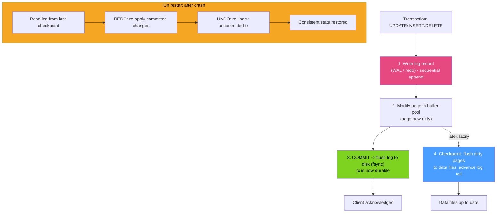

# 📝 Write-Ahead Logging (WAL / Redo)

> [!abstract] TL;DR
> **Write-Ahead Logging** is the rule that guarantees durability and crash recovery: *log the change before you change the data*. A committed transaction only needs its **log record** flushed to disk (a fast sequential append) — the actual data pages are flushed lazily by a **checkpoint**. On crash, the engine **replays the log** from the last checkpoint (**redo**) and rolls back uncommitted work (**undo**). Postgres calls it the **WAL** (LSN, 16 MB segments, full-page writes, `wal_level`, archiving); InnoDB has the **redo log** (`ib_logfile`/redo) plus a **doublewrite buffer**, and a separate **binary log (binlog)** for replication with `statement` / `row` / `mixed` formats. Cross-ref the systems-level [[Write_Ahead_Log]].

## Intuition — analogy FIRST

Picture a bank teller who must never lose a transaction, even if the power dies mid-update.

Instead of carefully rewriting the big master ledger for every deposit (slow, and catastrophic if interrupted halfway), the teller keeps a **running journal**: a strict, append-only tape where every change is scribbled *before* touching the master ledger — "acct #42 +\$100". Appending to the tape is one quick sequential stroke.

- **Commit = the journal entry is on the tape.** The customer is told "done" the instant the note is durably written, even though the master ledger hasn't been updated yet.
- **Crash?** On reboot, the teller reads the journal forward from the last checkpoint and re-applies every entry to the master ledger (**redo**), and tears up any half-finished entry from an interrupted transaction (**undo**). The master ledger is reconstructed exactly.
- **Checkpoint = "the master ledger is now caught up to here,"** so the journal before that point can be recycled.

Turning many random master-ledger edits into one sequential journal is *the* trick behind fast, durable databases.

---

## How It Works



### The WAL protocol (the invariant)

The one rule: **a log record describing a change must reach durable storage *before* the corresponding data page is written back.** This lets the engine flush data pages whenever convenient — even reordered or delayed — because the log can always reconstruct or reverse them. Commit latency depends only on flushing the (small, sequential) log, not the (large, scattered) data pages.

### Redo vs undo

- **Redo** — reapplies committed changes not yet persisted to data files (durability). Both Postgres WAL and InnoDB redo log do this on recovery.
- **Undo** — reverses uncommitted changes and provides old row versions for MVCC. In **InnoDB** undo lives in dedicated **undo logs/tablespaces** and feeds MVCC row reconstruction (see [[MVCC_Internals]]). In **Postgres** there is *no separate undo log*: old row versions live inline in the heap (`xmin`/`xmax`) and are cleaned by `VACUUM`; rollback simply marks the transaction aborted.

### PostgreSQL WAL specifics

- **LSN (Log Sequence Number)** — a monotonically increasing byte offset into the WAL stream; every page records the LSN that last modified it (`page.lsn`), enforcing the write-ahead rule.
- **WAL segments** — the log is split into files (default **16 MB**) under `pg_wal/`, recycled after a checkpoint.
- **Full-page writes** — the first modification of a page after a checkpoint logs the *entire page image* to survive **torn pages** (a partial 8 KB write during a crash). Costs log volume but guarantees a clean base to redo from.
- **Checkpoints** — flush all dirty pages and record a restart point; controlled by `checkpoint_timeout`, `max_wal_size`, `checkpoint_completion_target`.
- **`wal_level`** — `minimal` → `replica` → `logical`; higher levels log more so the WAL can drive **streaming replication** and **logical decoding / CDC**.
- **Archiving / PITR** — `archive_mode` copies filled segments; replaying archived WAL over a base backup gives **point-in-time recovery**.

### MySQL / InnoDB specifics

- **Redo log** — circular files (historically `ib_logfile0/1`; MySQL 8.0.30+ uses `#innodb_redo/`) recording physical page changes; sized via `innodb_redo_log_capacity`. `innodb_flush_log_at_trx_commit` (1 = fully ACID fsync per commit, 2 = flush to OS, 0 = every second) trades durability for throughput.
- **Doublewrite buffer** — InnoDB first writes each flushed page to a **doublewrite** area, then to its real location, so a torn page can be recovered from the intact copy (InnoDB's answer to Postgres full-page writes).
- **Undo log/tablespaces** — old versions for rollback + MVCC.
- **Binary log (binlog)** — a *separate*, higher-level log at the server layer (not InnoDB's) used for **replication** and **PITR**. Formats: **STATEMENT** (logs the SQL — compact but non-deterministic functions are unsafe), **ROW** (logs actual before/after row images — safe, default, verbose), **MIXED** (row when needed, else statement). The redo log makes a single node durable; the **binlog** ships changes to replicas. A two-phase commit keeps redo and binlog consistent.

---

## SQL / Examples

```sql
-- PostgreSQL: inspect WAL position, level, checkpoints, and segment size
SELECT pg_current_wal_lsn();                       -- current write position (LSN)
SHOW wal_level;                                     -- replica / logical for CDC & replication
SELECT name, setting FROM pg_settings
WHERE name IN ('max_wal_size','checkpoint_timeout','full_page_writes','archive_mode');

-- How much WAL a workload generates between two points
SELECT pg_size_pretty(pg_wal_lsn_diff('0/16000000','0/15000000'));

-- Logical decoding (CDC) reads committed changes straight from the WAL
SELECT * FROM pg_create_logical_replication_slot('cdc_slot', 'pgoutput');
```

```sql
-- MySQL / InnoDB: durability knob, redo capacity, doublewrite, and binlog format
SHOW VARIABLES LIKE 'innodb_flush_log_at_trx_commit';  -- 1 = safest (fsync per commit)
SHOW VARIABLES LIKE 'innodb_redo_log_capacity';
SHOW VARIABLES LIKE 'innodb_doublewrite';              -- ON: torn-page protection
SHOW VARIABLES LIKE 'binlog_format';                   -- ROW (default) / STATEMENT / MIXED

SHOW BINARY LOGS;                                       -- list binlog files
SHOW ENGINE INNODB STATUS\G                             -- LOG section: LSN, checkpoint age
```

> Difference: Postgres has **one** WAL that serves durability *and* replication/CDC (via `wal_level`/logical decoding). InnoDB splits the job: the **redo log** provides crash durability, while the **binlog** — a separate server-layer log with STATEMENT/ROW/MIXED formats — provides replication and PITR. InnoDB also uses a **doublewrite buffer** for torn-page safety where Postgres uses **full-page writes** in the WAL itself.

---

## Trade-offs

| Factor | Benefit | Cost |
|---|---|---|
| Log-before-data | Durable commit with only a sequential log fsync | Every change written twice (log + eventual data page) |
| Lazy checkpoints | Absorbs write bursts; batches data-page I/O | Longer crash-recovery replay; checkpoint I/O spikes |
| Full-page writes / doublewrite | Survives torn pages | Larger log volume / extra write per flushed page |
| `fsync` per commit (safe) | No data loss on crash | Higher commit latency; group-commit needed for throughput |
| Relaxed flush (PG `synchronous_commit=off`, InnoDB `=2/0`) | Much higher throughput | A crash can lose the last few committed transactions |
| WAL/binlog shipping | Enables replicas, PITR, CDC | Retained logs consume disk; a stuck replication slot fills the disk |

---

## Common Pitfalls

1. **A stuck/abandoned replication slot (Postgres).** An unread logical/physical slot pins WAL forever — `pg_wal/` fills and the server halts. Monitor and drop dead slots.
2. **Turning off durability without knowing it.** `synchronous_commit=off` (PG) or `innodb_flush_log_at_trx_commit=2/0` (MySQL) boosts throughput but silently trades away the last committed transactions on crash.
3. **STATEMENT binlog with non-deterministic SQL.** `UPDATE … SET x = RAND()`/`NOW()`/`UUID()` replicates differently on replicas; use ROW (or MIXED) to stay safe.
4. **Undersized checkpoints/redo.** Too-small `max_wal_size` / redo capacity forces frequent checkpoints and I/O storms; too-large lengthens recovery. Tune for your write rate.
5. **Assuming the data files are the source of truth mid-flight.** After a crash the data files may be *behind* the log; the database is only consistent *after* redo/undo replay completes — never copy raw data files from a running server.
6. **Confusing redo and binlog roles.** Redo makes one node durable; the binlog replicates. Losing the redo log corrupts recovery; losing the binlog breaks replicas/PITR — they are not interchangeable.

---

## Related Concepts

- [[_MOC_DB_Storage_Indexing|↑ Section MOC]]
- [[Write_Ahead_Log]] — systems-level view: streaming replication, CDC, log shipping (System Design vault)
- [[Storage_Engine_Internals]] — dirty pages, buffer pool, and checkpoints the WAL coordinates
- [[MVCC_Internals]] — undo logs / `xmin`/`xmax` versions used for rollback and snapshots
- [[LSM_Trees]] — the memtable's commit log is the same write-ahead idea
- [[BTree_Indexes]] — index page changes are also WAL-logged for crash safety

---

## Review Questions

1. State the write-ahead invariant precisely, and explain how it lets a database acknowledge a commit after flushing only a small sequential log while data pages remain dirty in memory.
2. Postgres uses full-page writes; InnoDB uses a doublewrite buffer. What identical failure are both defending against, and how does each mechanism work?
3. Contrast InnoDB's redo log and binary log: what does each guarantee, which binlog format is safest and why, and what breaks if you lose one but not the other?

---

## Sources

- PostgreSQL Documentation — Write-Ahead Logging & WAL Configuration — https://www.postgresql.org/docs/current/wal-intro.html
- MySQL Reference Manual — InnoDB Redo Log, Doublewrite & The Binary Log — https://dev.mysql.com/doc/refman/8.0/en/innodb-redo-log.html
- "Designing Data-Intensive Applications" — Martin Kleppmann, Ch. 3 & 7 (logs, durability)
- ARIES (Mohan et al., 1992) — the redo/undo recovery algorithm behind most RDBMS

#Database #Storage #Indexing #WAL #RedoLog #Binlog #CrashRecovery #Durability
