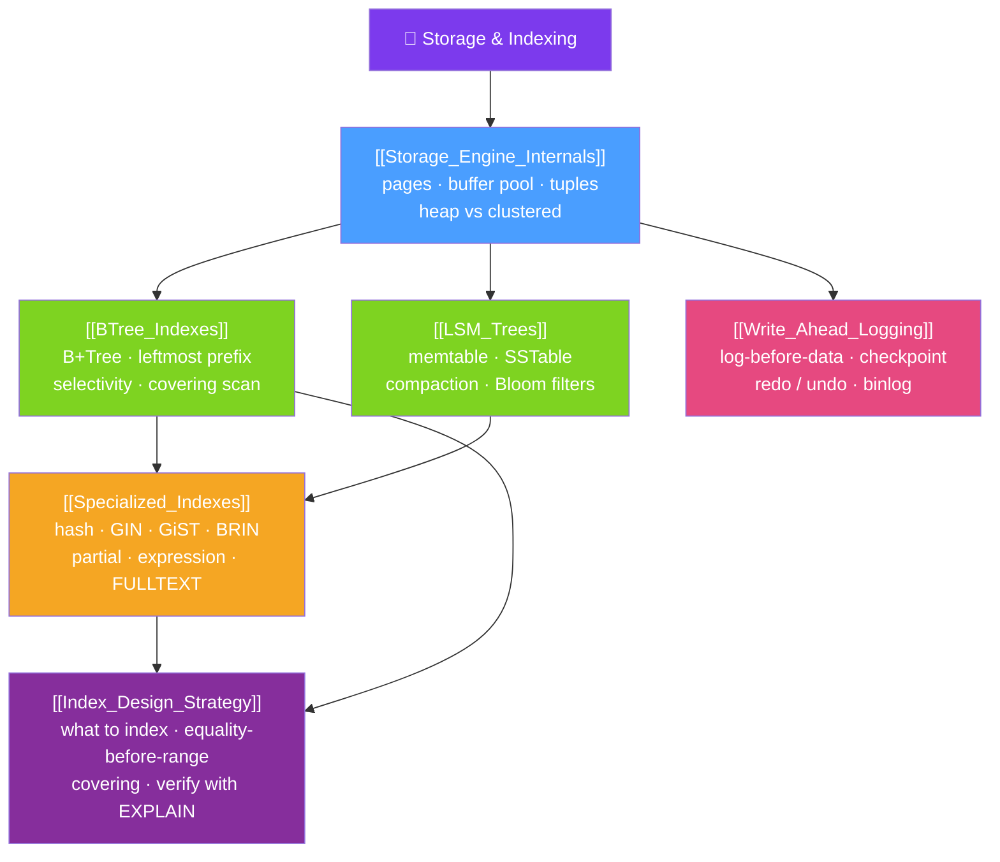

# 🗺️ Storage & Indexing — Map of Content

> [!abstract] What This Section Covers
> This section goes under the hood to the bytes on disk and the data structures that make queries fast. It starts with **storage engine internals** — fixed-size pages, the buffer pool, tuple layout, and the fork between Postgres's heap-plus-indexes and InnoDB's clustered index-organized tables. Then the two great index families: the **B+Tree** (the balanced, high-fanout default behind almost every RDBMS index, with the leftmost-prefix rule, selectivity, and covering scans) and the **LSM-tree** (the write-optimized alternative that turns random writes into sequential ones via memtables, SSTables, compaction, and Bloom filters). **Specialized indexes** cover everything the B-tree can't do well — hash, GIN, GiST, SP-GiST, BRIN, bitmap, partial, expression, and full-text/spatial. **Write-ahead logging** is the durability and crash-recovery backbone (log-before-data, checkpoints, redo/undo, Postgres WAL vs InnoDB redo log + binlog). Finally, **index design strategy** ties it together into a discipline: what to index, equality-before-range ordering, covering and partial indexes, avoiding over-indexing, and always verifying with `EXPLAIN`.

## Concept Map

## Learning Path
1. [[Storage_Engine_Internals]] — Pages, the buffer pool, tuple/slot layout, heap vs clustered (index-organized) tables, dirty pages, and TOAST/overflow.
2. [[BTree_Indexes]] — The B+Tree structure, clustered vs secondary indexes, the leftmost-prefix rule, selectivity, and index-only (covering) scans.
3. [[LSM_Trees]] — The write-optimized memtable → SSTable → compaction pipeline, write amplification, Bloom filters, and where LSM engines shine.
4. [[Specialized_Indexes]] — Hash, GIN, GiST, SP-GiST, BRIN, bitmap scans, and partial/expression/covering indexes; MySQL FULLTEXT/SPATIAL/invisible.
5. [[Write_Ahead_Logging]] — Log-before-data, LSN and segments, checkpoints, redo/undo on crash, and Postgres WAL vs InnoDB redo log + binlog.
6. [[Index_Design_Strategy]] — Which columns to index, equality-before-range composite ordering, covering/partial indexes, avoiding over-indexing, and verifying with EXPLAIN.

## All Notes at a Glance
| Note | Difficulty | What You'll Learn |
|------|------------|-------------------|
| [[Storage_Engine_Internals]] | Advanced | Page-based I/O, the buffer pool, tuple/slot layout, heap vs clustered tables, dirty-page flushing, and TOAST/overflow storage |
| [[BTree_Indexes]] | Advanced | B+Tree anatomy, clustered vs secondary indexes and bookmark lookups, leftmost prefix, selectivity, and covering index-only scans |
| [[LSM_Trees]] | Advanced | Memtable/SSTable/compaction, sequential-write advantage, read and write amplification, Bloom filters, and LSM-based engines |
| [[Specialized_Indexes]] | Advanced | When and why to use hash, GIN, GiST, SP-GiST, BRIN, bitmap, partial, expression, covering, and full-text/spatial indexes |
| [[Write_Ahead_Logging]] | Advanced | The WAL durability rule, checkpoints, redo/undo crash recovery, and Postgres WAL vs InnoDB redo log + doublewrite + binlog |
| [[Index_Design_Strategy]] | Intermediate | A repeatable indexing discipline: what to index, composite ordering, covering/partial indexes, over-indexing pitfalls, and EXPLAIN verification |

## Key Questions This Section Answers
- Why does a database read and write whole pages instead of single rows, and what is the buffer pool for?
- How does a B+Tree turn a billion-row lookup into 3–4 page reads?
- What is the leftmost-prefix rule, and how does column order in a composite index change which queries it helps?
- When is an LSM-tree the better choice than a B-tree, and what does it cost you on reads?
- Which specialized index fits JSON containment, geospatial nearest-neighbor, or a huge append-only table?
- How does write-ahead logging guarantee durability while still allowing lazy data-page flushes?
- How do you decide which indexes to create — and which existing ones to drop?

## Related Sections
- [[_MOC_Database_Master|↑ Database Master MOC]]
- [[_MOC_DB_Query_Processing|→ Query Processing]]
- [[_MOC_DB_Transactions|← Transactions & Concurrency]]
- DSA: [[B_Plus_Tree]] · System Design: [[Database_Indexes]]

#MOC #Database #Storage #Indexing
