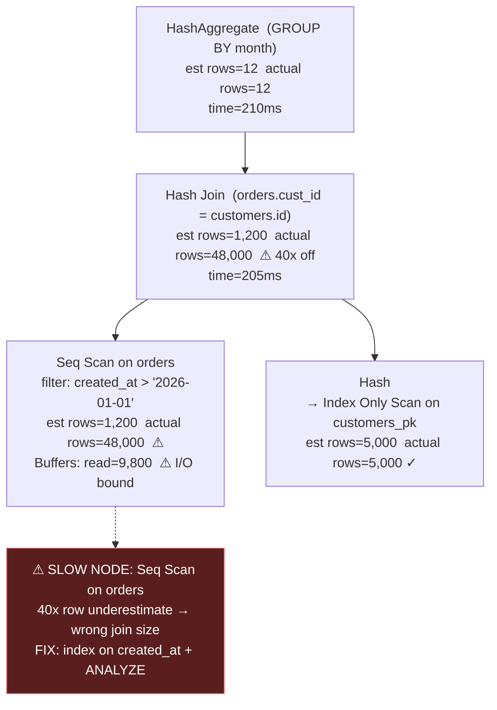

# 🔬 Execution Plans

> [!abstract] TL;DR
> An **execution plan** is the optimizer's chosen recipe, made visible. `EXPLAIN` shows the plan (**estimated** cost/rows); `EXPLAIN ANALYZE` actually runs it and shows **real** time, real row counts, and loops — so you can compare *what the optimizer thought* against *what really happened*. Reading a plan is a skill: it is a **tree** of nodes (scans at the leaves, joins/sorts/aggregates above), executed **inside-out, bottom-up**. The goal is always the same — **find the one slow node** (the biggest gap between estimate and reality, or the biggest chunk of actual time) and fix *that*.

## Intuition — analogy FIRST

Think of an execution plan as an **itemized receipt after a road trip**, next to the **estimate you got before leaving**.

- Before the trip, the GPS **estimates**: "Highway segment ~20 min, 40 km." That is `EXPLAIN` — predicted `cost` and `rows`, no driving done.
- After the trip, your dashcam log shows what **actually** happened: "Highway segment took 55 min because of a jam you did not know about." That is `EXPLAIN ANALYZE` — **actual time** and **actual rows**.
- To find why the trip was slow, you scan the log for the **one segment that blew past its estimate** — a 20-min leg that took 55. That mismatch is your culprit.

Reading a plan is exactly this: line up **estimated rows** against **actual rows**. A node the optimizer thought would return 1 row but that returned 2 million is the point where its plan went wrong — usually a **cardinality misestimate** that cascaded into a bad join choice.

---

## How It Works

### The plan is a tree, executed bottom-up

Plan output is **indented**: deeper indentation = a child node that runs *first* and feeds its parent. Leaves are **scans** (they read tables/indexes); internal nodes are **joins, sorts, aggregates**; the root is the final result. Rows flow **up** the tree (the Volcano pull model from [[Query_Execution_Pipeline]]).

### PostgreSQL plan nodes you must recognize

| Node | What it does | Good / bad signal |
|------|--------------|-------------------|
| **Seq Scan** | Read every heap page | Fine for small tables or non-selective filters; bad on a huge table with a selective `WHERE` |
| **Index Scan** | Walk B-tree, fetch matching heap rows | Great for selective lookups; random I/O per row |
| **Index Only Scan** | Answer purely from the index (covering) | Best case — no heap access; needs a covering index ([[Index_Design_Strategy]]) |
| **Bitmap Heap Scan** (+ **Bitmap Index Scan**) | Collect matching page IDs, read pages in physical order | Sweet spot for medium selectivity; combines multiple indexes |
| **Nested Loop** | For each outer row, probe inner | Great when outer is tiny + inner is indexed; disaster if both large |
| **Hash Join** | Build hash of one side, probe with other | Best for large, equality joins with enough `work_mem` |
| **Merge Join** | Merge two sorted inputs | Good when both inputs already sorted (or cheaply sortable) |
| **Sort** | Order rows (for `ORDER BY`, merge join, `DISTINCT`) | Watch for `Sort Method: external merge Disk` — spilled, needs more `work_mem` |
| **Aggregate / HashAggregate / GroupAggregate** | `GROUP BY`, `COUNT`, `SUM` | HashAggregate can spill; GroupAggregate needs sorted input |

### Reading the numbers on a Postgres node

```
Index Scan using orders_customer_idx on orders
  (cost=0.43..812.30 rows=1200 width=64)
  (actual time=0.028..3.145 rows=1187 loops=1)
```

- `cost=0.43..812.30` — **estimated** startup cost .. total cost (abstract units, see [[Query_Optimizer]]).
- `rows=1200` — **estimated** rows returned; `actual ... rows=1187` — **real** rows. Close here (good estimate).
- `width=64` — average row width in bytes.
- `actual time=0.028..3.145` — real time to **first row** .. **last row**, in ms, **per loop**.
- `loops=1` — how many times this node executed. **Multiply `actual time` × `loops`** for total time spent in the node — crucial inside a Nested Loop.

### BUFFERS — the hidden truth about I/O

`EXPLAIN (ANALYZE, BUFFERS)` adds cache/disk page counts per node:

```
Buffers: shared hit=4210 read=980
```

- `shared hit` — pages found in cache (fast).
- `shared read` — pages read from disk (slow) — a high `read` count pinpoints the I/O-bound node far better than time alone (which varies with cache warmth).

### Spotting the slow node — the method

1. Run `EXPLAIN (ANALYZE, BUFFERS)`.
2. Find the node with the **largest actual total time** (`actual time` × `loops`), not the largest cost.
3. Check its **rows estimate vs actual** — a big gap (e.g. estimated 1, actual 500k) means a **cardinality error** that likely caused a wrong join type.
4. Check **BUFFERS** — heavy `read` = I/O bound; heavy `hit` but slow = CPU bound.
5. Fix at that node: add/adjust an index, update statistics, rewrite, or raise `work_mem`. See [[Query_Tuning]].



### MySQL EXPLAIN

MySQL's classic `EXPLAIN` is a **flat table**, one row per accessed table. The columns that matter:

| Column | Meaning | What to want |
|--------|---------|--------------|
| **type** (access type) | How the table is read | Best→worst: `system` > `const` > `eq_ref` > `ref` > `range` > `index` > **`ALL`** (full scan — usually the problem) |
| **key** | Index actually used | `NULL` here on a big table = no index used |
| **rows** | Estimated rows examined | Lower is better; huge number = scanning too much |
| **filtered** | % of rows kept after the `WHERE` | Low % after a big `rows` = wasted reads |
| **Extra** | Notes | Avoid **`Using filesort`**, **`Using temporary`**; want **`Using index`** (covering) and `Using index condition` |

**`type` decoded:** `const`/`eq_ref` = unique/PK lookup (excellent); `ref` = non-unique index match (good); `range` = index range (`BETWEEN`, `>`); `index` = full **index** scan (reads whole index); **`ALL`** = full **table** scan (reads whole table — the classic red flag).

### MySQL EXPLAIN ANALYZE and FORMAT=JSON

- **`EXPLAIN ANALYZE`** (MySQL **8.0.18+**) actually executes and prints a tree with **actual** timings and loops, much like Postgres:
  `-> Table scan on orders (cost=... rows=...) (actual time=... rows=... loops=...)`.
- **`EXPLAIN FORMAT=JSON`** gives the full cost breakdown and `used_key_parts`, ideal for tooling.
- **`EXPLAIN FORMAT=TREE`** gives a readable tree without executing.

---

## SQL / EXPLAIN Examples

### PostgreSQL

```sql
-- Estimate only (does not run the query)
EXPLAIN
SELECT o.month, count(*)
FROM orders o JOIN customers c ON c.id = o.customer_id
WHERE o.created_at > '2026-01-01'
GROUP BY o.month;

-- Actually run it + page I/O — the version you should almost always use
EXPLAIN (ANALYZE, BUFFERS, VERBOSE)
SELECT o.month, count(*)
FROM orders o JOIN customers c ON c.id = o.customer_id
WHERE o.created_at > '2026-01-01'
GROUP BY o.month;

-- Machine-readable for tools like explain.depesz.com / pev2
EXPLAIN (ANALYZE, FORMAT JSON)
SELECT * FROM orders WHERE customer_id = 42;
```

Reading the first key line — a **healthy** node vs a **problem** node:

```
Index Only Scan using customers_pk ...
  (actual time=0.01..0.9 rows=5000 loops=1)     -- ✓ estimate matched, no heap
Seq Scan on orders  (cost=0..0 rows=1200 ...)
  (actual time=0.1..180 rows=48000 loops=1)      -- ⚠ 40x under-estimate, slow
  Buffers: shared read=9800                        -- ⚠ heavy disk reads
```

### MySQL

```sql
-- Classic flat EXPLAIN
EXPLAIN
SELECT o.customer_id, count(*)
FROM orders o
WHERE o.created_at > '2026-01-01'
GROUP BY o.customer_id;
-- Look for: type=ALL (bad), key=NULL (no index), Extra='Using filesort'/'Using temporary'

-- Run + real timings (MySQL 8.0.18+)
EXPLAIN ANALYZE
SELECT * FROM orders WHERE customer_id = 42;

-- Full detail as a tree / JSON
EXPLAIN FORMAT=TREE  SELECT * FROM orders WHERE customer_id = 42;
EXPLAIN FORMAT=JSON  SELECT * FROM orders WHERE customer_id = 42\G
```

> [!warning] `EXPLAIN ANALYZE` actually executes the statement
> On an `UPDATE`/`DELETE`/`INSERT`, `EXPLAIN ANALYZE` (both engines) **performs the write**. Wrap it in a transaction and `ROLLBACK`, or test on `SELECT` equivalents.

---

## Trade-offs

| Decision | `EXPLAIN` | `EXPLAIN ANALYZE` | Guidance |
|----------|-----------|-------------------|----------|
| Cost | Free, no execution | Runs the query (time + side effects) | Use plain EXPLAIN to peek; ANALYZE to diagnose real slowness |
| Truth | Estimated rows/cost only | Real rows, time, loops, buffers | Estimates can lie; ANALYZE is ground truth |
| Writes | Safe | **Executes writes** | Rollback or use SELECT for DML plans |
| Metric to trust | `cost` (relative rank) | `actual time × loops` + `Buffers` | Time varies with cache; BUFFERS/read is stabler |
| Format | Text (human) | `FORMAT JSON` (tools), `TREE` (readable) | JSON for pev2/depesz visualizers |

---

## Common Pitfalls

1. **Reading `cost` as milliseconds.** Cost is abstract, machine-relative units. Only `actual time` from `EXPLAIN ANALYZE` is real time.
2. **Ignoring `loops`.** A Nested Loop inner node showing `actual time=0.2ms loops=50000` is really **10 seconds** total. Always multiply by loops.
3. **Trusting a cold-cache run.** First execution reads from disk; the second is cached and looks fast. Use `BUFFERS` (`read` vs `hit`) to separate I/O from CPU, and run twice.
4. **Chasing the highest-`cost` node instead of the highest-*actual* node.** The optimizer's estimate is exactly what may be wrong — trust measured time.
5. **Missing the estimate/actual gap.** `rows=1` estimated but `rows=500000` actual is the root cause of most bad plans (wrong join type). This is a **statistics** problem — see [[Query_Optimizer]] and [[Query_Tuning]].
6. **MySQL: seeing `type=index` and thinking "index used, good."** `index` means a **full index scan** (entire index read) — better than `ALL` but still not a targeted lookup. Aim for `ref`/`range`/`eq_ref`.
7. **`Using filesort`/`Using temporary` in Extra** treated as harmless — they mean MySQL sorted or built a temp table, often fixable with an index that provides order.

---

## Related Concepts

- [[_MOC_DB_Query_Processing|↑ Section MOC]]
- [[Query_Optimizer]] — Who produces the plan you are reading, and why estimates go wrong
- [[Query_Execution_Pipeline]] — The plan is the physical output of stages 4–5
- [[Join_Algorithms]] — Nested Loop, Hash Join, Merge Join nodes explained in depth
- [[Query_Tuning]] — Turning a plan diagnosis into a concrete fix
- [[Database_Indexes]] — What Index Scan / Index Only Scan / Bitmap nodes rely on
- [[BTree_Indexes]] — Why an Index Scan does random I/O
- [[Index_Design_Strategy]] — Building covering indexes to unlock Index Only Scans
- [[Storage_Engine_Internals]] — What `Buffers: hit/read` are counting (pages)
- [[SQL_Tuning]] — Broader diagnosing-slow-SQL workflow

---

## Review Questions

1. In a PostgreSQL plan you see a Nested Loop whose inner Index Scan reads `actual time=0.15..0.20 rows=1 loops=90000`. The node's per-loop time looks tiny — why might this node still be your bottleneck, and what single number reveals it?
2. A MySQL `EXPLAIN` shows `type=ALL`, `key=NULL`, `rows=2,000,000`, `Extra='Using where; Using filesort'` for a query with `WHERE status='open' ORDER BY created_at`. Interpret each field and propose one index that could improve `type`, `key`, and remove the filesort.
3. Why is `EXPLAIN (ANALYZE, BUFFERS)` more trustworthy than `EXPLAIN ANALYZE` alone when deciding whether a node is I/O-bound or CPU-bound? What do `shared hit` vs `shared read` tell you?

---

## Sources

- *PostgreSQL Documentation* — "Using EXPLAIN" and "EXPLAIN" reference — https://www.postgresql.org/docs/current/using-explain.html
- *MySQL 8.0 Reference Manual* — "EXPLAIN Output Format", "EXPLAIN ANALYZE", "Understanding the Query Execution Plan"
- Markus Winand, *Use The Index, Luke!* — practical plan-reading — https://use-the-index-luke.com/
- depesz, "Explaining the unexplainable" series — reading PostgreSQL plans

#Database #QueryProcessing #ExecutionPlans #EXPLAIN #EXPLAINANALYZE #PlanNodes #Advanced
