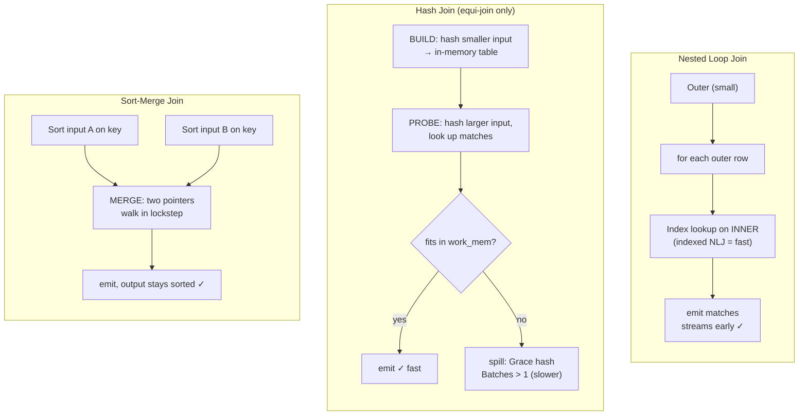

# 🔗 Join Algorithms

> [!abstract] TL;DR
> `JOIN` is a **logical** request ("combine these tables on this condition"); the optimizer must pick a **physical algorithm** to actually do it. There are three workhorses: **Nested Loop** (for each outer row, look up matches — unbeatable when one side is tiny and the other is indexed), **Hash Join** (build a hash table on the smaller side, probe with the larger — the champion for big equality joins when memory allows), and **Sort-Merge Join** (sort both inputs, then zip them together — great when inputs are already sorted). The optimizer's choice hinges on **row counts, indexes, sort order, and available memory** (`work_mem` / `join_buffer_size`). Pick wrong and a 1-second join becomes an hour.

## Intuition — analogy FIRST

You have two stacks of paper — a stack of **orders** and a stack of **customers** — and you must staple each order to its matching customer.

- **Nested Loop Join** — Pick up order #1, walk the entire customer stack to find its match, staple, repeat for every order. Painful if both stacks are huge (you re-scan customers for every order). But if you have an **address book (index)** that jumps straight to a customer by ID, each lookup is instant — now it is fast, *especially* if there are only a handful of orders.
- **Hash Join** — First, spread all customers across labeled bins by the last digit of their ID (**build a hash table**). Then take each order and go straight to its bin to find matches (**probe**). Two passes total, no re-scanning. This is the fastest for two big stacks — as long as the bins **fit on your desk** (memory). If customers overflow the desk, you must shove some bins into drawers (**spill to disk**), which slows things down.
- **Sort-Merge Join** — Sort both stacks by customer ID, then walk the two sorted stacks in lockstep with two fingers, advancing whichever is behind. One pass each after sorting. Brilliant if the stacks arrive **already sorted** (e.g. read via an index in ID order); otherwise you pay for two big sorts first.

The whole art is: **which is cheapest given the sizes, the indexes, the existing sort order, and how much desk space (memory) you have.**

---

## How It Works

### 1. Nested Loop Join (NLJ)

```
for each row R in OUTER (usually the smaller input):
    for each row S in INNER:
        if join_condition(R, S): emit (R, S)
```

- **Naïve NLJ** is O(outer × inner) — every inner row re-scanned per outer row. Terrible for two large tables.
- **Indexed Nested Loop** — if the inner side has an **index** on the join column, the inner "loop" becomes an **index lookup**, turning cost into roughly O(outer × log inner). This is the *good* case and why NLJ dominates OLTP point-joins.
- **Block Nested Loop (MySQL)** — buffers a block of outer rows (`join_buffer_size`) and scans the inner once per block, reducing inner re-scans when no index exists.
- **Best when:** the outer input is **small** and the inner is **indexed** (or tiny). Streams results immediately (low startup cost).

### 2. Hash Join

```
BUILD phase:  read the smaller ("build") input, hash each row on the join key → in-memory hash table
PROBE phase:  read the larger ("probe") input, hash each row, look up matches in the table → emit
```

- Only works for **equi-joins** (`=`), because hashing needs equality.
- **Cost ≈ O(build + probe)** — each side read once. Excellent for large ↔ large joins.
- **Memory-bound:** the build side's hash table must fit in `work_mem` (Postgres) / `join_buffer_size` (MySQL). If it does not, the engine does a **Grace / hybrid hash join**: partition both inputs into on-disk buckets by hash, then join bucket-by-bucket. This **spilling to disk** adds I/O and shows as `Batches > 1` in Postgres plans.
- **High startup cost** (must build the whole hash before emitting anything) — bad for `LIMIT 1`, great for full-result joins.
- **Best when:** both inputs are **large**, the join is **equality**, and neither side is usefully sorted or indexed.

### 3. Sort-Merge Join

```
SORT both inputs on the join key (skip if already sorted)
MERGE: two pointers walk the sorted inputs in lockstep, advancing the lagging side, emitting matches
```

- Works for **equi-joins and range/inequality joins** (`>=`, `<`), unlike hash join.
- **Cost ≈ sort(A) + sort(B) + merge** — dominated by the two sorts. But if an input is **already sorted** (delivered by an index scan in key order, or a prior sort), that sort is **free**, and merge join becomes very cheap.
- Handles **very large inputs gracefully** — sorts spill to disk predictably, and the merge is sequential I/O.
- **Best when:** inputs are already sorted on the join key, or the result must be sorted anyway (feeds an `ORDER BY`/merge), or for large non-equi joins.



### How the optimizer chooses

| Situation | Optimizer usually picks |
|-----------|-------------------------|
| Tiny outer, indexed inner (OLTP point lookup) | **Indexed Nested Loop** |
| Two large tables, equality join, enough memory | **Hash Join** |
| Inputs already sorted on join key / result needs sorting | **Sort-Merge Join** |
| Large tables but join memory too small | Hash Join **spilling**, or Sort-Merge |
| Non-equi join (`<`, `BETWEEN`) | **Nested Loop** or **Sort-Merge** (hash cannot do it) |

### Engine reality: PostgreSQL vs MySQL

- **PostgreSQL** has had all three (nested loop, hash, merge) for decades, and chooses per-join by cost.
- **MySQL/InnoDB was historically nested-loop only** (with Block Nested Loop as the fallback for un-indexed joins). **Hash join was added in MySQL 8.0.18** (2019) for equi-joins with no usable index, extended in 8.0.20. MySQL still has **no sort-merge join**. This history is why older MySQL advice obsessively pushed for an index on *every* join column — without one, the only option was a slow (block) nested loop.

The memory knobs: PostgreSQL `work_mem` sizes each hash table / sort (per node, per operation — so a big query can use many multiples); MySQL `join_buffer_size` sizes the block-nested-loop / hash-join buffer.

---

## SQL / EXPLAIN Examples

### PostgreSQL — seeing each algorithm, and forcing alternatives

```sql
-- Small, selective outer + indexed inner → Nested Loop
EXPLAIN ANALYZE
SELECT * FROM orders o JOIN customers c ON c.id = o.customer_id
WHERE o.id = 42;
--   Nested Loop
--     ->  Index Scan using orders_pkey on orders
--     ->  Index Scan using customers_pkey on customers

-- Two large tables, equality → Hash Join
EXPLAIN ANALYZE
SELECT c.region, count(*)
FROM orders o JOIN customers c ON c.id = o.customer_id
GROUP BY c.region;
--   Hash Join  (Hash Cond: o.customer_id = c.id)
--     ->  Seq Scan on orders
--     ->  Hash  ->  Seq Scan on customers        -- build side

-- Watch for a hash join spilling to disk:
--   Hash  Buckets: 65536  Batches: 8  Memory Usage: ...   -- Batches>1 = spilled
SET work_mem = '256MB';   -- give it room so Batches = 1

-- Diagnostic: disable hash join to compare the merge/NL cost
SET enable_hashjoin = off;
EXPLAIN ANALYZE SELECT ... ;   -- planner now shows Merge or Nested Loop
RESET enable_hashjoin;
```

### MySQL — nested loop by default, hash join since 8.0.18

```sql
-- Indexed join → nested loop (the classic MySQL path)
EXPLAIN
SELECT * FROM orders o JOIN customers c ON c.id = o.customer_id
WHERE o.id = 42;
-- type: eq_ref on customers (index lookup inside the loop)

-- No usable index on the join column → MySQL 8.0.18+ uses a Hash Join
EXPLAIN FORMAT=TREE
SELECT c.region, count(*)
FROM orders o JOIN customers c ON c.id = o.customer_id
GROUP BY c.region;
--   -> Hash join (c.id = o.customer_id)  ...
--        -> Table scan on o
--        -> Hash
--             -> Table scan on c

-- Give block-nested-loop / hash more buffer memory
SET SESSION join_buffer_size = 8388608;   -- 8 MB

-- Force nested loop off hash join to compare (optimizer hint)
SELECT /*+ NO_HASH_JOIN(o, c) */ ...
FROM orders o JOIN customers c ON c.id = o.customer_id;
```

---

## Trade-offs

| Algorithm | Best case | Worst case | Memory | Result order | Join types |
|-----------|-----------|------------|--------|--------------|-----------|
| **Nested Loop (indexed)** | Small outer, indexed inner; streams early | Both large, no index → O(N×M) | Minimal | Preserves outer order | Any (`=`, `<`, `BETWEEN`) |
| **Hash Join** | Large ↔ large equi-join, fits memory | Build side overflows → spills (Batches>1) | High (build side in `work_mem`) | Unordered | **Equality only** |
| **Sort-Merge Join** | Inputs pre-sorted / output must be sorted | Neither sorted → pays 2 sorts | Medium (sort buffers, spills gracefully) | **Sorted** on join key | `=` and range |

Rules of thumb: **few rows → nested loop; many rows equality → hash; already sorted or need sorted output → merge.**

---

## Common Pitfalls

1. **Nested loop on two large un-indexed tables.** If the optimizer misestimates the outer as tiny (bad statistics), it picks NLJ and the join explodes to billions of comparisons. The tell in `EXPLAIN ANALYZE`: an inner node with huge `loops`. Fix statistics or add the join index — see [[Query_Tuning]].
2. **Hash join spilling silently.** `Batches: 8` in a Postgres plan means the hash table did not fit `work_mem` and spilled to disk. Raise `work_mem` (carefully — it is **per operation**, so a complex query can multiply it across cores and nodes).
3. **Expecting hash join on a non-equality condition.** `ON a.x < b.y` can never use a hash join — only nested loop or merge. Rewriting a range join as equality (bucketing) sometimes helps.
4. **Old-MySQL muscle memory.** Pre-8.0.18 required an index on every join column or you got a slow block nested loop. On modern MySQL a hash join may now be fine without one — but an index is still usually better for selective joins.
5. **Sorting twice.** If your query merge-joins and *then* `ORDER BY` on the same key, the plan may sort once and reuse the order — or sort twice if columns differ. Check the plan for redundant `Sort` nodes.
6. **Assuming the "smaller" table is the build side by row count.** It is the smaller *estimated* side; a cardinality misestimate can make the optimizer build on the larger side and blow memory.

---

## Related Concepts

- [[_MOC_DB_Query_Processing|↑ Section MOC]]
- [[Joins]] — The logical SQL join types (INNER/LEFT/FULL) these algorithms implement
- [[Query_Optimizer]] — How the optimizer decides which join algorithm and order to use
- [[Execution_Plans]] — Spotting Nested Loop / Hash Join / Merge Join nodes and spills
- [[Query_Execution_Pipeline]] — Where join operators sit in the executor
- [[Query_Tuning]] — Fixing a join that chose the wrong algorithm
- [[Database_Indexes]] — Indexes that make indexed nested loops fast
- [[BTree_Indexes]] — Ordered index scans that feed merge joins for free
- [[Index_Design_Strategy]] — Indexing join columns to unlock the fast paths
- [[Storage_Engine_Internals]] — Why spilling to disk is expensive (page I/O)

---

## Review Questions

1. You join a 5-row filtered `orders` set to a 50-million-row `customers` table with a primary-key index on `customers.id`. Which join algorithm should the optimizer pick and why? Now the filter matches 30 million orders instead — does your answer change, and to what?
2. Explain the **build** and **probe** phases of a hash join. What does `Batches: 8` in a PostgreSQL plan indicate, what parameter controls it, and why is that parameter risky to raise globally?
3. Sort-merge join and hash join both handle large inputs. Give two distinct situations where the optimizer should prefer **sort-merge over hash**, and one join condition that **only** nested loop or merge (never hash) can handle.

---

## Sources

- *PostgreSQL Documentation* — "Planner Method Configuration" (`enable_hashjoin`, `enable_mergejoin`, `enable_nestloop`) and `work_mem` — https://www.postgresql.org/docs/current/runtime-config-query.html
- *MySQL 8.0 Reference Manual* — "Hash Join Optimization", "Block Nested-Loop and Hash Join Buffering", "Nested-Loop Join Algorithms"
- Graefe, *Query Evaluation Techniques for Large Databases* (ACM Computing Surveys, 1993) — canonical join-algorithm survey
- Ramakrishnan & Gehrke, *Database Management Systems*, Ch. 14 (Evaluation of Relational Operators)

#Database #QueryProcessing #Joins #HashJoin #NestedLoop #MergeJoin #Advanced
