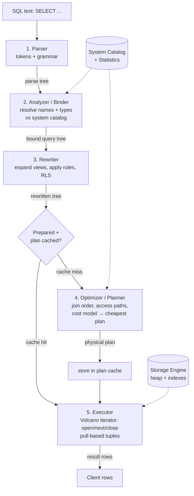

# 🏭 Query Execution Pipeline

> [!abstract] TL;DR
> A SQL string is just text — the database cannot run text. Before a single row is touched, that text passes down an **assembly line**: the **parser** turns characters into a parse tree, the **analyzer/binder** resolves table and column names to real catalog objects and checks types, the **rewriter** expands views and applies rules, the **optimizer** chooses the cheapest execution plan, and the **executor** finally pulls tuples through that plan to produce rows. Understanding these five stages is the foundation for reading plans, tuning queries, and knowing why **prepared statements** and the **plan cache** matter.

## Intuition — analogy FIRST

Think of ordering food at a large restaurant through a **kitchen assembly line**.

1. You hand over a written order slip (the **SQL text**).
2. The **expediter reads and checks the handwriting** — is this even a valid order? Are the words spelled correctly and in the right grammar? (**Parser** → parse tree.)
3. A **manager verifies the order references real menu items** — "Table 12" is a real table, "Salmon" is a real dish, and you cannot order a "medium-rare" salad because that modifier does not apply. (**Analyzer/binder** — resolve names and types.)
4. A **standing rule** says "every 'Chef's Special' actually means these three sub-dishes" — the order is expanded accordingly. (**Rewriter** — views and rules.)
5. The **head chef plans the cheapest, fastest way** to cook everything: which station, which order, do we already have stock prepped? (**Optimizer** — choose the plan.)
6. The **line cooks execute the plan**, each pulling ingredients from the station before them, plating one dish at a time. (**Executor** — pull-based tuples.)

The crucial insight: **you wrote *what* you want (declarative SQL); the database decides *how* to get it (the plan).** Every stage transforms the request into something more concrete, ending in physical operations over disk pages and memory. If you ever placed the *exact same complex order* many times, a smart kitchen would **remember the plan** instead of re-deriving it — that is the **plan cache** for **prepared statements**.

---

## How It Works

A query travels through five conceptual stages. In PostgreSQL these map almost one-to-one onto source modules; MySQL groups them slightly differently but the logical stages are the same.

### 1. Parser (syntax → parse tree)

The parser does **lexical analysis** (break the string into tokens: `SELECT`, `name`, `FROM`, `users`) then **syntactic analysis** (check the tokens form grammatically valid SQL and build a **parse tree** / abstract syntax tree). At this stage the database knows *nothing about whether the tables exist* — it only knows the statement is well-formed SQL. A missing comma or an unbalanced parenthesis fails **here**, before any catalog is touched.

### 2. Analyzer / Binder (resolve names, types — semantic analysis)

The binder walks the parse tree against the **system catalog** (`pg_class`, `pg_attribute` in Postgres; the data dictionary in MySQL). It answers:

- Does table `users` exist, and does the user have permission to read it?
- Does column `email` exist on it, and what is its data type?
- In `WHERE age > '30'`, can the string `'30'` be coerced to the `integer` type of `age`?
- Are aggregate/`GROUP BY` rules satisfied?

The output is a **bound query tree** where every identifier now points at a concrete catalog object with a known type. Errors like `column "emial" does not exist` are raised **here**.

### 3. Rewriter (views, rules, subquery flattening)

The rewriter applies **transformations that do not yet consider cost**:

- **View expansion** — a query against a view is rewritten to query the underlying base tables.
- **Rule system** (Postgres `CREATE RULE`, and how `INSERT/UPDATE/DELETE` on updatable views work).
- **Row-Level Security** predicates are injected here.
- Some engines do early **subquery flattening** and constant simplification.

### 4. Optimizer / Planner (choose the plan)

Now cost enters. The optimizer explores **equivalent ways** to execute the bound, rewritten tree — different **join orders**, different **access paths** (sequential scan vs index scan), different **join algorithms** — estimates the **cost** of each using table statistics, and emits the single cheapest **physical plan** (a tree of operators). This is a deep topic covered in [[Query_Optimizer]]; the access-path choices depend heavily on [[Database_Indexes]].

### 5. Executor (iterator / Volcano model, pull-based tuples)

The executor runs the chosen plan tree. Most relational engines use the **Volcano / iterator model**: every plan node implements the same interface — `open()`, `next()`, `close()`. Calling `next()` on the **top** node **pulls** one tuple, which recursively pulls from its children on demand. This is why a `LIMIT 10` on top of a huge scan can stop early: the top node simply stops calling `next()` after 10 rows. Rows are produced **lazily, one at a time**, streaming up the tree rather than materializing every intermediate result (except for blocking operators like `Sort` or a hash-join build — see [[Join_Algorithms]]).



### Prepared statements and the plan cache

Parsing, binding, rewriting, and especially **optimizing** cost CPU. For queries run repeatedly with different parameter values, doing all five stages every time is wasteful. A **prepared statement** splits the work:

- **PREPARE** once — parse, bind, rewrite, and (optionally) plan the statement, keeping `$1`, `$2` placeholders where values go.
- **EXECUTE** many times — supply parameters and (ideally) reuse the cached plan, skipping the expensive front of the pipeline.

Benefits: less CPU per call, and **protection from SQL injection** (parameters are never concatenated into SQL text). The subtlety is **generic vs custom plans**: Postgres may build a **generic plan** (parameter-independent) after several executions, which can be wrong if data is skewed; MySQL caches prepared plans per session. See [[Query_Tuning]] for when a cached generic plan causes trouble.

---

## SQL / EXPLAIN Examples

### PostgreSQL — watching stages fail at different points

```sql
-- Fails in the PARSER (stage 1): grammar is broken, no catalog touched
SELECT FROM;                      -- ERROR: syntax error at or near "FROM"

-- Fails in the ANALYZER/BINDER (stage 2): grammar is fine, name is not
SELECT emial FROM users;          -- ERROR: column "emial" does not exist

-- A VIEW is expanded by the REWRITER (stage 3)
CREATE VIEW active_users AS
    SELECT id, email FROM users WHERE status = 'active';

-- This query is rewritten to hit the base table `users` before planning:
SELECT email FROM active_users WHERE id = 42;
```

### PostgreSQL — prepared statement (skip the front of the pipeline)

```sql
PREPARE find_user (bigint) AS
    SELECT id, email FROM users WHERE id = $1;

EXECUTE find_user(42);            -- reuses parsed/analyzed statement
EXECUTE find_user(99);            -- again, no re-parse

-- Inspect whether Postgres chose a generic or custom plan:
EXPLAIN (ANALYZE) EXECUTE find_user(42);
```

### MySQL — same lifecycle, different syntax

```sql
-- Stage 1 failure (parser):
SELECT FROM;                      -- ERROR 1064 (42000): You have an error in your SQL syntax

-- Stage 2 failure (resolver):
SELECT emial FROM users;          -- ERROR 1054 (42S22): Unknown column 'emial'

-- Prepared statement lifecycle in MySQL:
PREPARE find_user FROM 'SELECT id, email FROM users WHERE id = ?';
SET @uid = 42;
EXECUTE find_user USING @uid;
DEALLOCATE PREPARE find_user;
```

> [!tip] Seeing the executor's iterator tree
> `EXPLAIN (ANALYZE, VERBOSE)` in PostgreSQL and `EXPLAIN ANALYZE` (MySQL 8.0.18+) print the **plan node tree** the executor walks — the physical form of stages 4 and 5. Reading it is covered in [[Execution_Plans]].

---

## Trade-offs

| Decision | Option A | Option B | Guidance |
|----------|----------|----------|----------|
| Repeated identical query | Ad-hoc (full pipeline each time) | **Prepared statement** (cached) | Prepared wins for hot, parameterized queries; also blocks SQL injection |
| Plan reuse strategy | **Custom plan** every execute | **Generic plan** after N executes | Custom is safer under data skew; generic saves planning CPU on uniform data |
| Views | **Query the view** (rewriter expands) | Inline the SQL by hand | Views aid readability; but nested views can produce surprising expanded plans |
| Executor model | **Volcano / tuple-at-a-time** | Vectorized / batch (OLAP engines) | Volcano is simple and pipelines well for OLTP; vectorized wins for analytics |
| Where to stop early | `LIMIT` exploits pull model | Compute-then-truncate | Pull-based execution lets `LIMIT` short-circuit huge scans cheaply |

---

## Common Pitfalls

1. **Blaming the "database" for a syntax vs semantic error.** A parser error (bad grammar) and a binder error (unknown column) come from different stages — read the error class before hunting.
2. **Assuming a prepared statement is always faster.** A cached **generic plan** can be *worse* than a fresh custom plan when column values are skewed (e.g. a status that is 99% `'done'`). Watch for this in [[Query_Tuning]].
3. **Thinking the executor materializes everything.** The Volcano model streams tuples; only **blocking operators** (`Sort`, hash build, `DISTINCT`, aggregation without index) buffer rows. Misjudging this leads to wrong memory expectations.
4. **Forgetting views are expanded, not precomputed.** A plain view is inlined by the rewriter every time — it is *not* a cached result. For that you need a **materialized view**.
5. **String-concatenating parameters into SQL** to "avoid PREPARE overhead" — this reintroduces SQL injection and defeats the plan cache. Always parameterize.
6. **Ignoring that stale statistics poison stage 4.** The pipeline can be flawless while the optimizer picks a terrible plan because `ANALYZE` never ran — see [[Query_Optimizer]].

---

## Related Concepts

- [[_MOC_DB_Query_Processing|↑ Section MOC]]
- [[Query_Optimizer]] — Stage 4 in depth: how the cheapest plan is actually chosen
- [[Execution_Plans]] — Reading the physical plan the executor runs (stages 4–5 made visible)
- [[Join_Algorithms]] — The join operators the executor pulls tuples through
- [[Query_Tuning]] — When the pipeline produces a slow plan and how to fix it
- [[Database_Indexes]] — Access paths the optimizer chooses among in stage 4
- [[Storage_Engine_Internals]] — What the executor actually reads: heap pages and index pages
- [[SQL_Tuning]] — System-design view of diagnosing slow SQL

---

## Review Questions

1. A user reports `column "emial" does not exist`. Which of the five pipeline stages raised this, and which stage would instead have caught an unbalanced parenthesis? Explain why the two errors come from different stages.
2. Explain the **Volcano/iterator model**. Using `open()`/`next()`/`close()`, describe how a `SELECT ... LIMIT 10` on top of a sequential scan of a billion-row table can avoid scanning the whole table.
3. What work does a **prepared statement** save on each `EXECUTE` compared to running the raw SQL, and in what data distribution can a cached **generic plan** actually hurt performance?

---

## Sources

- *PostgreSQL Documentation* — Ch. 52 "Overview of PostgreSQL Internals" (parser → rewriter → planner → executor) — https://www.postgresql.org/docs/current/overview.html
- Goetz Graefe, *Volcano — An Extensible and Parallel Query Evaluation System* (IEEE TKDE, 1994) — the iterator model
- *MySQL 8.0 Reference Manual* — "Prepared Statements" and "Optimizer" overview
- Hellerstein, Stonebraker & Hamilton, *Architecture of a Database System* (Foundations and Trends in Databases, 2007)

#Database #QueryProcessing #Pipeline #Parser #Planner #Executor #PreparedStatements #Intermediate
