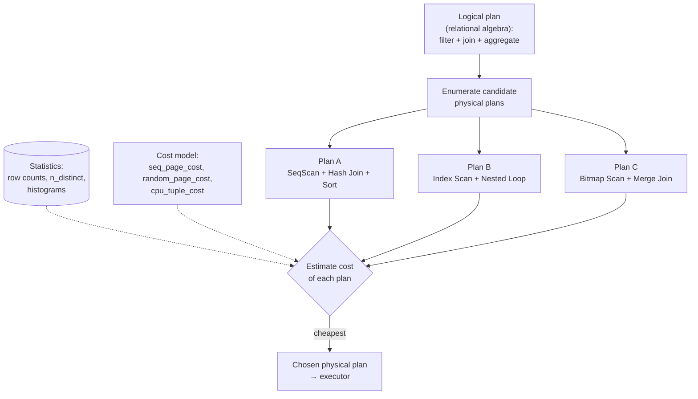

# 🧭 Query Optimizer

> [!abstract] TL;DR
> The optimizer is the **brain** of the database. You write **what** you want; it decides **how** to get it. Given one logical query, there can be thousands of equivalent physical plans — different **join orders**, **access paths** (seq scan vs index scan vs bitmap scan), and **join algorithms**. A **cost-based optimizer (CBO)** enumerates candidate plans, estimates each one's cost from **table statistics** using an I/O + CPU **cost model**, and picks the cheapest. The quality of your queries is largely the quality of the plan this component chooses — which is why bad statistics or a bad join order can make the *same query* run 1000× slower.

## Intuition — analogy FIRST

Imagine a **GPS navigation app** planning a route from home to the airport.

- The **destination is fixed** (your query result), but there are **countless routes** (execution plans): highways, back roads, toll roads.
- The GPS does not drive every route to see which is fastest. It **estimates** each route's cost from a **model**: distance, speed limits, and **live traffic data** (the database's **statistics**).
- It assigns each road segment a **cost** (minutes), sums them, and returns the **cheapest total route**.
- If the traffic data is **stale** — an accident it does not know about — it confidently recommends a road that is actually jammed. Same for a database: **stale statistics** make the optimizer confidently choose a terrible plan.

A **rule-based** GPS would instead say "always prefer highways" regardless of traffic — simple but often wrong. A **cost-based** GPS weighs the actual numbers. Modern databases are overwhelmingly **cost-based**, because the "right" plan depends entirely on *how much data* is involved: an index is great for 5 rows and terrible for 5 million.

---

## How It Works

### Logical plan vs physical plan

The optimizer works on two levels:

- A **logical plan** says *what* relational operations happen: "join `orders` and `customers`, filter on `region`, aggregate by `month`." It is algebra — no algorithm chosen yet.
- A **physical plan** commits to *how*: "use a **Hash Join**, feed it an **Index Scan** on `orders`, then a **Sort** then **GroupAggregate**." Each logical operator maps to one or more physical operators.

Optimization = search for the cheapest **physical** plan that is **logically equivalent** to the query.

### The plan search space

Two logically identical queries can have an explosive number of physical plans because independent choices multiply:

- **Join order** — for `n` joined tables the number of orderings grows factorially. With bushy trees it is even larger.
- **Access path per table** — sequential scan, index scan, index-only scan, bitmap scan.
- **Join algorithm per join** — nested loop, hash join, merge join (see [[Join_Algorithms]]).

The optimizer cannot brute-force all of them, so it uses smart search.

### Join ordering: left-deep trees, DP, and the genetic optimizer

- **Left-deep trees** — plans shaped so each join's right input is a **base table**, not another join result. This drastically shrinks the search space and pipelines well, so it is the classic default.
- **Dynamic programming (System R algorithm)** — build the best plan for every subset of tables bottom-up: best single-table access paths, then best 2-table joins, then 3-table, reusing sub-results. Optimal but exponential in memory/time, so it is only viable up to ~10–12 tables.
- **Genetic / heuristic search** — beyond a threshold, exhaustive DP is too expensive. **PostgreSQL switches to its Genetic Query Optimizer (GEQO)** when the number of relations in a `FROM` exceeds `geqo_threshold` (default 12), trading guaranteed optimality for a good-enough plan found quickly.

### Access path selection

For a single table, the optimizer weighs:

| Access path | Wins when | Mechanism |
|-------------|-----------|-----------|
| **Sequential scan** | Query touches a **large fraction** of rows | Read every page in order (cheap per page) |
| **Index scan** | Query is **highly selective** (few rows) | Walk the B-tree, then fetch each heap row — random I/O |
| **Index-only scan** | The index **covers** all needed columns | Never touch the heap at all (see [[Index_Design_Strategy]]) |
| **Bitmap heap scan** | **Medium** selectivity, or combining multiple indexes | Build a bitmap of matching page IDs, then read those pages **in physical order** (turns random I/O into sequential) |

The B-tree mechanics behind index scans are covered in [[BTree_Indexes]].

### The cost model: I/O + CPU

The optimizer assigns each operator a **cost** in abstract units, combining:

- **I/O cost** — how many **pages** must be read, split into **sequential** page reads (cheap) and **random** page reads (expensive). PostgreSQL exposes these as tunable parameters: `seq_page_cost` (default `1.0`) and `random_page_cost` (default `4.0` — random reads assumed 4× costlier than sequential).
- **CPU cost** — per-tuple processing, per-operator, per-index-entry: `cpu_tuple_cost`, `cpu_index_tuple_cost`, `cpu_operator_cost`.

Total plan cost = Σ (pages read × page cost) + Σ (tuples processed × CPU cost). The optimizer's estimate of **how many rows** flow between operators — **cardinality estimation** from statistics — is the single biggest driver of which plan wins, and the most common source of bad plans (see [[Query_Tuning]]).



### Rule-based vs cost-based

- **Rule-based optimization (RBO)** — a fixed priority list of heuristics ("an index access always beats a full scan"). Deterministic and simple, but **ignores data volume**, so it makes catastrophic choices on skewed data. Largely historical (old Oracle RBO).
- **Cost-based optimization (CBO)** — estimate and compare. The standard in PostgreSQL, MySQL/InnoDB, modern Oracle, SQL Server. Requires good statistics to work well.

### PostgreSQL planner vs MySQL optimizer

| Aspect | PostgreSQL planner | MySQL / InnoDB optimizer |
|--------|--------------------|--------------------------|
| Model | Cost-based, System-R DP + GEQO for many joins | Cost-based, greedy join search |
| Join algorithms | Nested loop, hash join, merge join | Nested loop (+ block nested loop); **hash join since 8.0.18** |
| Access paths | Seq, index, index-only, **bitmap** scans | Full scan, ref/range index scans; **no bitmap heap scan** |
| Tuning knobs | `seq_page_cost`, `random_page_cost`, `work_mem`, `enable_*` flags | `optimizer_switch`, index hints, `optimizer_search_depth` |
| Extended stats | Multi-column `CREATE STATISTICS` | Histograms (8.0), no multi-column correlation stats |

---

## SQL / EXPLAIN Examples

### PostgreSQL — same query, optimizer flips plan by selectivity

```sql
-- Highly selective: optimizer prefers an Index Scan (few rows)
EXPLAIN SELECT * FROM orders WHERE id = 42;
--   Index Scan using orders_pkey on orders  (cost=0.29..8.30 rows=1 ...)

-- Non-selective: same column pattern, but matching most rows → Seq Scan
EXPLAIN SELECT * FROM orders WHERE status <> 'cancelled';
--   Seq Scan on orders  (cost=0.00..18334.00 rows=980000 ...)

-- Inspect / tune the cost model that drives these choices:
SHOW random_page_cost;            -- default 4.0; lower it (e.g. 1.1) on SSDs
SET random_page_cost = 1.1;       -- makes index scans look cheaper
```

### PostgreSQL — force the planner's hand to see alternatives (diagnostic only)

```sql
-- Temporarily disable seq scan to see what the index plan would cost
SET enable_seqscan = off;
EXPLAIN ANALYZE SELECT * FROM orders WHERE status <> 'cancelled';
RESET enable_seqscan;

-- Give the optimizer fresh statistics so its estimates are accurate
ANALYZE orders;

-- Multi-column correlation stats (helps when columns are dependent)
CREATE STATISTICS orders_region_city (dependencies)
    ON region, city FROM orders;
```

### MySQL — optimizer trace and hints

```sql
-- See what plan the optimizer chose
EXPLAIN SELECT * FROM orders WHERE id = 42;

-- Full reasoning: the optimizer trace shows considered plans and costs
SET optimizer_trace = 'enabled=on';
SELECT * FROM orders WHERE status <> 'cancelled';
SELECT * FROM information_schema.optimizer_trace\G
SET optimizer_trace = 'enabled=off';

-- Refresh table statistics (drives cardinality estimates)
ANALYZE TABLE orders;

-- Toggle a strategy globally to compare
SET optimizer_switch = 'hash_join=off';
```

---

## Trade-offs

| Decision | Choose... | Because |
|----------|-----------|---------|
| Many-table join (>12 in Postgres) | Let **GEQO** run, or raise `geqo_threshold` | Exhaustive DP is too slow; genetic finds a good plan fast |
| Storage on SSD | Lower `random_page_cost` toward `seq_page_cost` | Random I/O is nearly as cheap as sequential on flash → more index plans |
| Skewed / correlated columns | Add **extended/multi-column statistics** | Default per-column stats assume independence and misestimate |
| Optimizer picks a bad plan repeatedly | First **`ANALYZE`**, then consider **hints** | 90% of "optimizer is dumb" cases are stale statistics |
| RBO vs CBO | **CBO** always for general workloads | Only CBO accounts for data volume/selectivity |

---

## Common Pitfalls

1. **Stale statistics.** The optimizer is only as smart as its row-count estimates. After bulk loads or big deletes, run `ANALYZE` (Postgres) / `ANALYZE TABLE` (MySQL) or the plan may be badly wrong.
2. **Assuming an index is always used.** For low-selectivity predicates, a **sequential scan is genuinely cheaper** — the optimizer is correct to skip the index. Do not "fix" this by forcing the index.
3. **Correlated columns misestimated.** The optimizer assumes columns are independent; `WHERE city='Paris' AND country='France'` is over-filtered in the estimate. Fix with extended statistics.
4. **Join-order blowup.** A 20-table view can push Postgres into GEQO, giving *non-deterministic* plans run to run. Reduce join count, raise thresholds, or materialize sub-results.
5. **Comparing raw `cost` numbers across machines.** Cost is in abstract units calibrated by page-cost parameters; it is a *relative* ranking, not milliseconds. Use `EXPLAIN ANALYZE` for real time (see [[Execution_Plans]]).
6. **Tuning `random_page_cost` blindly.** Lowering it favors index plans globally; wrong for spinning disks or cold caches. Change it because your storage warrants it, not to force one query.

---

## Related Concepts

- [[_MOC_DB_Query_Processing|↑ Section MOC]]
- [[Query_Execution_Pipeline]] — The optimizer is stage 4 of the overall pipeline
- [[Execution_Plans]] — Reading the physical plan the optimizer emitted
- [[Join_Algorithms]] — The join operators the optimizer chooses among and orders
- [[Query_Tuning]] — Fixing plans when the optimizer's estimates go wrong
- [[Database_Indexes]] — Access paths the optimizer selects between
- [[BTree_Indexes]] — Mechanics behind index-scan cost
- [[Index_Design_Strategy]] — Designing indexes so the optimizer has good options (covering indexes)
- [[Storage_Engine_Internals]] — Page-based storage that the I/O cost model counts
- [[SQL_Tuning]] — System-design perspective on query optimization

---

## Review Questions

1. You have `WHERE status <> 'shipped'` where 95% of rows match. The optimizer chooses a **sequential scan** and refuses your index. Is it wrong? Explain using selectivity and the I/O cost model, and describe when the *same column* would instead get an index scan.
2. Explain why PostgreSQL switches from **dynamic-programming** join enumeration to the **genetic optimizer (GEQO)** past ~12 tables. What does it trade away, and what practical symptom might you observe as a result?
3. Define **cardinality estimation** and explain, with an example of two correlated columns, why the default independence assumption makes the optimizer underestimate row counts — and what feature fixes it in PostgreSQL and MySQL.

---

## Sources

- Selinger et al., *Access Path Selection in a Relational Database Management System* (System R, SIGMOD 1979) — the founding CBO / DP join-ordering paper
- *PostgreSQL Documentation* — "Planner/Optimizer", "Genetic Query Optimizer", and "Planner Cost Constants" — https://www.postgresql.org/docs/current/planner-optimizer.html
- *MySQL 8.0 Reference Manual* — "Optimizer" and "Tracing the Optimizer"
- Ramakrishnan & Gehrke, *Database Management Systems*, 3rd ed., Ch. 12–15 (Query Optimization)

#Database #QueryProcessing #Optimizer #CostBased #JoinOrder #Cardinality #Advanced
