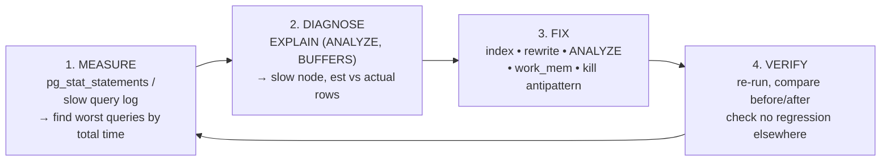

# 🛠️ Query Tuning

> [!abstract] TL;DR
> Query tuning is a **loop, not a guess**: **measure** (find the actually-slow queries with `pg_stat_statements` / the slow query log), **diagnose** (read the plan, find the one slow node and the estimate-vs-actual gap), **fix** (add or adjust an index, rewrite the query, refresh statistics with `ANALYZE`, raise `work_mem`, or remove an antipattern), then **verify** (re-measure — did it actually help?). The most common root cause is not a "missing index" but **bad cardinality estimates** from stale or insufficient statistics, which trick the optimizer into the wrong plan. Tune with evidence; never optimize a query you have not measured.

## Intuition — analogy FIRST

Query tuning is **diagnosing a slow car**, not randomly swapping parts.

- A bad mechanic hears "it's slow" and immediately replaces the engine (adds a random index) — expensive, often useless.
- A good mechanic runs the **diagnostic computer first** (`EXPLAIN ANALYZE`, `pg_stat_statements`) to find *which* system is failing. Maybe the tyres are flat (missing index), maybe the fuel gauge is lying (stale statistics telling the optimizer the tank is empty when it is full), maybe you are towing a trailer you forgot about (a `SELECT *` dragging huge columns).
- Then they **fix the one identified fault**, take it for a **test drive** (re-run and re-measure), and confirm the lap time improved. If not, they diagnose again.

Two habits separate good tuning from cargo-cult tuning: **always measure before and after**, and **treat the optimizer's wrong estimate as the real bug** — an index only helps if the optimizer *believes* it should use it, and that belief comes from statistics.

---

## How It Works

### The tuning loop



### Step 1 — Measure: find the queries that actually matter

Optimize by **total impact = mean time × call count**, not the single slowest one-off.

- **PostgreSQL:** the `pg_stat_statements` extension aggregates every normalized query with `calls`, `total_exec_time`, `mean_exec_time`, `rows`, and cache-hit ratios. Sort by `total_exec_time` to find where the server actually spends its life.
- **MySQL:** the **slow query log** (`long_query_time`, `log_queries_not_using_indexes`) plus **`performance_schema`** (`events_statements_summary_by_digest`) and the `sys` schema views (`sys.statement_analysis`).

### Step 2 — Diagnose: read the plan

Run `EXPLAIN (ANALYZE, BUFFERS)` (Postgres) / `EXPLAIN ANALYZE` (MySQL 8.0.18+). Find:

- the node with the largest **actual total time** (`actual time × loops`),
- the biggest **estimated-vs-actual row gap** (the optimizer's mistake), and
- whether it is **I/O-bound** (high `Buffers: read`) or **CPU-bound**.

Full method in [[Execution_Plans]].

### Statistics & cardinality estimation — the usual culprit

The optimizer chooses plans from **estimated row counts**. Those estimates come from statistics gathered by `ANALYZE`:

- **`n_distinct`** — number of distinct values in a column → drives join/`GROUP BY` size estimates.
- **Histograms** (`most_common_vals` + bucket boundaries in `pg_stats`) → estimate how many rows match `WHERE col = x` or `col BETWEEN a AND b`.
- **Correlation** — how physically ordered the column is → affects index-scan cost.

**When estimates go wrong:**

| Symptom | Cause | Fix |
|---------|-------|-----|
| Estimate 1 row, actual 500k | Stale stats after bulk load/delete | `ANALYZE table;` |
| `WHERE city='Paris' AND country='France'` over-filtered | Columns **correlated**, optimizer assumes independence | **Extended statistics** (`CREATE STATISTICS`) / MySQL column histograms |
| Skewed column (99% one value) | Default histogram too coarse | Raise `default_statistics_target` (Postgres) / more histogram buckets |
| Function on column `WHERE lower(email)=...` | No stats for the expression | **Expression index** (also fixes sargability) |

### Step 3 — Fix: the toolbox (cheapest / safest first)

1. **Update statistics** — `ANALYZE` (Postgres) / `ANALYZE TABLE` (MySQL). Free, and fixes a huge share of bad plans.
2. **Add / adjust an index** — the highest-leverage fix for selective queries; design covering indexes so the plan can use an **Index Only Scan**. See [[Index_Design_Strategy]] and [[Database_Indexes]].
3. **Rewrite the query** — remove antipatterns (below), replace `OR` with `UNION ALL`, turn a correlated subquery into a join, add sargable predicates.
4. **Raise `work_mem`** (Postgres) / `join_buffer_size`, `sort_buffer_size` (MySQL) — stops sorts and hash joins spilling to disk (see [[Join_Algorithms]]). Set it **per-session for the heavy query**, not globally, since it is allocated per operation.
5. **Partitioning / clustering** — for very large tables, prune by range or physically order hot data.

### Antipatterns that defeat indexes ("non-sargable" predicates)

A predicate is **sargable** (Search-ARGument-able) if an index can seek on it. These break that:

- `WHERE lower(email) = 'a@b.com'` — function wraps the column → index on `email` unusable (fix: expression index, or store normalized).
- `WHERE created_at + interval '1 day' > now()` — arithmetic on the column (fix: move math to the constant side).
- `WHERE status != 'done'` / leading-wildcard `LIKE '%foo'` — cannot seek a B-tree range.
- `SELECT *` — drags wide columns, defeats index-only scans, bloats I/O.
- Implicit type casts (`WHERE varchar_col = 123`) — silently disables the index.

These overlap heavily with [[SQL_Antipatterns]].

### Optimizer hints and plan stability

When the optimizer is *persistently* wrong despite good statistics:

- **PostgreSQL** has **no native hints** by design — use the `pg_hint_plan` extension (`/*+ IndexScan(orders idx) */`), or nudge via `enable_*` flags and cost parameters. Postgres favors adaptivity over pinned plans.
- **MySQL** has first-class **optimizer hints** (`/*+ INDEX(t idx) */`, `/*+ JOIN_ORDER(...) */`, `/*+ NO_HASH_JOIN(...) */`) and older index hints (`FORCE INDEX`, `USE INDEX`).
- **Plan stability** — hints pin a plan so it cannot regress when statistics shift, but they also **freeze** it, so it cannot improve when data grows. Use them as a **last resort**, and revisit after major data changes. Prefer fixing statistics/indexes so the optimizer makes the right choice on its own.

---

## SQL / EXPLAIN Examples

### PostgreSQL — the full loop

```sql
-- 1. MEASURE: top queries by total time
CREATE EXTENSION IF NOT EXISTS pg_stat_statements;
SELECT queryid, calls, mean_exec_time, total_exec_time, rows
FROM   pg_stat_statements
ORDER BY total_exec_time DESC
LIMIT 10;

-- 2. DIAGNOSE
EXPLAIN (ANALYZE, BUFFERS)
SELECT * FROM orders WHERE lower(email) = 'a@b.com';
--   Seq Scan on orders  (rows est=1  actual=1  loops=1)  Buffers: read=18000  ⚠

-- 3a. FIX — refresh stats first (free)
ANALYZE orders;

-- 3b. FIX — the predicate is non-sargable; add an EXPRESSION index
CREATE INDEX idx_orders_email_lower ON orders (lower(email));

-- 3c. FIX — correlated columns misestimated → extended statistics
CREATE STATISTICS orders_geo (dependencies, ndistinct) ON city, country FROM orders;
ANALYZE orders;

-- 3d. FIX — sort spilling to disk → more memory for THIS session only
SET work_mem = '128MB';

-- 4. VERIFY — same EXPLAIN ANALYZE; confirm Index Scan + fewer Buffers
EXPLAIN (ANALYZE, BUFFERS)
SELECT * FROM orders WHERE lower(email) = 'a@b.com';
```

### PostgreSQL — sargable rewrite

```sql
-- BAD (non-sargable): math on the column disables the index
SELECT * FROM orders WHERE created_at + interval '30 days' < now();

-- GOOD: move the math to the constant → index on created_at is usable
SELECT * FROM orders WHERE created_at < now() - interval '30 days';
```

### MySQL — find slow queries, tune, and hint

```sql
-- 1. MEASURE: enable slow log + read the digest summary
SET GLOBAL slow_query_log = 'ON';
SET GLOBAL long_query_time = 0.5;
SELECT DIGEST_TEXT, COUNT_STAR, AVG_TIMER_WAIT/1e9 AS avg_ms
FROM   performance_schema.events_statements_summary_by_digest
ORDER BY SUM_TIMER_WAIT DESC LIMIT 10;

-- 2. DIAGNOSE
EXPLAIN ANALYZE
SELECT * FROM orders WHERE status <> 'done' ORDER BY created_at;

-- 3a. FIX — refresh optimizer statistics / histograms
ANALYZE TABLE orders;
ANALYZE TABLE orders UPDATE HISTOGRAM ON status, created_at WITH 64 BUCKETS;

-- 3b. FIX — covering index to serve filter + order without a filesort
CREATE INDEX idx_orders_status_created ON orders (status, created_at);

-- 3c. FIX (last resort) — pin a plan with an optimizer hint
SELECT /*+ INDEX(orders idx_orders_status_created) */ *
FROM orders WHERE status <> 'done' ORDER BY created_at;
```

---

## Trade-offs

| Decision | Choose... | Because |
|----------|-----------|---------|
| Which query to tune first | **Highest total time** (mean × calls) | A 5 ms query run 1M times beats a 2 s query run once |
| First fix to try | **`ANALYZE` (stats)** before adding indexes | Free, and fixes most "dumb optimizer" cases |
| Add an index vs rewrite | Rewrite if the predicate is **non-sargable** | An index cannot help a query that cannot seek |
| `work_mem` scope | **Per-session** for the heavy query | It is per-operation; global raises risk OOM under concurrency |
| Optimizer hints | **Last resort**, MySQL more than Postgres | Pins the plan → stable but cannot adapt as data grows |
| More indexes | Only when read benefit > write cost | Every index slows `INSERT/UPDATE/DELETE` and uses space |

---

## Common Pitfalls

1. **Tuning without measuring.** Adding indexes "that seem useful" bloats writes and storage while the real bottleneck sits untouched. Start from `pg_stat_statements` / the slow log.
2. **Optimizing the wrong query.** The scariest-looking slow query may run once a night; the 8 ms query hit 50k times/second is the real cost. Rank by **total** time.
3. **Ignoring statistics.** Reaching for hints or rewrites when a plain `ANALYZE` would have fixed the estimate. Always refresh stats first.
4. **Non-sargable predicates.** Wrapping the indexed column in a function/arithmetic/implicit cast silently disables the index — the plan shows a Seq Scan you cannot explain.
5. **Raising `work_mem` globally.** It is allocated **per sort/hash node per connection**; a big global value times many connections can exhaust RAM. Set it locally.
6. **`SELECT *` everywhere.** Prevents index-only scans, moves needless bytes, and breaks when schemas change. Select only needed columns.
7. **Hints as a first resort.** They freeze a plan against future data growth. Fix the cause (stats/index) so the optimizer chooses correctly on its own; hint only when it persistently cannot.
8. **Not verifying.** "It should be faster now" is not tuning. Re-run `EXPLAIN ANALYZE` and confirm — and check you did not slow down a different query.

---

## Related Concepts

- [[_MOC_DB_Query_Processing|↑ Section MOC]]
- [[Execution_Plans]] — Step 2 of the loop: reading the plan to find the slow node
- [[Query_Optimizer]] — Why cardinality estimates and statistics drive plan choice
- [[Join_Algorithms]] — Fixing joins that spill or pick the wrong algorithm (`work_mem`)
- [[Query_Execution_Pipeline]] — Where prepared-statement / generic-plan issues arise
- [[SQL_Tuning]] — System-design view of benchmarking, profiling, and optimization
- [[SQL_Antipatterns]] — The non-sargable and query-shape mistakes tuning removes
- [[Index_Design_Strategy]] — Designing the indexes the fix step adds
- [[Database_Indexes]] — Index types available as fixes
- [[BTree_Indexes]] — Why sargable predicates can seek and non-sargable cannot
- [[Storage_Engine_Internals]] — Buffers/I/O the diagnosis step counts

---

## Review Questions

1. Walk through the four steps of the tuning loop for a query that `EXPLAIN ANALYZE` shows doing a Seq Scan with `Buffers: read=18000` and an estimate of 1 row but an actual of 500,000. Name the single most likely root cause and the cheapest fix to try first.
2. What makes a predicate **non-sargable**? Give two concrete examples (one with a function, one with column arithmetic) and rewrite or re-index each so an index can be used.
3. Contrast how **PostgreSQL** and **MySQL** approach **optimizer hints** and **plan stability**. Why does pinning a plan with a hint carry a long-term risk, and what should you usually try before resorting to one?

---

## Sources

- *PostgreSQL Documentation* — `pg_stat_statements`, "Using EXPLAIN", "Statistics Used by the Planner", `CREATE STATISTICS` — https://www.postgresql.org/docs/current/pgstatstatements.html
- *MySQL 8.0 Reference Manual* — "The Slow Query Log", "Optimizer Hints", "Comparison of B-Tree and Hash Indexes", "Histogram Statistics"
- Markus Winand, *SQL Performance Explained* / *Use The Index, Luke!* — sargability and index-driven tuning
- `pg_hint_plan` project documentation — hinting in PostgreSQL

#Database #QueryProcessing #Tuning #Statistics #Sargability #Indexing #Advanced
