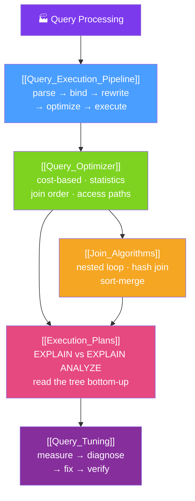

# 🗺️ Query Processing — Map of Content

> [!abstract] What This Section Covers
> This section follows a SQL string from raw text to returned rows and teaches you to make that journey fast. The **query execution pipeline** is the assembly line every query rides — parser → analyzer/binder → rewriter → optimizer → executor — and why prepared statements and the plan cache matter. The **query optimizer** is the brain: given thousands of equivalent physical plans, a cost-based optimizer enumerates candidates, estimates each from table statistics, and picks the cheapest — which is why stale statistics or a bad join order can make the same query 1000× slower. **Join algorithms** are the physical operators the optimizer chooses between (nested loop, hash join, sort-merge) and the row-count/index/memory conditions that favor each. **Execution plans** make the optimizer's choice visible: `EXPLAIN` for estimates, `EXPLAIN ANALYZE` for reality, and the skill of reading a plan tree bottom-up to find the one slow node. Finally, **query tuning** is the disciplined measure → diagnose → fix → verify loop — where the usual root cause is bad cardinality estimates, not a missing index.

## Concept Map

## Learning Path
1. [[Query_Execution_Pipeline]] — The five stages a SQL string passes through, and why prepared statements and the plan cache matter.
2. [[Query_Optimizer]] — How a cost-based optimizer enumerates plans, estimates cost from statistics, and picks join order and access paths.
3. [[Join_Algorithms]] — Nested loop vs hash join vs sort-merge, and the row counts, indexes, sort order, and memory that decide which wins.
4. [[Execution_Plans]] — Reading `EXPLAIN` and `EXPLAIN ANALYZE` plan trees bottom-up to find the single slow node and the estimate-vs-actual gap.
5. [[Query_Tuning]] — The measure → diagnose → fix → verify loop, with bad cardinality estimates as the most common root cause.

## All Notes at a Glance
| Note | Difficulty | What You'll Learn |
|------|------------|-------------------|
| [[Query_Execution_Pipeline]] | Intermediate | The parser → binder → rewriter → optimizer → executor assembly line, and the role of prepared statements and the plan cache |
| [[Query_Optimizer]] | Advanced | Cost-based optimization, table statistics and the cost model, join-order enumeration, and access paths (seq/index/bitmap scan) |
| [[Join_Algorithms]] | Advanced | Nested loop, hash join, and sort-merge join — how each works and the conditions (rows, indexes, memory) that make it the right pick |
| [[Execution_Plans]] | Advanced | EXPLAIN vs EXPLAIN ANALYZE, reading the plan tree bottom-up, and spotting the slow node via the estimate-vs-actual gap |
| [[Query_Tuning]] | Advanced | The measure-diagnose-fix-verify loop, finding slow queries (pg_stat_statements/slow log), and fixing cardinality-estimate problems |

## Key Questions This Section Answers
- What are the stages a SQL string passes through before any row is touched?
- Why do prepared statements and the plan cache speed up repeated queries?
- How does a cost-based optimizer decide between a sequential scan and an index scan?
- When does the optimizer choose a nested loop over a hash join or a sort-merge join?
- What is the difference between `EXPLAIN` and `EXPLAIN ANALYZE`, and how do you read the plan tree?
- How do you find the one slow node in a plan and prove your fix actually helped?
- Why is a "missing index" often not the real cause of a slow query?

## Related Sections
- [[_MOC_Database_Master|↑ Database Master MOC]]
- [[_MOC_DB_Storage_Indexing|← Storage & Indexing]]
- [[_MOC_DB_SQL|← SQL]]
- System Design: [[SQL_Tuning]]

#MOC #Database #QueryProcessing
