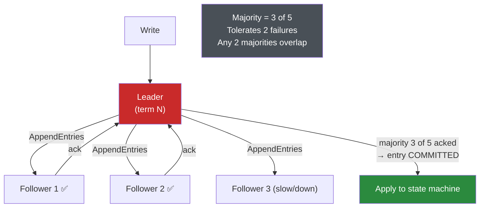
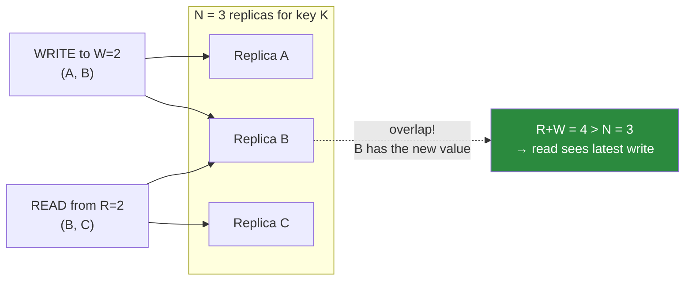

# 🗳️ Consensus and Quorums

> [!abstract] TL;DR
> Distributed databases must get many nodes to **agree** on things that must have a single answer: who is the leader, and in what order did writes commit. **Consensus** algorithms — **Paxos** and its more teachable cousin **Raft** — let a majority of nodes agree on an ordered log even as some crash, guaranteeing safety as long as a **majority (quorum)** is alive. On the leaderless side, **quorum reads/writes** give a lighter, tunable form of agreement: with `N` replicas, requiring `W` write acks and `R` read responses where **`R + W > N`** forces overlap so reads can see the latest write. Leaderless stores (Cassandra) layer on **read repair**, **hinted handoff**, and **anti-entropy** to converge. Modern NewSQL (CockroachDB, Spanner, TiDB, etcd) runs **one Raft group per shard/range**, so each slice of data is independently, strongly replicated. See [[Consensus_and_Raft]] for the algorithm walkthrough; this note is the database-engineering angle.

## Intuition — analogy FIRST

Picture a committee that must make binding decisions, but members occasionally step out of the room and the phone lines sometimes drop.

**Consensus (Raft/Paxos)** is running the committee with a strict rule: elect **one chairperson** (the **leader**), and every decision is recorded only if a **majority** of members write it in their notebooks. Because any two majorities of the same committee *must share at least one member*, no two conflicting decisions can ever both pass — that overlapping member would have to have agreed to both, which the rules forbid. If the chairperson steps out, the remaining majority elects a new one. As long as *more than half* the room is present, the committee keeps making consistent, ordered decisions. Fewer than half? It safely stops rather than risk two rooms deciding differently (**split-brain**).

**Quorums** are the same "majority overlap" trick applied without a permanent chair. To *record* a fact you tell it to `W` members; to *look it up* you ask `R` members. If `R + W` is more than the total `N`, the group you ask and the group that was told **must overlap**, so at least one member you ask knows the latest truth. You can dial `R` and `W`: tell more members (safer writes) or ask more members (safer reads).

The unifying idea is **majority overlap**: any two sufficiently-large subsets of the same set share a member, and that shared member carries the truth forward.

---

## How It Works

### Why databases need consensus

Two problems have exactly one correct answer and cannot tolerate disagreement:

1. **Leader election** — a single-leader system must have *exactly one* leader. Two leaders (split-brain) = data corruption. Electing one safely, and re-electing after a crash, is a consensus problem.
2. **Commit ordering** — replicas must apply writes in the *same order* to converge. Agreeing on "the next entry in the log is X" is consensus.

A naive "promote if the primary looks down" heuristic gets both wrong under network partitions. Consensus solves them correctly.

### Raft (and Paxos) in one picture

Raft elects a leader; the leader appends entries to a replicated log and only marks an entry **committed** once a **majority** has durably stored it. On leader failure, a new leader is elected by majority vote and the log is reconciled.



- **Majority quorum**: a cluster of `2f + 1` nodes tolerates `f` failures (5 nodes → survive 2). Committing needs `f + 1` acks.
- **Safety over liveness**: if it can't reach a majority, Raft stops accepting writes rather than risk divergence — this is the CAP "choose C, sacrifice A under partition" in action (see [[CAP_Theorem]]).
- Raft is used directly in **etcd**, **Consul**, and *per-range* in **CockroachDB**/**TiDB**; **Spanner** uses **Paxos** per tablet group. Details in [[Consensus_and_Raft]].

### Quorum reads/writes — the leaderless form

Leaderless systems (Dynamo, Cassandra, Riak) skip a permanent leader and use quorum overlap directly:

- `N` = replication factor (copies per key).
- `W` = replicas that must acknowledge a write.
- `R` = replicas that must respond to a read.
- **`R + W > N` ⟹ read and write sets overlap** ⟹ a read can observe the most recent completed write.



Tuning: `W=N,R=1` (fast reads, slow/fragile writes), `W=1,R=N` (fast writes, slow reads), `W=R=quorum` (balanced). Note quorum consistency ≠ linearizability (see [[Consistency_Models]]).

### Cassandra tunable consistency levels

Cassandra exposes the quorum knobs *per query* as consistency levels:

| Level | Meaning | Consistency |
|---|---|---|
| **ONE** | 1 replica responds | Weak, fast, high availability |
| **QUORUM** | Majority of `N` respond | Strong-ish if used for both R & W (`R+W>N`) |
| **LOCAL_QUORUM** | Majority within the local datacenter | Strong within DC, low cross-DC latency |
| **ALL** | Every replica responds | Strongest, but one dead replica fails the op |

### Convergence machinery (leaderless)

Because writes can miss replicas (some were down), leaderless stores actively repair:

- **Read repair** — on a read, the coordinator notices a replica returned a stale value and pushes the newer one to it, healing on the read path.
- **Hinted handoff** — if a target replica is down during a write, another node stores a **hint** and replays it when the replica recovers, so the write isn't lost. (Under a long outage, hints can pile up; a "sloppy quorum" using hints is *not* a strict quorum and weakens the `R+W>N` guarantee.)
- **Anti-entropy** — background comparison of replicas using **Merkle trees** to find and repair divergent ranges without transferring everything.

### How NewSQL uses consensus per shard/range

The key architectural move in modern distributed SQL: **don't run one giant consensus group** — split data into many small **ranges/shards**, and give **each range its own Raft (or Paxos) group** of replicas.

- **CockroachDB / TiDB**: data is split into ranges (~64–512 MB); each range is a Raft group with (typically) 3 replicas spread across nodes. A node holds the leader ("leaseholder") for some ranges and followers for others → the whole cluster shares write load.
- **Spanner**: each tablet/directory is a Paxos group; **TrueTime** adds real-time ordering for external consistency (see [[NewSQL]]).
- **etcd**: a *single* Raft group storing cluster metadata (this is what Kubernetes and Patroni rely on for leader election).

This "consensus per range" is why NewSQL scales horizontally *and* stays strongly consistent: each range is independently, majority-replicated, and rebalanced automatically.

---

## SQL / Config Examples

**Cassandra — tunable quorum consistency (`R + W > N`):**

```sql
-- config: N = 3 in this datacenter
CREATE KEYSPACE app WITH replication =
    {'class':'NetworkTopologyStrategy','dc1':3};

-- QUORUM write (W=2) + QUORUM read (R=2): 2 + 2 > 3 → overlap guaranteed
INSERT INTO ledger (id, bal) VALUES (7, 500) USING CONSISTENCY QUORUM;
SELECT bal FROM ledger WHERE id = 7 USING CONSISTENCY LOCAL_QUORUM;

-- Force read repair across all replicas
SELECT bal FROM ledger WHERE id = 7 USING CONSISTENCY ALL;
```

**PostgreSQL — synchronous quorum commit (majority durability):**

```config
# postgresql.conf — commit only when a QUORUM of standbys has the WAL
synchronous_commit = on
synchronous_standby_names = 'ANY 2 (s1, s2, s3)'   -- majority of 3 → quorum
```

**etcd / Patroni — Raft-backed leader election for Postgres HA:**

```config
# Patroni stores cluster state in etcd (a Raft group); the Postgres leader
# holds a TTL lease. Losing the etcd majority → Patroni demotes to avoid split-brain.
etcd:
  hosts: [10.0.0.1:2379, 10.0.0.2:2379, 10.0.0.3:2379]   # 3-node Raft: tolerates 1 loss
```

**CockroachDB — inspect per-range Raft replication:**

```sql
-- Each range is its own Raft group; see replica placement & leaseholder
SELECT range_id, replicas, lease_holder
FROM crdb_internal.ranges
WHERE table_name = 'orders'
LIMIT 5;
```

---

## Trade-offs

| Mechanism | Gains | Costs |
|---|---|---|
| Consensus (Raft/Paxos) | Correct leader election + total order; survives `f` failures | Needs a live majority; write latency = round trip to majority; stops under quorum loss |
| Quorum (`R+W>N`) | Tunable per-op, no permanent leader, highly available | Not linearizable; sloppy quorums weaken it; read repair overhead |
| Cassandra ONE | Lowest latency, max availability | Stale reads |
| Cassandra ALL | Strongest read | One dead replica fails the operation |
| Consensus per range (NewSQL) | Horizontal scale + strong consistency together | Many Raft groups to manage; cross-range txns need 2PC-over-Raft |
| Read repair / hinted handoff / anti-entropy | Eventual convergence without downtime | Extra background work; hints can mask under-replication |

## Common Pitfalls

1. **Even-numbered clusters.** A 4-node cluster tolerates only 1 failure (majority = 3), same as 3 nodes, but has *more* ways to fail and higher split-vote odds. Always size consensus clusters **odd** (3, 5, 7).
2. **Assuming `QUORUM` writes alone give strong reads.** You need `R + W > N`, i.e. quorum for *both* read and write. `QUORUM` write + `ONE` read (2+1 with N=3) does **not** guarantee freshness.
3. **Treating a sloppy quorum as a strict quorum.** Hinted-handoff writes to *non-home* replicas keep you available but break the overlap guarantee — a subsequent strict read may miss the write until hints replay.
4. **Rolling your own failover with a heartbeat script.** Detecting "leader is down" across a partition without consensus produces split-brain. Use etcd/Consul/Patroni or built-in Raft, not a bash cron.
5. **Forgetting consensus needs a *majority alive*, not just "some" nodes.** Lose the majority (e.g. the DC holding 2 of 3) and the cluster correctly *stops accepting writes*. Plan replica placement across failure domains.
6. **Expecting consensus to scale writes by adding nodes.** More voters = *more* messages per commit, not more throughput. NewSQL scales by adding *ranges/groups*, not by enlarging one group.

## Related Concepts

- [[_MOC_DB_Distributed|↑ Section MOC]]
- [[Consensus_and_Raft]] — the step-by-step Raft/Paxos algorithm; this note applies it to databases
- [[Consistency_Models]] — quorum vs linearizable; why `R+W>N` approximates but isn't strong consistency
- [[Replication_Strategies]] — leaderless quorum replication and consensus-based leader election in practice
- [[Distributed_Transactions_in_Databases]] — modern systems run the commit decision through consensus instead of a fragile 2PC coordinator
- [[NewSQL]] — Spanner/CockroachDB/TiDB run consensus per shard/range to scale strong consistency
- [[CAP_Theorem]] — consensus chooses consistency and stops under a partition that severs the majority

## Review Questions

1. Explain the "majority overlap" argument twice: once for why a Raft cluster of 5 can never elect two leaders in the same term, and once for why `R + W > N` lets a quorum read see the latest write.
2. A Cassandra keyspace has `N=3`. A developer uses `QUORUM` for writes but `ONE` for reads to make reads fast. What consistency bug can this cause, and what minimal change fixes it?
3. Why does adding more nodes to a *single* Raft group not increase write throughput, and how does CockroachDB use consensus differently to actually scale out? What is the role of "one Raft group per range"?

## Sources

- Diego Ongaro & John Ousterhout, "In Search of an Understandable Consensus Algorithm (Raft)"
- Leslie Lamport, "Paxos Made Simple"
- Martin Kleppmann, *Designing Data-Intensive Applications*, Ch. 9 — Consensus; Ch. 5 — Quorums
- Apache Cassandra Documentation: Dynamo & consistency levels — https://cassandra.apache.org/doc/latest/cassandra/architecture/dynamo.html
- CockroachDB Documentation: Architecture — Replication Layer — https://www.cockroachlabs.com/docs/stable/architecture/replication-layer

#Database #DistributedDatabases #Consensus #Raft #Paxos #Quorum #ReadRepair #HintedHandoff
