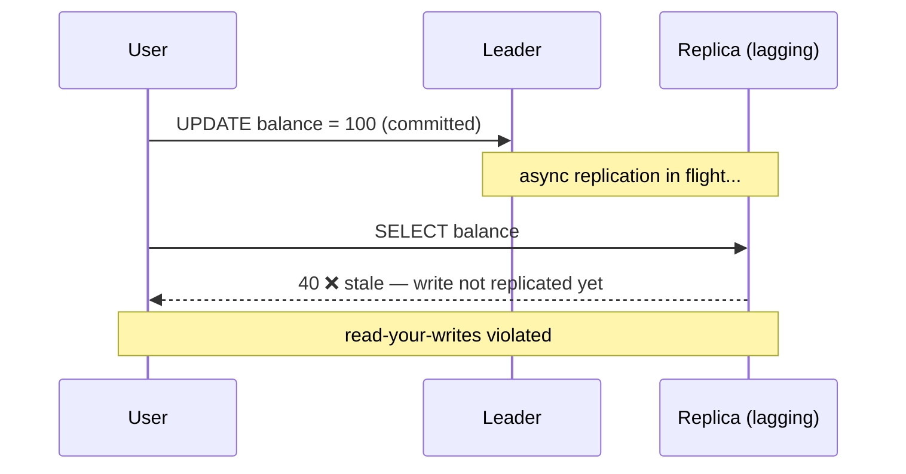

# 🎚️ Consistency Models

> [!abstract] TL;DR
> A **consistency model** is the contract a distributed database makes about *which values a read is allowed to return* once data is replicated. They form a spectrum from **eventual** (replicas converge... eventually) through **causal** (things that cause each other are seen in order) to **linearizable** (every read sees the single most recent write, as if one machine). Two words people mix up: **linearizability** is a *recency* guarantee about a single object (a read reflects the latest write); **serializability** is an *isolation* guarantee that concurrent transactions behave as if run one-at-a-time — they are orthogonal, and "strict serializable" is both. On the read side, the client-centric guarantees — **read-your-writes, monotonic reads, consistent prefix** — describe anomalies that **replication lag** introduces. **Tunable consistency** (`R + W > N`) lets you dial where you sit on the spectrum. See [[CAP_Theorem]], [[PACELC_Theorem]], and [[Consistency_Patterns]] for the systems framing; this note is the DB-engineering angle.

## Intuition — analogy FIRST

Imagine a group chat where several people relay the same announcement, but messages take time to propagate.

- **Eventual consistency**: if everyone stops posting, *eventually* every phone shows the same final thread. In the meantime, different people see different states. Nothing is guaranteed about *when* they agree — only that they will.
- **Causal consistency**: if Alice asks "should we cancel?" and Bob replies "yes," everyone who sees Bob's "yes" has already seen Alice's question. Cause is never seen after effect. But two *unrelated* messages might appear in different orders on different phones — and that's allowed.
- **Linearizable**: there is effectively one shared whiteboard. The instant anyone writes on it, every subsequent reader — anywhere — sees exactly that, as though the replicas didn't exist. Beautiful to reason about, expensive to build.

Now three *client-centric* promises about your own experience:

- **Read-your-writes**: after *you* post a message, *you* always see it on refresh (even if others don't yet).
- **Monotonic reads**: once you've seen a message, it never disappears on a later refresh (time doesn't run backwards for you).
- **Consistent prefix**: you never see a reply before the question it answers — you always see a valid *prefix* of history.

The whole zoo exists because replication takes time, and different apps tolerate different amounts of "not agreeing yet."

---

## How It Works

The models form a lattice — stronger models forbid more anomalies (and cost more coordination). Here is the spectrum from weakest to strongest.

```mermaid
graph LR
    E["Eventual\nreplicas converge someday\n(DNS, Dynamo default)"]
    RYW["Read-your-writes\n+ monotonic reads\n(session guarantees)"]
    C["Causal\ncause-before-effect preserved\n(strongest under a partition)"]
    S["Sequential\nsingle global order\n(all clients agree)"]
    L["Linearizable\nreal-time recency\n(reads see latest write)"]

    E -->|"add session stickiness"| RYW
    RYW -->|"track causal deps"| C
    C -->|"total order"| S
    S -->|"+ real-time ordering"| L

    L -.->|"combine with\nserializable txns"| SS["Strict Serializable\n(Spanner, CockroachDB)"]

    style E fill:#e8590c,color:#fff
    style C fill:#f08c00,color:#fff
    style L fill:#2b8a3e,color:#fff
    style SS fill:#862e9c,color:#fff
```



### The spectrum, tier by tier

| Model | Guarantee | Forbids | Cost |
|---|---|---|---|
| **Eventual** | Given no new writes, all replicas converge | Almost nothing in the meantime | Cheapest; highest availability |
| **Read-your-writes** | You see your own writes | You reading stale-your-own | Session pinning |
| **Monotonic reads** | Time never goes backward *for you* | Reads regressing | Sticky replica |
| **Causal** | Causally-related ops seen in order | Effect-before-cause | Dependency tracking; the strongest model still available during a network partition |
| **Linearizable** | Every read sees the latest committed write, respecting real time | Any staleness | Coordination (consensus/quorum) on every op |

### The distinction that trips everyone up: linearizability vs serializability

They answer **different questions** and are **independent**:

| | Linearizability | Serializability |
|---|---|---|
| Domain | A **single object** (one register/row) | **Multi-object transactions** |
| Guarantee | **Recency** — reads reflect the most recent write, honoring real-time order | **Isolation** — the outcome equals *some* serial order of the transactions |
| Says nothing about | Multi-key transactions | Real-time recency (a serializable schedule may use a stale-but-valid order) |
| Analogy | "The whiteboard is always current" | "The concurrent transactions could have happened one at a time" |

- A system can be **serializable but not linearizable**: transactions are isolated, but the equivalent serial order may be "in the past" — a read-only transaction can see a consistent *stale* snapshot. (This is exactly [[Snapshot_Isolation|snapshot isolation]]/MVCC behavior.)
- A system can be **linearizable but not serializable**: each *single* operation is fresh, but there is no multi-object transaction isolation.
- **Strict serializability** = linearizability **+** serializability: transactions are isolated *and* respect real-time order. This is the gold standard that Google Spanner and CockroachDB target — and it is why it is expensive (see [[NewSQL]]).

> [!tip] One-line memory: **Linearizability is about *when* (recency of one object). Serializability is about *what order* (isolation of many objects).**

### Client-centric (session) guarantees — anomalies of lag

These describe what a *single client's session* observes, and each is a direct consequence of [[Replication_Strategies|replication lag]]:

- **Read-your-writes** — after a client writes, its own subsequent reads must reflect it. Violated when the write hits the leader and the read hits a lagging replica.
- **Monotonic reads** — successive reads by a client never move backward in time. Violated when consecutive reads hit replicas with *different* lag.
- **Consistent prefix reads** — a client sees writes in an order consistent with causality (a valid prefix of the log). Violated in sharded systems where partitions replicate at different speeds.

### Tunable consistency and `R + W > N`

Leaderless systems (Cassandra, DynamoDB) let you *choose* your point on the spectrum per operation via quorum sizing across `N` replicas:

- Read from `R` replicas, write to `W`, and if **`R + W > N`** the read and write sets are guaranteed to **overlap** on at least one replica — so a read can observe the newest write ("strong-ish" consistency).
- `R + W ≤ N` → you may read stale data (eventual).
- Tuning: `W=N, R=1` favors fast reads; `W=1, R=N` favors fast writes; `W=R=quorum` balances both. (Mechanics in [[Consensus_and_Quorums]].)

Even with `R + W > N`, edge cases (concurrent writes, sloppy quorums/hinted handoff) mean quorum consistency is **not** the same as linearizability — it is a practical approximation.

### How replication lag breaks strong consistency



The only cures are coordination (route to leader, wait for the replica to catch past the write's LSN/GTID, or use synchronous replication / consensus) — each trading latency for freshness, exactly the [[PACELC_Theorem|PACELC]] "else latency vs consistency" tradeoff.

---

## SQL / Config Examples

**PostgreSQL — force fresh reads or accept replica staleness:**

```sql
-- Read-your-writes: pin critical reads to the PRIMARY connection.
-- Or verify a replica has caught up to the write's LSN before reading it:
SELECT pg_last_wal_replay_lsn() >= '0/16B3F80'::pg_lsn AS caught_up;

-- A read replica can be told to guarantee it won't serve too-stale data:
SET max_standby_streaming_delay = '5s';
```

```sql
-- Serializable but not linearizable: SSI gives a consistent (possibly slightly
-- stale) snapshot; it is NOT a real-time recency guarantee.
BEGIN ISOLATION LEVEL SERIALIZABLE;
SELECT SUM(amount) FROM orders WHERE customer_id = 42;  -- consistent snapshot
COMMIT;
```

**Cassandra — tunable per-query consistency (`R + W > N`):**

```sql
-- config: keyspace with N = 3 replicas
CREATE KEYSPACE shop WITH replication =
    {'class':'NetworkTopologyStrategy', 'dc1': 3};

-- Strong-ish: QUORUM write (W=2) + QUORUM read (R=2), 2+2 > 3 → overlap
INSERT INTO orders (id, total) VALUES (1, 99) USING CONSISTENCY QUORUM;
SELECT total FROM orders WHERE id = 1 USING CONSISTENCY QUORUM;

-- Fast but eventual: R=ONE + W=ONE, 1+1 < 3 → may read stale
SELECT total FROM orders WHERE id = 1 USING CONSISTENCY ONE;
```

**MySQL — read-your-writes with Group Replication / semi-sync:**

```sql
-- With MySQL Group Replication, enforce session-level read-your-writes:
SET SESSION group_replication_consistency = 'AFTER';   -- write waits until applied everywhere
-- 'BEFORE' makes a read wait for prior writes to be applied before executing.
```

---

## Trade-offs

| Model | Gains | Costs |
|---|---|---|
| Eventual | Max availability & throughput, survives partitions | Stale reads, anomalies, harder app logic |
| Causal | Preserves intuitive ordering; available under partition | Dependency metadata overhead |
| Session guarantees | Cheap fix for the *user-visible* anomalies | Requires sticky routing; not global |
| Linearizable | Trivial to reason about (looks single-machine) | Coordination on every op → latency; unavailable under partition |
| Strict serializable | Correctness gold standard (txns + recency) | Highest coordination cost (TrueTime/consensus) |
| Tunable (`R+W>N`) | Per-query control of the tradeoff | Easy to misconfigure; still not true linearizability |

## Common Pitfalls

1. **Using "linearizable" and "serializable" interchangeably.** They are orthogonal. Snapshot isolation is serializable-ish but not linearizable; a linearizable KV store gives no multi-key transaction isolation.
2. **Assuming a quorum read (`R+W>N`) is linearizable.** Concurrent writes, read repair timing, and sloppy quorums mean it approximates strong consistency but is not the real-time guarantee.
3. **"Eventually consistent" treated as "consistent after a second."** There is no time bound. Under load or partition, "eventually" can be minutes. Never gate correctness (uniqueness, balances) on eventual reads.
4. **Fixing read-your-writes globally when you only need it per-user.** Pinning *everyone's* reads to the leader throws away your read replicas. Session stickiness is usually enough.
5. **Believing stronger is always better.** Linearizability costs latency and availability (CAP/PACELC). A social feed is fine on eventual/causal; a bank ledger is not.
6. **Ignoring monotonic reads in a load-balanced replica pool.** Round-robining a user across replicas of differing lag makes data flicker backward. Hash the user to a sticky replica.

## Related Concepts

- [[_MOC_DB_Distributed|↑ Section MOC]]
- [[CAP_Theorem]] — during a partition, consistency here means *linearizability*; you must trade it for availability
- [[PACELC_Theorem]] — even with no partition, stronger consistency costs latency ("else L or C")
- [[Consistency_Patterns]] — the systems-design catalog (weak / eventual / strong) that this note grounds in DB terms
- [[Replication_Strategies]] — replication lag is the *source* of every session anomaly described here
- [[Consensus_and_Quorums]] — the machinery (`R+W>N`, Raft) that buys linearizability
- [[NewSQL]] — Spanner/CockroachDB aim for strict serializability (linearizable + serializable)

## Review Questions

1. Explain why a system can be **serializable but not linearizable**, and give a concrete database (isolation level) where this happens. Then describe a system that is linearizable but not serializable.
2. A leaderless store has `N=5` replicas. You want reads that are guaranteed to see the latest acknowledged write. Give a valid `(R, W)` pair, explain the overlap argument, and name one reason it still might not be truly linearizable.
3. A user reports that refreshing a page sometimes shows *older* data than a previous refresh. Which client-centric consistency guarantee is violated, what replication behavior causes it, and how do you fix it without giving up your read replicas?

## Sources

- Martin Kleppmann, *Designing Data-Intensive Applications*, Ch. 5 & 9 (consistency, linearizability)
- Peter Bailis et al., "Highly Available Transactions" & the Jepsen consistency model hierarchy — https://jepsen.io/consistency
- Daniel Abadi, "Consistency Tradeoffs in Modern Distributed Database System Design" (PACELC)
- Apache Cassandra Documentation: Consistency levels — https://cassandra.apache.org/doc/latest/cassandra/architecture/dynamo.html

#Database #DistributedDatabases #Consistency #Linearizability #Serializability #EventualConsistency #Quorum
