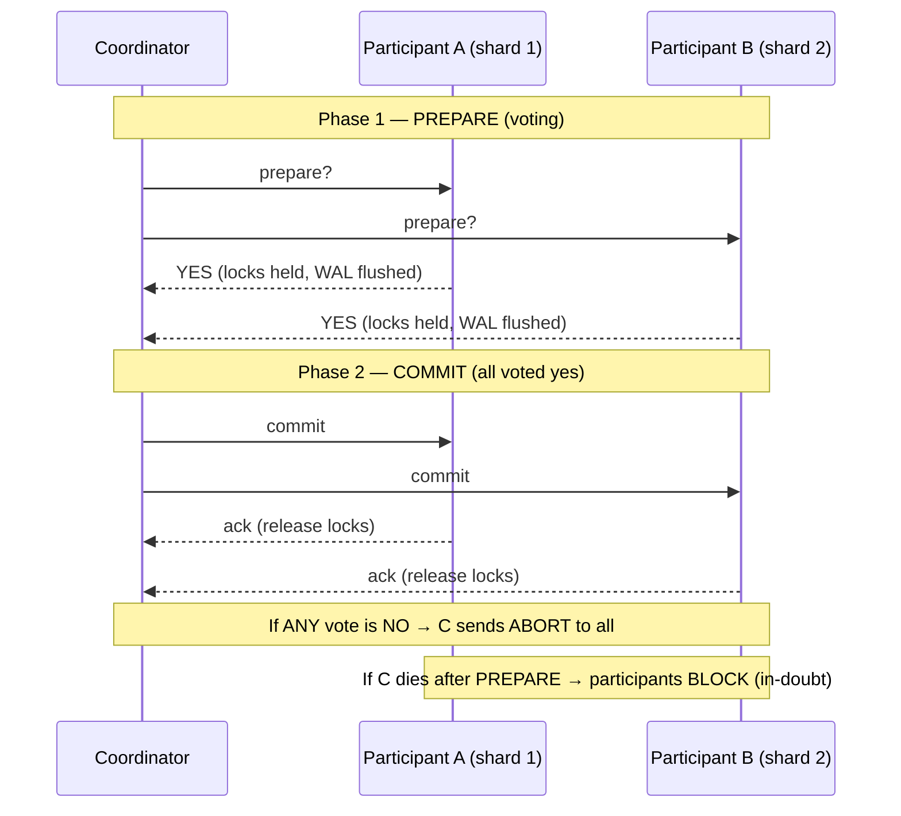

# 🤝 Distributed Transactions in Databases

> [!abstract] TL;DR
> A **distributed transaction** must commit atomically across multiple databases/shards — all-or-nothing when the data lives in more than one place. The classic mechanism is **two-phase commit (2PC)**: a **coordinator** asks every **participant** "can you commit?" (*prepare*), and only if *all* vote yes does it tell them to *commit*. Its fatal flaw is **blocking**: if the coordinator dies after prepare, participants sit locked, holding resources, unable to decide. **Three-phase commit (3PC)** adds a step to reduce blocking (but breaks under network partitions). Real databases expose 2PC through **XA** (`XA START`/`PREPARE` in MySQL) and **prepared transactions** (`PREPARE TRANSACTION` in Postgres). Because 2PC is slow and fragile, many systems prefer the **[[Saga_Pattern|saga]]** (a chain of local transactions with compensations) or **Percolator-style** distributed transactions (snapshot isolation over a KV store, used by TiDB). For the systems framing see [[Distributed_Transactions]]; this note is the DB-engineering mechanics.

## Intuition — analogy FIRST

Imagine booking a honeymoon that requires **three separate vendors** to all succeed together: a flight, a hotel, and a car. You want *all three or none* — a flight with no hotel is useless.

A naive approach is to book them one by one, but if the car fails after you've paid for the flight and hotel, you're stuck unwinding paid bookings.

**Two-phase commit** is hiring a travel agent (the **coordinator**) who runs it in two rounds:

1. **Prepare (voting)**: the agent calls each vendor — "Hold this exact seat/room/car and *promise* me you can finalize it if I call back." Each vendor either reserves and says **"ready"** or says **"can't."** Crucially, once a vendor says "ready," it must *keep that promise* — the seat is locked, no one else can take it.
2. **Commit**: only if *all three* said "ready" does the agent call back "**Confirm all!**" If even one said "can't," the agent calls everyone: "**Cancel.**"

The horror scenario: all three vendors say "ready" (seats locked), and then **the travel agent's phone dies**. The vendors are stuck holding your reservations *indefinitely*, unable to sell them to anyone else, not knowing whether to confirm or cancel. That is the **blocking problem** — and it is why 2PC, while correct, is dangerous.

---

## How It Works

### Two-phase commit (2PC)



Key properties:

- Once a participant votes **YES**, it has durably written a *prepared* record and **must** be able to commit — it cannot unilaterally abort. It holds locks until it hears the decision.
- The coordinator's decision, once written to its log, is final and must be delivered to every participant (retried forever if needed).
- **The blocking problem**: if the coordinator crashes *after* participants prepare but *before* sending the decision, participants are **in-doubt** — locked, holding resources, unable to proceed until the coordinator recovers. This is 2PC's defining weakness and why it does not fit high-availability systems well.

### Three-phase commit (3PC)

3PC inserts a **pre-commit** phase between prepare and commit so that a crashed coordinator can be replaced without indefinite blocking: participants that reached "pre-commit" can safely time out and commit; those that didn't can safely abort.

- ✅ Non-blocking **under the assumption of a synchronous network and no partitions**.
- ❌ **Breaks under network partitions** — a partition can split participants into groups that make *inconsistent* decisions. This is why 3PC is largely academic; real systems use consensus (Raft/Paxos) for the commit decision instead (see [[Consensus_and_Quorums]]).

### XA — the standard 2PC API

**XA** (X/Open Distributed Transaction Processing) is the industry standard that lets a **transaction manager** coordinate 2PC across heterogeneous resource managers (multiple databases, or a database + a message broker).

- **MySQL** implements XA directly: `XA START`, `XA END`, `XA PREPARE`, `XA COMMIT`.
- **PostgreSQL** exposes the participant side via **prepared transactions**: `PREPARE TRANSACTION 'gid'` durably prepares, and later `COMMIT PREPARED 'gid'` / `ROLLBACK PREPARED 'gid'` finalizes. (Requires `max_prepared_transactions > 0`.)

> ⚠️ A prepared/in-doubt transaction that is never resolved (coordinator lost) holds locks and blocks vacuum/purge indefinitely. Monitor `pg_prepared_xacts` (Postgres) and `XA RECOVER` (MySQL) and have a reaper.

### Saga — the alternative when 2PC is too costly

Instead of one atomic distributed transaction, a **saga** is a sequence of *local* transactions, each with a **compensating action** that semantically undoes it. If step 4 fails, run the compensations for steps 3→2→1.

- ✅ No global locks, no blocking coordinator, high availability — each step commits locally.
- ❌ **No isolation** — intermediate states are visible; only *eventual* atomicity via compensation. You design for it (semantic locks, idempotency).
- Orchestrated (central coordinator) vs choreographed (event-driven). Full treatment in [[Saga_Pattern]].

**2PC vs Saga at a glance:**

| | 2PC / XA | Saga |
|---|---|---|
| Atomicity | True atomic commit | Eventual, via compensation |
| Isolation | Yes (locks held across prepare) | No (intermediate states visible) |
| Availability | Blocks if coordinator dies | High — local commits |
| Latency | High (2 round trips + locks) | Low per step |
| Best for | Few nodes, short txns, strong isolation | Long-lived, cross-service business workflows |

### Percolator-style distributed transactions

Google's **Percolator** (and **TiDB** which adopts it) implements distributed ACID transactions over a distributed KV store using **snapshot isolation** and a *2PC-like* protocol built on the KV layer itself — no separate coordinator process:

- A global **timestamp oracle** hands out monotonically increasing timestamps for snapshot reads and commit ordering.
- One key of the transaction is chosen as the **primary lock**; committing the primary atomically decides the whole transaction (secondary locks point at it). A crashed client leaves locks that later transactions can *roll forward or clean up* by inspecting the primary — so it is **non-blocking** in practice, unlike classic 2PC.
- Underneath, each key range is replicated by **Raft** for durability and HA (see [[NewSQL]], [[Consensus_and_Quorums]]).

This is how modern NewSQL gets distributed ACID without the coordinator-blocking pathology.

---

## SQL / Config Examples

**PostgreSQL — prepared (two-phase) transactions:**

```config
# postgresql.conf — must be > 0 to allow PREPARE TRANSACTION
max_prepared_transactions = 20
```

```sql
-- Participant side of 2PC, driven by an external transaction manager.
BEGIN;
UPDATE accounts SET balance = balance - 100 WHERE id = 1;
PREPARE TRANSACTION 'txn_transfer_42';   -- phase 1: durable prepare, locks held

-- ...coordinator collects votes from all participants...

COMMIT PREPARED 'txn_transfer_42';       -- phase 2 (or ROLLBACK PREPARED)

-- Find dangerous in-doubt transactions holding locks:
SELECT gid, prepared, owner, database FROM pg_prepared_xacts;
```

**MySQL — XA transactions:**

```sql
-- Branch on database node 1 (a second branch runs on node 2 with a different xid)
XA START 'txn_transfer', 'branch1';
UPDATE accounts SET balance = balance - 100 WHERE id = 1;
XA END   'txn_transfer', 'branch1';
XA PREPARE 'txn_transfer', 'branch1';    -- phase 1: vote YES, hold locks

-- ...after ALL branches on all nodes have PREPAREd...
XA COMMIT 'txn_transfer', 'branch1';     -- phase 2

-- Recover in-doubt branches after a coordinator crash:
XA RECOVER;
```

---

## Trade-offs

| Approach | Gains | Costs |
|---|---|---|
| 2PC / XA | True atomicity + isolation across nodes | Coordinator blocking, held locks, 2 RTT latency, poor availability |
| 3PC | Reduces blocking on a healthy network | Fails under partitions; more messages; rarely used |
| Saga | High availability, no global locks, scales | No isolation, complex compensations, eventual atomicity |
| Percolator/TiDB | Distributed ACID + snapshot isolation, non-blocking | Timestamp-oracle dependency, extra KV round trips |
| Avoid distributed txns (co-locate) | Simplest, fastest | Requires data modeling so a txn stays on one shard |

## Common Pitfalls

1. **Reaching for 2PC as the default for cross-service consistency.** Its blocking and latency make it a poor fit for microservices; a [[Saga_Pattern|saga]] or the [[Outbox_Pattern|outbox]] is usually better. 2PC shines only for a small number of tightly-coupled resources.
2. **Leaving prepared/in-doubt transactions unmonitored.** A lost coordinator leaves locks held forever, blocking vacuum/purge and other writers. Always monitor `pg_prepared_xacts` / `XA RECOVER` and reap orphans.
3. **Believing 3PC "solves" blocking.** It only does so on a reliable, synchronous network. Under real network partitions it can produce inconsistent commit decisions.
4. **Expecting isolation from a saga.** Intermediate states *are* visible to other transactions. If a reader must never see the half-done state, a saga alone is wrong — add semantic locks or reconsider.
5. **Non-idempotent compensations or commits.** Retries are inevitable in distributed commit; a compensation that isn't idempotent double-refunds. Make every step and compensation idempotent.
6. **Mixing a database and a message queue in one XA transaction "for safety."** Fragile and slow; the **transactional outbox** pattern (write the event to a DB table in the same local txn, relay it via CDC) is the robust alternative.

## Related Concepts

- [[_MOC_DB_Distributed|↑ Section MOC]]
- [[Distributed_Transactions]] — the systems-design framing of 2PC vs saga; this note is the XA / `PREPARE TRANSACTION` mechanics
- [[Saga_Pattern]] — the high-availability alternative to 2PC using local transactions + compensations
- [[Consensus_and_Quorums]] — modern systems replace the fragile 2PC coordinator with a Raft/Paxos-decided commit
- [[NewSQL]] — CockroachDB/TiDB/Spanner deliver distributed ACID via consensus + Percolator-style commit
- [[Partitioning_and_Sharding]] — the reason distributed transactions exist: a write spanning shards
- [[Consistency_Models]] — the isolation/recency guarantees these protocols are trying to preserve

## Review Questions

1. Walk through the exact failure that causes 2PC's "blocking problem": at which point must the coordinator crash, what state are the participants left in, and why can't a participant just decide on its own?
2. Your team wants atomic consistency across an Orders service and a Payments service (separate databases). Compare using XA/2PC versus a saga, and state which you'd pick and why — including what you give up.
3. Explain how a Percolator-style transaction (as in TiDB) avoids classic 2PC's indefinite blocking. What role does the "primary lock" play when a client crashes mid-commit?

## Sources

- Martin Kleppmann, *Designing Data-Intensive Applications*, Ch. 9 — Consistency & Consensus (2PC, XA)
- Daniel Peng & Frank Dabek, "Large-scale Incremental Processing Using Distributed Transactions and Notifications" (Percolator), Google
- PostgreSQL Documentation: PREPARE TRANSACTION — https://www.postgresql.org/docs/current/sql-prepare-transaction.html
- MySQL Documentation: XA Transactions — https://dev.mysql.com/doc/refman/8.0/en/xa.html
- TiDB Documentation: Transaction model — https://docs.pingcap.com/tidb/stable/transaction-overview

#Database #DistributedDatabases #Transactions #TwoPhaseCommit #XA #Saga #Percolator
