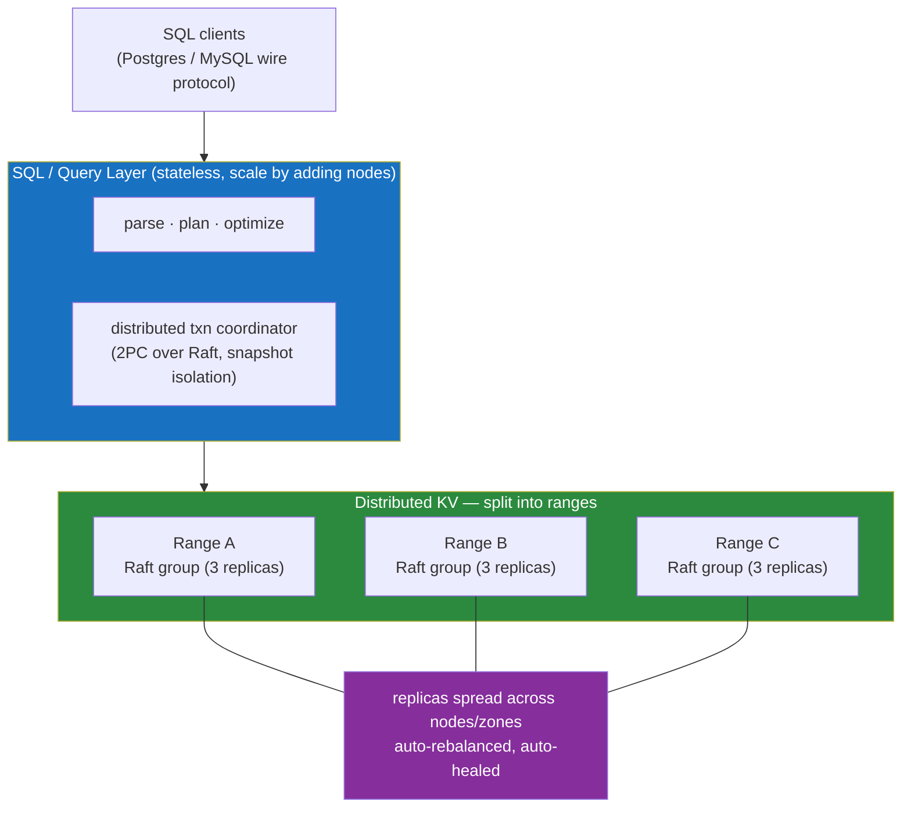

# 🆕 NewSQL

> [!abstract] TL;DR
> **NewSQL** is a class of databases that refuses the old either/or: it wants the **horizontal scale-out and fault tolerance of NoSQL** *and* the **ACID transactions + SQL of relational systems**, at the same time. The recipe is consistent across the leaders: shard the data into ranges, replicate **each range with a consensus group (Raft or Paxos)**, and layer a SQL engine on top of the resulting distributed key-value store. **Google Spanner** pioneered it (Paxos + **TrueTime** atomic-clock ordering for external consistency); **CockroachDB** (Raft per range, serializable, Postgres-wire), **TiDB** (Percolator + Raft, MySQL-compatible), **YugabyteDB** (Raft, Postgres-compatible), and **VoltDB** (in-memory, single-threaded partitions) followed. You get distributed ACID and elastic scale — at the cost of higher write latency and operational complexity than a single Postgres/MySQL box. This note is the DB-engineering angle; it builds on [[Consensus_and_Quorums]], [[Distributed_Transactions_in_Databases]], and [[Partitioning_and_Sharding]].

## Intuition — analogy FIRST

For two decades you had to pick one of two houses.

The **relational mansion** (Postgres, MySQL) has beautiful rooms — SQL, joins, transactions, foreign keys — but it sits on a *single* plot of land. Add more furniture (data, traffic) and eventually you must buy a bigger plot (scale *up*), until no plot is big enough.

The **NoSQL warehouse district** (Cassandra, DynamoDB) is endless — just add more buildings across the city (scale *out*) — but the buildings are bare: no cross-building transactions, weak consistency, you hand-roll joins in your app.

**NewSQL** is the attempt to build a **mansion that spans the whole city**: it still has all the elegant rooms (SQL, ACID, joins), but underneath, the floor plan is transparently split across dozens of buildings, each with its own backup generators (consensus replicas). You walk in and it *feels* like one giant relational database; behind the walls it is a self-managing distributed system. The magic trick is that every small section of the house keeps *three synchronized copies* voting on every change — so any building can burn down and the section survives, and the whole thing still enforces "all-or-nothing" transactions across rooms.

The catch: coordinating across buildings takes real time (network round trips), so it is never quite as *fast* per operation as the single mansion — you trade a little latency for limitless scale and survivability.

---

## How It Works

The shared NewSQL architecture: a **stateless SQL layer** parses queries and turns them into reads/writes against a **distributed, transactional key-value store**, which is split into **ranges**, each replicated by its own **Raft/Paxos group**.



### The common recipe

1. **Range-based sharding** — data auto-splits into ranges (~64–512 MB) by key. No manual shard key ceremony; the DB splits/merges ranges as they grow/shrink (contrast the manual pain in [[Partitioning_and_Sharding]]).
2. **Consensus per range** — each range is a Raft/Paxos group of (usually) 3 replicas across nodes/zones. A write commits when a **majority** acks (see [[Consensus_and_Quorums]]) → survives node/zone loss with no data loss.
3. **Distributed ACID** — multi-range transactions use **2PC layered over the consensus log** (so the commit decision itself is fault-tolerant, unlike classic blocking 2PC) plus **MVCC/snapshot isolation** (see [[Distributed_Transactions_in_Databases]]).
4. **Stateless SQL layer** — any node can serve any query; scale the SQL tier by adding nodes.
5. **Automatic rebalancing & healing** — ranges move to balance load and re-replicate lost replicas automatically.

### The systems, and how each achieves distributed ACID

| System | Consensus | Isolation | Wire compat | Signature trick |
|---|---|---|---|---|
| **Google Spanner** | Paxos per tablet group | External consistency (strict serializable) | SQL (proprietary / Cloud) | **TrueTime** — GPS + atomic clocks give a *bounded* clock uncertainty ε; commit waits out ε so timestamps order transactions globally in real time |
| **CockroachDB** | Raft per range | Serializable (default) | PostgreSQL wire | Hybrid Logical Clocks (HLC) instead of atomic clocks; "leaseholder" per range serves reads without a Raft round trip |
| **TiDB** | Raft per region (in TiKV) | Snapshot isolation / serializable | MySQL wire | **Percolator**-style 2PC over KV + a **timestamp oracle (PD)**; separates SQL (TiDB) from storage (TiKV) |
| **YugabyteDB** | Raft per tablet | Serializable / snapshot | PostgreSQL wire (reuses PG query layer) | DocDB storage engine; Postgres upper half bolted onto a Raft-replicated KV |
| **VoltDB** | Replication (k-safety) | Serializable | SQL (stored procs) | **In-memory, single-threaded per partition** — no locks; transactions run to completion serially per shard |

**Spanner's TrueTime**, briefly: normal clocks disagree, so you can't order events by timestamp across machines. TrueTime returns an *interval* `[earliest, latest]` guaranteed to contain the true time. To make a transaction's timestamp globally ordered, Spanner **commit-waits** until it's certain the interval has passed — turning bounded clock uncertainty into globally-ordered, externally-consistent transactions. That is how it gets strict serializability at planet scale.

### NewSQL vs sharded Postgres/MySQL

The honest comparison — because "just shard Postgres" is the real alternative:

| | Sharded Postgres/MySQL (or Vitess/Citus) | NewSQL (CockroachDB/TiDB/Spanner) |
|---|---|---|
| Sharding | You choose the shard key; resharding is painful | Automatic range split/merge/rebalance |
| Cross-shard txns | Hard — app-level or fragile XA/2PC | Native distributed ACID |
| Failover | Bolt-on (Patroni/Orchestrator) | Built-in via consensus |
| Ops maturity | Decades of tooling, well understood | Younger; fewer experts, evolving tooling |
| Single-node speed | Faster per op (no consensus round trip) | Slower per write (majority round trip) |
| SQL surface | Full mature Postgres/MySQL | Large but not 100% compatible; some features missing |
| Best when | You know your shard key & rarely cross it | You need elastic scale + global consistency + survive-a-zone |

---

## SQL / Config Examples

**CockroachDB — looks like PostgreSQL, scales like NoSQL:**

```sql
-- Speaks the PostgreSQL wire protocol: normal SQL, real transactions
CREATE TABLE accounts (id INT PRIMARY KEY, balance DECIMAL);

BEGIN;                                    -- SERIALIZABLE by default, across ranges
UPDATE accounts SET balance = balance - 100 WHERE id = 1;
UPDATE accounts SET balance = balance + 100 WHERE id = 2;  -- may live on another range/node
COMMIT;                                   -- 2PC over Raft — atomic across ranges

-- Pin data to regions for locality + survive-region goals
ALTER TABLE accounts SET LOCALITY REGIONAL BY ROW;
ALTER DATABASE bank SURVIVE REGION FAILURE;
```

**TiDB — MySQL-compatible, Percolator transactions under the hood:**

```sql
-- Connects with any MySQL client/driver
CREATE TABLE orders (id BIGINT PRIMARY KEY, total DECIMAL);

-- Optimistic (Percolator 2PC) or pessimistic transactions
SET @@tidb_txn_mode = 'pessimistic';
BEGIN;
UPDATE orders SET total = total * 1.1 WHERE id = 5;
COMMIT;                                   -- primary-key lock commit decides the txn
```

```config
# TiDB cluster components (deployed together):
#   tidb   — stateless SQL layer (MySQL protocol)
#   tikv   — distributed transactional KV, Raft per region
#   pd     — Placement Driver: timestamp oracle + rebalancing brain
```

**Spanner — external consistency via commit-wait (conceptual):**

```sql
-- Standard SQL; the engine assigns a globally-ordered commit timestamp
-- and commit-waits out TrueTime uncertainty for strict serializability.
INSERT INTO Singers (SingerId, Name) VALUES (1, 'Ada');
-- Stale but consistent reads are cheap (no locks, no coordination):
SELECT * FROM Singers AS OF SYSTEM TIME '-10s';
```

---

## Trade-offs

| Aspect | Gains | Costs |
|---|---|---|
| Consensus per range | Survives node/zone loss with zero data loss; strong consistency | Every write pays a majority round trip → higher latency than single node |
| Automatic sharding | No manual shard key, online rebalancing | Less control; range hotspots still possible (sequential PKs) |
| Distributed ACID | Cross-shard transactions "just work" | Contention across ranges → retries/aborts under hot rows |
| SQL compatibility | Reuse drivers, ORMs, skills | Not 100% compatible; some extensions/features unsupported |
| Elastic scale-out | Add nodes → more capacity, no downtime | Operational + cost complexity; overkill for small workloads |
| vs single Postgres | Scale + HA built in | A tuned single node is simpler and faster until you truly outgrow it |

## Common Pitfalls

1. **Adopting NewSQL when a single Postgres would do.** For most workloads a well-indexed primary + read replicas is simpler, cheaper, and faster per query. NewSQL earns its complexity only when you genuinely need horizontal write scale or survive-a-region.
2. **Sequential/monotonic primary keys.** Auto-increment IDs concentrate all inserts on the "last" range → a hotspot that defeats scale-out. Use hash-sharded indexes or UUID/random keys for write-heavy tables.
3. **Assuming full Postgres/MySQL compatibility.** Triggers, certain extensions, some `information_schema` corners, or specific isolation quirks may differ. Test your actual queries, don't assume drop-in.
4. **Ignoring cross-range transaction contention.** A hot row touched by many transactions serializes through its range's consensus and causes retry storms. Model to spread contention.
5. **Under-provisioning for the consensus round trip.** Cross-region NewSQL writes pay inter-region latency on every commit. Co-locate replicas or use regional-by-row placement for latency-sensitive data.
6. **Confusing NewSQL with NoSQL "because it's distributed."** NewSQL keeps ACID and SQL; that is the whole point. Treating it like an eventually-consistent KV store throws away its guarantees.

## Related Concepts

- [[_MOC_DB_Distributed|↑ Section MOC]]
- [[Consensus_and_Quorums]] — the Raft/Paxos-per-range machinery that makes NewSQL both scalable and strongly consistent
- [[Distributed_Transactions_in_Databases]] — how NewSQL runs 2PC over the consensus log (and Percolator in TiDB)
- [[Partitioning_and_Sharding]] — NewSQL automates the sharding you'd otherwise do by hand with Vitess/Citus
- [[Consistency_Models]] — Spanner targets strict serializability; CockroachDB defaults to serializable
- [[Replication_Strategies]] — consensus replication is the strongly-consistent cousin of leader/replica streaming
- [[SQL_vs_NoSQL]] — NewSQL is the deliberate synthesis of the two families this note contrasts

## Review Questions

1. State the two capabilities NewSQL tries to combine, and describe the single architectural pattern (used by CockroachDB, TiDB, and Spanner alike) that lets it get *both* horizontal scale and strong consistency.
2. What problem does Google Spanner's TrueTime solve that ordinary server clocks cannot, and what does the database physically *do* (commit-wait) to convert bounded clock uncertainty into globally-ordered transactions?
3. Your team can either shard Postgres with Citus or adopt CockroachDB. List three factors that would push you toward NewSQL and two that would push you toward staying on sharded Postgres.

## Sources

- James C. Corbett et al., "Spanner: Google's Globally-Distributed Database," OSDI 2012
- Andrew Pavlo & Matthew Aslett, "What's Really New with NewSQL?" SIGMOD Record 2016
- CockroachDB Documentation: Architecture Overview — https://www.cockroachlabs.com/docs/stable/architecture/overview
- TiDB Documentation: TiDB Architecture — https://docs.pingcap.com/tidb/stable/tidb-architecture
- YugabyteDB Documentation: Architecture — https://docs.yugabyte.com/preview/architecture/

#Database #DistributedDatabases #NewSQL #Spanner #CockroachDB #TiDB #TrueTime #DistributedACID
