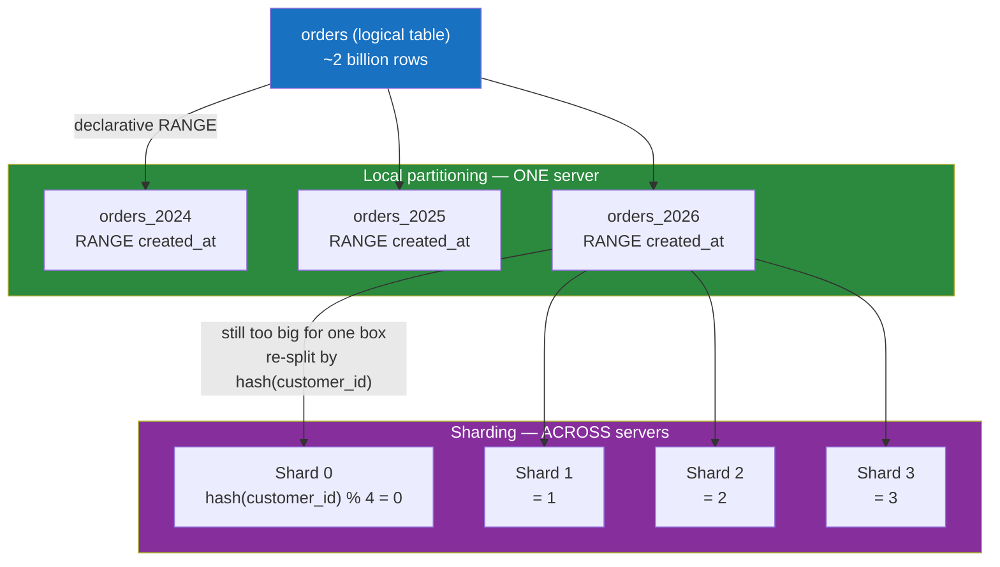

# 🪓 Partitioning and Sharding

> [!abstract] TL;DR
> **Partitioning** splits one big table into many smaller physical pieces. When those pieces live *inside a single server* it is **local partitioning** (Postgres declarative partitioning, MySQL `PARTITION BY`) — it buys you cheaper pruning, faster vacuum, and painless bulk deletes, but not more CPU or RAM. When the pieces live *on different servers* it is **sharding** — the same idea scaled across a cluster, which finally buys you horizontal capacity but hands you a hard new problem: the **shard key**. Pick it well and every query hits one node; pick it badly and you get **hotspots**, **cross-shard joins**, and **resharding** — the three horsemen of distributed-DB regret. This note goes deep on the DB-engineering mechanics; for the systems-architecture framing see [[Database_Sharding]].

## Intuition — analogy FIRST

Picture a single enormous phone book for an entire country — millions of pages, one spine. Two problems: it is unwieldy to search, and only one person can hold it at a time.

**Partitioning within one server** is like tearing that phone book into 26 volumes, A–Z, and keeping them all on *your own desk*. You still have every volume, but now when someone asks for "Nguyen," you grab the N volume and ignore the other 25 — that skip is **partition pruning**. Your desk (the server) is no bigger, but every lookup touches less paper, and when you retire the old "1990 archive" volume you just throw one book in the bin instead of erasing millions of lines (**partition drop** vs `DELETE`).

**Sharding across servers** is like giving each of 26 librarians *one* volume and putting them in 26 different buildings. Now 26 people can be served at once — real added capacity. But ask "who is named Smith AND lives on Oak Street" and you may have to phone every building (**cross-shard query**). And the day the S volume gets too fat, you cannot just re-letter every book overnight (**resharding**). The letter you chose to split by is the **shard key**, and you are married to it.

Same core idea — divide and skip. The line between "one desk" and "many buildings" is the line between partitioning and sharding.

---

## How It Works

Two orthogonal axes. **What you split by**: *vertical* (split columns) vs *horizontal* (split rows). **Where the pieces live**: one server (partitioning) vs many servers (sharding).



### Vertical vs horizontal partitioning

| | Vertical partitioning | Horizontal partitioning (the usual meaning of "sharding") |
|---|---|---|
| Splits | **Columns** into narrow tables | **Rows** into disjoint sets |
| Example | Move rarely-read `bio TEXT`, `avatar BYTEA` out of the hot `users` row | Rows 0–1M on shard A, 1M–2M on shard B |
| Wins | Hot columns pack more rows per page → better cache hit rate | Adds servers → adds capacity |
| Note | Overlaps with [[Normalization]] and [[Database_Federation]] (feature-based splitting) | The core distributed-DB technique |

Vertical partitioning is really a *modeling* decision; horizontal partitioning is a *scaling* decision. The rest of this note is about horizontal.

### Local partitioning — inside one server

Postgres and MySQL both let one logical table be backed by many physical child tables. The optimizer reads only the children a query can possibly match — **partition pruning** — using the partition key in the `WHERE` clause.

**Partition strategies** (both engines support the same three shapes):

- **RANGE** — by an ordered value, classically time (`created_at`). Best for time-series and easy archival (drop the oldest partition).
- **LIST** — by an explicit set (`region IN ('EU','US')`). Best for known, discrete categories.
- **HASH** — by `hash(key) % N`. Best for spreading writes evenly when there is no natural range/list.

What local partitioning buys you (and what it does **not**):

- ✅ **Pruning** — scan one partition instead of the whole table.
- ✅ **Cheap bulk delete** — `DETACH`/`DROP` a whole partition is a metadata op; `DELETE FROM ... WHERE date < ...` is millions of dead tuples + vacuum.
- ✅ **Smaller indexes** — one index per partition, each fits in cache.
- ✅ **Maintenance parallelism** — `VACUUM`/`ANALYZE`/`REINDEX` per partition.
- ❌ **Not more capacity** — every partition shares the same CPU, RAM, and disk. Local partitioning is *organization*, not *scale-out*.

### Sharding — across servers

Sharding is horizontal partitioning where partitions live on independent database servers ("shards"), each a full DBMS with its own CPU, memory, and storage. This is what actually breaks the single-machine ceiling. Three routing strategies:

| Strategy | How the shard is chosen | Pro | Con |
|---|---|---|---|
| **Range-based** | `id 0–1M → shard 0`, `1M–2M → shard 1` | Range scans stay on one shard; easy to reason about | **Hotspots** — newest IDs all land on the last shard (monotonic key) |
| **Hash-based** | `shard = hash(key) % N` | Even write distribution, no hotspots | Range scans fan out to all shards; adding a shard reshuffles almost everything |
| **Directory-based** | A lookup service maps key → shard | Flexible; can rebalance a single key | The directory is a new SPOF and an extra hop |

**Shard key selection** is the single most consequential decision:

- Choose a key present in *most* queries so they route to **one** shard (single-shard queries are cheap; scatter-gather is not).
- Choose a key with **high cardinality and even distribution** to avoid hotspots. `customer_id` (millions of values) beats `country` (a handful, wildly skewed).
- Avoid **monotonically increasing** keys (auto-increment id, timestamp) as the *hash-mod-N* base only if using range sharding — they concentrate all new writes on one shard.
- Anticipate **cross-shard joins**: co-locate rows that are joined together by sharding parent and child on the *same* key (e.g. shard both `orders` and `order_items` by `customer_id`).

**The three horsemen:**

- **Hotspots** — one shard gets disproportionate load (celebrity user, "today's" partition). Mitigate with hashing, key salting, or splitting the hot key.
- **Cross-shard queries & joins** — a query without the shard key becomes *scatter-gather*: hit every shard, merge results in the app/router. Aggregations (`COUNT`, `GROUP BY`) and `JOIN`s across shard boundaries are expensive and cannot use a single index. Distributed transactions across shards need [[Distributed_Transactions_in_Databases|2PC or sagas]].
- **Resharding** — going from N to N+1 shards with plain `hash % N` remaps almost every key. **Consistent hashing** or **pre-splitting into many virtual buckets** (e.g. 1024 buckets mapped onto few physical shards) makes rebalancing move only a slice, not everything.

### Middleware — don't hand-roll routing

- **Vitess** (MySQL) — the sharding layer behind YouTube; a `VTGate` proxy speaks the MySQL protocol, hides shards from the app, and handles resharding online.
- **Citus** (Postgres extension) — turns Postgres into a distributed database; a coordinator node holds metadata and shards are placed across workers, with `create_distributed_table('orders','customer_id')`.

---

## SQL / Config Examples

**PostgreSQL — declarative RANGE partitioning + pruning:**

```sql
-- Parent is partitioned; it stores no rows itself
CREATE TABLE orders (
    id          bigint      GENERATED ALWAYS AS IDENTITY,
    customer_id bigint      NOT NULL,
    created_at  timestamptz NOT NULL,
    amount      numeric(12,2)
) PARTITION BY RANGE (created_at);

CREATE TABLE orders_2025 PARTITION OF orders
    FOR VALUES FROM ('2025-01-01') TO ('2026-01-01');
CREATE TABLE orders_2026 PARTITION OF orders
    FOR VALUES FROM ('2026-01-01') TO ('2027-01-01');

-- Pruning: planner touches ONLY orders_2026
EXPLAIN SELECT * FROM orders WHERE created_at >= '2026-07-01';

-- Archival is a metadata op, not a giant DELETE
ALTER TABLE orders DETACH PARTITION orders_2025;   -- or DROP TABLE orders_2025;
```

```sql
-- PostgreSQL HASH partitioning (even spread, no natural range)
CREATE TABLE events (id bigint, payload jsonb) PARTITION BY HASH (id);
CREATE TABLE events_p0 PARTITION OF events FOR VALUES WITH (MODULUS 4, REMAINDER 0);
CREATE TABLE events_p1 PARTITION OF events FOR VALUES WITH (MODULUS 4, REMAINDER 1);
-- ... p2, p3
```

**MySQL — RANGE and HASH partitioning:**

```sql
-- MySQL RANGE partitioning by year
CREATE TABLE orders (
    id          BIGINT NOT NULL AUTO_INCREMENT,
    customer_id BIGINT NOT NULL,
    created_at  DATETIME NOT NULL,
    amount      DECIMAL(12,2),
    PRIMARY KEY (id, created_at)          -- partition key MUST be in every unique key
) PARTITION BY RANGE (YEAR(created_at)) (
    PARTITION p2025 VALUES LESS THAN (2026),
    PARTITION p2026 VALUES LESS THAN (2027),
    PARTITION pmax  VALUES LESS THAN MAXVALUE
);

-- Drop a whole year instantly
ALTER TABLE orders DROP PARTITION p2025;

-- HASH partitioning for even spread
CREATE TABLE sessions (id BIGINT, data BLOB)
    PARTITION BY HASH(id) PARTITIONS 8;
```

> ⚠️ MySQL gotcha: **every unique/primary key must include every column used in the partitioning expression.** That is why `PRIMARY KEY (id, created_at)` above includes `created_at`.

**Citus — sharding Postgres across servers:**

```sql
-- config: on the coordinator, register worker nodes then distribute
SELECT citus_add_node('worker-1', 5432);
SELECT citus_add_node('worker-2', 5432);

-- Co-locate parent and child on the SAME key so joins stay single-shard
SELECT create_distributed_table('orders',      'customer_id');
SELECT create_distributed_table('order_items', 'customer_id', colocate_with => 'orders');
```

---

## Trade-offs

| Decision | Gains | Costs |
|---|---|---|
| Local partitioning | Pruning, cheap archival, smaller indexes, maintenance parallelism | Zero extra capacity; partition-key must be in `WHERE` to prune; unique-key constraints |
| Sharding | True horizontal scale of writes and storage | Cross-shard joins/txns, resharding pain, operational complexity, no global secondary index for free |
| Range sharding | Cheap range scans, human-readable | Hotspots on monotonic keys |
| Hash sharding | Even load | Range scans fan out; resharding reshuffles everything (unless consistent hashing) |
| Directory sharding | Flexible per-key rebalancing | Extra hop + a component to keep highly available |
| Middleware (Vitess/Citus) | Hides sharding from app; online resharding | New moving part, version coupling, its own failure modes |

## Common Pitfalls

1. **Sharding before you need to.** A well-indexed single Postgres/MySQL box handles far more than teams assume. Sharding adds permanent complexity; exhaust vertical scaling, read replicas, and caching first.
2. **Picking a low-cardinality or skewed shard key** (e.g. `country`, `status`). One shard drowns while others idle. Prefer high-cardinality keys like `customer_id`.
3. **Forgetting the shard key in your hot queries.** Any query lacking it becomes scatter-gather across every shard — the opposite of scaling.
4. **`hash % N` with no rebalancing plan.** Adding one node remaps nearly all keys and melts the cluster during migration. Use consistent hashing or many virtual buckets from day one.
5. **Confusing local partitioning with sharding.** Splitting a table into partitions on the *same* server does not add capacity — it only helps pruning and maintenance. If you need more CPU/RAM, you need more servers.
6. **Cross-shard `JOIN`s and unique constraints.** A globally-unique email across shards needs a directory or app-level check; joins across shards need co-location or a distributed query engine.

## Related Concepts

- [[_MOC_DB_Distributed|↑ Section MOC]]
- [[Database_Sharding]] — the systems-design view of sharding (federation, denormalization, SPOF); this note is the DB-engineering deep dive
- [[Replication_Strategies]] — sharding scales writes/storage; replication scales reads and adds HA — you almost always use both
- [[Distributed_Transactions_in_Databases]] — how to commit atomically when a transaction spans shards
- [[Consistency_Models]] — what guarantees survive once data is split across nodes
- [[Database_Federation]] — feature-based (vertical) splitting across servers, contrasted with row-based sharding
- [[NewSQL]] — systems that automate sharding + replication + ACID for you (CockroachDB, TiDB, Spanner)

## Review Questions

1. You shard an `orders` table by `hash(order_id) % 8`. Product now needs "all orders for customer X" as the most frequent query. Why is your shard key wrong, and what would you change it to — and what does that change break?
2. A teammate says "we partitioned the table by month, so now it scales." What is the flaw in that reasoning? Distinguish what local partitioning gives you from what sharding gives you.
3. You must grow a hash-sharded cluster from 4 nodes to 5 without a multi-hour migration. Explain why naive `hash % N` is catastrophic here and describe two techniques that limit how much data moves.

## Sources

- Martin Kleppmann, *Designing Data-Intensive Applications*, Ch. 6 — Partitioning
- PostgreSQL Documentation: Table Partitioning — https://www.postgresql.org/docs/current/ddl-partitioning.html
- MySQL Documentation: Partitioning — https://dev.mysql.com/doc/refman/8.0/en/partitioning.html
- Citus Documentation: Distributing Tables — https://docs.citusdata.com/
- Vitess Documentation: Sharding — https://vitess.io/docs/concepts/sharding/

#Database #DistributedDatabases #Partitioning #Sharding #ShardKey #Hotspots #Citus #Vitess
